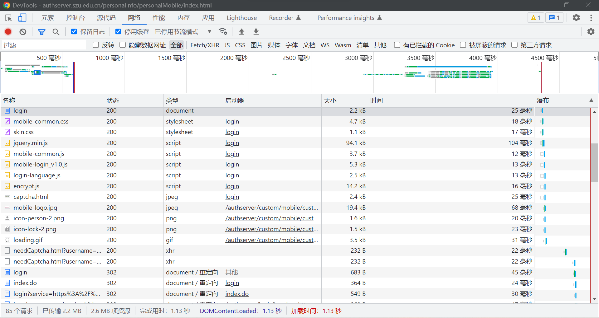
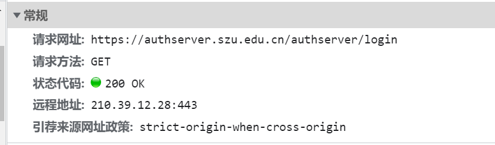
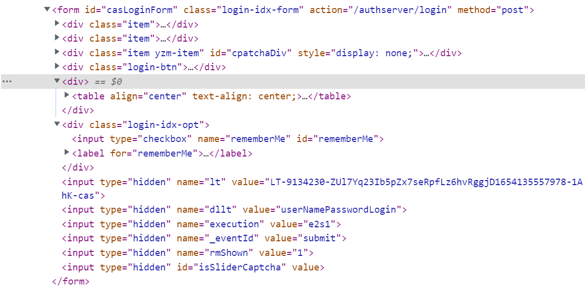
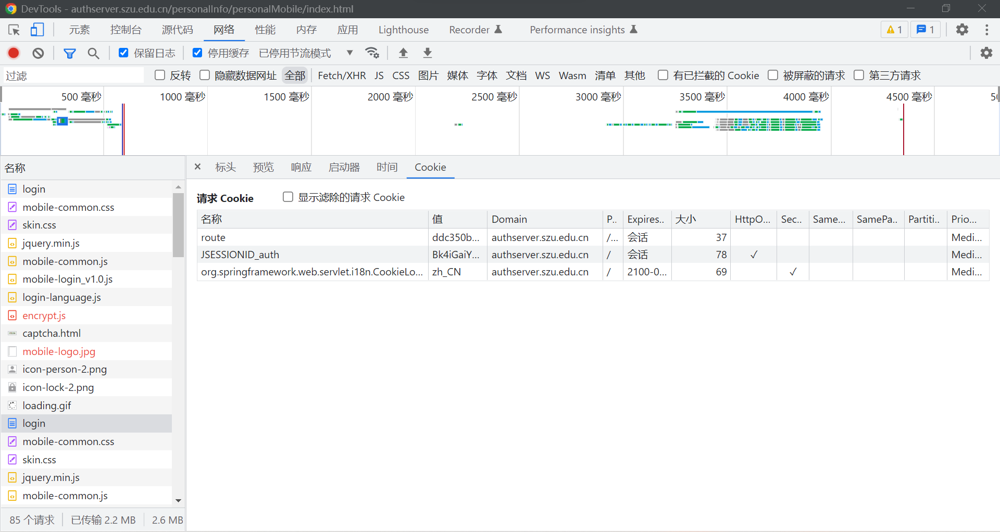
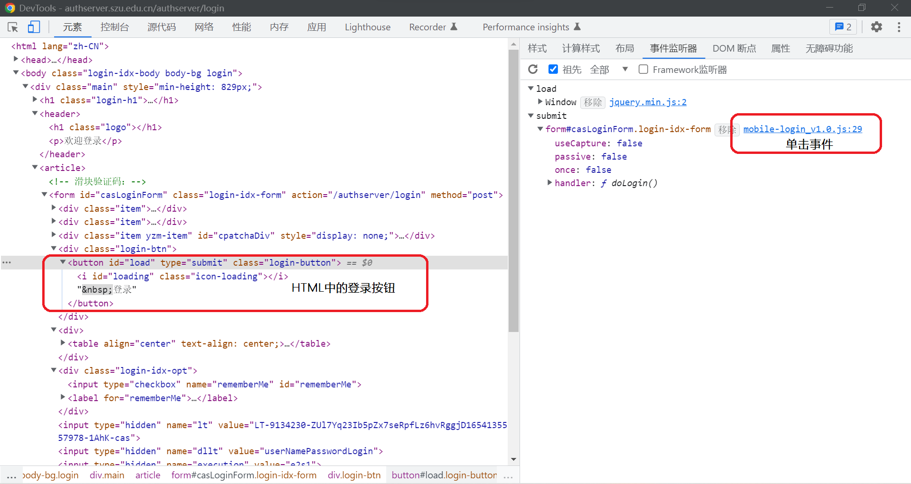
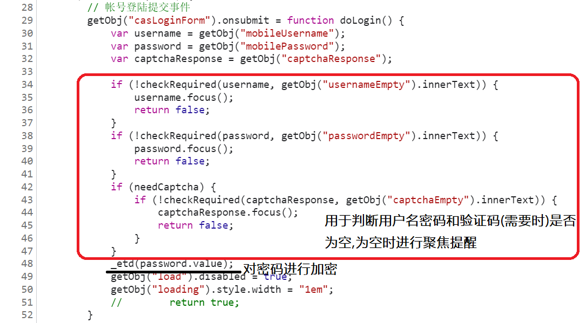
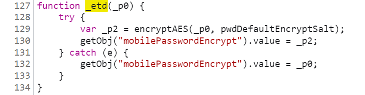
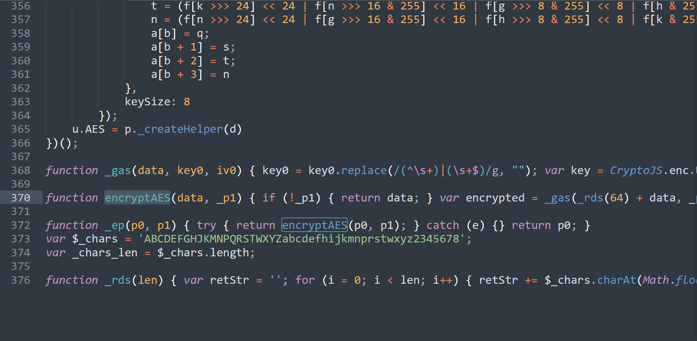
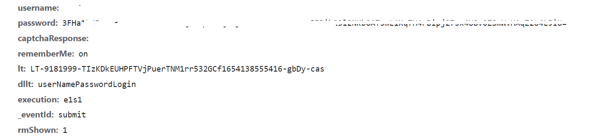
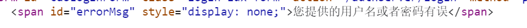

## 抓包分析
- 深大统一身份认证登录网址为<br> `https://authserver.szu.edu.cn/authserver/login`<br>一次登录过程(模拟Android网页版)所产生的主要网络请求如下图所示



### 1. login:
- 此过程为一次GET请求(`https://authserver.szu.edu.cn/authserver/login`)，无查询参数，生成登录页面的HTML



- 在该HTML中含有最后登录发送POST请求所需要的表单信息。



- 同时有变量pwdDefaultEncryptSalt，用于使用js进行加密密码时传递的参数


- 在未有cookies登录网址时，此请求会进行两次，第一次会由js代码生成记录语言的cookies：`org.springframework.web.servlet.i18n.CookieLocaleResolver.LOCALE=zh_CN`(在Andriod客户端可忽略该语言cookies)，以及每次都会产生用于记录用户的cookie:`route`和`JSESSIONID_auth`。



### 2. encrypt.js:
- 此请求为GET请求(`https://authserver.szu.edu.cn/authserver/custom/js/encrypt.js`)，无查询参数，需传递由login生成的Cookies信息，获取进行加密的js代码，用于在登录请求时进行密码的加密。(通过对登录按钮的事件监听器进行分析得出)








- encryptAES函数位于encrypt.js，由于该js使用了混淆，不易分析其具体加密过程。但我们可以在Android程序中获取该js文件，并在程序中执行js代码以获取加密后的代码。

### 3. captcha.html：
- 此为GET请求(`https://authserver.szu.edu.cn/authserver/captcha.html`)，无查询参数，需传递由login生成的Cookies信息，获取此次登录如果需要输入验证码时的验证码图片。
### 4. needCaptcha.html?XXXX
- 此请求在用户输入完用户名或密码之后发出，用于判断登录过程是否需要验证码，但由于登录之后若登录失败生成的HTML含有登录失败信息，在实际的的登录过程中，忽略该请求，可分析最后登录失败的HTML进行判断是否需要验证码。

### 5. login
- 此为POST请求(`https://authserver.szu.edu.cn/authserver/login`)，用于登录并获取cookies完成身份认证登录。请求参数如下
```
username              //账户名
password              //加密后的密码
captchaResponse       //需要验证码时用户输入的验证码
lt                    //可从login HTML获取的的参数
dllt                  //可从login HTML获取的的参数
execution             //可从login HTML获取的的参数
_eventId              //可从login HTML获取的的参数
rmShown               //可从login HTML获取的的参数

//若使用此请求参数，其仅有一个值: on。
//即在用户勾选了一周内免登录，使用此参数，
//使其cookies有效值为一周
rememberMe
```


### 6. 登录失败之后的login的HTML
- 登录失败后，会回到登录界面，在HTML中会产生一个id为“errorMsg”的span，其值为错误信息的提示


