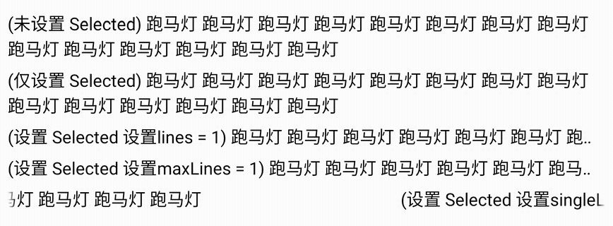

如果要给一个 `TextView` 设置跑马灯效果，我们仅需要给其设置如下属性即可：
```xml
<TextView
    android:ellipsize="marquee"
    android:singleLine="true" />
```
`ellipsize` 属性设置为 `marquee` 表示开启跑马灯效果，而 `singleLine` 则设置其为单行展示。同时需要在 `TextView` 获焦或被选中时才会有跑马灯效果，因此我们在代码中可以手动让其获焦或者设置其为 `selected` 的状态 `textview.isSelected = true`。

通过对比发现，设置 `android:lines="1"` 和 `android:maxLines="1"` 是没有效果的，一定是要 `android:singleLine="true"` 才可以，以下是实例代码：
```xml
<!-- 布局 -->
<LinearLayout
    android:layout_width="match_parent"
    android:layout_height="match_parent"
    android:orientation="vertical"
    android:padding="16dp">

    <TextView
        android:id="@+id/tv1"
        style="@style/TextView_Style"
        android:text="(未设置 Selected) 跑马灯 跑马灯 跑马灯 跑马灯 跑马灯 跑马灯 跑马灯 跑马灯 跑马灯 跑马灯 跑马灯 跑马灯 跑马灯 跑马灯" />

    <TextView
        android:id="@+id/tv2"
        style="@style/TextView_Style"
        android:text="(仅设置 Selected) 跑马灯 跑马灯 跑马灯 跑马灯 跑马灯 跑马灯 跑马灯 跑马灯 跑马灯 跑马灯 跑马灯 跑马灯 跑马灯 跑马灯" />

    <TextView
        android:id="@+id/tv3"
        style="@style/TextView_Style"
        android:lines="1"
        android:text="(设置 Selected 设置lines = 1) 跑马灯 跑马灯 跑马灯 跑马灯 跑马灯 跑马灯 跑马灯 跑马灯 跑马灯 跑马灯 跑马灯 跑马灯 跑马灯 跑马灯" />

    <TextView
        android:id="@+id/tv4"
        style="@style/TextView_Style"
        android:maxLines="1"
        android:text="(设置 Selected 设置maxLines = 1) 跑马灯 跑马灯 跑马灯 跑马灯 跑马灯 跑马灯 跑马灯 跑马灯 跑马灯 跑马灯 跑马灯 跑马灯 跑马灯 跑马灯" />

    <TextView
        android:id="@+id/tv5"
        style="@style/TextView_Style"
        android:singleLine="true"
        android:text="(设置 Selected 设置singleLine = true) 跑马灯 跑马灯 跑马灯 跑马灯 跑马灯 跑马灯 跑马灯 跑马灯 跑马灯 跑马灯 跑马灯 跑马灯 跑马灯 跑马灯" />

</LinearLayout>

<!-- style -->
<style name="TextView_Style">
    <item name="android:layout_width">match_parent</item>
    <item name="android:layout_height">wrap_content</item>
    <item name="android:ellipsize">marquee</item>
    <item name="android:textSize">36sp</item>
    <item name="android:layout_marginVertical">8dp</item>
    <item name="android:textColor">@color/black</item>
</style>
```

各种情况的结果如下：

