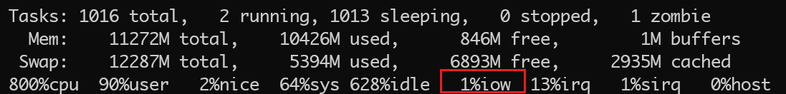

> 原文链接：https://blog.csdn.net/TeleostNaCl/article/details/149152653
> 发布时间：2025-07-06 14:41:34
> 标签：android、经验分享

---

#### 文章目录

- [一、问题背景](#_1)
- [二、代码实现](#_9)

## 一、问题背景

经常做 `Android` 应用的小伙伴应该会有经验，就是如果应用在写入文件的时候，即使写文件的动作是在子线程，也会出现 `UI` 上的卡顿，这是因为文件的 `IO` 是由内核去完成的，此时 `CPU` 会从 `用户态` 切换到 `内核态`，应用将无法获得 `CPU` 时间片。如果 `IO` 较少的时候，这个切换不频繁，应用能有足够的时间片去执行绘制。但如果 `IO` 频繁，例如高速写入的场景下，此时 `IO` 占用的时间片增加，而我们知道 `CPU` 资源是有限的，此时会导致应用获得 `时间片` 将减少，导致 `UI` 绘制线程出现卡顿，进而影响 `UI` 上的卡顿。

我们可以使用 `top` 命令，查看 `IO` 占用 `CPU` 的时间片（即 `iow`）：  
 

因此，如果不能从其它方式去解决此问题（内核层的 `IO` 调度 和 `CPU` 调度机制），可以运用简单的方式：在写入文件的时候，限制写入速度，减缓 `IO` 占用率。

## 二、代码实现

例如，一个标准的拷贝文件的 `Kotlin` 方法如下：

```kotlin
originFile.inputStream().buffered().use { inputStream ->
    targetFile.outputStream().buffered().use { outputStream ->
        val buffer = ByteArray(1024)
        var bytesRead: Int
        while (inputStream.read(buffer).also { bytesRead = it } != -1) {
            outputStream.write(buffer, 0, bytesRead)
        }
        outputStream.flush()
    }
}
```

这个方法对 `源文件` 开启了 `InputStream`，并转换为 `BufferInputStream`，而对 `目标文件` 开启了 `OutputStream`，并转换为 `BufferOutputStream`，然后再从 `InputStream` 读取流，输出到 `OutputStream`，完成文件的读写。

而我们为了实现限制其写入速度，我们可以定义一个速率，例如每秒写入 `20M`，即每秒写入的字节数为 `20 * 1024 * 1024 = 20, 971, 520` 。在每次写入量达到 `20M` 的时候，检查一次写入这 `20M` 使用的时长，如果这个时长 `< 1s` ，则表示在这 `1s` 的时间里，写入的速率已经超过了 `20M`，需要等待一定时长，使其满足 `1s` 内只写入 `20M` 的需求。代码如下：

```kotlin
// 限制拷贝时的速率, 每秒最多拷贝的字节数
val MAX_COPY_SPEED = 20 * 1024 * 1024L

// 记录已拷贝的文件大小
var copiedSize = 0L

// 记录上次检查性能的时间 (用来计算拷贝速率 限制拷贝速率)
var lastCheckPerformanceTime = System.currentTimeMillis()
// 记录上次检查时 已拷贝的数据量
var lastCheckPerformanceSize = 0L

originFile.inputStream().buffered(1024 * 1024).use { inputStream ->
    targetFile.outputStream().buffered().use { outputStream ->
        val buffer = ByteArray(DEFAULT_BUFFER_SIZE)
        var bytesRead: Int
        while (inputStream.read(buffer).also { bytesRead = it } != -1) {
            outputStream.write(buffer, 0, bytesRead)

            // 增加已拷贝文件的大小
            copiedSize += bytesRead

            // 计算拷贝速率 每满 MAX_COPY_SPEED 计算一次速率
            if (copiedSize - lastCheckPerformanceSize >= MAX_COPY_SPEED) {
                lastCheckPerformanceSize = copiedSize
                val time = System.currentTimeMillis()
                // 计算写入 MAX_COPY_SPEED 字节数所使用的时间
                val deltaTime = time - lastCheckPerformanceTime
                lastCheckPerformanceTime = time
                // 如果速率大于 MAX_COPY_SPEED 则暂停 等待下次计算
                if (deltaTime < 1000) {
                	// 延迟 1000 - deltaTime 使满足 1s 内只写入指定量
                    delay(1000 - deltaTime)
                }
            }
        }
        outputStream.flush()
    }
}
```
