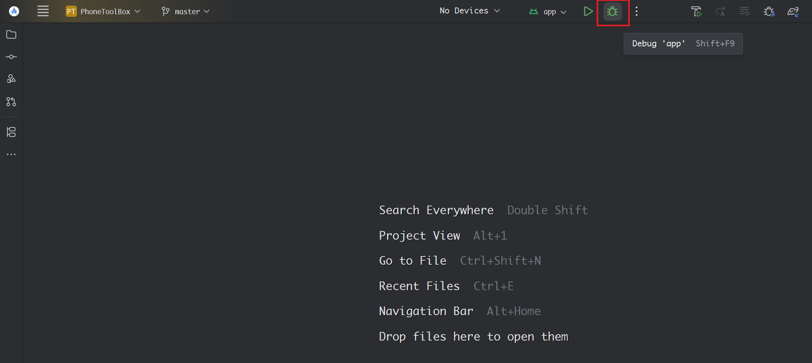
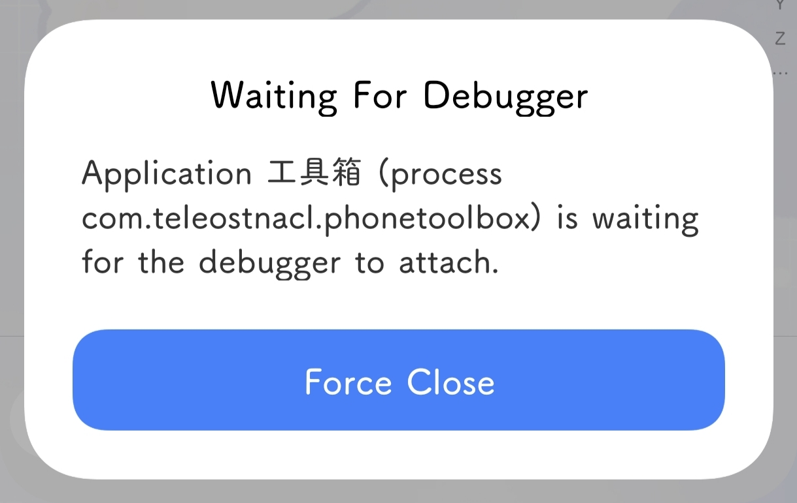
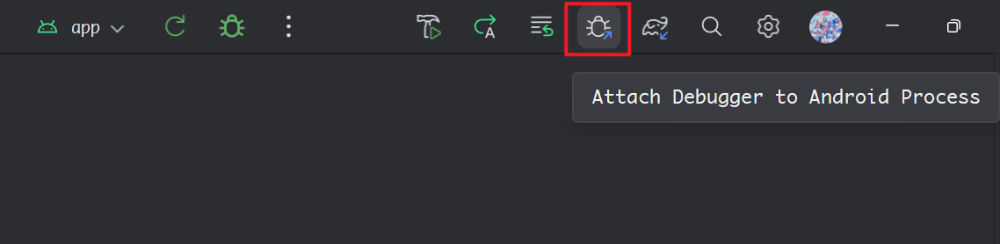
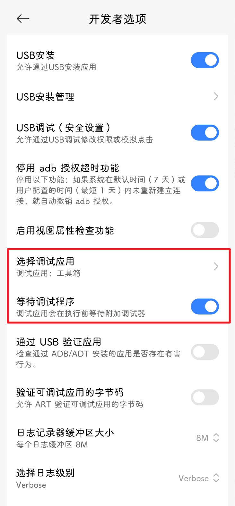

@[TOC]
## 一、问题背景
我们在做 `Android` 应用开发的时候，有时候为了调试应用，需要让应用进入调试状态，我们一般可以通过 `Android Studio` 的 `Debug` 按钮 使应用进入调试状态：



那么在这个过程中，`Android` 如何使应用进入调试状态呢？特别在有些情况，我们可能不能使用 `Debug` 按钮使应用进入调试状态，那么我们是否可以直接利用命令，使应用进入调试状态呢？本文将详细介绍使用命令使 Android 应用进入调试状态。

参考文档：[https://android-dev-life.blogspot.com/2015/02/do-you-adb-shell-am-set-debug-app.html](https://android-dev-life.blogspot.com/2015/02/do-you-adb-shell-am-set-debug-app.html)

## 二、进入调试状态
从参考文档可以知道，我们可以在终端使用以下命令使应用进入调试状态（注意此应用需要 `debuggable` 状态，即 `debug` 版本）：
```shell
am set-debug-app -w --persistent 包名
```

此时启动应用的时候，会有提示进入 Debug 状态，等待连接调试器。



此时，需要点击 `Android Studio` 的 `Attrach Debugger to Android Process` 的功能，选择指定的进程，此时就可以连接上调试状态了。



## 三、退出调试状态
当不需要调试状态时，可以使用以下命令退出调试状态：
```shell
am clear-debug-app 包名
```

## 四、图形界面的方法
在 `Android` 设置中，`开发者选项` 菜单下，有一个 `选择调试应用` 功能 和 `等待调试程序`，此时可以设置这两个选项实现应用进入调试状态：


