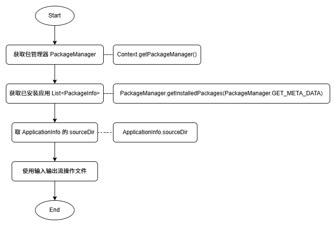

> 原文链接：https://blog.csdn.net/TeleostNaCl/article/details/152417326
> 发布时间：2025-10-03 00:02:34
> 标签：android、经验分享、android runtime、androidx、java、kotlin

---

#### 文章目录

- [一、问题背景](#_1)
- [二、流程图](#_4)
- [三、代码实现](#_51)

## 一、问题背景

在 `Android` 平台上，我们使用 `apk` 安装软件时，其实是把 `apk` 文件移动到了 `/data/app` 文件夹下。在我们应用开发需求的时候，例如做备份应用，我们需要把应用软件的 `apk` 重新提取出来。本文将详细介绍在做Android开发的时候，如何用代码将应用安装包 `apk` 提取出来。

## 二、流程图



基本原理是通过 `PackageManager` 获取到已安装的应用，得到 `PackageInfo`，再从 `PackageInfo` 中的 `ApplicationInfo` 取 `sourceDir`，即为 `APK` 路径，此时使用文件的输入输出流即可将文件输出到指定目录下。

如果仅需要获取指定包名的 `APK` ，则可以使用 `PackageManager.getApplicationInfo(包名, PackageManager.GET_META_DATA)` 方式拿到指定应用的 `ApplicationInfo` 信息

除了 `APK` 路径，从 `ApplicationInfo` 中还可以取到多个与应用相关的路径，如 `aab` 打包方式的 `spilt`，官方 `API` 如下：

```java
/**
 * Full path to the base APK for this application.
 */
public String sourceDir;

/**
 * Full path to the publicly available parts of {@link #sourceDir},
 * including resources and manifest. This may be different from
 * {@link #sourceDir} if an application is forward locked.
 */
public String publicSourceDir;

/**
 * The names of all installed split APKs, ordered lexicographically.
 * May be null if no splits are installed.
 */
@Nullable
public String[] splitNames;

/**
 * Full paths to split APKs, indexed by the same order as {@link #splitNames}.
 * May be null if no splits are installed.
 */
@Nullable
public String[] splitSourceDirs;

/**
 * Full path to the publicly available parts of {@link #splitSourceDirs},
 * including resources and manifest. This may be different from
 * {@link #splitSourceDirs} if an application is forward locked.
 * May be null if no splits are installed.
 *
 * @see #splitSourceDirs
 */
@Nullable
public String[] splitPublicSourceDirs;
```

## 三、代码实现

在高版本的 `Android` 系统中（`Android 11` 及以上），需要声明 `android.permission.QUERY_ALL_PACKAGES` 才可以查询到所有应用。需要在 `AndroidManifest.xml` 文件中声明 `android.permission.QUERY_ALL_PACKAGES` 权限：

```xml
<manifest>
    <uses-permission android:name="android.permission.QUERY_ALL_PACKAGES" />
</manifest>
```

对于只需要查询指定应用的情况，我们可以仅声明查询指定应用，在`AndroidManifest.xml` 文件中声明类似的查询包名：

```xml
<manifest>
	<queries>
	    <package android:name="com.example.store" />
	    <package android:name="com.example.services" />
	</queries>
</manifest>
```

官方文档如下：<https://developer.android.com/training/package-visibility>

获取所有应用的 `APK` 路径：

```kt
// 通过context 获取 PackageManager
val packageManager = context.packageManager
// 获取已安装的应用列表
val installedPackages = packageManager.getInstalledPackages(PackageManager.GET_META_DATA)
// 遍历每个应用
installedPackages.forEach { packageInfo ->
    // 获取 ApplicationInfo
    val applicationInfo = packageInfo.applicationInfo ?: return
    // 开启 sourceDir 的文件输入流
    File(applicationInfo.sourceDir).inputStream().use { inputStream ->
        // 对输入流进行操作 即可访问文件 APK
    }
}
```

查询指定应用的 `APK` 路径：

```kt
// 通过context 获取 PackageManager
val packageManager = context.packageManager
// 获取 指定应用的 ApplicationInfo
val info = packageManager.getApplicationInfo(包名, PackageManager.GET_META_DATA)
// 开启 sourceDir 的文件输入流
File(info.sourceDir).inputStream().use { inputStream ->
    // 对输入流进行操作 即可访问文件 APK
}
```
