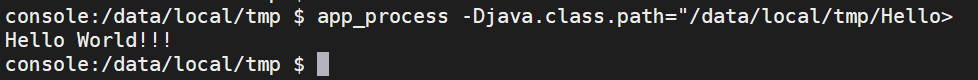
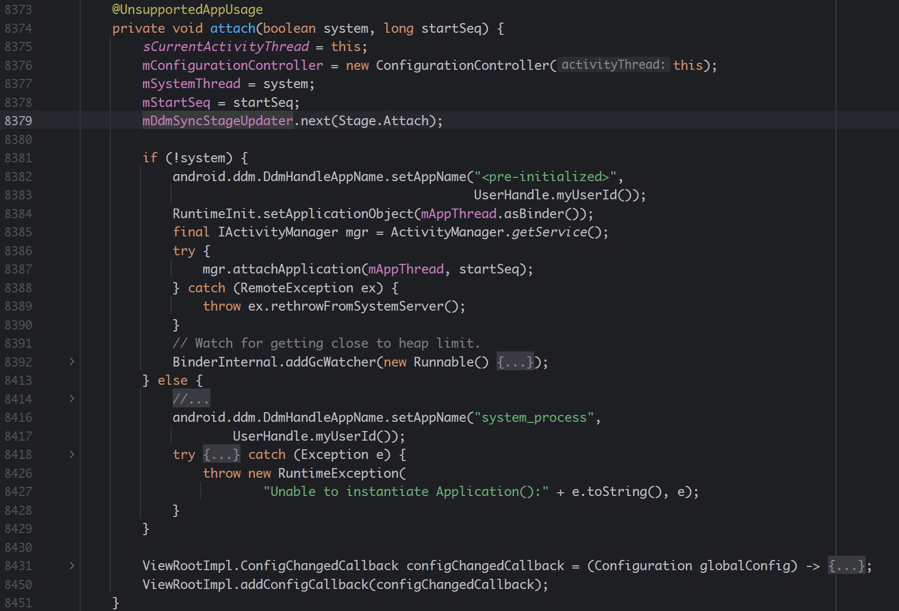

@[TOC]
# 一、问题背景
在 `Android` 中，可以使用 `Android Studio` 编写 `Java` 应用程序，通过编译打包成 `apk` 文件，然后将文件推送至 `/data/local/tmp` 等可执行的目录或安装打包出来的应用，随后使用 `app_process` 命令即可运行此 `Java 程序`，命令格式如下：
```shell
app_process -Djava.class.path=${apk路径} /system/bin 主类的全限定名
```
例如如下：
在 `Android Studio` 中编写一个 `Hello World` 程序：
```kotlin
package com.teleostnacl

object HelloWorld {
    @JvmStatic
    fun main(args: Array<String>) {
        println("Hello World!!!")
    }
}
```
编译完成之后，推送至 `/data/local/tmp`，随后使用命令执行 `app_process -Djava.class.path="/data/local/tmp/HelloWorld.apk" /system/bin com.teleostnacl.HelloWorld`

可以看到其可以正常执行 `Java` 代码并输出 `Hello World!!!`
这个方式启动的 `Java` 程序将集成 `shell` 的 `用户组` 和 `用户`，可以执行高权限的命令，实现应用的提权，流行于各种工具箱中。但是由于这样启动的 `Java` 程序是没有`Application` `Activity` 和其它四大组件的，无法直接拿到 `Context`，而对于很多 `Android API` 来说都需要用到 `Context` 的。那么有没有办法去拿到一个 `Context` 呢？本文将介绍一种可以在通过 `app_process` 命令启动的 Java 程序中获取到 `Context` 的方式。

# 二、代码实现
先直接上代码，看如何在代码中构造一个 `Context`
```kotlin
val context: Context? by lazy {
    try {
        Looper.prepareMainLooper()

        // ActivityThread activityThread = new ActivityThread();
        val activityThreadCls = Class.forName("android.app.ActivityThread")
        val activityThreadConstructor: Constructor<*> = activityThreadCls.getDeclaredConstructor()
        activityThreadConstructor.isAccessible = true
        val activityThread = activityThreadConstructor.newInstance()
        
        val getSystemContextMethod = activityThreadCls.getDeclaredMethod("getSystemContext")
        getSystemContextMethod.invoke(activityThread) as Context
    } catch (e: Exception) {
        e.printStackTrace()
        null
    }
}
```
参考：[scrcpy 的 Workarounds.java](https://github.com/Genymobile/scrcpy/blob/master/server/src/main/java/com/genymobile/scrcpy/Workarounds.java)

此方法的原理是通过 `ActivityThread.getSystemContext()` 来构造获取 `Context`，但是由于 `ActivityThread` 的构造方法和 `getSystemContext()` 方法都是被打上了 `@UnsupportedAppUsage` 注解的，外部无非直接调用，因此需要通过反射来构造。

# 三、代码详解
我们可以通过分析 `Android App` 的启动流程来了解到 `Context` 被构造出来的过程。
我们知道 `Android App` 是基于 Java 编写的一种特殊的程序，其跟 `Java` 程序一样，需要通过 `main` 方法来作为应用程序的唯一入口。在 APP 启动时，会先通过 `AMS` 请求启动应用，通过 `Zygote` 使用 `fork()` 方法复制自身，创建新的应用进程，此时会加载 `Android Runtime (ART)` 进行加载 `Java 虚拟机和核心库`，再调用 `ActivityThread` 的 `main()` 方法，这就是应用进程的入口点。
我们来看一下 `ActivityThread` 的 `main()` 实际的实现：
```java
public static void main(String[] args) {
    Trace.traceBegin(Trace.TRACE_TAG_ACTIVITY_MANAGER, "ActivityThreadMain");

    // Install selective syscall interception
    AndroidOs.install();

    // CloseGuard defaults to true and can be quite spammy.  We
    // disable it here, but selectively enable it later (via
    // StrictMode) on debug builds, but using DropBox, not logs.
    CloseGuard.setEnabled(false);

    Environment.initForCurrentUser();

    // Make sure TrustedCertificateStore looks in the right place for CA certificates
    final File configDir = Environment.getUserConfigDirectory(UserHandle.myUserId());
    TrustedCertificateStore.setDefaultUserDirectory(configDir);

    // Call per-process mainline module initialization.
    initializeMainlineModules();

    Process.setArgV0("<pre-initialized>");

    Looper.prepareMainLooper();

    // Find the value for {@link #PROC_START_SEQ_IDENT} if provided on the command line.
    // It will be in the format "seq=114"
    long startSeq = 0;
    if (args != null) {
        for (int i = args.length - 1; i >= 0; --i) {
            if (args[i] != null && args[i].startsWith(PROC_START_SEQ_IDENT)) {
                startSeq = Long.parseLong(
                        args[i].substring(PROC_START_SEQ_IDENT.length()));
            }
        }
    }
    ActivityThread thread = new ActivityThread();
    thread.attach(false, startSeq);

    if (sMainThreadHandler == null) {
        sMainThreadHandler = thread.getHandler();
    }

    if (false) {
        Looper.myLooper().setMessageLogging(new
                LogPrinter(Log.DEBUG, "ActivityThread"));
    }

    // End of event ActivityThreadMain.
    Trace.traceEnd(Trace.TRACE_TAG_ACTIVITY_MANAGER);
    Looper.loop();

    throw new RuntimeException("Main thread loop unexpectedly exited");
}
```
在这段代码中，前几行都是为了初始化相关的模块，以便后续在 Android 应用中可以正常使用相关的功能，随后 调用 `Looper.prepareMainLooper();` 将主线程的 `Looper` 给准备好，随后
```java
    ActivityThread thread = new ActivityThread();
    thread.attach(false, startSeq);
```
构建了一个 `ActivityThread`，并调用 `attach` 方法将其绑定。最后调用 `Looper.loop();` 开始循环处理主线程的消息。
我们再来看 `attach` 方法：

这个方法中的逻辑较多，核心的就是给 `sCurrentActivityThread` 和 `mSystemThread` 进行赋值，并将`ApplicationThread` `attach` 到 `AMS` 中，向 `AMS` 注册应用进程。最后添加与 `View` 有关的配置修改的回调。

我们再看与 `Context` 有关的逻辑：
```java
@UnsupportedAppUsage
ActivityThread() {
    mResourcesManager = ResourcesManager.getInstance();
}

@Override
@UnsupportedAppUsage
public ContextImpl getSystemContext() {
    synchronized (this) {
        if (mSystemContext == null) {
            mSystemContext = ContextImpl.createSystemContext(this);
        }
        return mSystemContext;
    }
}
```
可以看到 `getSystemContext()` 就是一个获取 `Context` 的关键方法，而在其内部调用 `ContextImpl.createSystemContext();` 方法，并传递了一个 `ActivityThread` 的实例。
`ActivityThread` 的构造方法和 `getSystemContext()` 方法都是被打上了 `@UnsupportedAppUsage` 注解的，且构造方法是使用 `default` 的限定符，外部无法直接实例化。而 `ActivityThread` 的类被打上了@hide标记，整个类对于外部来说都无法使用。
因此在构造 `Context` 的时候，需要通过 `val activityThreadCls = Class.forName("android.app.ActivityThread")` 来获取到类对象，再改变构造方法的可访问性来实例化 `ActivityThread` 对象 
```kotlin
val activityThreadConstructor: Constructor<*> = activityThreadCls.getDeclaredConstructor()
activityThreadConstructor.isAccessible = true
val activityThread = activityThreadConstructor.newInstance()
```
再然后反射调用 `getSystemContext()` 方法
```kotlin
val getSystemContextMethod = activityThreadCls.getDeclaredMethod("getSystemContext")
getSystemContextMethod.invoke(activityThread) as Context
```
直接这样构造出来之后，在使用上可能会因为缺少相关的初始化而不能使用，可以参考 [scrcpy 的 Workarounds.java](https://github.com/Genymobile/scrcpy/blob/master/server/src/main/java/com/genymobile/scrcpy/Workarounds.java) 将 `ActivityThread.sCurrentActivityThread` 和 `activityThread.mSystemThread` 都赋值：
```kotlin
// ActivityThread.sCurrentActivityThread = activityThread;
val sCurrentActivityThreadField = activityThreadCls.getDeclaredField("sCurrentActivityThread")
sCurrentActivityThreadField.isAccessible = true
sCurrentActivityThreadField.set(null, activityThread)

// activityThread.mSystemThread = true;
val mSystemThreadField = activityThreadCls.getDeclaredField("mSystemThread")
mSystemThreadField.isAccessible = true
mSystemThreadField.setBoolean(activityThread, true)
```
