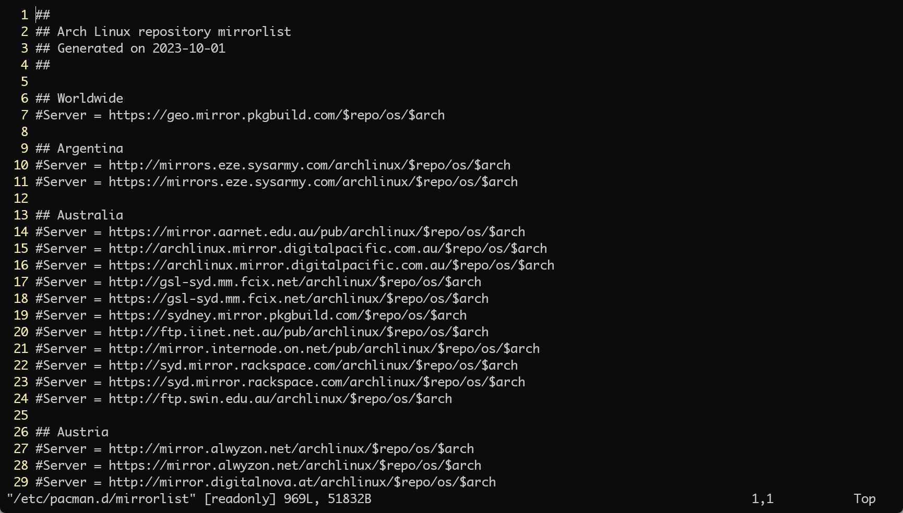
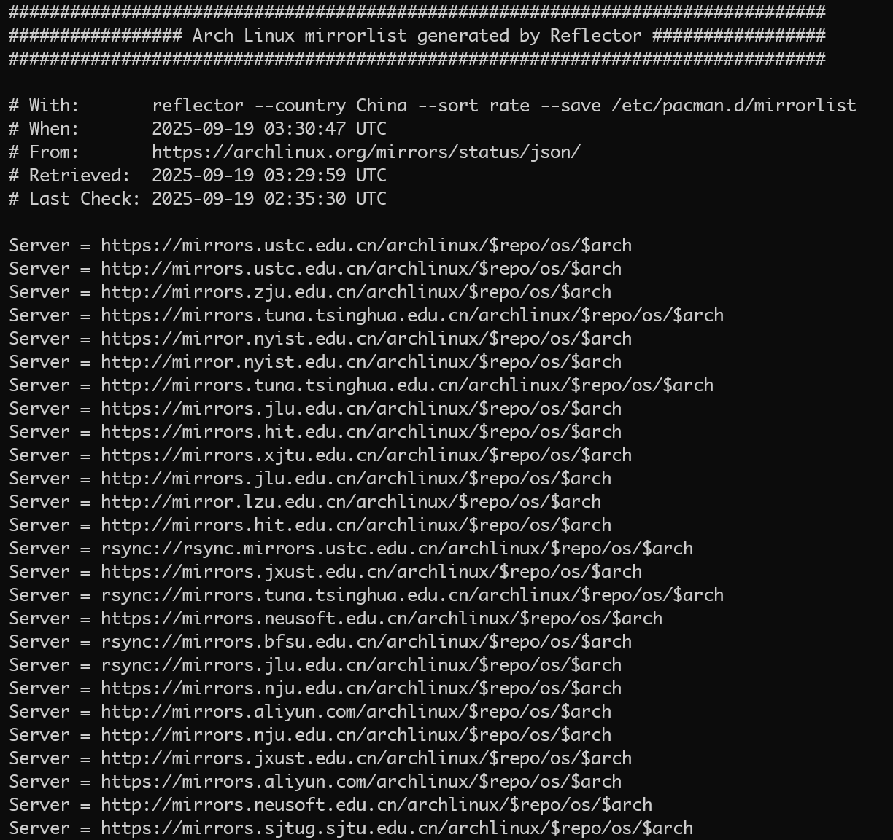
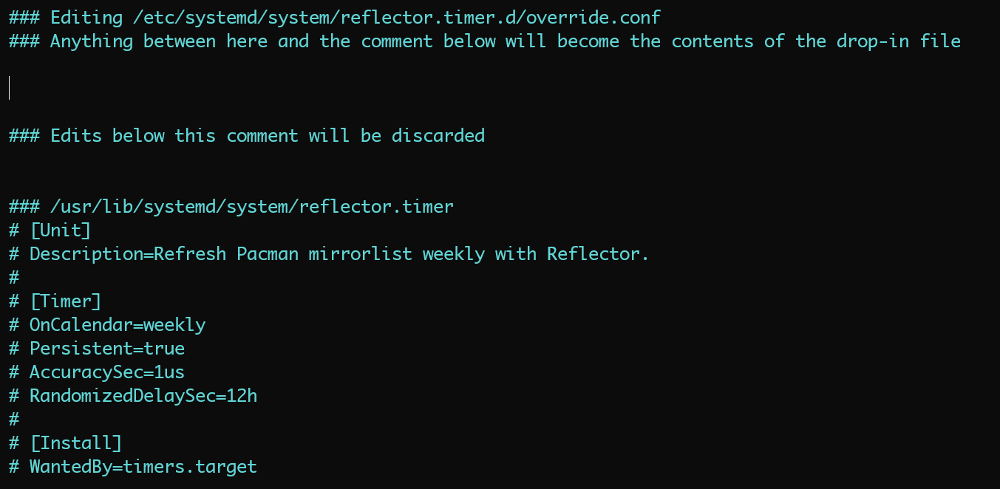
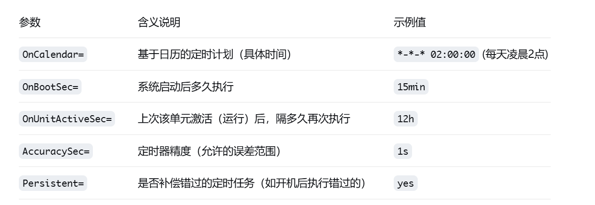
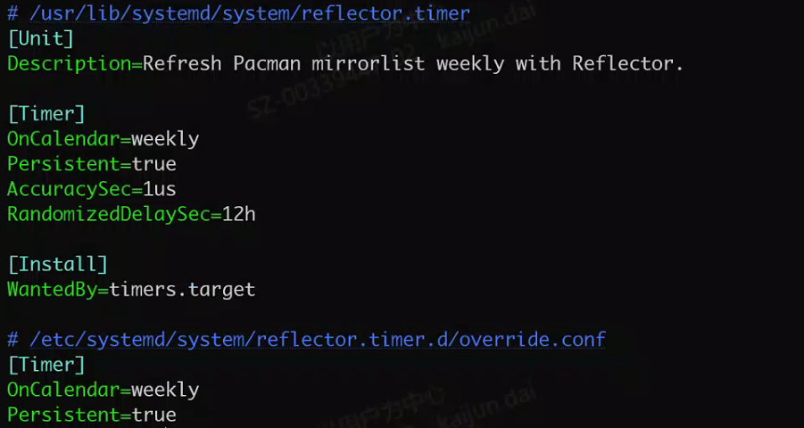

@[TOC]
# 一、问题背景
我们在使用 ArchLinux 的时候，使用 `Pacman` 软件包管理工具快速的更新 `ArchLinux` 系统中安装的应用，`Pacman` 通过和主服务器同步软件包列表来保持系统是最新的。一种常用的命令如下：
```shell
sudo pacman -Syyu
```

官方文档如下：[https://wiki.archlinux.org/title/Pacman](https://wiki.archlinux.org/title/Pacman)

我们知道，我们可以通过编辑 `/etc/pacman.d/mirrorlist` 文件管理 `Pacman` 更新的时候所使用的源服务器，如果选择离我们将近的服务器可以达到提高更新速度的目的。一份标准的 `mirrorlist` 文件如下：

如果想使用哪个源，则把那一行的注释符 `#` 去掉即可。

一份标准的文件可以通过以下链接进行获取:
[https://archlinux.org/mirrorlist/](https://archlinux.org/mirrorlist/)
[https://archlinux.org/mirrorlist/all/](https://archlinux.org/mirrorlist/all/)

但是，官方源的服务器是分布于全球范围，即使选择自己国家的服务器，也有可能因为服务器的远近导致更新缓慢。因此我们会有需求希望能自动筛选可用的服务器，并按时延进行排序，使 `Pacman` 可以优先使用低时延的服务器进行更新软件，以达到加快 `Pacman` 的更新速度的目的。

# 二、Reflector 介绍
`Reflector` 工具 可以从 `Arch Linux` 官方镜像状态页面获取最新的镜像列表，并根据延迟、速度等进行筛选和排序。
其支持丰富的调用方式，以满足不同需求下的调用。同时，其支持定时调用，可以在指定的时间自动更新 `mirrorlist`

# 三、基础调用
强烈建议，在操作前首先备份自己的原始镜像文件 `/etc/pacman.d/mirrorlist`
```shell
sudo cp /etc/pacman.d/mirrorlist /etc/pacman.d/mirrorlist.bak
```

首先，我们明确我们的需求，我们需要选出自己所在国家下载速度最快的镜像源，并按时延排序进行更新，那么查阅官方的文档，我们可以有以下命令：
```shell
sudo reflector --country China --sort rate --save /etc/pacman.d/mirrorlist
```
命令解析如下：
- `sudo`：使用 `reflector` 需要 `root` 权限以便修改 `/etc/pacman.d/mirrorlist`
- `--country`：此参数可以限制在指定国家中选择源进行测试，最终也仅使用指定国家下的源。此参数可以帮助我们仅使用自己国家的源，加快测试的速度，提前得到结果。
- `--sort`：排序规则，此参数可以传递 `age, rate, country, score, delay`，分别表示按添加时间进行排序，按下载速率进行排序，按国家进行排序，按评分进行排序，按时延进行排序。一般使用 `--sort rate` 或 `--sort delay`。
- `--save /etc/pacman.d/mirrorlist`：用于指定更新后的镜像源存储的位置。

调用如下命令之后，则会自动更新 `/etc/pacman.d/mirrorlist` 文件，此时 `/etc/pacman.d/mirrorlist` 文件会被更新，会有以下文件头内容：
```
################################################################################
################# Arch Linux mirrorlist generated by Reflector #################
################################################################################
```
详细文件如下：


此时使用 `pacman` 更新的时候就会使用更新之后的镜像。

# 四、定时任务
## 1. 启用Service
如果希望实现定时任务，在指定的时间点进行自动更新，可以启用 `Reflector` 附带的 `reflector.timer` 服务，然后编辑相应的服务参数，这样即可实现自动更新镜像列表。
```shell
# 启用 reflector.service
sudo systemctl enable reflector.service
 # 启用定时器 自动更新 reflector.timer
sudo systemctl enable reflector.timer
```

## 2. 编辑Service
默认的配置文件在 `/usr/lib/systemd/system/` 下的，但是直接编辑文件不是最佳实践，应使用 `systemctl edit` 命令来创建覆盖配置文件 `override.conf`，命令如下：

```shell
sudo systemctl edit reflector.timer
```
> 这个命令默认会用你的 `$EDITOR` 环境变量指定的编辑器（比如 `nano` 或 `vim`）。如果想指定编辑器，可以用 `sudo EDITOR=vim systemctl edit reflector.timer`。

此时会打开文本编辑器，此时将编辑 `/etc/systemd/system/reflector.timer.d/override.conf` 文件。

我们将在 `### Anything between here and the comment below will become the contents of the drop-in file` 之后 和 `### Edits below this comment will be discarded` 之前的位置 编辑自己想增加的内容，这里添加的配置将覆盖原文件。

例如，我们想要每周日凌晨3点自动运行
```
[Timer]
OnCalendar=Sun *-*-* 03:00:00
Persistent=true
```

每天凌晨2点运行
```
[Timer]
OnCalendar=*-*-* 02:00:00
Persistent=true
```

此语法规则如下：[https://wiki.archlinux.org/title/Systemd/Timers](https://wiki.archlinux.org/title/Systemd/Timers)

`OnCalendar` 的基本格式是：`星期 年-月-日 时:分:秒`，其它参数解析如下：



之后，我们要编辑 `reflector.service`，命令如下：

```shell
sudo systemctl edit reflector.service
```
与上面相同，在两个注释间添加以下内容即可，这个的作用是覆写执行命令，使用我们指定的参数进行更新。：
```
[Service]
ExecStart=
ExecStart=/usr/bin/reflector \
    --country China \
    --sort rate \
    --save /etc/pacman.d/mirrorlist
```

当两个 `service` 都被编辑完成之后，此时需要重新加载 `systemctl` 保证其生效。
```shell
sudo systemctl daemon-reload
```
## 3. 验证Service
我们可以使用 `systemctl cat` 命令去验证修改是否已经生效
```
sudo systemctl cat reflector.timer
sudo systemctl cat reflector.service
```

此时可以看到 在原来 `/usr/lib/systemd/system/reflector.timer` 的文件内容之后，加了一个 ` /etc/systemd/system/reflector.timer.d/override.conf` 覆盖文件，即表示修改成功，将会使用 `override.conf` 的配置进行调用。


同时，我们可以执行 `sudo systemctl start reflector.service` 直接运行一次 `reflector.service` 以便验证我们对 `reflector.service` 是否生效。

最后，我们可以用 `sudo systemctl list-timers reflector.timer` 命令查看 `reflector.timer` 下一次执行的时间，例如：
```
NEXT                        LEFT LAST                        PASSED UNIT            ACTIVATES
Fri 2025-09-19 22:50:34 CST  10h Thu 2025-09-11 17:00:45 CST      - reflector.timer reflector.service

1 timers listed.
Pass --all to see loaded but inactive timers, too.
```
从这个列表中可以知道下一次执行时间为 `Fri 2025-09-19 22:50:34 CST`，由此可以验证设置的定时器是否生效。

# 五、Reflector 文档
官方 `man` 文档如下：
```shell
usage: reflector [-h] [--connection-timeout n] [--download-timeout n] [--list-countries] [--cache-timeout n]
                 [--url URL] [--save <filepath>] [--sort {age,rate,country,score,delay}] [--threads n] [--verbose]
                 [--info] [-a n] [--delay n] [-c <country name or code>] [-f n] [-i <regex>] [-x <regex>] [-l n]
                 [--score n] [-n n] [-p <protocol>] [--completion-percent [0-100]] [--isos] [--ipv4] [--ipv6]

retrieve and filter a list of the latest Arch Linux mirrors

options:
  -h, --help            show this help message and exit
  --connection-timeout n
                        The number of seconds to wait before a connection times out. Default: 5
  --download-timeout n  The number of seconds to wait before a download times out. Default: 5
  --list-countries      Display a table of the distribution of servers by country.
  --cache-timeout n     The cache timeout in seconds for the data retrieved from the Arch Linux Mirror Status API. The
                        default is 300.
  --url URL             The URL from which to retrieve the mirror data in JSON format. If different from the default,
                        it must follow the same format. Default: https://archlinux.org/mirrors/status/json/
  --save <filepath>     Save the mirrorlist to the given path.
  --sort {age,rate,country,score,delay}
                        Sort the mirrorlist. "age": last server synchronization; "rate": download rate; "country":
                        country name, either alphabetically or in the order given by the --country option; "score":
                        MirrorStatus score; "delay": MirrorStatus delay.
  --threads n           Use n threads for rating mirrors. This option will speed up the rating step but the results
                        will be inaccurate if the local bandwidth is saturated at any point during the operation. If
                        rating takes too long without this option then you should probably apply more filters to
                        reduce the number of rated servers before using this option.
  --verbose             Print extra information to STDERR. Only works with some options.
  --info                Print mirror information instead of a mirror list. Filter options apply.

filters:
  The following filters are inclusive, i.e. the returned list will only contain mirrors for which all of the given
  conditions are met.

  -a, --age n           Only return mirrors that have synchronized in the last n hours. n may be an integer or a
                        decimal number.
  --delay n             Only return mirrors with a reported sync delay of n hours or less, where n is a float. For
                        example. to limit the results to mirrors with a reported delay of 15 minutes or less, pass
                        0.25.
  -c, --country <country name or code>
                        Restrict mirrors to selected countries. Countries may be given by name or country code, or a
                        mix of both. The case is ignored. Multiple countries may be selected using commas (e.g.
                        --country France,Germany) or by passing this option multiple times (e.g. -c fr -c de). Use "--
                        list-countries" to display a table of available countries along with their country codes. When
                        sorting by country, this option may also be used to sort by a preferred order instead of
                        alphabetically. For example, to select mirrors from Sweden, Norway, Denmark and Finland, in
                        that order, use the options "--country se,no,dk,fi --sort country". To set a preferred country
                        sort order without filtering any countries. this option also recognizes the glob pattern "*",
                        which will match any country. For example, to ensure that any mirrors from Sweden are at the
                        top of the list and any mirrors from Denmark are at the bottom, with any other countries in
                        between, use "--country 'se,*,dk' --sort country". It is however important to note that when
                        "*" is given along with other filter criteria, there is no guarantee that certain countries
                        will be included in the results. For example, with the options "--country 'se,*,dk' --sort
                        country --latest 10", the latest 10 mirrors may all be from the United States. When the glob
                        pattern is present, it only ensures that if certain countries are included in the results,
                        they will be sorted in the requested order.
  -f, --fastest n       Return the n fastest mirrors that meet the other criteria. Do not use this option without
                        other filtering options.
  -i, --include <regex>
                        Include servers that match <regex>, where <regex> is a Python regular express.
  -x, --exclude <regex>
                        Exclude servers that match <regex>, where <regex> is a Python regular express.
  -l, --latest n        Limit the list to the n most recently synchronized servers.
  --score n             Limit the list to the n servers with the highest score.
  -n, --number n        Return at most n mirrors.
  -p, --protocol <protocol>
                        Match one of the given protocols, e.g. "https" or "ftp". Multiple protocols may be selected
                        using commas (e.g. "https,http") or by passing this option multiple times.
  --completion-percent [0-100]
                        Set the minimum completion percent for the returned mirrors. Check the mirrorstatus webpage
                        for the meaning of this parameter. Default value: 100.0.
  --isos                Only return mirrors that host ISOs.
  --ipv4                Only return mirrors that support IPv4.
  --ipv6                Only return mirrors that support IPv6.
```
