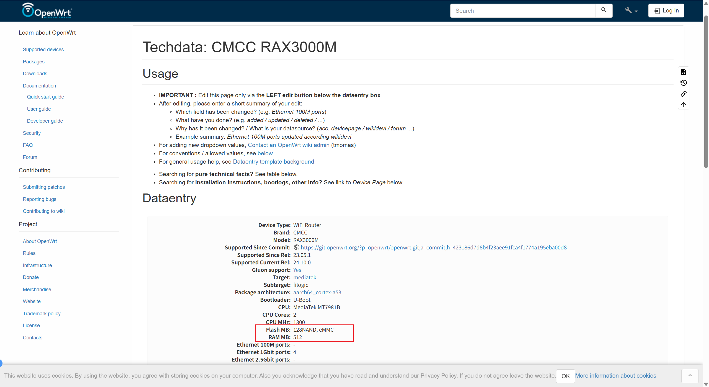
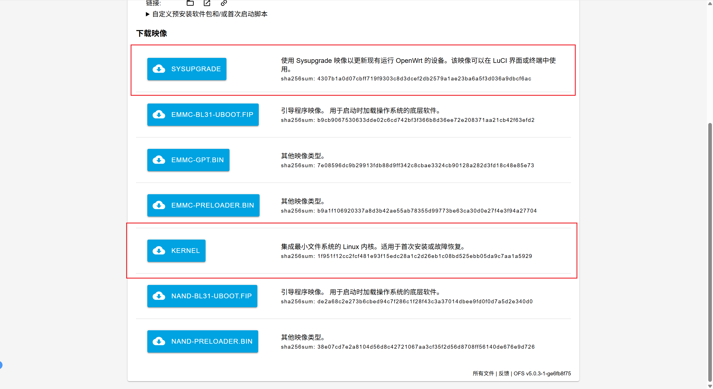
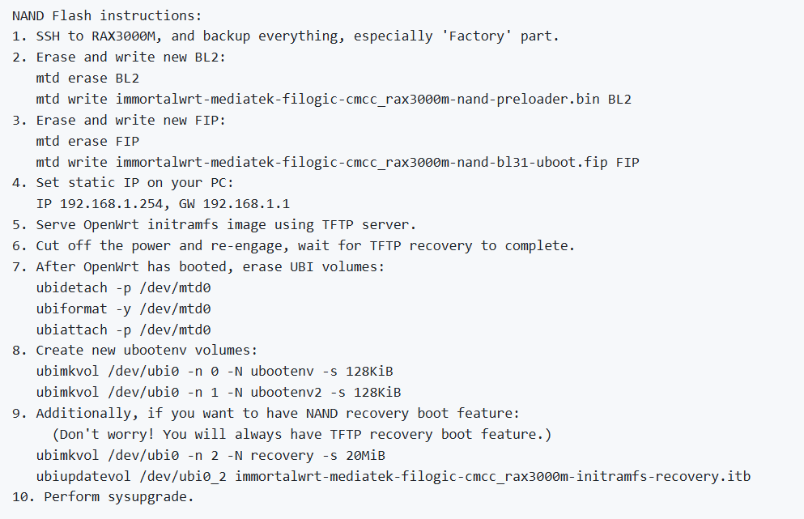

@[TOC]

## 问题背景

`CMCC RAX3000M` `Nand` 版本的配置为 128MB 的 `nand` `ROM` + `512MB` 的 `RAM`，详细可见 [CMCC RAX3000M](https://openwrt.org/toh/hwdata/cmcc/cmcc_rax3000m)


因此，在 `CMCC RAX3000M` 可用空间应该约为 `128MB`。但是最近在刷 `OpenWrt` 的时候，发现刷完新系统之后的可用空间只有几M了，但是镜像包都不是很大；同时刷写大于 `55MB` 的固件的时候，总是会刷写失败，并且刷写失败之后会进入到一个之前刷过的某个版本，这表明 `Flash` 中有一个系统占据了部分空间，**导致实际可用的空间大幅度减少了**。


因此，依照这个思路，本文来研究一下如何释放掉无效的占用，恢复原来的 `Flash` 空间。


## 尝试一、通过 Tftpd64 重新刷写 initramfs-recovery 镜像 （不成功）

参考：[CMCC RAX3000M使用Tftpd刷写OpenWrt固件的救砖方法](https://blog.csdn.net/TeleostNaCl/article/details/147594600)


根据在刷写失败之后进入到一个之前刷写过的某个版本这个信息，因为这个系统曾经通过 `Tftpd64` 刷写了其 `initramfs-recovery` 镜像，随后启动了 `ramdisk` 的 `OpenWrt`，然后再通过 `System Upgrade` 刷写了 `squashfs-sysupgrade`，使其可以完整的运行 `OpenWrt` 镜像，因此由此推测，使用 `initramfs-recovery` 镜像会额外占用空间，作为 `recovery` 启动。


综上分析，做出了第一次尝试，是不是只有刷一个小的`initramfs-recovery` 镜像，就可以减小占用了呢？那么直接从官方的镜像选择器，找到 `CMCC RAX3000M` 的 `OpenWrt` 的官方镜像：`https://firmware-selector.openwrt.org/?version=24.10.1&target=mediatek%2Ffilogic&id=cmcc_rax3000m`，从而可以使用到集成最小文件系统的 `OpenWrt` 系统，最大程度的减小占用。


下载`KERNEL` 和 `SYSUPGRADE` ，此时会得到 `openwrt-24.10.1-mediatek-filogic-cmcc_rax3000m-initramfs-recovery.itb` 和 `openwrt-24.10.1-mediatek-filogic-cmcc_rax3000m-squashfs-sysupgrade.itb` 两个文件，即第一个是 `ramdik`，用于在 `Tftpd64` 刷机，第二个为完整的系统，用于在系统升级中使用。


参考[CMCC RAX3000M使用Tftpd刷写OpenWrt固件的救砖方法](https://blog.csdn.net/TeleostNaCl/article/details/147594600) 这篇文章的方法刷写 `ramdik` 系统，然后再升级 `squashfs-sysupgrade` 系统。


但遗憾的是，根据此方法之后，依旧没有释放出空间了，可用空间还是只有 `55MB` 左右，并且刷写失败之后，依旧会进入到之前的系统中，证明 `Flash` 中的那个系统没有被移除。


## 尝试二、重新分配 ubi 卷（此操作存在一定的危险，请查阅相关资料，避免影响到核心分区）

在 `OpenWrt` 官方 `pull` 中，添加了 `CMCC RAX3000M` 支持的提交中，给出了刷机的方法，参考：[mediatek: add CMCC RAX3000M support #1075](https://github.com/immortalwrt/immortalwrt/pull/1075)


第二三步是刷写 `BL2` 分区 和 `uboot` 分区的，而第七步提到了重新分配 `UBI` 分区卷的过程。而在 `OpenWrt` 中 `UBI` 卷是存放 `rootfs` 和 `overlay` 分区的卷，此卷的大小就会影响到刷机之后实际可用的空间。因此，由此推测，是不是 `UBI` 卷分区有问题呢，导致可用空间变小了。


由于在正常系统运行的时候，`ubi`卷是被使用的，无法直接操作，因此我们先在 `ramdik` 系统中，检查 `ubi` 的`Volume` 情况。


我们先使用 `ubinfo -a` 列出 `ubi` 分区情况，得到的结果如下：

```
root@OpenWrt:~# ubinfo -a
UBI version:                    1
Count of UBI devices:           1
UBI control device major/minor: 10:127
Present UBI devices:            ubi0

ubi0
Volumes count:                           6
Logical eraseblock size:                 126976 bytes, 124.0 KiB
Total amount of logical eraseblocks:     912 (115802112 bytes, 110.4 MiB)
Amount of available logical eraseblocks: 0 (0 bytes)
Maximum count of volumes                 128
Count of bad physical eraseblocks:       0
Count of reserved physical eraseblocks:  20
Current maximum erase counter value:     92
Minimum input/output unit size:          2048 bytes
Character device major/minor:            250:0
Present volumes:                         0, 1, 2, 3, 4, 5

Volume ID:   0 (on ubi0)
Type:        dynamic
Alignment:   1
Size:        29 LEBs (3682304 bytes, 3.5 MiB)
State:       OK
Name:        kernel
Character device major/minor: 250:1
-----------------------------------
Volume ID:   1 (on ubi0)
Type:        dynamic
Alignment:   1
Size:        9 LEBs (1142784 bytes, 1.0 MiB)
State:       OK
Name:        ubootenv
Character device major/minor: 250:2
-----------------------------------
Volume ID:   2 (on ubi0)
Type:        dynamic
Alignment:   1
Size:        9 LEBs (1142784 bytes, 1.0 MiB)
State:       OK
Name:        ubootenv2
Character device major/minor: 250:3
-----------------------------------
Volume ID:   3 (on ubi0)
Type:        dynamic
Alignment:   1
Size:        459 LEBs (58281984 bytes, 55.5 MiB)
State:       OK
Name:        fit
Character device major/minor: 250:4
-----------------------------------
Volume ID:   4 (on ubi0)
Type:        dynamic
Alignment:   1
Size:        359 LEBs (45584384 bytes, 43.4 MiB)
State:       OK
Name:        recovery
Character device major/minor: 250:5
-----------------------------------
Volume ID:   5 (on ubi0)
Type:        dynamic
Alignment:   1
Size:        21 LEBs (2666496 bytes, 2.5 MiB)
State:       OK
Name:        rootfs_data
Character device major/minor: 250:6
```


此时我们就会发现，`ubi` 有六个卷（`Volume` ），分别如下：

| 卷标 | 卷名 | 大小 |
| - | - | - |
| 0 | kernel | 3.5 MiB |
| 1 | ubootenv | 1.0MB  |
| 2 | ubootenv2  | 1.0MB |
| 3 | fit | 55.5MB  |
| 4 | recovery | 43.4MB |
| 6 | rootfs_data | 2.5MB |


此时就会发现，`fit` 是存放实际运行系统的大小，即刷写 `squashfs-sysupgrade` 系统存放的空间，而 `rootfs_data` 就是 `overlay` 分区所对应的卷了。因此，这里就多了一个 `recovery` 的无效分区，占了 `43.4MB`，也就是之前的系统。因此为了恢复可用空间，就是需要减小这个 `recovery` 的无效分区了。


从 `pull` 信息中，其会在 `ramdik` 系统中 擦除了 `ubi` 的卷信息，并重建了 `ubootenv` 卷 和 `ubootenv2` 卷，同时 `CMCC RAX3000M` 的 `uboot` 是放在 `FIP` 分区的，只要不修改到 `FIP` 分区，`uboot` 就不会出问题， 因此可以知道在这里处理 `ubi` 分区是安全的，即使 `ubi` 分区挂了，只要在 uboot 中重新刷写  `ramdik` 系统，再升级`squashfs-sysupgrade` 系统即可救砖。因此基于此，我们开始修改 `ubi` 分区。

```
7. After OpenWrt has booted, erase UBI volumes:
   ubidetach -p /dev/mtd0
   ubiformat -y /dev/mtd0
   ubiattach -p /dev/mtd0
8. Create new ubootenv volumes:
   ubimkvol /dev/ubi0 -n 0 -N ubootenv -s 128KiB
   ubimkvol /dev/ubi0 -n 1 -N ubootenv2 -s 128KiB
```

> 在 `ramdisk` 的系统中，可以通过 `Putty` 等终端软件建立 `SSH` 连接到 `OpenWrt`，从而可以使用终端。


首先，我们先用 `ubidetach -p /dev/mtd0` 命令卸载 ubi 分区。但是，在我的设备上，其报了一个错误：

```
ubidetach: error!: cannot detach "/dev/mtd0"
           error 16 (Resource busy)
```

原因是 `/dev/mtd0` 正在被使用，通过命令 `cat /proc/cmdline` 查看系统依赖的卷，得到的结果如下：

```
root@OpenWrt:~# cat /proc/cmdline
root=/dev/fit0 rootwait
```

可以知道，运行的 `ramdisk` 系统是使用了 `/dev/fit0`，其正在使用 `fit` 卷（`UBI Volume 3`）作为根文件系统（`rootfs`），因此无法正常卸载。也就不能再往下执行 `ubiformat -y /dev/mtd0` 命令去格式化 `ubi` 分区。因此我们需要另外寻找方法了。


我们可以使用 `ubirmvol /dev/ubi0 -n 卷号` 命令，去删除多余的卷，这样效果就等同于格式化 `ubi` 分区了，我们有以下命令，删除所有卷

```shell
ubirmvol /dev/ubi0 -n 0
ubirmvol /dev/ubi0 -n 1
ubirmvol /dev/ubi0 -n 2
ubirmvol /dev/ubi0 -n 3
ubirmvol /dev/ubi0 -n 4
ubirmvol /dev/ubi0 -n 5
```

这里执行 `ubirmvol /dev/ubi0 -n 3` 会出现失败，因为它是 `fit` 卷，正在被作为 `rootfs` ，被系使用中，但是没有关系，可以忽略此错误。等删除完成之后，用命令重新建立 `ubootenv` 卷 和 `ubootenv2` 卷。

```shell
ubimkvol /dev/ubi0 -n 0 -N ubootenv -s 128KiB
ubimkvol /dev/ubi0 -n 1 -N ubootenv2 -s 128KiB
```

待成功之后，在系统升级中，刷入 `squashfs-sysupgrade` 系统，此时会重新分配 `fit` 卷 和 `rootfs_data`，系统启动之后，会发现空间成功恢复。
