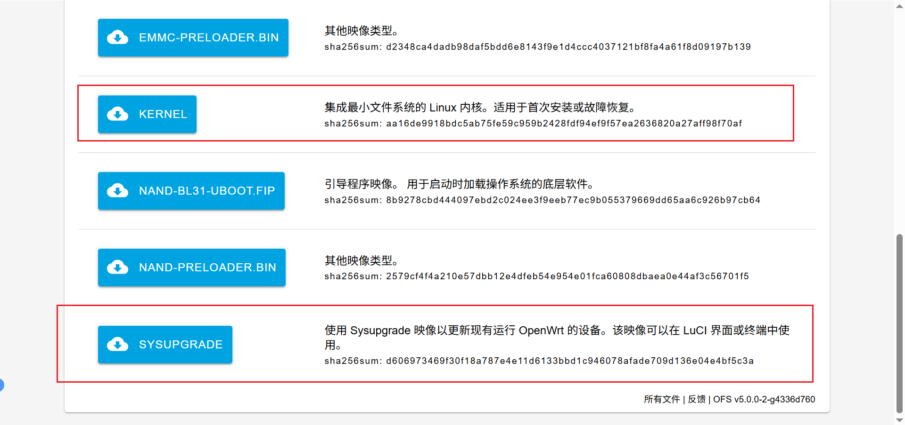
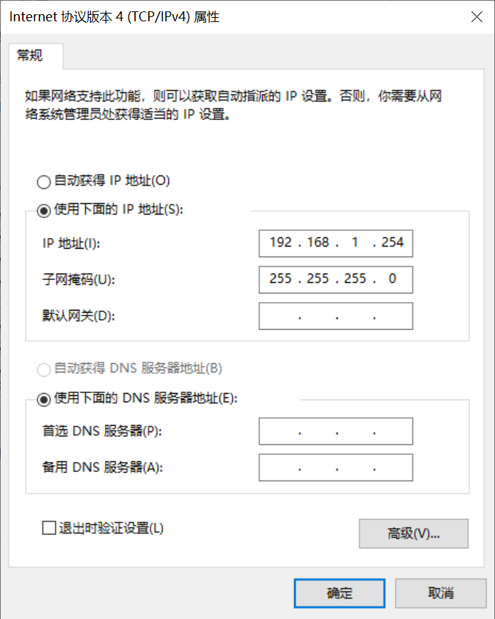
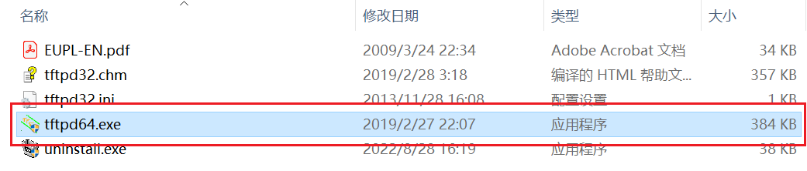
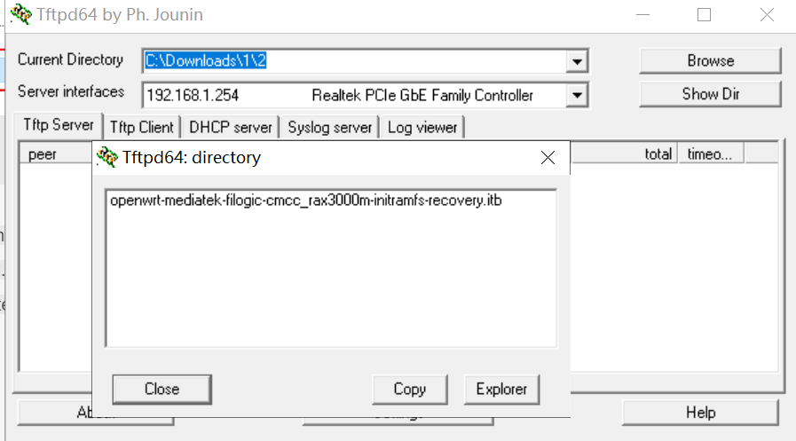
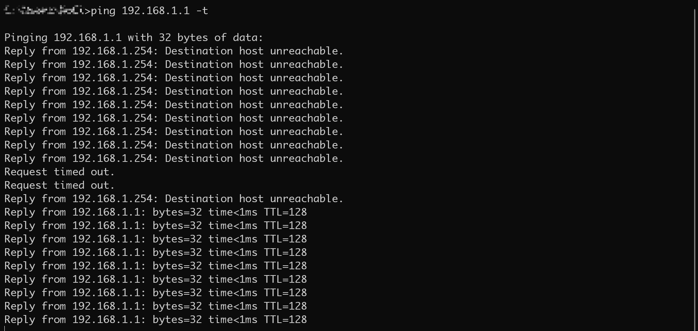
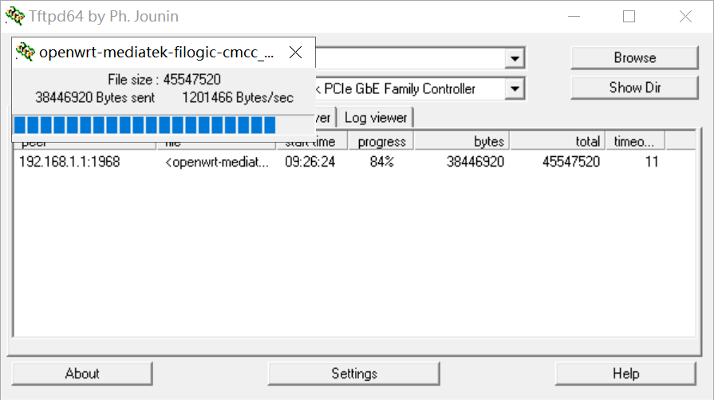
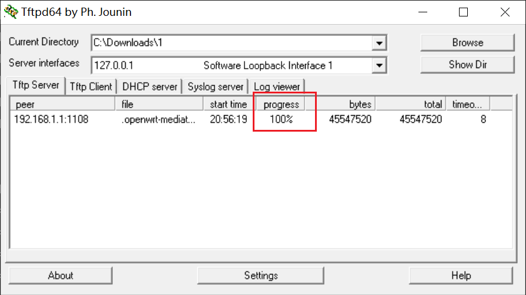
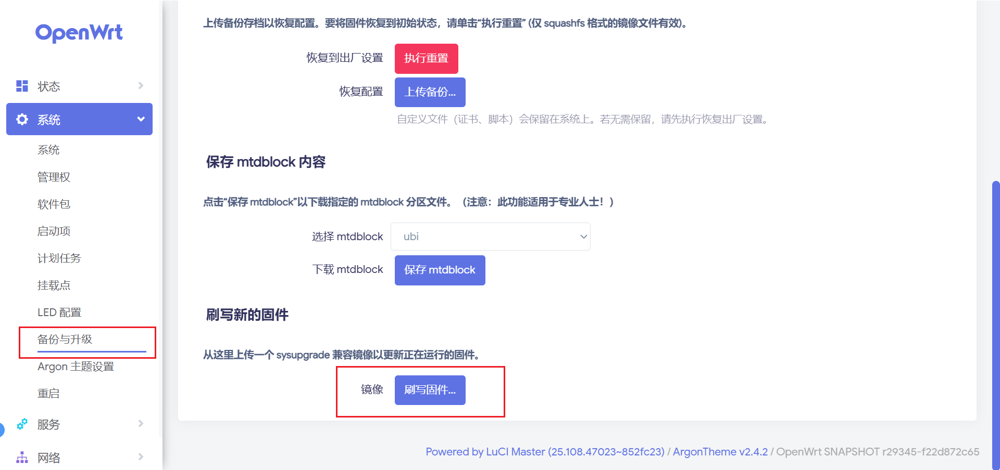

> 原文链接：https://blog.csdn.net/TeleostNaCl/article/details/147594600
> 发布时间：2025-04-28 21:05:06
> 标签：经验分享、智能路由器

---

有时候，我们在玩运行 `OpenWrt` 的 `CMCC RAX3000M` ，因为一些操作不当，导致无法进入路由器系统，无法正常刷机。此时，如果我们已经刷写了`uboot`，则可以在`uboot`模式下通过`Tftpd`刷写新的`OpenWrt`固件，实现救砖效果。  
 本文将以原版`OpenWrt`为例，详细介绍 `CMCC RAX3000M` 通过`Tftpd`刷写`OpenWrt`固件的救砖方法。

救砖的固件可以自行编译生成，也可以从 官方的 `OpenWrt Firmware Selector` 选择`CMCC RAX3000M` 进行下载，地址为：`https://firmware-selector.openwrt.org/?version=SNAPSHOT&target=mediatek%2Ffilogic&id=cmcc_rax3000m`

  
 其中

- `KERNEL` 为 `openwrt-mediatek-filogic-cmcc_rax3000m-initramfs-recovery.itb`
- `SYSUPGRADE` 为 `openwrt-mediatek-filogic-cmcc_rax3000m-squashfs-sysupgrade.itb`

本文仅使用到这两个文件。

#### 文章目录

- [一、设置静态IP地址并关闭防火墙](#IP_13)
- [二、配置Tftpd](#Tftpd_20)
- [三、路由器进入uboot模式](#uboot_28)

## 一、设置静态IP地址并关闭防火墙

首先，需要将我们的电脑的`以太网`接口设置为静态IP：**`192.168.1.254`**  
 同时，我们需要临时将电脑的防火墙关闭，以免被防火墙拦截，导致无法传输文件。

因为在uboot的时候，路由器会尝试从 **`192.168.1.254`** 上的 `tftp server` 拉取 名为`openwrt-mediatek-filogic-cmcc_rax3000m-initramfs-recovery.itb` 文件来起 `initrd`，从而可以启动系统。

## 二、配置Tftpd

`Tftpd`官网：`https://pjo2.github.io/tftpd64/`  
 似乎官网下载链接已经挂了，找了很久在电脑上找到了一个Tftpd： `https://pan.baidu.com/s/1s5Am5JKYHlm4_Do8tEseQw?pwd=cy3q`

下载之后直接运行  
   
 进入之后，在`Current Directory` 选择 `openwrt-mediatek-filogic-cmcc_rax3000m-initramfs-recovery.itb` 所在的目录，`Service interfaces` 选择已经将IP地址设置为 `192.168.1.254` 的网络接口，点击`Show Dir`可以看到选中文件夹是否包含 `openwrt-mediatek-filogic-cmcc_rax3000m-initramfs-recovery.itb` 文件，如下图所示，此时已经配置完成。  
 

## 三、路由器进入uboot模式

先将路由器断开电源，然后使用牙签等工具摁住路由器底部的 `reset` 键不放，再接上电源，等待两三秒之后亮**绿灯**，则进入 `uboot` 模式。

此时可以连接电脑，使用命令 `ping 192.168.1.1 -t`，如果可以`ping`通，则表示连接正常。  
 

此时如果一切顺利的话，`Tftpd` 将出现进度条并开始传输文件(如果不能正常传输的话，请检查防火墙设置)，如下图所示：  
   
 等进度条走完之后，路由器将重启，此时可以将电脑静态IP地址去掉，登录新的管理员地址，即可进入新的`OpenWrt` 系统。  
 

这个时候，需要在新系统中的备份与升级刷写 `openwrt-mediatek-filogic-cmcc_rax3000m-squashfs-sysupgrade.itb` 文件，真正的进行刷写新系统，否则断电之后将会丢失。  
 
