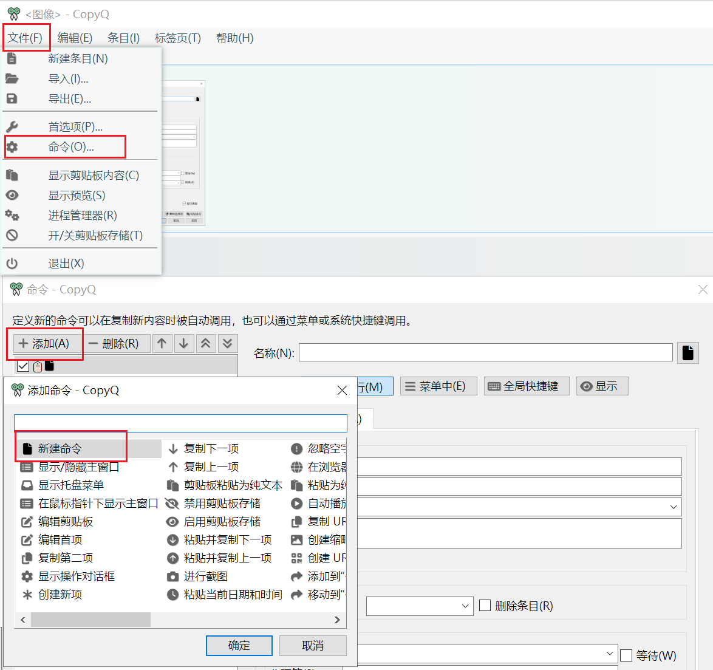
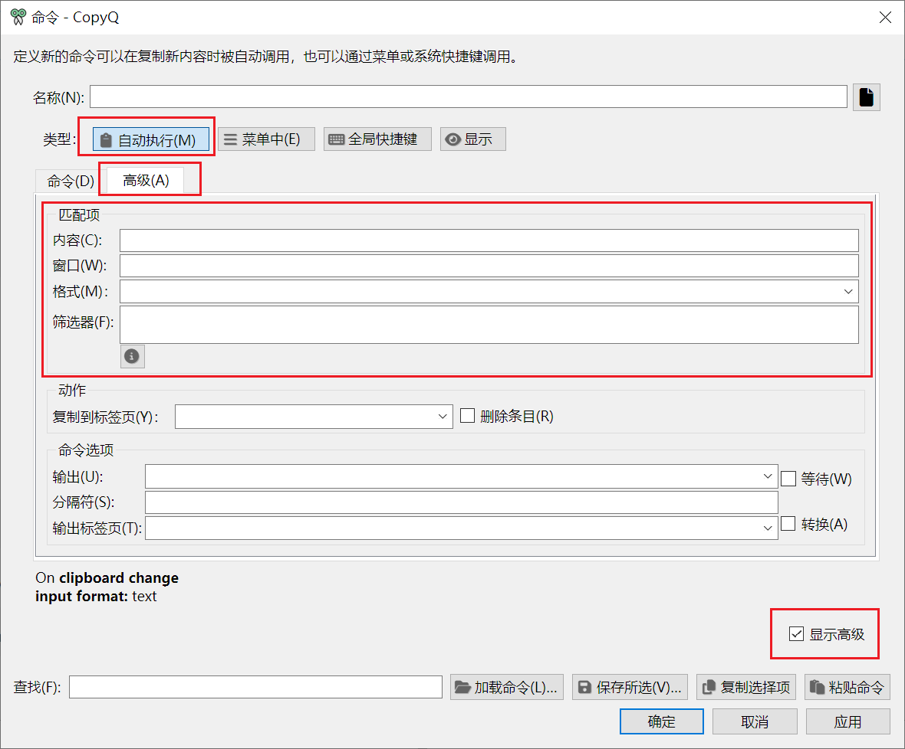
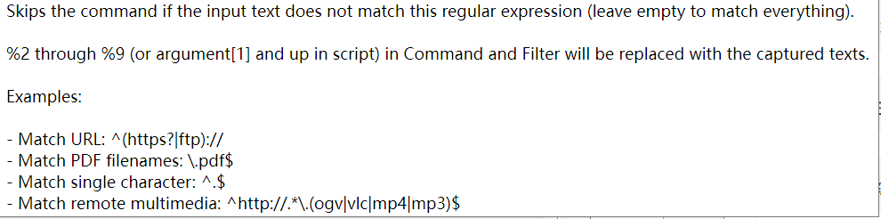
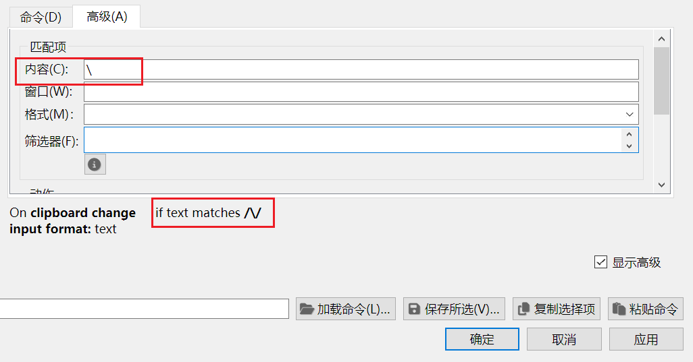

`CopyQ` 是一款强大的剪贴板应用，其支持丰富的脚本和命令调用，实现当剪贴板发生变动时，可以及时的对复制的内容做出相应的动作，具有极高的可拓展性，官网：[https://hluk.github.io/CopyQ/](https://hluk.github.io/CopyQ/)

在编辑 `CopyQ` 命令的时候，我们可能需要在高级显示的内容区中判断指定的条目是否包含指定的内容，从而实现不同的逻辑。本文将介绍在 `CopyQ` 的命令中使用正则表达式的方式和匹配指定字符串的方法。

由官方的 [Scripting API]((https://copyq.readthedocs.io/en/latest/scripting-api.html#scripting-api)) 文档可以知道，其语法规则使用的是 `ECMAScript`，类似于 `JavaScript` 的语法规则，因此可参考：
[ECMAScript Reference](http://doc.qt.io/qt-5/ecmascript.html)
[JavaScript reference on MDN](https://developer.mozilla.org/en-US/docs/Web/JavaScript/Reference/)

因此这里使用的 `正则表达式` 将于 `js` 中使用的一致。

如下图所示，在 `CopyQ` 主页面点击 `文件` > `命令`，此时会打开 `命令` 窗口，随后点击`添加`，选择 `新建命令`，即可打开 `命令编辑窗口`。

之后在 `命令编辑窗口` ，选择 `自动执行`，勾选 `显示高级`，再切换到高级窗口，此时就会出现匹配项，本文将在这个页面中使用正则表达式去判断目是否包含指定内容。

在 `匹配项` 中，`内容` 即是复制的内容，此处的输入将会进行匹配。
我们首先点击内容的输入框，悬停一下会，会出现一个简短的帮助文档：

从此帮助文档里面说明了各种正则表达式的情况，其与常规的正则表达式是相同的，可以参考：https://www.runoob.com/regexp/regexp-rule.html
有以下两个规则：
| 符号 | 功能  |
| :--: | :--: |
| ^  | 匹配字符串开头 | 
| $ | 	匹配字符串结尾 |

因此，帮助文档中的实例解释如下：
1. 匹配 `URL`： 需要以 `https?|ftp` 开头，即 `^(https?|ftp):/`
2. 匹配 `PDF` 的文件名：需要以.pdf 结尾，即 `\.pdf$`
3. 匹配指定的字符内容：即需要以字符开头和结尾，即 `^.$`

同时从输入 `内容` 之后出现的条件：`if text matches \/\`，可以知道这是默认使用了正则表达式进行匹配的（ `JavaScript` 语法）。

因此综上分析，由于默认的匹配规则是正则表达式，因此如果需要指定包含指定字符，则需要使用  `^.$` 来限定其匹配开头和结尾。
