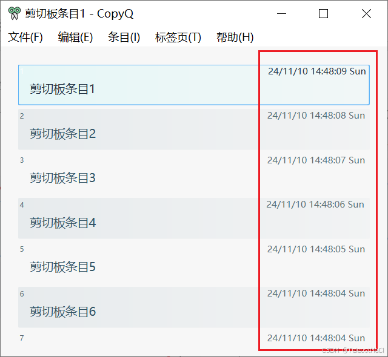
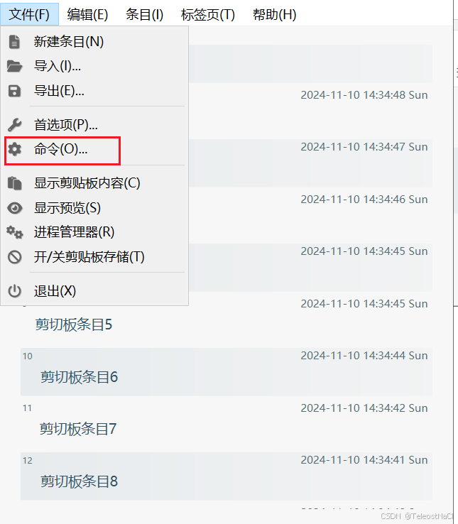
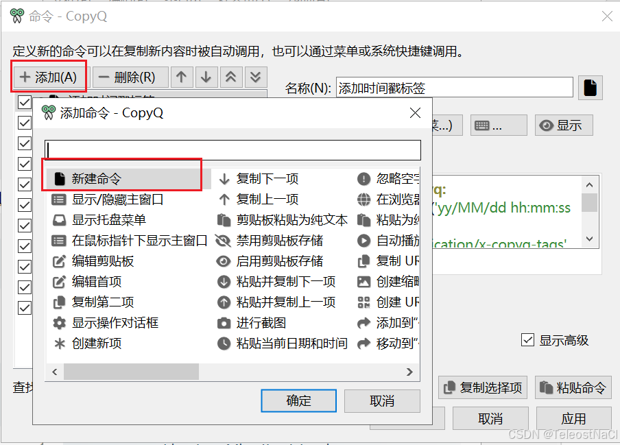
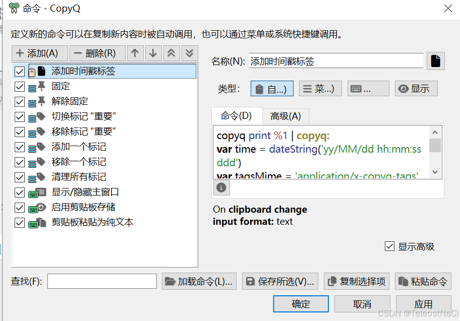

参考链接:
`https://cloud.tencent.com/developer/article/2179460`
编写命令和添加功能-CopyQ文档: `https://copyq.readthedocs.io/en/latest/writing-commands-and-adding-functionality.html`
脚本API-CopyQ文档`https://copyq.readthedocs.io/en/latest/scripting-api.html#dateString`
日期 QML 类型: `https://doc.qt.io/qt-5/qml-qtqml-date.html#format-strings`

## CopyQ的命令实现代码
```js
copyq: 
var time = dateString('yy/MM/dd hh:mm:ss ddd')
var tagsMime = 'application/x-copyq-tags' 
var tags = str(data(tagsMime)) + ', ' + time
setData(tagsMime, tags)
```

## 效果
当复制一条剪贴板内容之后, 会自动向条目添加一个时间戳标签, 方便回溯复制的时间, 效果如下: 


## 命令详解
首先, 通过js的方法`dateString`将当前的时间按照指定的格式格式化成字符串, 以下的格式(`yy/MM/dd hh:mm:ss ddd`)为 `两位数年/两位数月/两位数日 两位数时:两位数分:两位数秒 星期简称`, 比如 `24/11/10/14/48/04 Sun`. 
具体的格式可以查看: [日期 QML 类型](https://doc.qt.io/qt-5/qml-qtqml-date.html#format-strings)
```js
var time = dateString('yy/MM/dd hh:mm:ss ddd')
```
拿到当前时间指定格式格式化的字符串之后, 通过`application/x-copyq-tags`的mime拿到原来的tag值, 然后拼接上日期, 即得到最终的tag. 
```js
var tags = str(data(tagsMime)) + ', ' + time
```
最后, 通过`setData`将此条目编辑保存. 

## 使用
在CopyQ主页面, 点击`文件` > `命令` > `添加` > `新建命令`, 定义一条新的命令. 



勾选显示高级之后, 即可在命令的输入框中输入以上命令, 即实现对应的效果.

