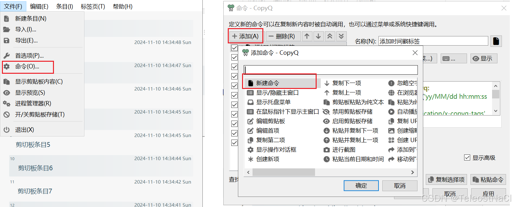

参考链接:
https://cloud.tencent.com/developer/article/2179460
编写命令和添加功能-CopyQ文档: https://copyq.readthedocs.io/en/latest/writing-commands-and-adding-functionality.html

## CopyQ的命令实现代码
```js
python -c '
import socket
import sys

# 目标 IP 和端口
target_ip = "127.0.0.1"  # 目标 IP 地址，替换为需要的地址
target_port = 12345  # 目标端口

# 获取 CopyQ 的复制内容
clipboard_content = sys.argv[1]

# 创建 UDP socket 并发送复制的内容
sock = socket.socket(socket.AF_INET, socket.SOCK_DGRAM)
sock.sendto(clipboard_content.encode("UTF-8"), (target_ip, target_port))
sock.close()
' %1
```

## 命令详解
CopyQ是可以直接执行Python代码的, 该段代码中, 在''中编写了一段将指定内容通过udp发送到指定地址和端口的python代码, 即
```py
import socket
import sys

# 目标 IP 和端口
target_ip = "127.0.0.1"  # 目标 IP 地址，替换为需要的地址
target_port = 12345  # 目标端口

# 获取 CopyQ 的复制内容
clipboard_content = sys.argv[1]

# 创建 UDP socket 并发送复制的内容
sock = socket.socket(socket.AF_INET, socket.SOCK_DGRAM)
sock.sendto(clipboard_content.encode("UTF-8"), (target_ip, target_port))
sock.close()
```
通过`sys.argv[1]`拿到传递给脚本的参数, 在本例中通过`python -c ... %1`启动了Python脚本, 并将`%1`所代表的值作为参数进行传递. 

在CopyQ的自动执行命令里, `%1`即是刚复制的内容, 则是把刚复制的内容传递给了Python脚本中, Python脚本在通过udp将其发送出去, 即实现了目标.

对于其它应用来说, 只要编写一个`UDP客户端`, 监听指定的端口, 即可接受刚发送出来的内容, 例如一下Java程序
```java
// 端口号
int PORT = 48523;
// 缓冲池大小
int MAX_SIZE = 10240;
// 创建一个UDP接收器 用来接受CopyQ转变的剪贴板内容
try (DatagramSocket socket = new DatagramSocket(PORT)) {
    // 创建一个缓冲区来存储接收到的数据
    byte[] buffer = new byte[MAX_SIZE];

    //noinspection InfiniteLoopStatement
    while (true) {
        // 创建数据包来接收数据
        DatagramPacket packet = new DatagramPacket(buffer, buffer.length);

        // 接收数据包
        socket.receive(packet);

        // 将接收到的字节数据转换为字符串
        String receivedData = new String(packet.getData(), 0, packet.getLength(), StandardCharsets.UTF_8);
        // TODO 此处处理字符串
        
    }
} catch (Exception e) {
    e.printStackTrace();
}
```

## 使用
在CopyQ主页面, 点击文件 > 命令 > 添加 > 新建命令, 定义一条新的命令. 勾选显示高级之后, 即可在命令的输入框中输入以上命令, 即实现对应的效果.

