> 原文链接：https://blog.csdn.net/TeleostNaCl/article/details/150702358
> 发布时间：2025-08-24 17:11:45
> 标签：电脑、经验分享

---

#### 文章目录

- [一、背景介绍](#_1)
- [二、选购驱动板](#_19)
- [三、切割适合屏幕的纸板](#_41)
- [四、将屏幕固定在纸板上](#_53)
- [五、固定驱动板](#_58)

## 一、背景介绍

由于旧笔记本电脑使用了快十年，性能已经跟不上时代了，因此更换了新笔记本电脑。将笔记本拆机成网卡、硬盘、主板和屏幕配件分别挂二手出售。网卡、硬盘和主板都成功卖出，唯独只剩下屏幕未售出。本着废物再利用原则，在考虑能不能将这块屏幕打造成副屏呢？于是就看到了这个视频：<https://www.bilibili.com/video/BV11o4y147wv>，从这个视频中可以了解到，只要使用屏幕驱动板，就可以外接 `HDMI` 信号，作为电脑的显示屏。

因此，本着 `DIY` 的原则，将此块屏幕打造成低成本副屏，使其变废为宝，让旧电脑继续发挥其余热。本 `DIY` 使用的材料如下：

| 材料 | 数量 |
| --- | --- |
| 旧屏幕 | 一块 |
| 驱动板 | 一块 |
| 硬纸板 | 两块 |
| 双面胶 | 一卷 |
| 透明胶带 | 一卷 |

最后成品如下图：

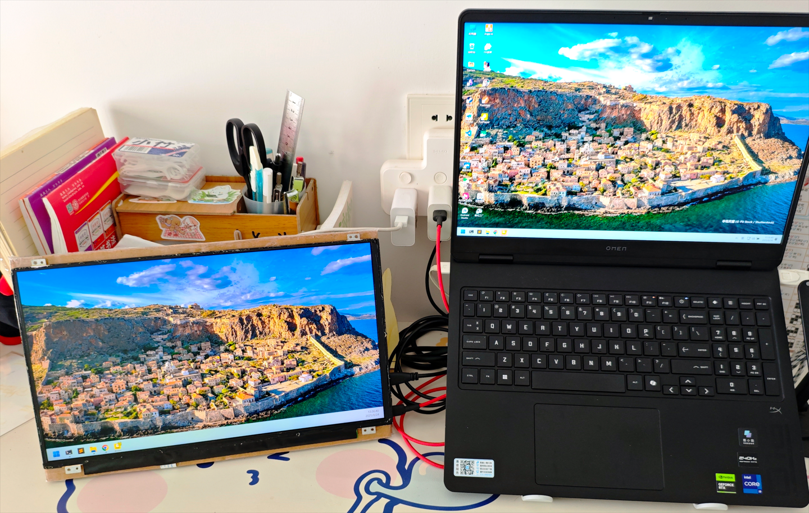

## 二、选购驱动板

首先，需要先知道此块屏幕的详细参数。先将屏幕从笔记本电脑的边框中卸下来，找到屏幕背面的标签，可以知道此屏幕型号为 `NV156FHM-N43`，从屏库网可以找到该屏幕的信息：<https://www.panelook.cn/NV156FHM-N43_BOE_15.6_LCM_overview_cn_26503.html>

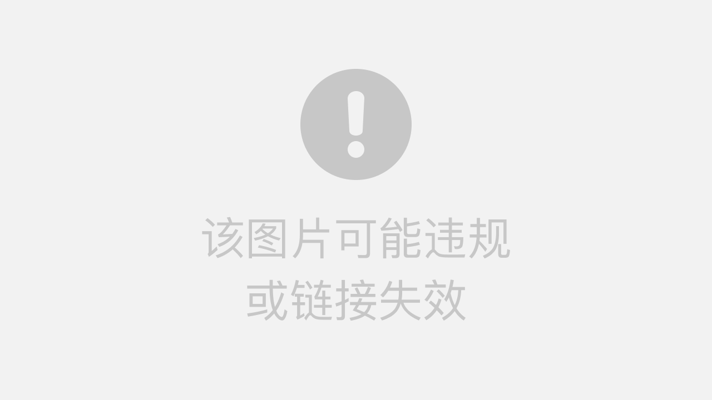

可以知道，这是一块 分辨率为 `1920x1080`，`15.6` 英寸的 `ISP` `LCD` `60Hz` 屏幕，其接口类型为 `30 pin`。

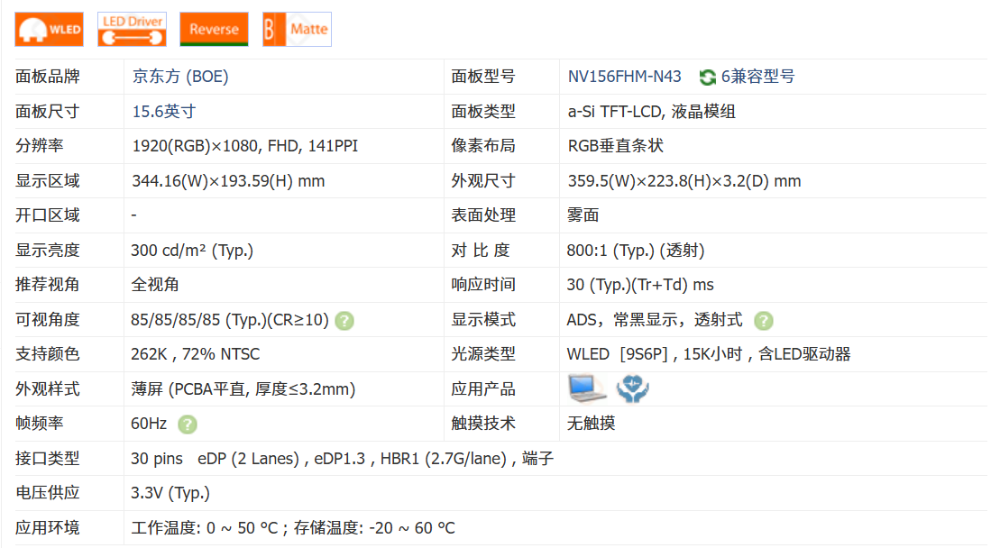  
 同时，对于现在使用的场景来说，只需要一个HDMI接口，仅用于副屏显示且不需要外接喇叭，因此在选购驱动板的时候，只需要支持 `1920x1080 60Hz` 的 `15.6` 英寸，带一个HDMI接口和 `30 pin` 输入接口即可。

在购物平台上找到此转接板，完全符合以上要求，同时还送一个屏幕支架，总价为**54.8**元，符合低成本打造。  
 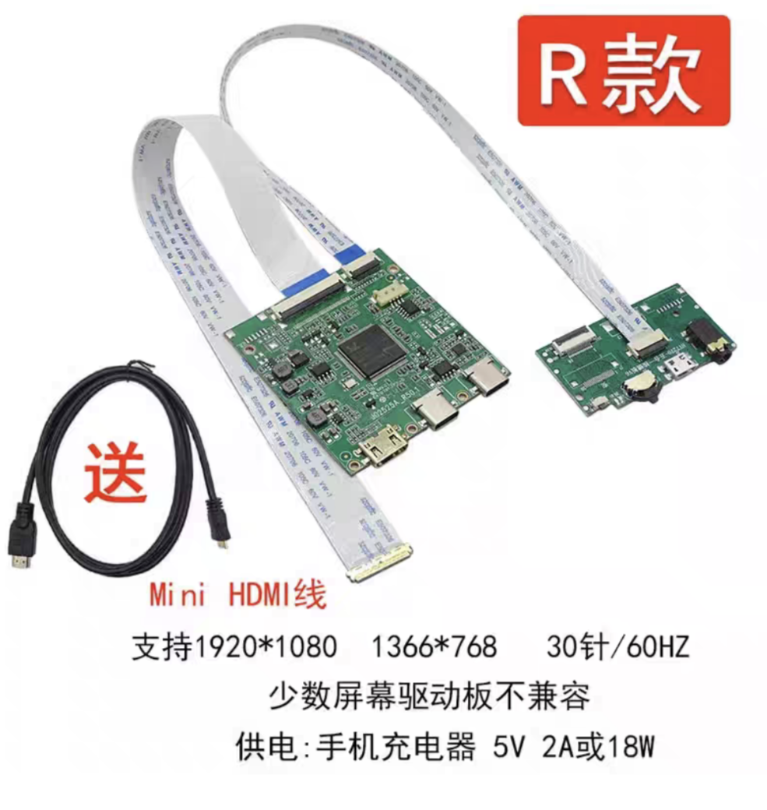

收到货之后，驱动板长这样，左边接口是 `Mini HDMI` 接口，中间为 `Type-C` 信号输入，右边为电源输入：

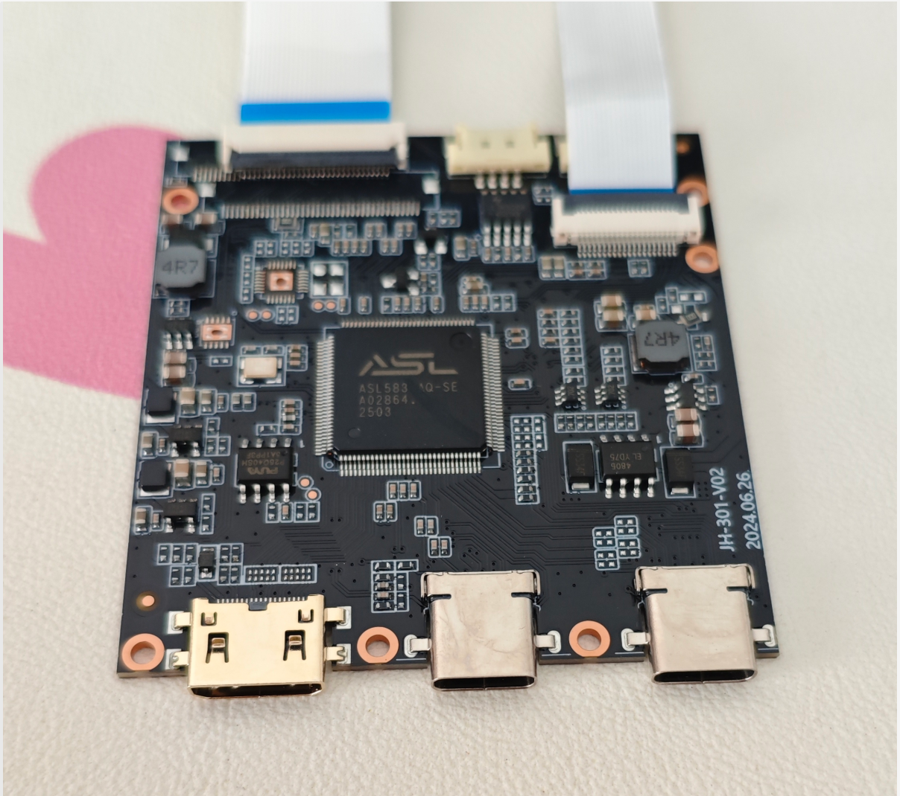

接线测试功能一切都正常：

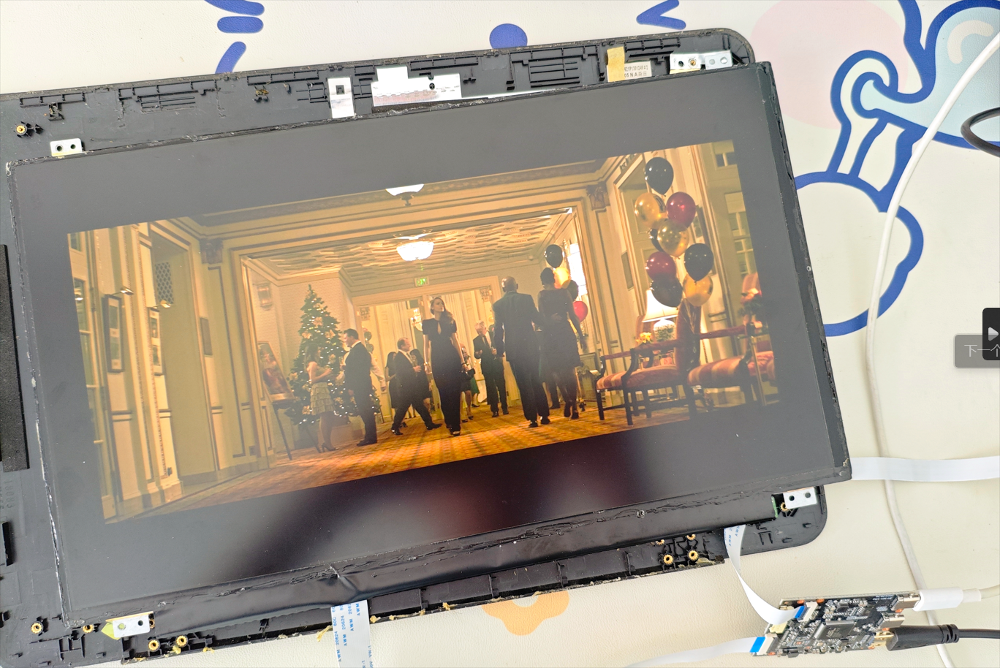

## 三、切割适合屏幕的纸板

由于屏幕比较脆弱，因此需要有东西支撑住屏幕防止损坏。于是找了无用的硬瓦楞纸板，从上面裁剪出适合屏幕的尺寸。

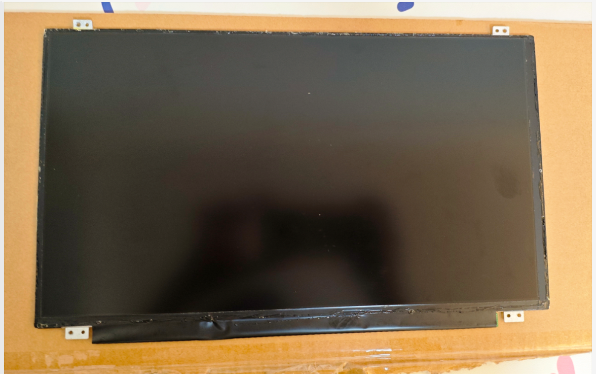

使用记号笔画出屏幕的边框，标记出屏幕的范围，随后分别裁出两块与屏幕尺寸相匹配的纸板。  
 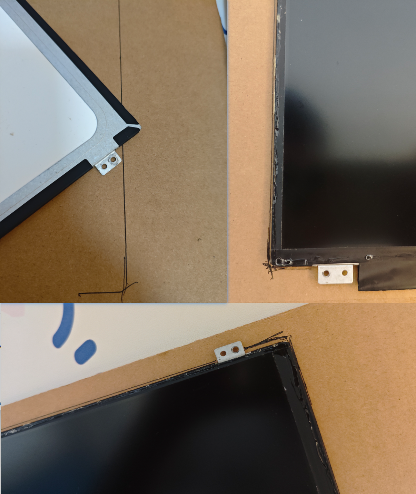

完成两块硬纸板的裁剪。同时为了延长硬纸板的使用时长，可以给硬纸板贴上一圈胶带。

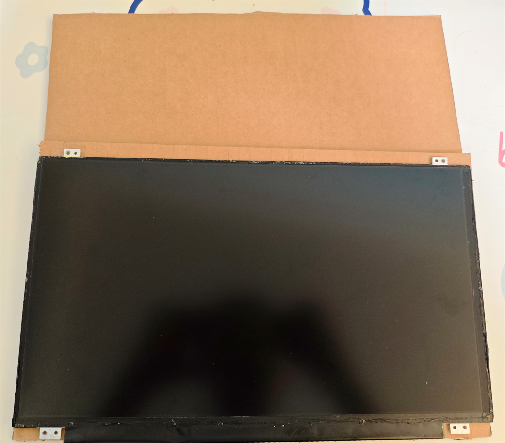

## 四、将屏幕固定在纸板上

我们在屏幕背面的四周贴上双面胶，随后将屏幕固定的粘在纸板上

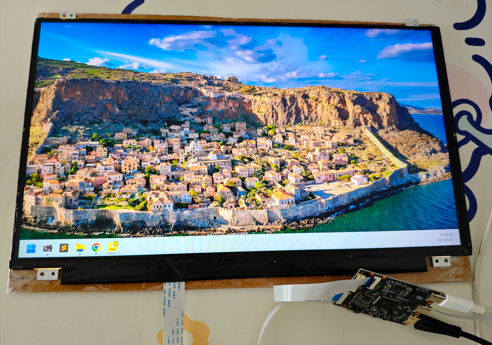

## 五、固定驱动板

在背面确定驱动板的位置，方便接线和理线，并固定小板和屏线。

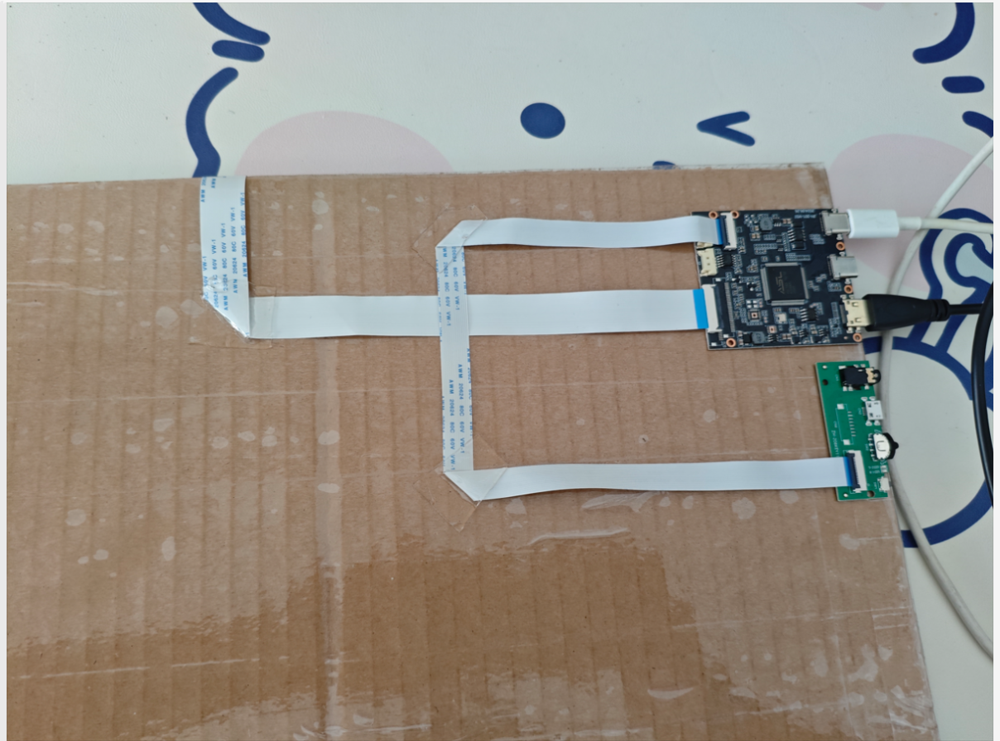

最后在纸板四周贴上双面胶，将另外一块硬纸板粘上，遮挡住小板，最后成品如下图：

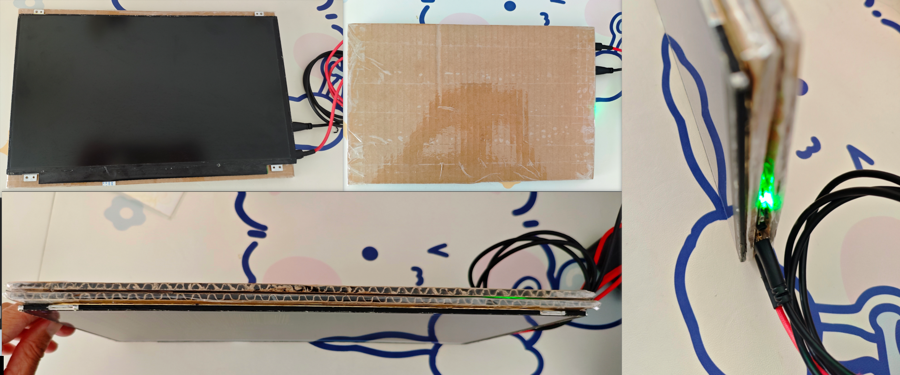
