> 原文链接：https://blog.csdn.net/TeleostNaCl/article/details/126676011
> 发布时间：2022-09-03 16:55:02
> 标签：windows、batch

---

## 写在前面

之前有写文章分析了深大校园网的认证过程, 编写Linux脚本可在路由器等Linux设备上实现自动登录, 断线自动重连. 考虑到Windows才是主要使用者, 本篇文章分享在Windows上编写bat脚本, 实现自动登录并断线重连, 从而可不再使用客户端进行登录认证.  
 校园网认证分析过程: `https://blog.csdn.net/TeleostNaCl/article/details/124553119`  
 教学区:`https://blog.csdn.net/TeleostNaCl/article/details/125145618`

***此脚本需要使用curl命令***  
 win10在系统内版本17063之后就已经内置了curl命令, 故新版的win10 或 win11可直接使用脚本. (具体看[Tar 和 Curl 来到 Windows](https://devblogs.microsoft.com/commandline/tar-and-curl-come-to-windows/))  
 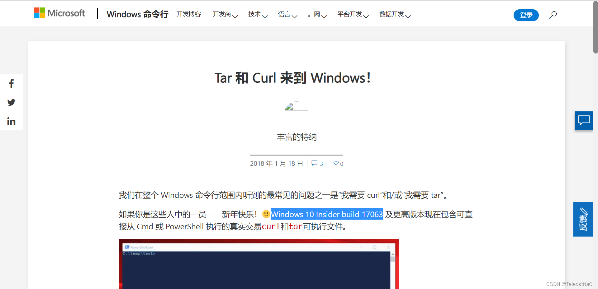  
 win7 等设备需自行安装curl命令(`https://curl.se/windows/`)

## 认证方式

此处列举深大校园网的认证请求的网址和参数, 可在后文中按需进行替换(网址和参数可能会有所变动, 可自行抓包分析并更新)

###### 对于 GET 请求(宿舍区网页认证过程)

```bash
//请求地址为
http://172.30.255.42:801/eportal/portal/login/

//请求方式为
GET

//请求查询的key-value对为
user_account=$校园卡号
user_password=$密码
```

###### 对于 POST 请求(宿舍区客户端认证过程)

```bash
//请求地址为
http://172.30.255.42:801/eportal/

//请求方式为
POST

//请求的参数为
DDDDD=$校园卡号
upass=$密码
ver=1.3.5.201712141.P.W.A
c=ACSetting
a=Login
```

###### 教学区认证请求

```bash
//请求地址为
https://drcom.szu.edu.cn/a70.htm/

//请求方式为
POST

//请求的参数为
DDDDD=$校园卡号
upass=$密码
0MKKey=123456
R7=0
```

## 具体思路

### 1. 创建batch脚本

可在任意位置创建一个txt文件, 使用记事本或其它文本编辑进行编辑, 里面书写第一行代码, 保存, 并重命名文件拓展名为.bat, 双击即可运行bat脚本

```batch
@echo off
```

使用记事本编辑第一行batch脚本  
 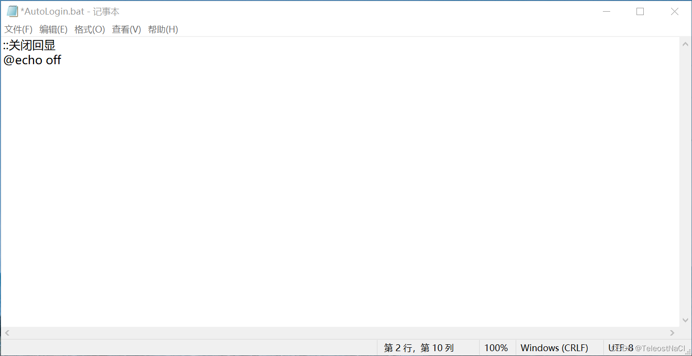

### 2. 模拟登录

与在Linux上使用curl命令相同, 直接根据语法去发出请求. 与linux不同的是, 参数不需要使用单引号, 且命令中使用^进行换行  
 **宿舍区POST请求**

```bash
curl -d DDDDD=$校园卡号 ^
-d upass=$密码 ^
-d ver=1.3.5.201712141.P.W.A ^
-d c=ACSetting ^
-d a=Login ^
http://172.30.255.42:801/eportal/
```

**宿舍区GET请求**

```bash
curl -G ^
-d user_account=$校园卡号 ^
-d user_password=$密码 ^
http://172.30.255.42:801/eportal/portal/login/
```

**教学区POST请求**

```bash
curl -d DDDDD=$校园卡号 ^
-d upass=$密码 ^
-d 0MKKey=123456 ^
-d R7=0 ^
https://drcom.szu.edu.cn/a70.htm
```

可在命令行窗口(`Win`键 + `R`键, 输入`cmd` 打开 )下测试能否使用命令.  
 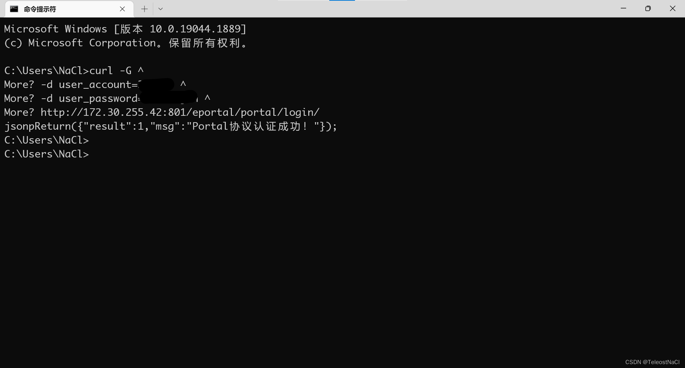

### 3. 断线重连

这部分逻辑可通过不断的ping某个网址, 检查是否可ping通的方式检查是否断连, 断连之后即发送请求, 进行重连.  
 在Windows平台下, ping命令执行完之后, 会对ERRORLEVEL变量进行赋值, 如果ping不同的话, 则该值会被赋值为1, 即表示断网. 我们只要对该变量进行判断, 并在断网时发送请求, 即实现断线重连. 检测断网的代码如下

```bash
::关闭回显
@echo off

::进行ping, 检查是否ping通 并重定向其输出(不在命令行显示)
ping 8.8.8.8  >NUL

::检查ERRORLEVEL变量 如果为1 则跳转至
IF ERRORLEVEL 1 GOTO ERROR

::编写联网状态的逻辑
echo "SUCCESSFUL"
PAUSE
exit

::编写断网状态的模块
:ERROR
echo "ERROR"
PAUSE
exit
```

脚本运行结果 - 联网状态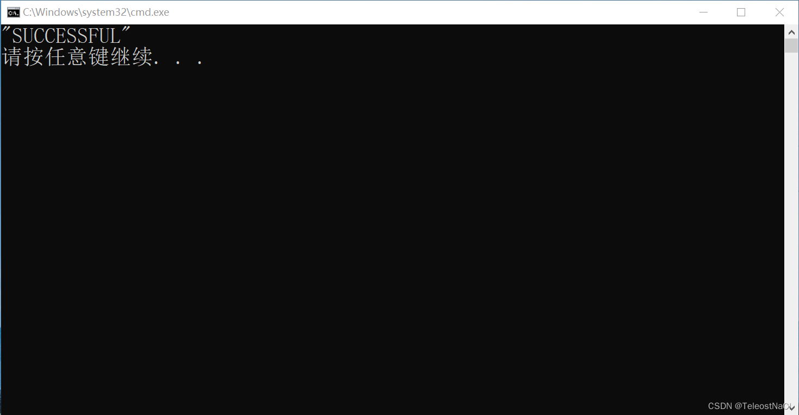

将断网检测与自动登录代码合并,即为

```bash
::关闭回显
@echo off
	
::进行ping, 检查是否ping通 并重定向其输出(不在命令行显示)
ping 8.8.8.8  >NUL

::检查ERRORLEVEL变量
IF ERRORLEVEL 1 GOTO ERROR				::跳转至断网状态的逻辑模块

::编写联网状态的逻辑
exit

::编写断网状态的模块
:ERROR
::发出认证请求(按需使用认证的代码)
curl -G ^
-d user_account=$校园卡号 ^
-d user_password=$密码 ^
http://172.30.255.42:801/eportal/portal/login/ >NUL
exit
```

> ping的地址可任意选择, 只要保证在联网状态下其能ping通, 断网状态下ping不通即可.

> 校园网环境下 114.114.114.114地址在未认证的情况下也可ping通, 注意应不使用该地址进行断网检测

> 推荐使用DNS服务器进行断网检测, 如谷歌DNS 8.8.8.8, 腾讯DNS 119.29.29.29 等

### 4. 循环检测

可使用GOTO关键字进行代码跳转,从而实现循环,即在循环开始处设计标志::START, 在联网成功处使用GOTO START进行跳转实现循环, 并使用timeout设置循环速率, 代码如下

```bash
::关闭回显
@echo off

::设置循环开始标志位
:START

::设置循环的速度 60s循环一次(使用等待)
timeout 60 >NUL

::进行ping, 检查是否ping通 并重定向其输出(不在命令行显示)
ping 8.8.8.8 >NUL

::检查ERRORLEVEL变量
IF ERRORLEVEL 1 GOTO ERROR				::跳转至断网状态的逻辑模块

::编写联网状态的逻辑
::联网成功, 跳转至START, 进行循环
GOTO START

::编写断网状态的模块
:ERROR
::按需使用认证的代码
curl -G ^
-d user_account=$校园卡号 ^
-d user_password=$密码 ^
http://172.30.255.42:801/eportal/portal/login/ >NUL
	
::断网状态并发送了认证请求, 跳转至START, 进行循环
GOTO START
```

该脚本运行之后, 可检测断网并重新进行认证

> 如果需要对脚本进行debug, 检测何处无法正常运行时, 可在适当位置添加`echo`语句进行打印, 并将重定向输出流的语句(`>NUL`)去除掉.

### 5. 隐藏运行时命令行窗口

脚本编写完成之后, 运行脚本需要保持命令行窗口的打开, 体验非常不好, 我们可以在自动登录脚本的同一个文件夹下, 编写vbs脚本, 在vbs设置隐藏命令行窗口, 并运行脚本(`Run命令, 后一个参数0即为隐藏命令行窗口`), 即可在无命令行窗口的情况下运行自动登录的脚本. 具体如下:

```bash
set ws=WScript.CreateObject("WScript.Shell")
ws.Run "cmd.exe /c .\脚本文件名", 0
```

> 创建VBS脚本的过程与创建bat脚本的过程是一样的, 都是新建文本文档, 并重命名文件拓展名为.vbs

如果VBS脚本文件与bat脚本文件不在同一个文件夹下, 则`.\脚本文件名`应使用绝对路径

### 6. 开机自动运行脚本

使用计划任务实现开机自动运行脚本名

1. 开启任务计划程序窗口  
    右键点击`开始`菜单图标, 选择`计算机管理`, 点击`任务计划程序`, 即打开任务计划程序窗口  
    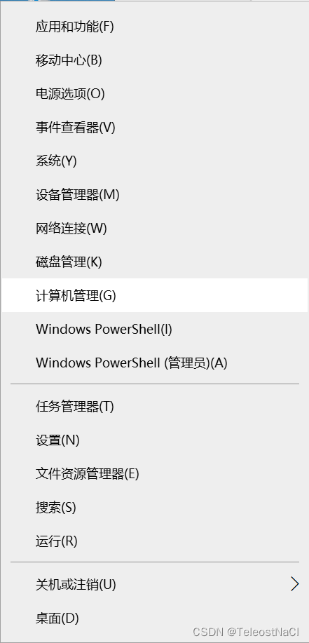  
    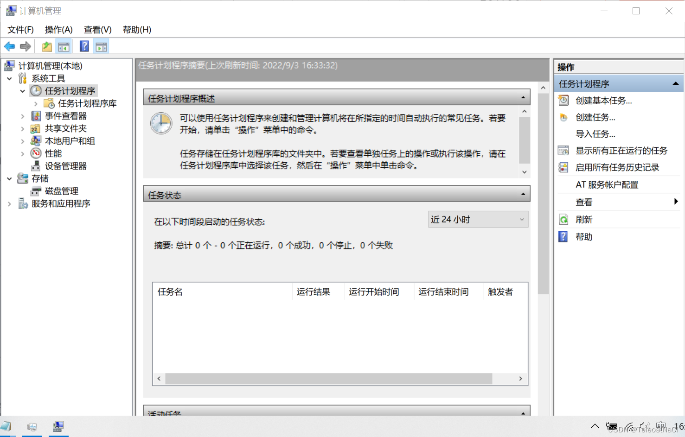
2. 点击右栏的`创建任务`,打开创建任务的选项框  
    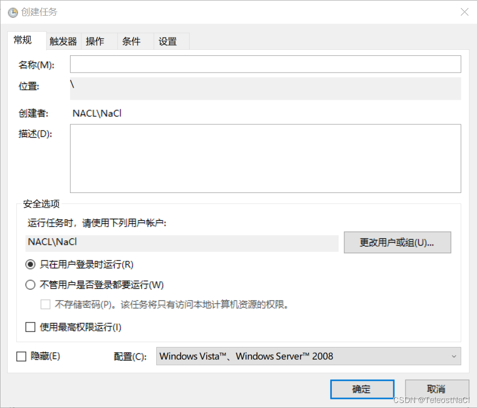
3. 在`常规`窗口中, 名称可随意填写, 安全选项中选择不管用户是否登录都要运行, 并勾选不存储密码.  
    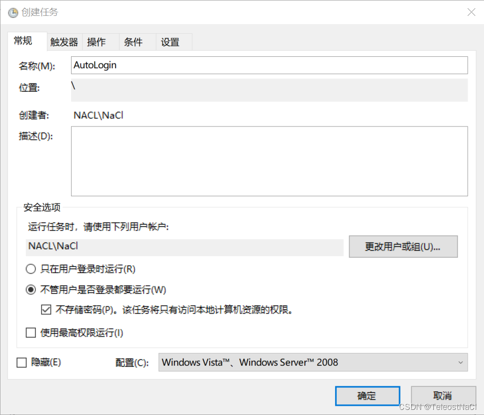
4. 在`触发器`窗口中, 点击`新建`, 打开新建触发器的窗口  
    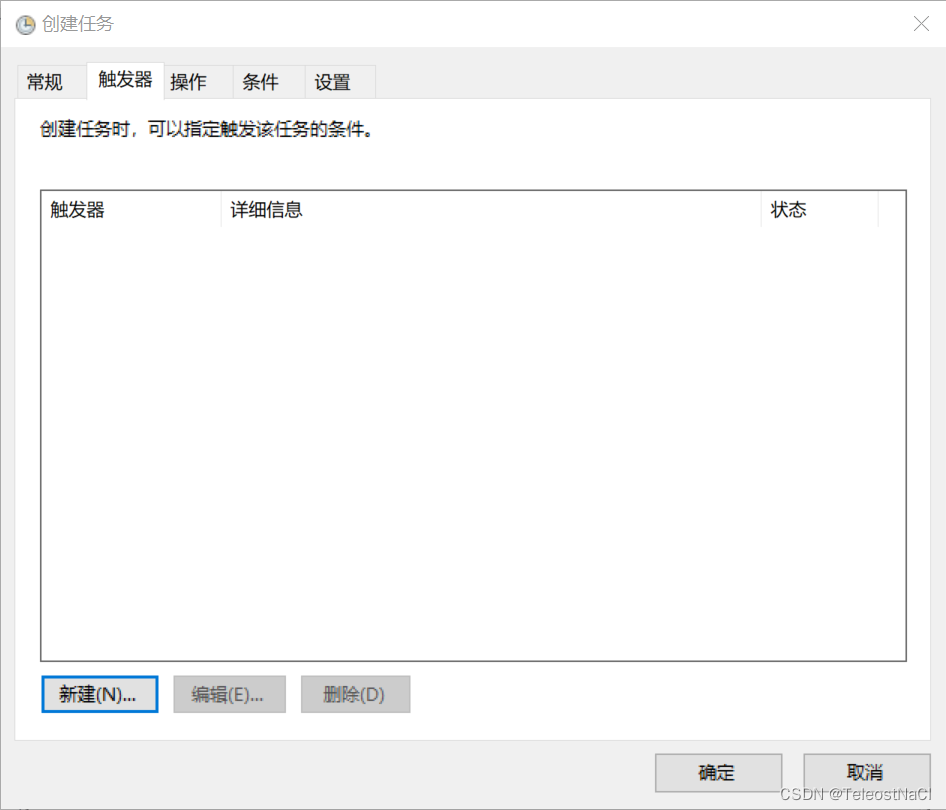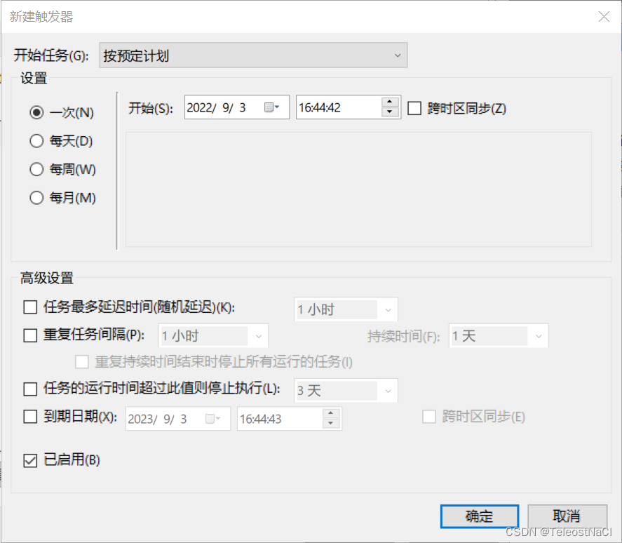
5. `开始任务`选择`启动时`, 并点确定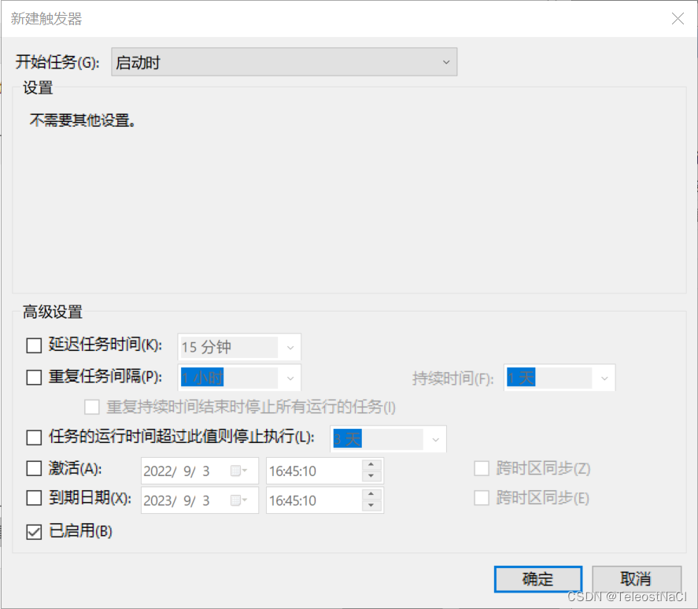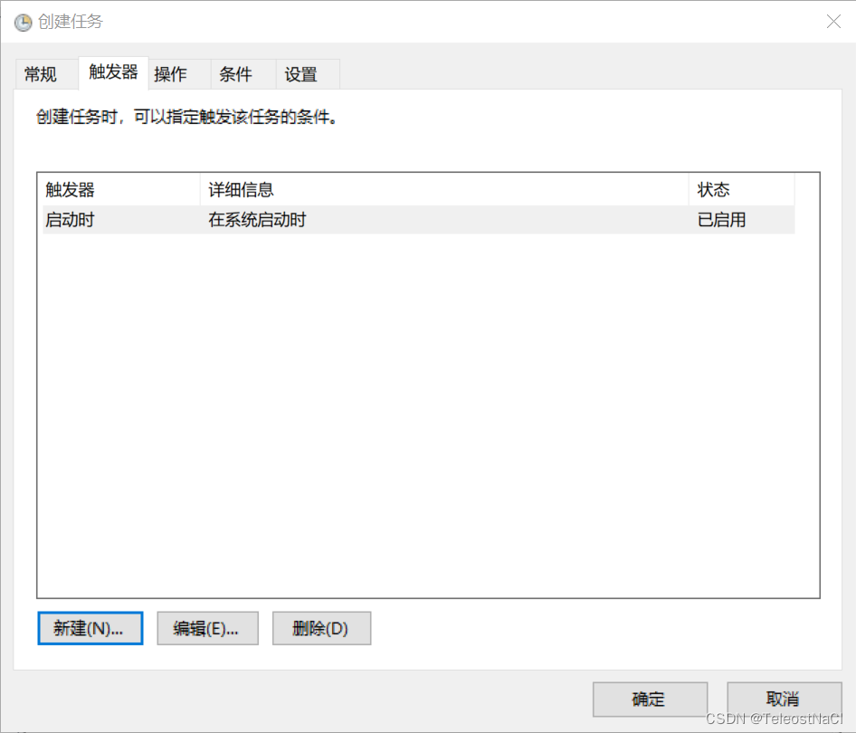
6. 在`操作`选项框下, 点击`新建`, 打开新建操作的选项框, 选择刚创建的bat脚本(使用计划任务启动bat脚本时, 其不会弹出命令行窗口, 故可以只使用bat脚本, 而不编写vbs脚本), 并点确定  
    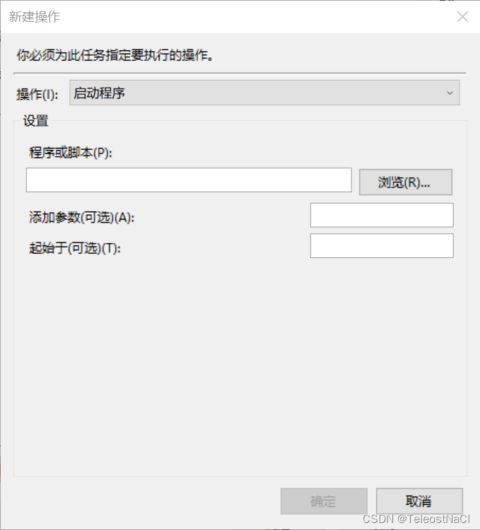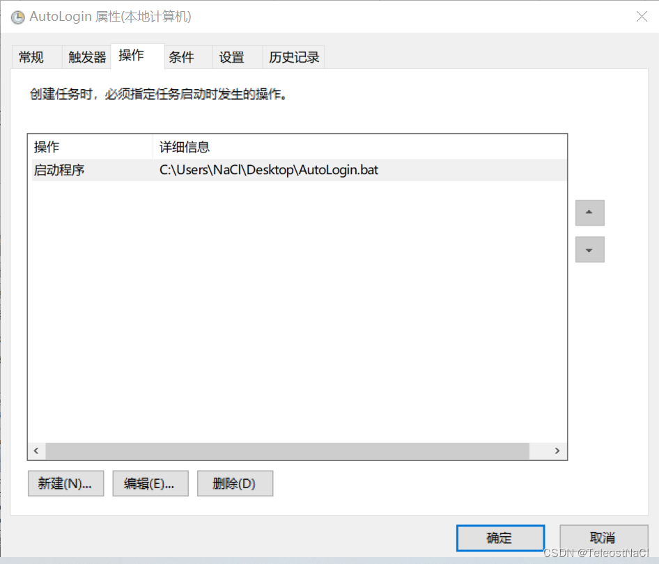
7. 在`条件`中, 取消勾选`只有在计算机使用交流电源时才启动此任务` 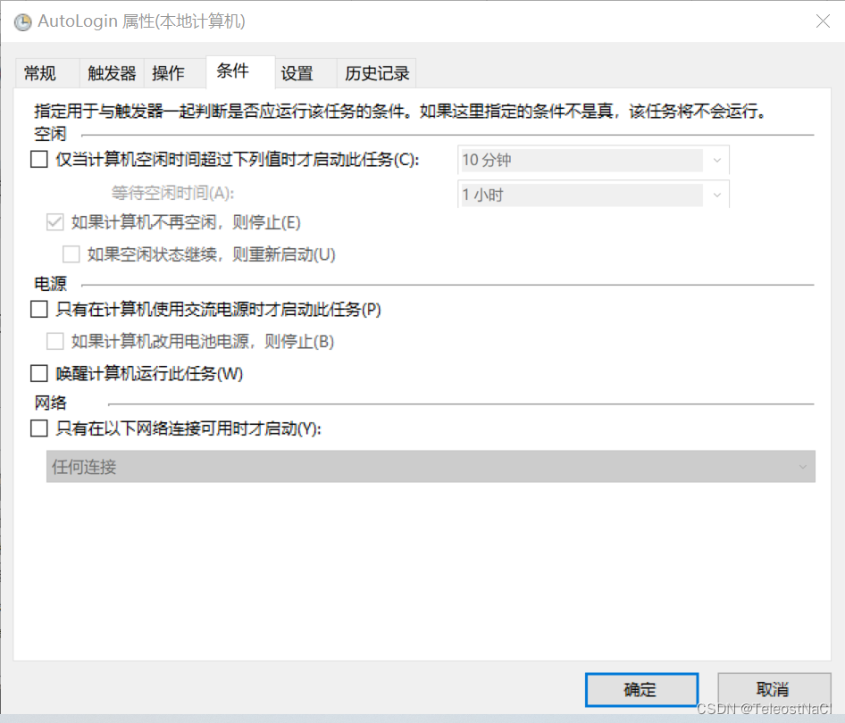
8. 在`设置`选项卡中, 按如下进行选择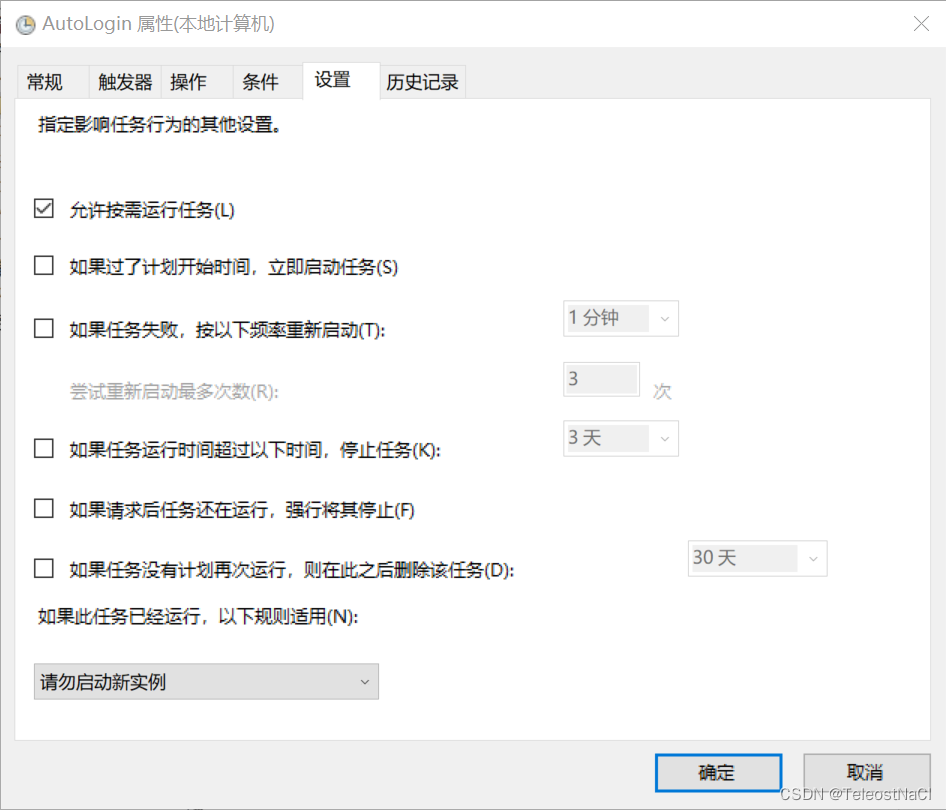
9. 最后点击确定, 即可创建自动运行脚本的任务. 可在活动任务中, 找到刚创建的任务. 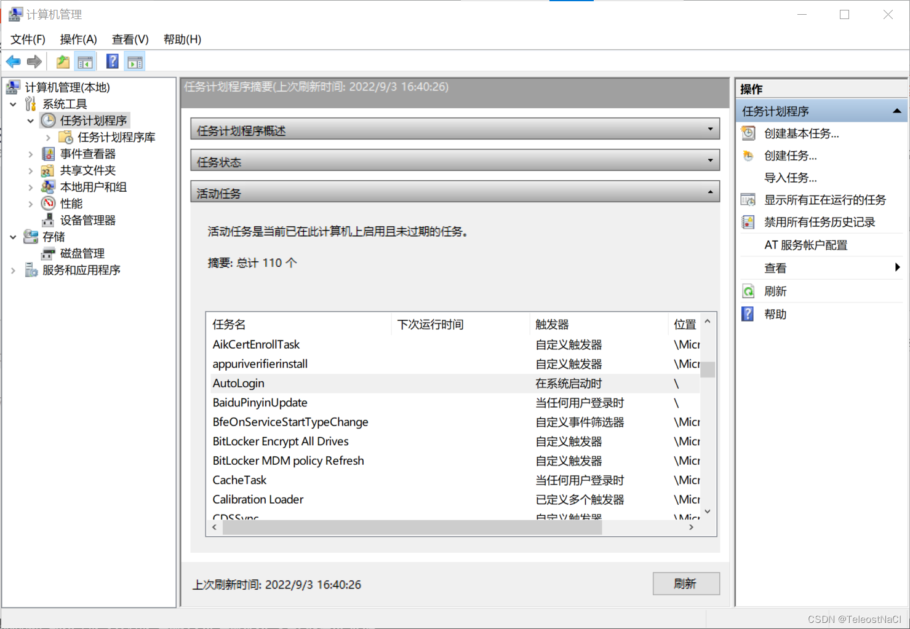
10. 重启, 检查脚本是否生效
