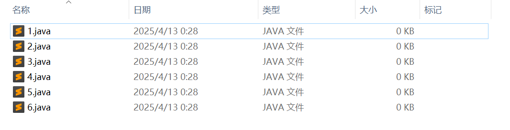
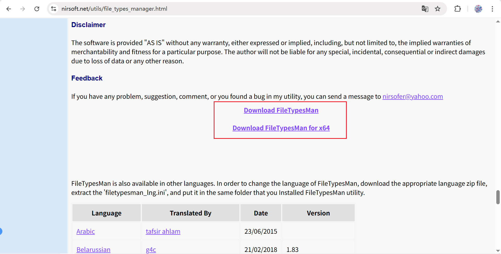
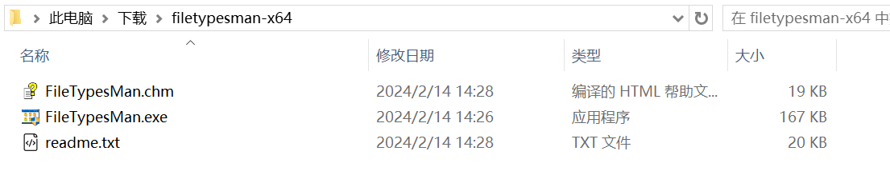
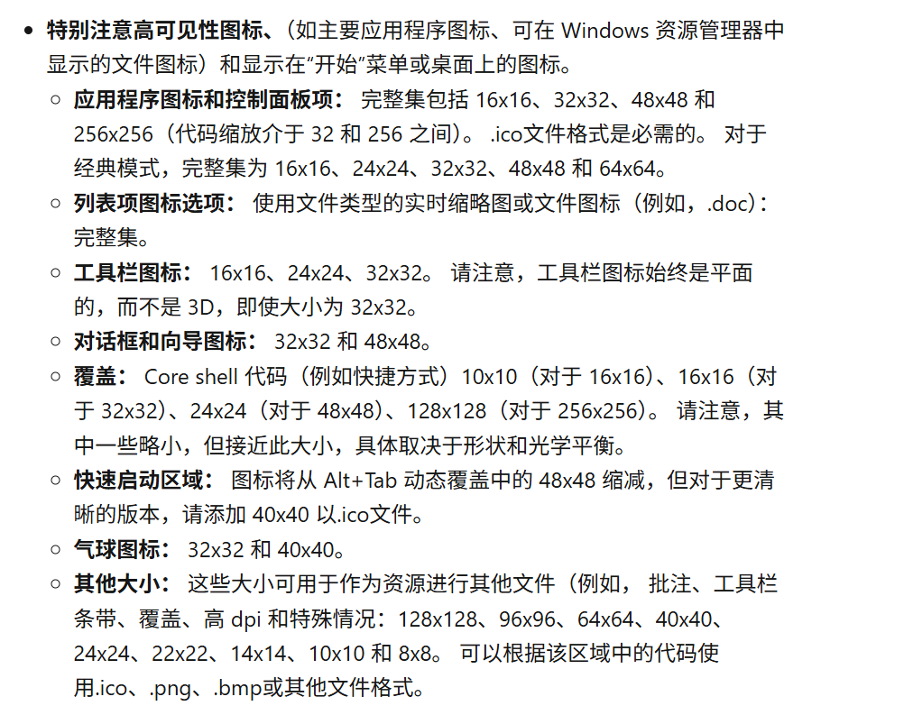
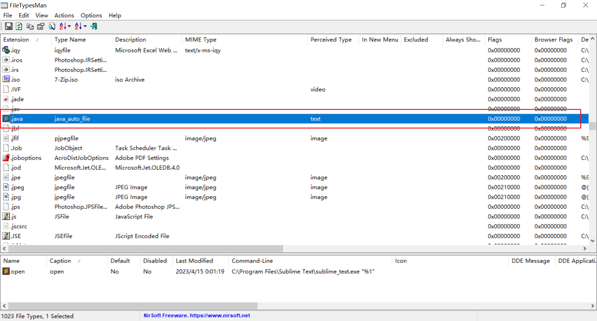
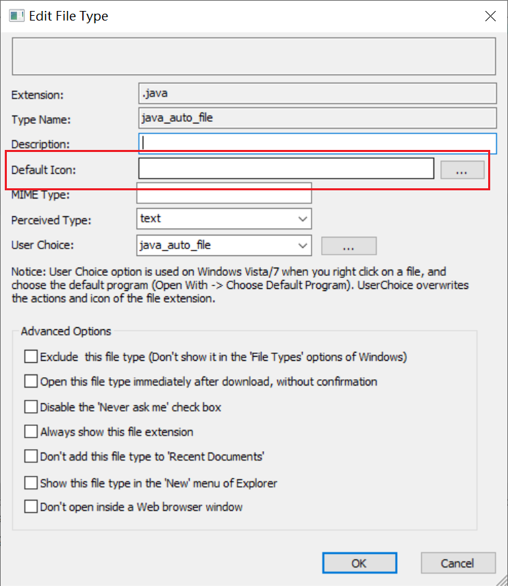
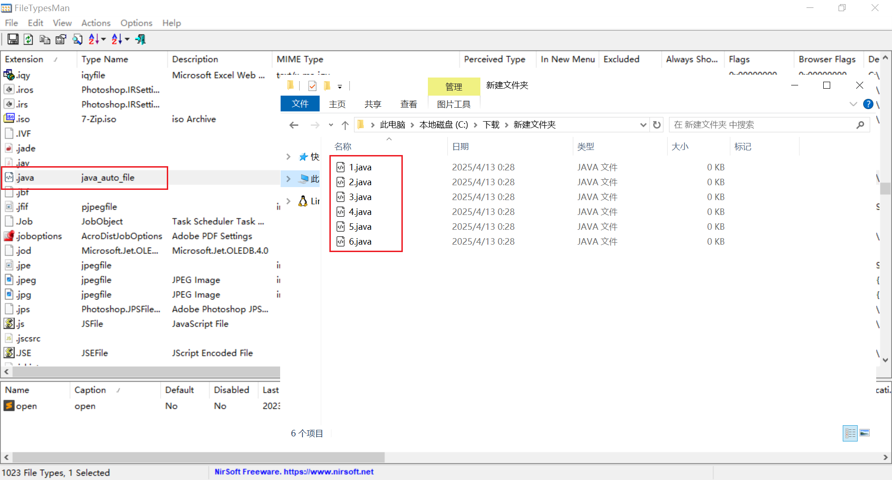

> 原文链接：https://blog.csdn.net/TeleostNaCl/article/details/147185704
> 发布时间：2025-04-13 03:18:49
> 标签：windows、电脑、开源软件、经验分享

---

对于一些文件格式，如果选择了某些应用为默认应用程序打开之后，相应地这些格式的文件图标也会跟随应用的设置而更改。但是有些程序的默认图标有些不美观（特别点名`Sublime`应用），或者为了保持图标一致性，我们希望去修改该格式的默认图标。

下图为`.java`格式文件选择`Sublime`之后的默认图标，为`Sublime`图标。`Sublime`作为阅读代码优秀的编辑器，我们会将很多源代码文件都使用`Sublime`去打开，但是其图标显得实在是太突兀了，总是希望能去改变这个图标。  
   
 因此本文将介绍一款可以实现改变文件图标的软件–`FileTypesMan`

#### 文章目录

- [一、 `FileTypesMan`介绍](#_FileTypesMan_7)
- [二、下载运行](#_21)
- [三、使用](#_26)

## 一、 `FileTypesMan`介绍

官方下载地址：`https://www.nirsoft.net/utils/file_types_manager.html`

以下引用官方的介绍

> FileTypesMan is an alternative to the ‘File Types’ tab in the ‘Folder Options’ of Windows. It displays the list of all file extensions and types registered on your computer. For each file type, the following information is displayed: Type Name, Description, MIME Type, Perceived Type, Flags, Browser Flags, and more.  
>  FileTypesMan also allows you to easily edit the properties and flags of each file type, as well as it allows you to add, edit, and remove actions in a file type.  
>  This utility works on any version of Windows from Windows XP to Windows 11. For using this utility under x64 system, you should download the x64 version.

大致意思即是`FileTypesMan`是文件夹选项中文件类型的替代品，它可以展示所有注册在计算机里的文件格式以及文件格式的信息，并且允许简单的编辑、添加甚至删除每一个文件格式信息。  
 此工具支持从 `Windows XP` 到 `Windows 11` 之间的任意版本

因此，这个软件将方便的给我们提供了改变文件图标的方式。

> 当然，正如官方所介绍的那样，这个软件是可以管理编辑文件格式的各种信息的，它的功能远远不止于此，可以实现很多客制化的需求。

## 二、下载运行

拖到网页的最下面，即有下载地址，选择对应的cpu位数进行下载，之后解压即可运行。  
   
 

## 三、使用

在开始使用之前，需要去找到适合做图标的文件，按照这篇文章（`https://learn.microsoft.com/zh-cn/windows/win32/uxguide/vis-icons`）所介绍的，选择不超过 `256*256`分辨率的图标文件。  
 

找到下载解压之后的文件夹，以`管理员身份`运行 `FileTypesMan.exe`。在主页面中找到需要修改的图标的文件格式，双击之后将打开编辑窗口。  
   
 在打开的 `Edit File Type` 窗口中编辑 `Default Icon` 项  
   
 编辑完成之后点击OK，该文件格式即被替换成指定的图标。  
   
 如果没有生效，可以尝试点击右上角的`刷新`按钮，强制刷新桌面图标。
