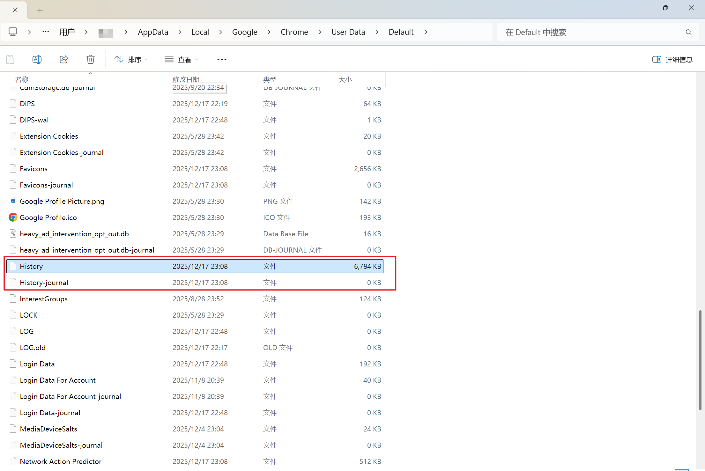
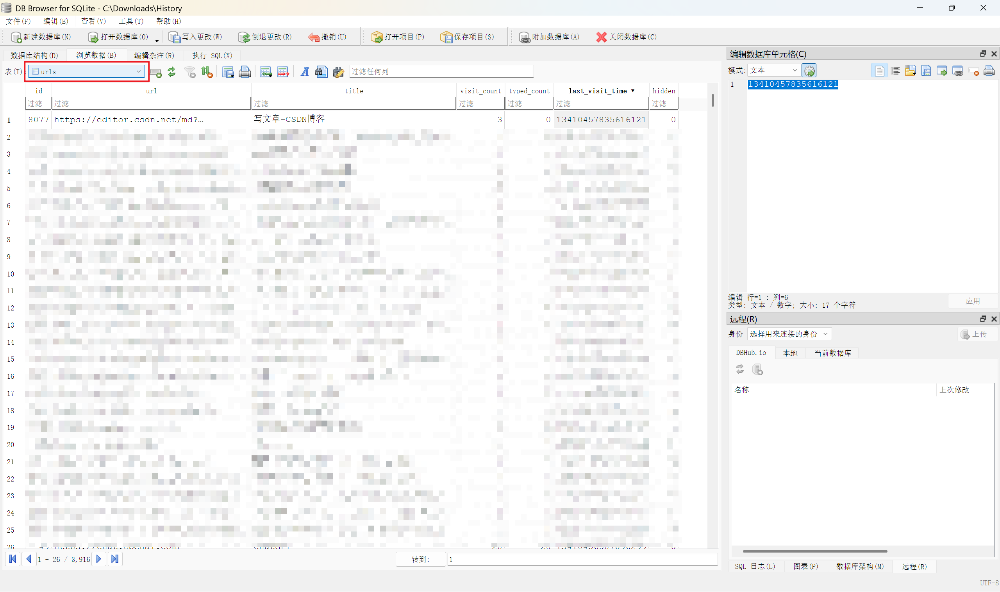

`Google Chrome` 浏览器的历史记录是通过 `SQLite` 数据库存储在应用数据目录下的，不同系统的具体路径如下：

- **Windows**: `%LocalAppData%\Google\Chrome\User Data\Default\History`
- **macOS**: `~/Library/Application Support/Google/Chrome/Default/History`
- **Linux**: `~/.config/google-chrome/Default/History`

例如以 `Windows` 为例：可以看到在用户数据下中有 `History` 和 `History-journal` 文件，，而这就是历史记录的`SQLite` 数据库。

我们用数据库相关软件打开这个文件，就可以看到里面有一张 `urls` 表，有以下字段：

- `id`：数据库的主键，标识一条历史记录
- `url`：历史记录的链接
- `title`：历史记录的标题
- `visit_count`：访问次数
- `typed_count`：输入次数
- `last_visit_time`：最后一次访问时间

其中我们可以利用 `url` 和 `title` 字段可以快速到处历史记录信息，`SQL` 语句如下：`Select * FROM urls`。

> `last_visit_time` 是跟随系统开始记录的，可以采用 从1601年1月1日（`协调世界时UTC`）开始计算的100纳秒（1亿分之一秒）间隔数，或者 `UNIX时间戳`（自1970年1月1日以来秒数）。在 `Windows` 中是采用 `协调世界时UTC` 记录的。在代码中可以使用专用的库进行转换。
