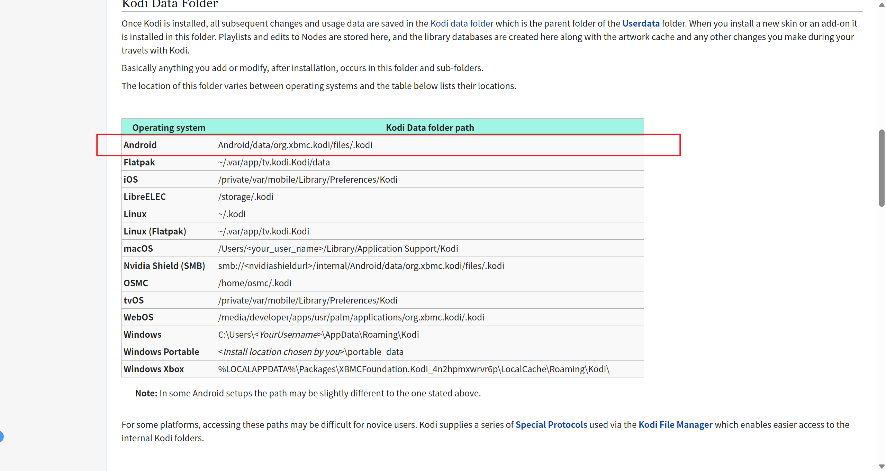
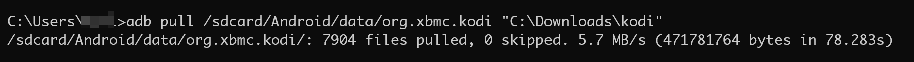
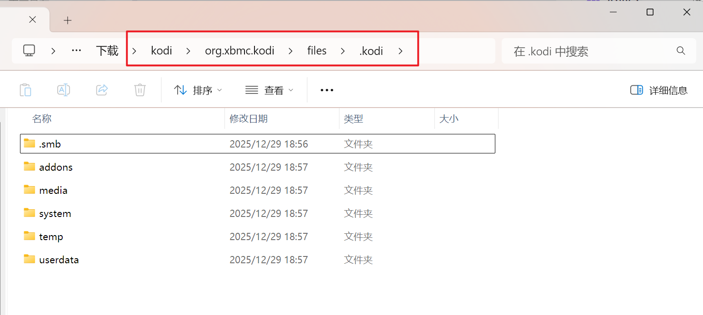
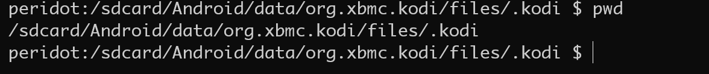
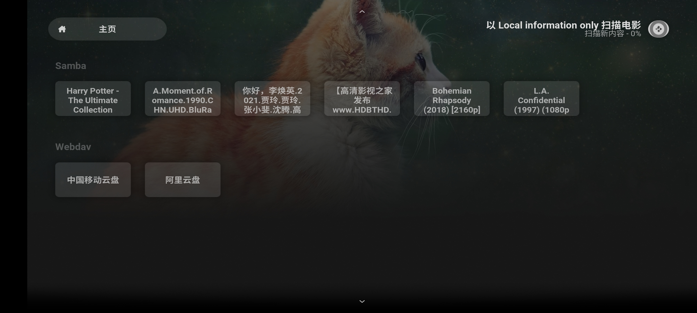

`Kodi` 是跨平台的影音播放器，被广泛运用在各类电视和电视盒子上，其功能非常强大，可以播放任何类型的影音，例如音乐、图片、视频、直播。因此，几乎成为了电视必备的应用，轻松打造家庭影院电影库必备神器。

`Kodi` 官网：[https://kodi.tv/](https://kodi.tv/)
中文论坛 `Kodi` 中文网如下：[http://www.kodiplayer.cn/](http://www.kodiplayer.cn/)

但是也因为 `Kodi` 功能强大，配置也很复杂，因此当我们把 `Kodi` 配置好之后，我们会希望能够与将数据备份好，以便下次可以使用。

本文将参考 [https://kodi.wiki/view/Backup](https://kodi.wiki/view/Backup) 官方的备份教程，详细介绍如何使用 `ADB` 免 `root` 备份 `Android` 版的 `Kodi` 数据并导入到另一台 `Android` 设备的方法。

# 备份

首先，查阅官方教程可以知道，`Kodi` 的数据是存储在 `Android/data/org.xbmc.kodi/files/.kodi` 目录下的：



> 这个信息是非常重要的，因为这意味着 `Kodi` 的数据是存在 `/sdcard` 上的，而不是在 `/data/data` 下的私用空间。而 `/sdcard` 上的目录我们可以无 `root` 直接访问。这就可以很方便的让我们直接备份和恢复了。

在 `Android 11` 的版本之后，由于严格的安全限制，禁止其它应用直接访问 `Android/data` 目录，因此本文需要使用 `adb` 命令才能够备份和还原 `Kodi` 的数据。

首先，我们连接上待备份的设备，使用如下命令可以将 `Kodi` 的全部数据提取到电脑上（将 `$folder` 替换为电脑上的指定位置）：
```shell
adb pull /sdcard/Android/data/org.xbmc.kodi $folder
```



此时我们就在电脑上得到了 `Kodi` 的完整备份：


# 还原
首先，我们还是使用 `ADB` 连接上待还原的设备，使用如下命令将备份的数据还原到设备上(`$folder` 替换为备份数据的文件夹)：
```shell
adb push $folder /sdcard/Android/data/org.xbmc.kodi
```

随后我们进入串口，检查文件夹路径是否符合预期 `/sdcard/Android/data/org.xbmc.kodi/files/.kodi`



并 `cd` 到 `/sdcard/Android/data/org.xbmc.kodi/` 目录，执行 `chmod 0777 -R *`，给刚推进去的文件授予可读写的权限。

```shell
cd /sdcard/Android/data/org.xbmc.kodi
chmod -R 0755 *
```

随后，我们启动新设备上的 `Kodi`，检查是否已经还原数据成功。


