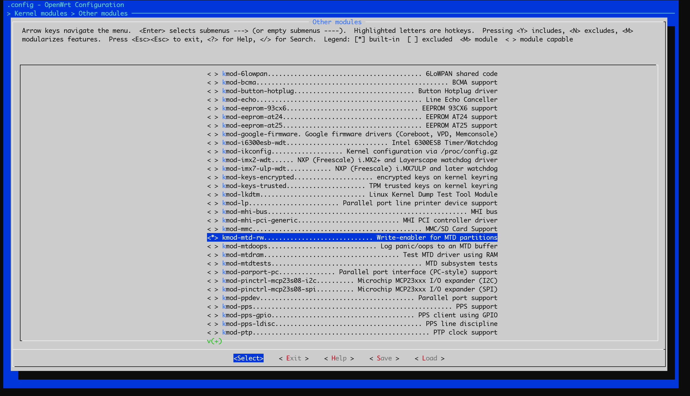

@[TOC]
# 一、问题背景
我们有时候在 `OpenWrt` 上希望使用 `mtd write` 命令去更新部分分区，例如 `uboot` 分区，具体命令如下：
```shell
# 先擦除分区
mtd erase 分区名
# 刷写新分区
mtd write 分区文件 分区名
```
而分区名可以通过 `cat /proc/mtd` 获取到，例如如下：
```text
root@OpenWrt:~# cat /proc/mtd 
dev:    size   erasesize  name
```
此时会输出一个表格，其中最后一个 `name` 即是分区名，使用其即可替换相关的分区。

举个例子，现在要更新 `CMCC RAX3000M NAND` 的 `uboot`，从网上下载到 `uboot` 和 知道 `uboot` 的分区为 `FIP`，并将 `uboot` 文件上传到 `/tmp` 目录下。我们先通过命令 `cat /proc/mtd ` 得到分区信息
```text
root@OpenWrt:~# cat /proc/mtd 
dev:    size   erasesize  name
mtd0: 07200000 00020000 "ubi"
mtd1: 00200000 00020000 "fip"
mtd2: 00200000 00020000 "factory"
mtd3: 00080000 00020000 "u-boot-env"
mtd4: 00100000 00020000 "bl2"
```
可以知道 `uboot` 分区名为 `fip`，因此刷写新 `uboot` 的命令为：`mtd write openwrt-24.10.1-mediatek-filogic-cmcc_rax3000m-emmc-bl31-uboot.fip fip`

但是，此时却弹出了一个提示
```text
root@OpenWrt:/tmp# mtd write openwrt-24.10.1-mediatek-filogic-cmcc_rax3000m-emmc-bl31-uboot.fip fip
Could not open mtd device: fip
Can't open device for writing!
```

通过查询，可以知道 `OpenWrt` 官方为了保护 `uboot` 分区，默认是不可写入的，要先解锁分区的写入，本文将介绍一种方式来解决此问题。

# 二、解决方案
参考：[H3C Magic NX30 Pro 官方 OpenWrt 安装教程](https://ericclose.github.io/install-openwrt-on-h3c_magic-nx30-pro.html#%E9%87%8D%E6%96%B0%E5%88%B7%E5%86%99%E6%AD%A4%E5%89%8D%E6%9C%AA%E5%88%B7%E5%85%A5%E7%9A%84-BL2-%E5%88%86%E5%8C%BA)
 
从以上文章可以知道，只有安装了 `kmod-mtd-rw`，使内核支持 `mtd` 读写，解锁分区的写入，然后再输入 `insmod /lib/modules/$(uname -r)/mtd-rw.ko i_want_a_brick=1` 将所有分区配置为可读写。

## 1. 编译勾选 kmod-mtd-rw
在编译 `OpenWrt` 时勾选 `Kernel modules > Other modules > kmod-mtd-rw`，使内核支持 `mtd` 读写

待编译完成之后，刷入带了 `kmod-mtd-rw` 的新系统即可。

## 2. 配置所有分区为可读写
在新系统启动之后，在终端输入命令将所有分区配置为可读写。
```shell
insmod /lib/modules/$(uname -r)/mtd-rw.ko i_want_a_brick=1
```

通过以上操作之后，即可刷新新的分区。
