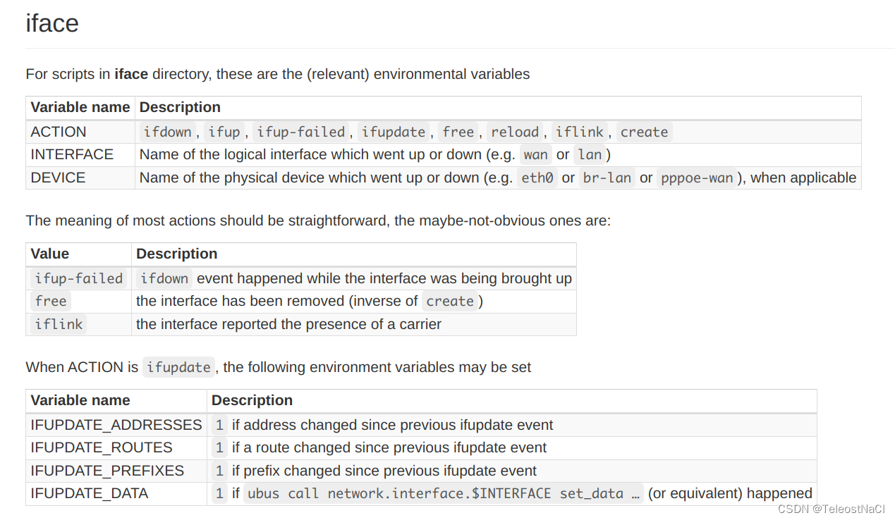
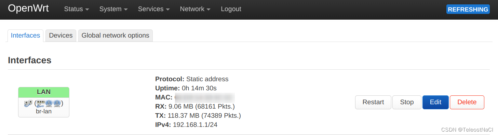
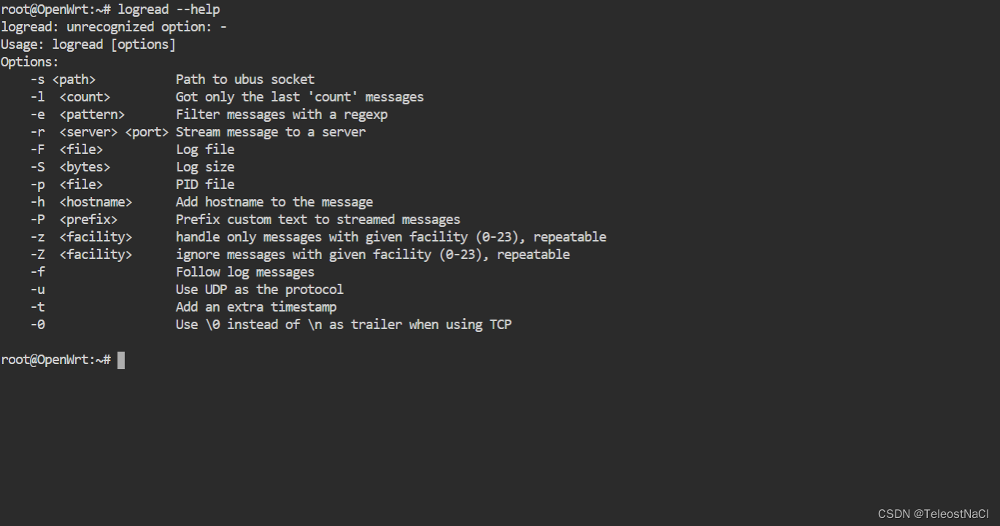

@[toc]
## 一、绪言
OpenWrt是一个高度模块化、高度自动化的嵌入式Linux系统，拥有强大的网络组件和扩展性，适用于较多的路由器设备。

有时候，在使用OpenWrt时，我们需要监听网线的插拔，获取网线插拔的事件，并执行一些操作。OpenWrt官方文档给出使用hotplug去获取相关事件: `https://openwrt.org/docs/guide-user/base-system/hotplug`
如文档中指出，可在`/etc/hotplug.d/iface/`文件夹下编写脚本，对`$ACTION`， `$INTERFACE`，`$DEVICE`进行判断，可监听网络接口的状态。



但是实际上验证，此监听只是对INTERFACE下建立的接口虚拟接口有效，当手动控制接口状态时，如Restart Stop才会执行`/etc/hotplug.d/iface/`下的脚本文件，而直接插拔网线并不能被监听到。因此此方法并不能直接监听网线插拔事件。



同时，这篇文章(`https://www.jianshu.com/p/a1bfc54bc6dd`)中提到phy内核检测到WAN口变化后会创建hotplug消息，因此可在`/etc/hotplug.d/phy/`路径下编写脚本，获取hotplug消息。但是使用斐讯K2的官方OpenWrt，在插拔网线时，并不能执行`/etc/hotplug.d/phy/`路径下的脚本。

在通过查看日志排查脚本的过程中，发现日志中有内核对网线插拔的事件打印。


打印形式诸如`mtk_soc_eth 10100000.ethernet eth0: port x link up/down `
`port`标识端口号，`up/down`表示插入/移除网线。

因此，本文以此为基础，以斐讯K2为例，将介绍一种通过读取日志的方法，监听OpenWrt网线插拔的事件。

## 二、相关基础
### 1. logread命令
OpenWrt提供了logread命令用来读取日志的内容，其帮助文档如下：



logread命令相当强大，官方已给出来详细的指导文档(`https://openwrt.org/docs/guide-user/base-system/log.essentials`)，可以实现将日志保存到内存，文件甚至是通过TCP/IP存储到远程设备中。

我们关注`-f`参数，此参数可以使终端一直等待日志的到来，并将日志实时地显示在终端中


因此我们可以通过编写脚本，使用`logread -f`命令实时读取日志，并使用Linux的管道流操作，检测是否为网线插拔的事件，从而做成相应的响应。

### 2. Linux管道流操作
在Bash中，把前一个的输出连接作为后一个的输入，是谓管道。命令`commandA|commandB`的执行流程可用流程图进行如下表示


### 3. 判断变量中是否含有指定字符串
在Bash中可以使用 `=~` 符号进行判断字符串是否包含另一个字符串，如`"$var1" =~ "$var2"`

### 4. 使用read命令并搭配循环，逐行获取输入流
`read`是bash提供的从输入流读取单行数据的命令，`read`后面接一个变量名，可将读取到的数据赋值给该变量，其搭配循环可以实现逐行获取，循环体中可对各行数据进行处理，采用`do...while`循环体的格式如下
```bash
while read var; do
	# statements
done
```
## 三、编写脚本
经前文分析，可以编写以下脚本，实现通过读取日志的方法，监听OpenWrt网线插拔的事件。
```bash
#!/bin/sh

# 编写判断是否为插入/摆出网线的事件的函数
judge() {
	# 使用read进行逐行读取读取输入流, 并赋值给变量log
	while read log; do
		# 此处监听端口4的插入事件(其它端口和事件修改此判断条件)
		if [[ "$log" =~ "eth0: port 4 link up" ]]; then
			# 编写事件的响应
		fi
	done
}

# 使用 readlog -f 实时读取日志, 并使用管道传递给judge函数, 进行判断并做出响应
logread -f | judge
```
