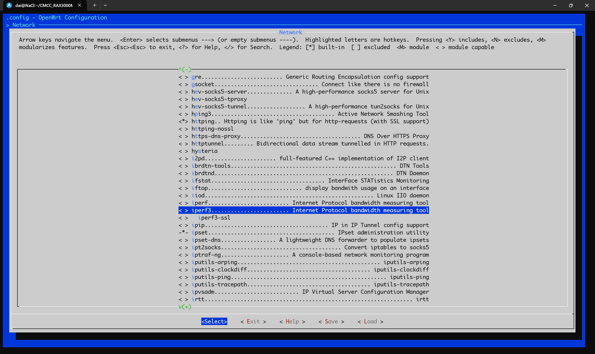
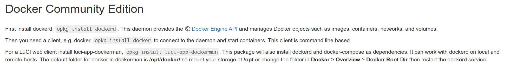
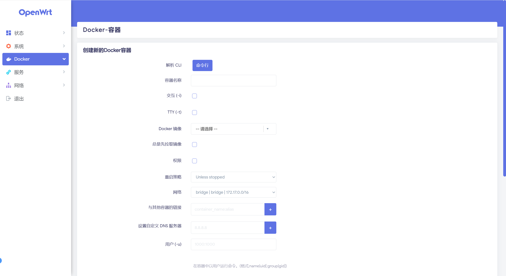
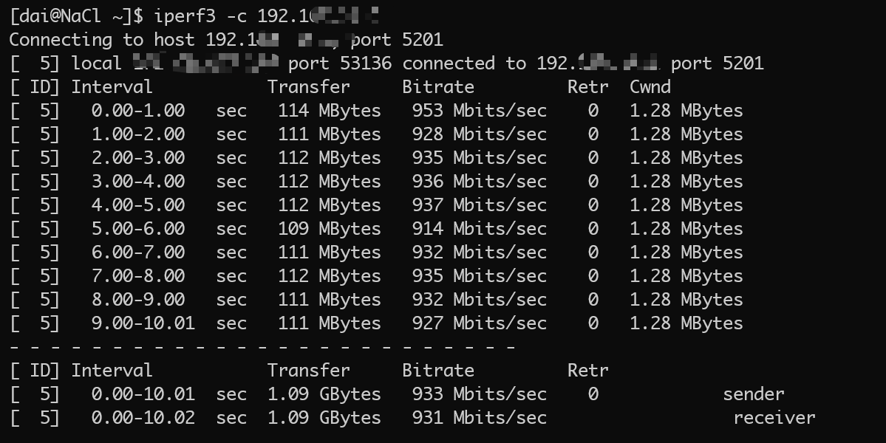

> 原文链接：https://blog.csdn.net/TeleostNaCl/article/details/149032735
> 发布时间：2025-06-30 22:55:10
> 标签：docker、容器、智能路由器、经验分享

---

#### 文章目录

- [一、问题背景](#_1)
- [二、安装方法](#_18)

## 一、问题背景

`iperf3` 是一套测试网络性能的工具，其可以测试出在两个 `IP` 之间最大的带宽速率。其官网地址如下：<https://software.es.net/iperf/>。其可以被安装在 `OpenWrt` 的系统上，用来测试设备到路由器间内网的最大速率，可以测试 `lan` 口网络和 `wifi` 的极限速率以及各种性能，对于调试路由器和分析网络问题时起到极大的帮助，也能推测出通信的性能瓶颈是出自哪里。

`iperf3` 已经被预置在了 `OpenWrt` 的官方包中，在编译时可以选择 `Network` > `iperf3`，即可在 `OpenWrt` 运行 `iperf3`

  
 而 `iperf3` 可能会占用太多的磁盘空间，对于空间小的路由器来说，可能使用 `iperf3` 会对空间造成压力。因此本文将介绍在 `Docker` 中运行 `iperf3`，实现快速复用和减少系统的占用。

> 不过使用 `docker` 运行 `iperf3` 会造成或多或少的内存损耗，对测试结果带来一定的不准确。如果

`Docker` 是一个开源的应用容器引擎，可以让开发者打包他们的应用以及依赖包到一个轻量级、可移植的容器中，然后发布到任何流行的 Linux 机器上，也可以实现虚拟化。可以实现快速部署大量的应用程序。

参考 `OpenWrt` 的 [OpenWrt as Docker container host[(https://openwrt.org/docs/guide-user/virtualization/docker\_host) 官方教程，只要安装了 `luci-app-dockerman` luci包，即可在 `OpenWrt` 上运行 `docker`。  
   
 `luci-app-dockerman` 包的位置位于：`LuCI` > `3. Applications` > `luci-app-dockerman`，勾选编译即可。  
 

> 由于 `Docker` 空间占用相对较大，因此需要提前挂载 `USB` 磁盘才能较好的体验 `Docker`，参考 `OpenWrt` 搭建 `Samba` 服务器的方法：<https://openwrt.org/docs/guide-user/services/nas/cifs.server>

## 二、安装方法

本文将使用 `networkstatic/iperf3` 镜像进行安装：<https://hub.docker.com/r/networkstatic/iperf3>

首先在 `luci` 管理界面，`Docker` > `镜像` > `拉取镜像`，输入 `networkstatic/iperf3`，点击拉取，即可将 `networkstatic/iperf3` 镜像拉取到本地。

如果因为下载包较大导致下载镜像超时，可以用命令进行安装

```shell
docker pull networkstatic/iperf3
```

随后在 `luci` 管理界面，`Docker` > `新增`，打开 `新增` 容器的界面  
   
 为了便于输入，可以使用命令行输入命令的方式，添加容器，参考官方的 `Cli`：

```shell
docker run -it --rm --name=iperf3-server --net=host networkstatic/iperf3 -s
```

这里与官方介绍不一样的地方在于，我们使用了 `host` 的网络模式，而不是 `bridge`。因为使用 `host` 的网络模式可以消除网络隔离，容器与主机共享网络命名空间，此时会带来性能提升，对于 `iperf3` 性能测试工具来说，使用此模式才能真实反映出性能数据。

最后的 `-s` 传递的是 `iperf3` 的命令参数，可以依据官方文档传递相关参数，配置 `iperf3` 。此处仅传递 `-s` 表示启动服务端，其默认会占用 `5201` 端口，等待客户端连接并测试网络性能。

为了便于复用，可以编写 `docker-compose` 的 `yaml` 文件，方便在多个设备进行部署：

```yaml
---
services:
  iperf3-server:
    image: networkstatic/iperf3:latest
    container_name: iperf3-server
    hostname: iperf3-server
    restart: unless-stopped
    network_mode: host
    command: -s
```

保存在路由器合适的位置之后，在 `OpenWrt` 的终端运行如下命令：

```shell
docker-compose -f .yml文件 up -d
```

在添加完成之后，此时点击容器的运行，即可启动 `iperf3` 服务端。在终端设备中，输入 `iperf -c 路由器IP` 即可开始测试性能数据。  
 
