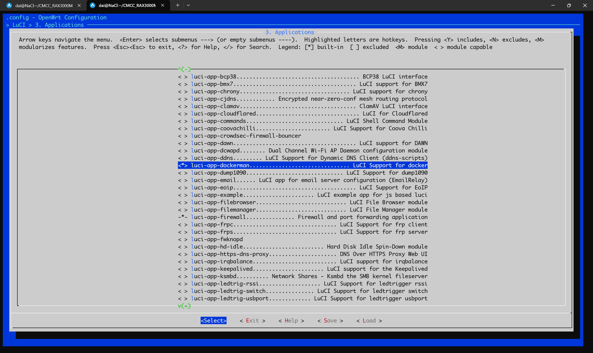
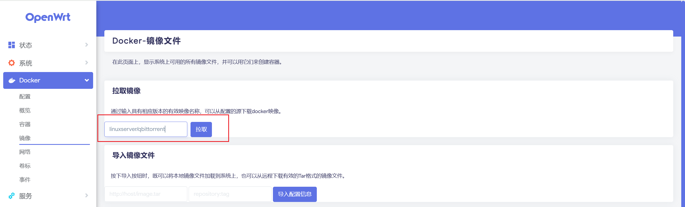
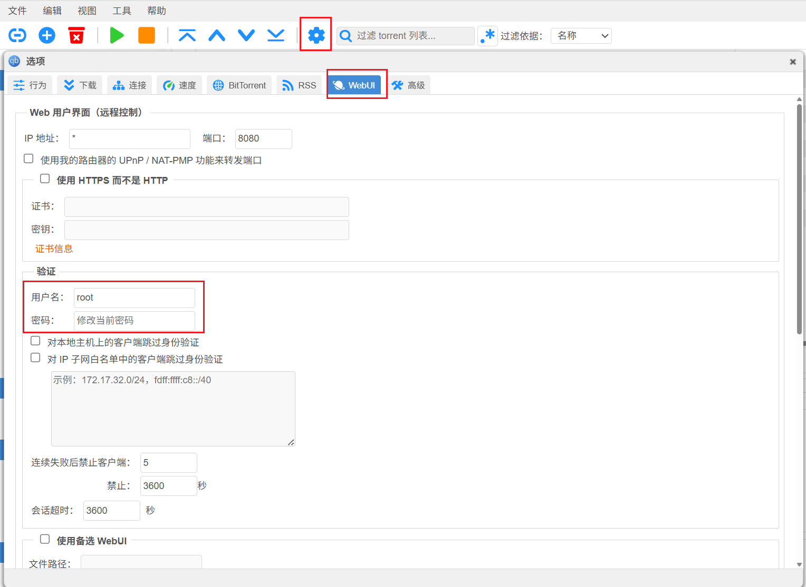
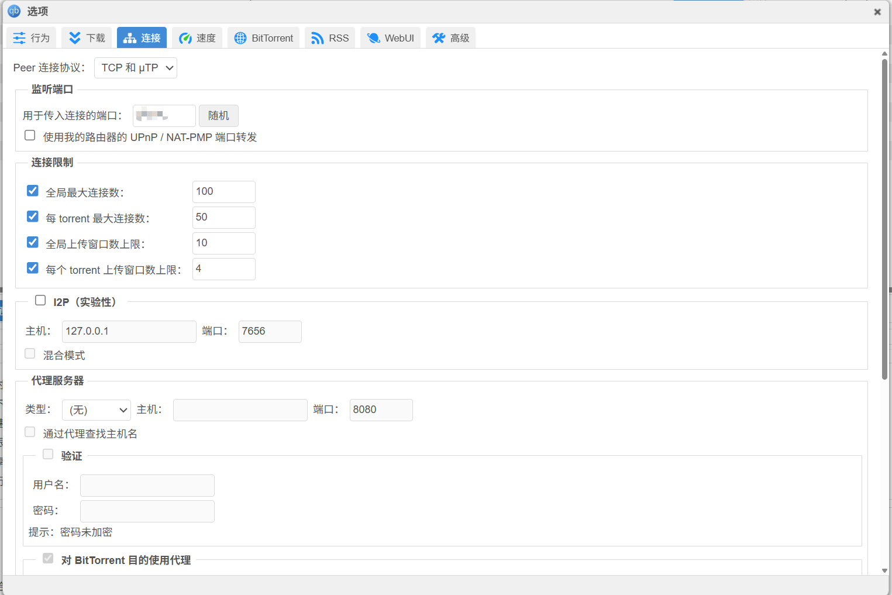
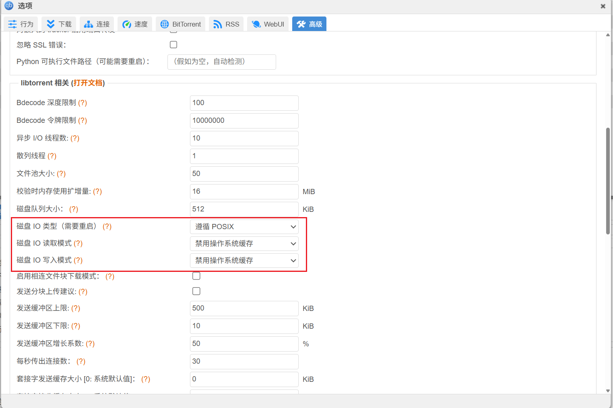
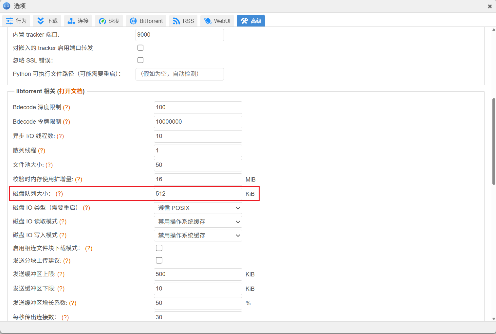
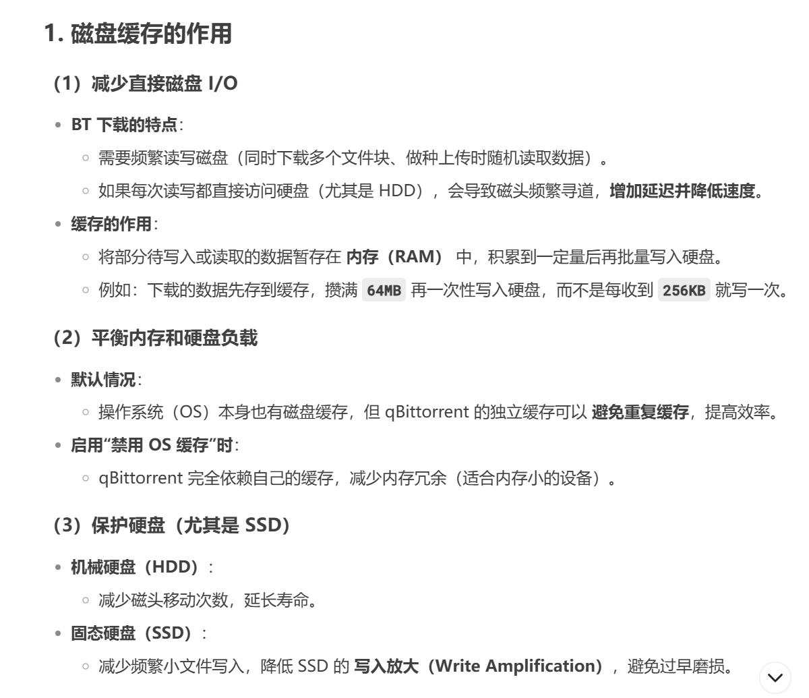

> 原文链接：https://blog.csdn.net/TeleostNaCl/article/details/148996029
> 发布时间：2025-06-29 14:13:40
> 标签：docker、容器、经验分享、智能路由器

---

#### 文章目录

- [一、问题背景](#_1)
- [二、安装方法](#_19)
- [三、性能优化](#_94)

## 一、问题背景

`qBittorrent` 是一款优秀的跨平台的种子下载器的开源软件，官方的介绍如下：

> qBittorrent is a bittorrent client programmed in C++ / Qt that uses libtorrent (sometimes called libtorrent-rasterbar) by Arvid Norberg.  
>  It aims to be a good alternative to all other bittorrent clients out there. qBittorrent is fast, stable and provides unicode support as well as many features.

项目地址：<https://github.com/qbittorrent/qBittorrent>

之前有介绍使用包装了 [qbittorrent-nox-static](https://github.com/userdocs/qbittorrent-nox-static) 的 `luci-app-qbittorrent-static` 来在 `OpenWrt` 上运行 `qBittorrent`，文章地址为：[luci-app-qbittorrent-static | 一种在OpenWrt运行qBittorrent的方法](https://blog.csdn.net/TeleostNaCl/article/details/146217194)

但是直接在 `OpenWrt` 编译运行 `qBittorrent`，其占用相对较大，对于低内存设备来说，是一笔不小的开销。因此本文将介绍一种使用 `Docker` 来运行 `qBittorrent`方法。

`Docker` 是一个开源的应用容器引擎，可以让开发者打包他们的应用以及依赖包到一个轻量级、可移植的容器中，然后发布到任何流行的 Linux 机器上，也可以实现虚拟化。可以实现快速部署大量的应用程序。

参考 `OpenWrt` 的 [OpenWrt as Docker container host[(https://openwrt.org/docs/guide-user/virtualization/docker\_host) 官方教程，只要安装了 `luci-app-dockerman` luci包，即可在 `OpenWrt` 上运行 `docker`。  
   
 `luci-app-dockerman` 包的位置位于：`LuCI` > `3. Applications` > `luci-app-dockerman`，勾选编译即可。  
 

> 由于 `Docker` 空间占用相对较大，因此需要提前挂载 `USB` 磁盘才能较好的体验 `Docker`，参考 `OpenWrt` 搭建 `Samba` 服务器的方法：<https://openwrt.org/docs/guide-user/services/nas/cifs.server>

## 二、安装方法

本文使用 `linuxserver/qbittorrent` 镜像进行安装：<https://hub.docker.com/r/linuxserver/qbittorrent>

首先在 `luci` 管理界面，`Docker` > `镜像` > `拉取镜像`，输入 `linuxserver/qbittorrent`，点击拉取，即可将 `linuxserver/qbittorrent` 镜像拉取到本地。  
   
 如果因为下载包较大导致下载镜像超时，可以用命令进行安装

```shell
docker pull linuxserver/qbittorrent
```

随后在 `luci` 管理界面，`Docker` > `新增`，打开 `新增` 容器的界面

  
 为了便于输入，可以使用命令行输入命令的方式，添加容器，参考官方的 `Cli`：

```shell
docker run -d \
  --name=qbittorrent \
  -e PUID=1000 \
  -e PGID=1000 \
  -e TZ=Etc/UTC \
  -e WEBUI_PORT=8080 \
  -e TORRENTING_PORT=6881 \
  -p 8080:8080 \
  -p 6881:6881 \
  -p 6881:6881/udp \
  -v /path/to/qbittorrent/appdata:/config \
  -v /path/to/downloads:/downloads `#optional` \
  --restart unless-stopped \
  linuxserver/qbittorrent:latest
```

参数解析：  
 `-e WEBUI_PORT=8080`：这个是指定 `WebUI` 的端口地址  
 `-e TORRENTING_PORT=6881`：这个是指定 `qBittorrent` 通信的端口。

下面三个的 `-p` 是指容器需要开放的端口，需要与 `WEBUI_PORT` 和 `TORRENTING_PORT` 相同，即开放 `WebUI` 的端口地址和 `qBittorrent` 通信的端口 。

`-v /path/to/qbittorrent/appdata:/config`：这个是指定将 `docker` 中的地址映射到 本机的物理路径，即 在 `docker` 中的 `/config` 映射到本机的 `/path/to/qbittorrent/appdata`。  
 `-v /path/to/downloads:/downloads`：同上，是指定 `qBittorrent` 下载路径。

> 注意，此路径需要给适当的权限，由于 `qBittorrent` 的用户和用户组非 `root`，无法修改 `root` 创建的文件夹和文件。因此，此文件夹需要给 `0777` 权限。

为了便于复用，可以编写 `docker-compose` 的 `yaml` 文件，方便在多个设备进行部署：

```yaml
---
services:
  qbittorrent:
    image: linuxserver/qbittorrent:latest
    container_name: qbittorrent
    environment:
      - PUID=1000
      - PGID=1000
      - TZ=Etc/UTC
      - WEBUI_PORT=8080
      - TORRENTING_PORT=6881
    volumes:
      - /path/to/qbittorrent/appdata:/config
      - /path/to/downloads:/downloads #optional
    ports:
      - 8080:8080
      - 6881:6881
      - 6881:6881/udp
    restart: unless-stopped
```

保存在路由器合适的位置之后，在 `OpenWrt` 的终端运行如下命令：

```shell
docker-compose -f .yml文件 up -d
```

此时在 `luci` 管理界面，`Docker` > `容器` 里可以看到 `qBittorrent` 的容器了。然后点击编辑，点击查看日志，如果此时运行正常，会有如下打印：

```
The webUI administrator username is: admin
The webui is administrator password was not set. A temporary password is provided for this session: ********
```

这段日志则表示的是默认用户名和密码，首次登录可以使用此账户密码登录 `WebUI`。此时可以在登录 `路由器IP:8080` 打开 `WebUI`，输入账户密码登录。  
   
 首次登录成功之后，点击 `设置` > `WebUI` > `验证`，修改用户名和密码。之后就可以正常使用 `qBittorrent` 。  
 

## 三、性能优化

由于路由器设备的性能相对较弱，为了减少 `qBittorrent` 对资源的占用，可以用以下方法进行相关优化。

1. 在 `连接` > `连接限制` 中，减少 `全局最大连接数` 和 `每 torrent 最大连接数`



2. 在 `高级` 中禁用磁盘缓存，将 `磁盘 IO 类型（需要重启）` 设置为 `遵循 POSIX`，`磁盘 IO 读取模式` 和 `磁盘 IO 写入模式` 都设置为 `禁用操作系统缓存`

  
 3. 在 `高级` 中 减小 `磁盘队列大小`

  
 以下摘自 `DeepSeek`  
   
 
