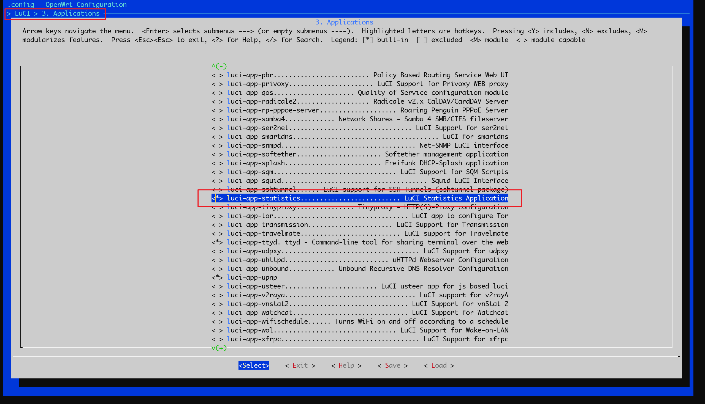
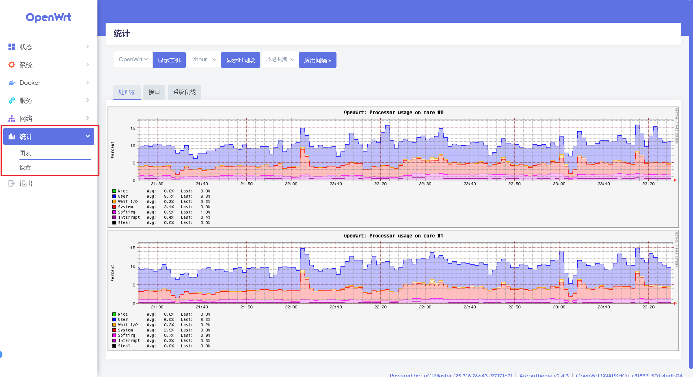
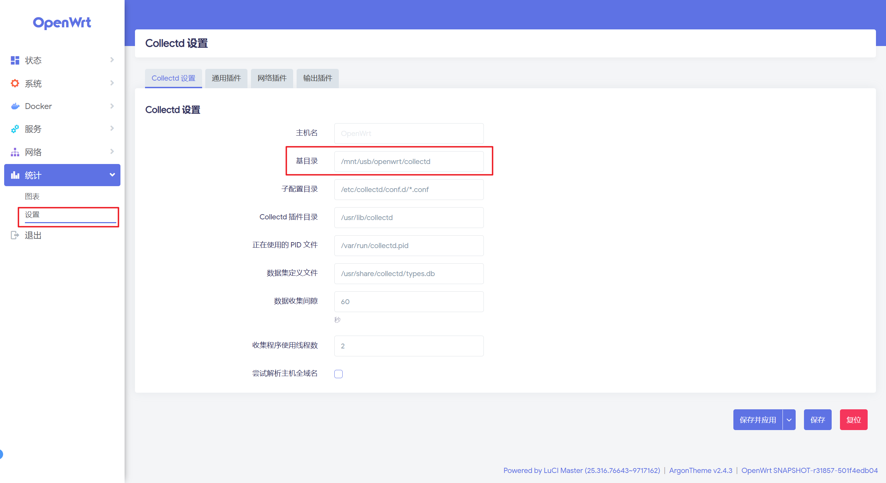
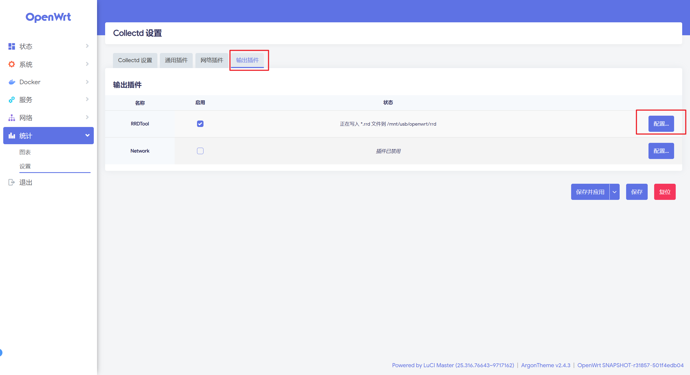
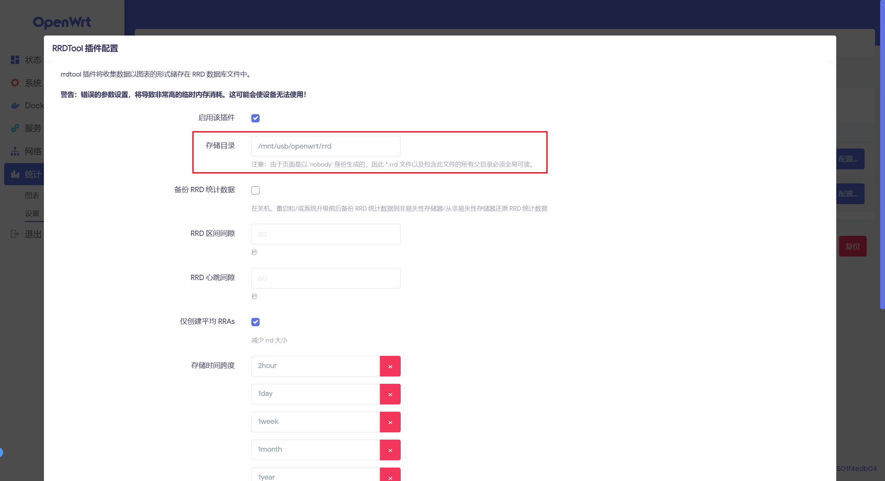
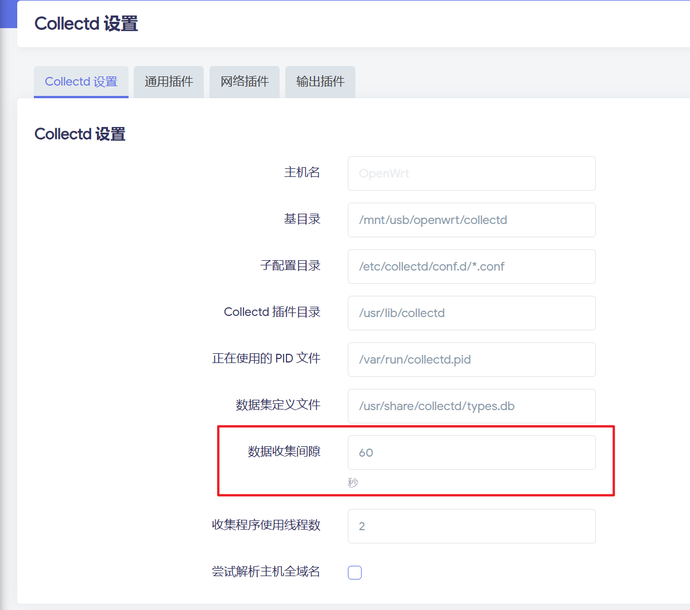

> 原文链接：https://blog.csdn.net/TeleostNaCl/article/details/154961719
> 发布时间：2025-11-17 23:44:31
> 标签：网络、经验分享、智能路由器、运维

---

#### 文章目录

- [一、背景介绍](#_1)
- [二、安装 luci-app-statistics](#_luciappstatistics_25)
- [三、持久化配置](#_44)
- [四、详细配置](#_72)

## 一、背景介绍

我们在使用 `OpenWrt` 的时候，可以使用 `ifconfig` 命令清晰的获得从开机开始到此刻各接口的流量使用情况，例如：

```text
pppoe-wan Link encap:Point-to-Point Protocol  
          inet addr:xxxx  P-t-P:xxxx  Mask:255.255.255.255
          inet6 addr: xxxx/128 Scope:Link
          inet6 addr: xxxx/64 Scope:Global
          UP POINTOPOINT RUNNING NOARP MULTICAST  MTU:1492  Metric:1
          RX packets:5377021 errors:0 dropped:0 overruns:0 frame:0
          TX packets:26112086 errors:0 dropped:0 overruns:0 carrier:0
          collisions:0 txqueuelen:3 
          RX bytes:2979930001 (2.7 GiB)  TX bytes:22341805551 (20.8 GiB)
```

从这段输出可以清晰的知道，`pppoe-wan` 接口上传了 `20.8GB`，下载了 `2.7 GB` 的流量。

并且，在 `luci` 的 `概览` 中也提供了明显的可视化的流量查看方式，例如：


但是，以上方式也只是基于本次开机的数据结果，只要设备一断电重启，这些数据就会消失，重新统计，无法累计所有的流量。在我们实际使用中，路由器可能会一些特殊原因断电，从而导致部分流量数据缺失，并且此方式无法清晰地看到是否有流量高峰。

因此，本文将详细介绍使用 `luci-app-statistics` 进行统计流量数据的方式，并详细介绍如何持久化统计到的数据。

## 二、安装 luci-app-statistics

`luci-app-statistics` 底层依赖于 `collectd` 服务进行收集数据，并由 `rrdtool` 提供数据存储与可视化，可以详细的收集并展示设备的 `CPU`、`内存`、`流量` 等各项数据。

首先，我们要使用 `luci-app-statistics` 收集数据，则先要安装 `luci-app-statistics`，可用如下命令安装所有有关的插件和依赖：

```shell
// 使用 opkg 
opkg update
opkg install collectd collectd-mod-cpu collectd-mod-interface collectd-mod-iwinfo collectd-mod-load collectd-mod-memory collectd-mod-network collectd-mod-rrdtool rrdtool1

// 使用 apk
apk update
apk add collectd collectd-mod-cpu collectd-mod-interface collectd-mod-iwinfo collectd-mod-load collectd-mod-memory collectd-mod-network collectd-mod-rrdtool rrdtool1
```

如果我们是在编译的时候，则只需要勾选 `LuCI` > `3. Applications` > `luci-app-statistics` 即可。  
 

等安装完成之后，此时在 `luci` 中就会出现新的选项卡：`统计`，点进去之后即可看到可视化的数据项。  
 

## 三、持久化配置

当首次安装完成之后，默认将收集到的数据是存放在 `/tmp` 目录下的，当设备重启之后，数据就会丢失，因此我们需要设置一个可持久化存放数据的目录，例如 外置挂载设备 的目录。

我们在 `luci` 中点击 `统计` > `设置`，进入 `luci-app-statistics` 的设置管理界面。

  
 首先，我们在 `collected` 设置中设置 `基目录`，使用可持久化存放数据的目录作为 `基目录`。

随后，切到 `输出插件` 选项，点击 `RRDTool` 的 `配置` 按钮，在 `存储目录` 中设置为可持久化存放数据的目录。

  
 

> ！！！ 请注意，由于 RRDTool 的限制，不允许在目录中带 `.` 否则会抛以下错误：
>
> ```text
> [2025年11月16日 GMT+8 23:46:37] daemon.err: collectd[2533]: rrdtool plugin: Cowardly refusing to create a directory that begins with a `.' (dot): `/mnt/usb/.openwrt/rrd/OpenWrt/load/load.rrd'
> [2025年11月16日 GMT+8 23:46:37] daemon.err: collectd[2533]: rrdtool plugin: cu_rrd_create_file (/mnt/usb/.openwrt/rrd/OpenWrt/load/load.rrd) failed.
> ```
>
> 另外，需要给所有父文件夹授予可读权限，给 `collected` 目录 和 `rrd` 目录设置为 `nobody` `nogroup`，并授予`0777` 的权限：
>
> ```shell
> chmod -R 0777 rrd collected
> chown -R nobody:nogroup rrd collected
> ```
>
> 

这样配置好之后，数据就会被持久化保存，设备断电之后也不会丢失。

## 四、详细配置

首先，我们的需求只是统计流量使用情况，由于 `collected` 也是使用 `ifconfig` 收集数据的，因此它不需要实时获取具体时刻的数据就可以统计出流量使用情况，那么我们的时间间隔可以不用设置的很快，避免性能占用太大，此处我设置的是1分钟获取一次数据：



随后，剩下的通用插件和网络插件按需配置即可，只捕捉自己感兴趣的数据。
