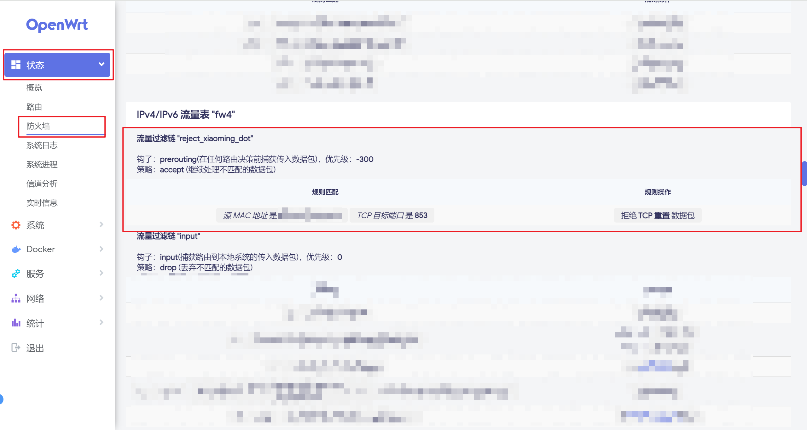

> 原文链接：https://blog.csdn.net/TeleostNaCl/article/details/156168664
> 发布时间：2025-12-22 22:39:45
> 标签：经验分享、智能路由器、tv、智能tv、电视盒子、智能电视

---

上篇文章详细介绍了通过抓包分析的过程，发现小明投影仪因为内置了 `DoT` 服务，通过阿里云的 `DNS` 服务去解析域名，从而导致无法解析本地域名，而无法使用域名连接 `SMB` 服务，并介绍如何通过 `OpenWrt` 的防火墙配置解决此问题：<https://blog.csdn.net/TeleostNaCl/article/details/156135648>

解决方案是通过 `OpenWrt` 防火墙，将小明投影仪的 `DoT` 流量拦截即可 。

但是，在 `OpenWrt` 防火墙是在 `forward` 链上进行拦截的，如果设备上有其他影响防火墙的插件，会导致以上防火墙规则不生效。因此本文在前文的基础上，补充使用 nftables 规则禁用小明投影仪内置 `DoT` 服务的流量。

首先，我们可以使用以下命令验证 nftables 是否可以生效。

```shell
# 1. 创建 table
nft add table inet filter

# 2. 创建 chain
nft add chain inet filter reject_xiaoming_dot { type filter hook prerouting priority -300 \; }

# 3. 针对 TCP 853 的 DoT 拒绝（MAC 匹配）
nft add rule inet filter reject_xiaoming_dot ether saddr ${mac地址} tcp dport 853 reject with tcp reset
```

验证通过之后，我们可以在 `/etc/nftables.d` 编写自动应用的 `nft` 规则文件 `10-reject-xiaoming-dot.nft`，内容如下：

```shell
chain reject_xiaoming_dot {
    type filter hook prerouting priority -300; policy accept;

    ether saddr ${mac地址} tcp dport 853 reject with tcp reset
}
```

我们可以在 `luci` > `状态` > `防火墙` 看到我们新增的一条规则，其在路由最早的 `prerouting`，以便及时的被拦截。


