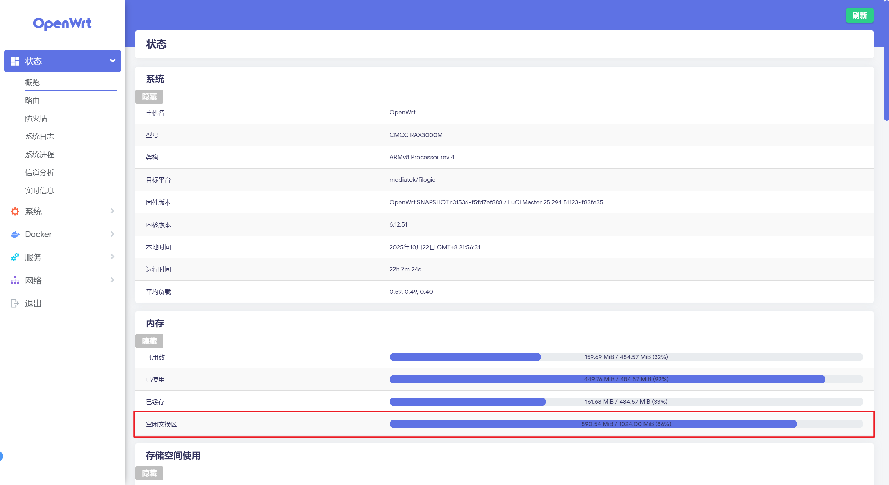
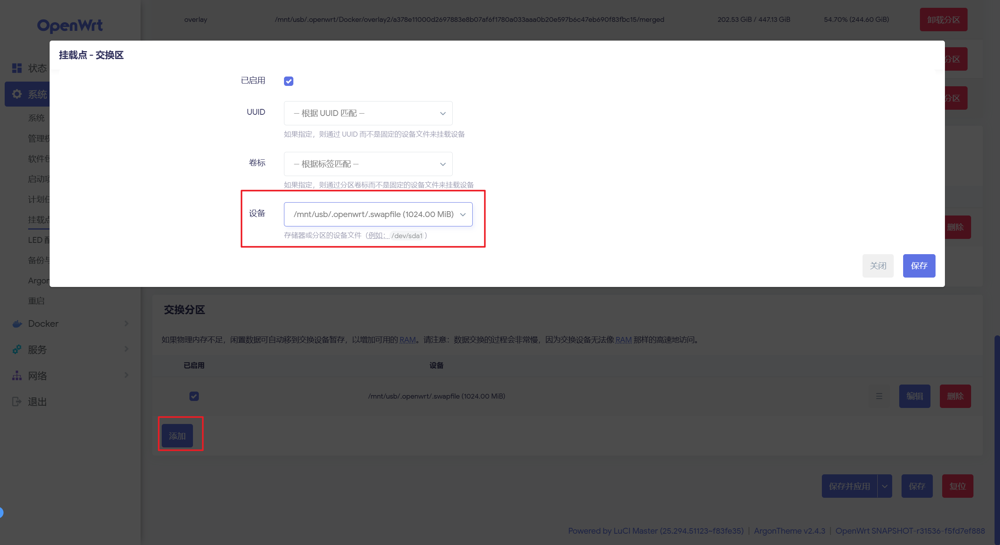

> 原文链接：https://blog.csdn.net/TeleostNaCl/article/details/153748969
> 发布时间：2025-10-22 22:12:58
> 标签：经验分享、智能路由器、linux

---

#### 文章目录

- [一、背景介绍](#_1)
- [二、创建 Swap](#_Swap_8)
- - [准备工作](#_11)
  - [方案一 创建一个文件作为 Swap](#__Swap_39)
  - [方案二 使用独立的分区作为 Swap](#__Swap_55)
- [三、 检查是否生效](#__66)
- [四、开机自动启用](#_77)
- [五、关闭 Swap](#_Swap_91)
- [六、调整 Swap 使用策略](#_Swap__97)

## 一、背景介绍

`Swap`（交换空间）也被称为 `虚拟内存`，是操作系统中的一种内存管理技术，可以从磁盘中开辟一片空间（可以是一个文件，也可以是一块分区）作为物理内存使用。由于 `RAM` 速度快，但价格较贵，通常内存较小，而 `Swap` 弥补了这一点，牺牲了速度而获取了将大的内存空间，增大系统的内存可用空间。比如 `Windows` 中的虚拟内存的设置。

因此，对于像 `OpenWrt` 这种嵌入式系统，对于物理内存来说一般都是较少的，执行一些复杂任务的时候，会出现内存不够的性能瓶颈，因此可以创建一个交换分区（Swap 大小一般是物理内存的1~2倍），增大系统的内存可用空间。

本文将详细介绍在 `OpenWrt` 系统中创建交换区 `swap` 的方法。

## 二、创建 Swap

创建 `Swap` 有两种方式，一种是使用独立的分区作为 `Swap`，另一种是创建一个文件作为 `Swap`，以下将详细介绍两种方法。

### 准备工作

一般来说，我们都会使用外挂磁盘的空间来作为 Swap 的空间，因此需要在编译 `OpenWrt` 时需要给 `内核` 勾选上对 `usb` 和 `文件系统`的相关的支持。

**usb 的模块有：**

```
kmod-usb3 kmod-usb-storage-uas usbutils block-mount mount-utils
```

各个模块所在的位置如下：

```
Kernel modules > USB Support > kmod-usb3
Kernel modules > USB Support > kmod-usb-storage-uas 
Utilities > usbutils
Base system > block-mount
Utilities > mount-utils
```

前两个是最基础的 `USB` 支持，后三个是用于自动挂载 `USB设备` 的工具。

> 此处推荐安装 `Utilities` > `Disc` > `fdisk` 工具，可用于查看和管理 `USB设备` 的分区信息。

**文件系统的模块有：**

```
kmod-fs-ext4 kmod-fs-exfat kmod-fs-ntfs3
```

其都是在 `Kernel modules > Filesystems` 下的。其中，  
 `kmod-fs-ext4`：`EXT4` 文件系统支持  
 `kmod-fs-exfat`：`exFAT` 和 `fat32` 文件系统支持  
 `kmod-fs-ntfs3`：`NTFS` 文件系统支持（ `Windows` 默认的文件系统）。也可以使用 `Utilities` > `Filesystem` > `ntfs-3g` 启用 `NTFS` 文件系统支持  
 如果有其它文件系统格式，则勾选编译安装其他相关的驱动。

### 方案一 创建一个文件作为 Swap

我们需要先创建一个空文件作为 `Swap` 空间的文件，我们可以使用以下命令创建空文件，其中 `swapfile` 应替换为 `Swap` 文件所在的位置：

```bash
# 创建一个 512MB 的 swap 文件（根据需求调整大小）
dd if=/dev/zero of=swapfile bs=1M count=512
```

随后我们格式化文件为 `swap`：

```bash
mkswap swapfile
```

最后我们启用此 `Swap`（如果 `Swap` 较大时，此过程可能较长）：

```bash
swapon swapfile
```

### 方案二 使用独立的分区作为 Swap

对于分区的方案来说，步骤是一样，首先需要提前将磁盘分一个特定的分区用来作为`swap`，随后使用如下命令将分区格式化为 `Swap`，其中 `/dev/sda1` 应修改为指定的分区：

```bash
#把/dev/sda1建立为swap交换分区
mkswap /dev/sda1
```

使用如下命令启用此 `Swap`

```bash
swapon /dev/sda1
```

## 三、 检查是否生效

我们可以使用 `free -m` 查看 `swap` 分区是否生效，如下所示:

```bash
root@OpenWrt:~# free -h
              total        used        free      shared  buff/cache   available
Mem:         496204      295004       36968         444      164232      147824
Swap:       1048572      134924      913648
```

在 `luci` 管理界面的 `状态` > `概览` > `内存` > `空闲交换区` 也可以查看 `Swap` 的使用量：  
 

## 四、开机自动启用

在第二步使用 `swapon swapfile` 命令只是在本次系统运行其中启用此 `Swap`，如果系统重启之后就无效了。因此为了使下次还能使用 `Swap`，我们需要设置开机自动启用。

我们可以在 `/etc/rc.local` 文件里，在 `exit 0` 之前添加以下语句，即可在开机自启的时候自动挂载。

```shell
swapon swapfile
```

---

同时我们在编译系统的时候添加了 `block-mount` 模块，因此我们也可以在 `luci` > `系统` > `挂载点` > `交换分区` 中，添加新的交换分区，然后在设备里填写 `swap` 的路径



## 五、关闭 Swap

使用如下命令可以关闭掉指定的 `Swap`

```
swapoff swapfile
```

## 六、调整 Swap 使用策略

`swappiness` 是一个可调节的内核参数，用于控制系统使用 `Swap` 的积极程度，取值从`0~100`，取值越大使用 `Swap` 越积极，默认值一般是 `60` 。

使用如下命令可以临时调整 `Swap` 的积极度：

```bash
echo 10 > /proc/sys/vm/swappiness
```

而可以在在 `/etc/sysctl.conf` 文件 或者在 `/etc/sysctl.conf.d` 文件夹创建新文件 `10-swap.conf`，添加以下语句，永久调整 `Swap` 的积极度：

```conf
vm.swappiness=10
```
