> 原文链接：https://blog.csdn.net/TeleostNaCl/article/details/151333736
> 发布时间：2025-09-08 22:32:56
> 标签：经验分享、智能路由器、网络、ip

---

#### 文章目录

- [一、WAN 口配置](#WAN__3)
- [二、LAN 口配置](#LAN__24)
- [三、IPv6 测试](#IPv6__53)

本文将详细介绍 **将光猫的网络模式改成桥接之后使用路由器拨号的上网方式**的情况下，在 `OpenWrt` 上使用 `PPP` 拨号模式上网时，启用 `IPv6` 功能的方法。

## 一、WAN 口配置

首先，我们需要在 `网络` > `接口` > `WAN` > `编辑`，打开 `WAN` 口配置。

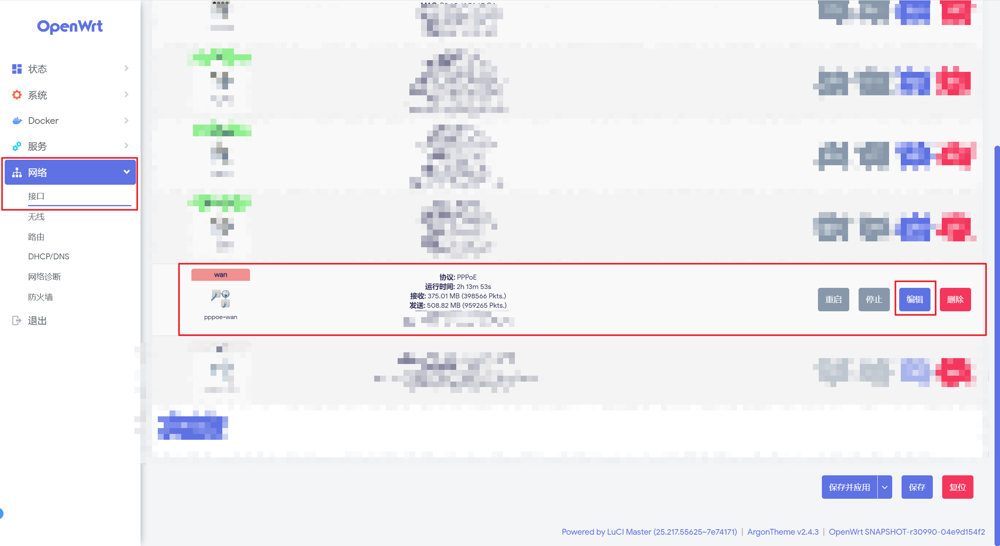

随后，点击 `高级设置` ：

- 将 `获取 IPv6 地址` 设置为 `自动`
- 勾选 `IPv6 源路由`，勾选 `委托 IPv6 前缀`
- `IPv6 分配长度` 设置为 `已禁用`
- 其余保持默认

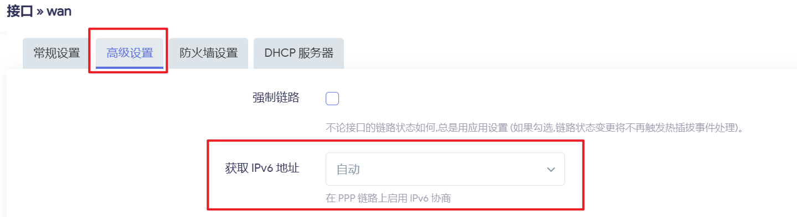  
 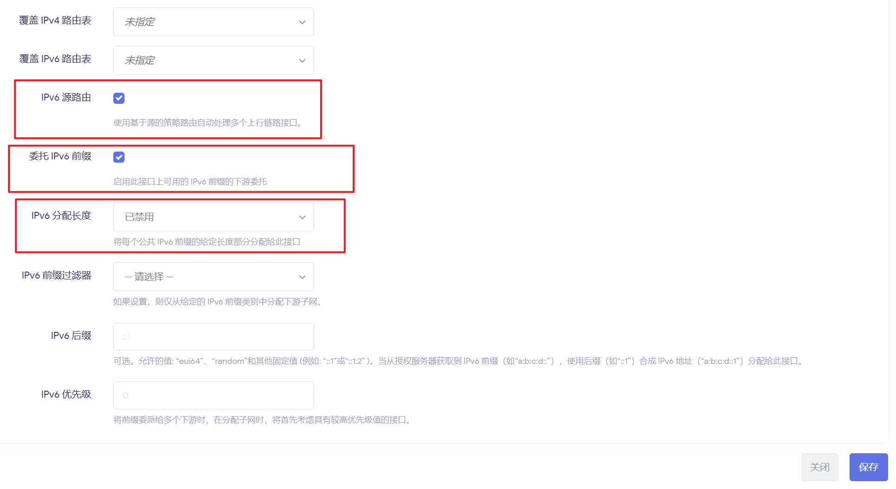

随后，切到 `DHCP 服务器` > `IPv6 设置`，将 `RA 服务`，`DHCPv6 服务`，`NDP 代理` 都设置为 `已禁用`，使 `WAN` 口不会获取到 `IPv6` 地址  
 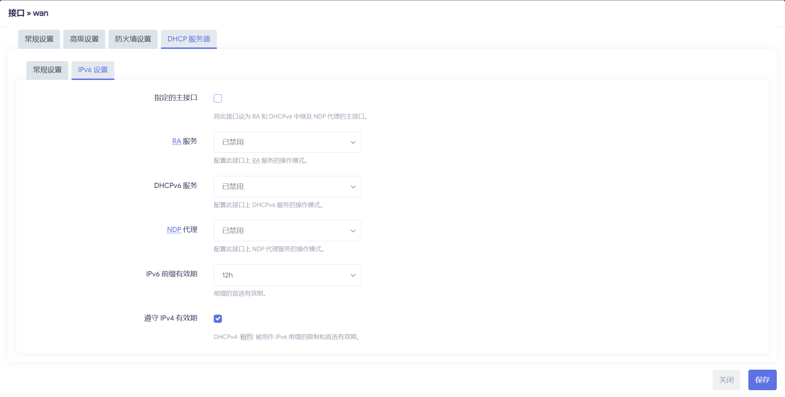

点击保存即可，待 `WAN` 口重启之后，此时会多一个 `虚拟动态接口 (DHCPv6 客户端)`，并成功获取到 `IPv6` 的公网地址。

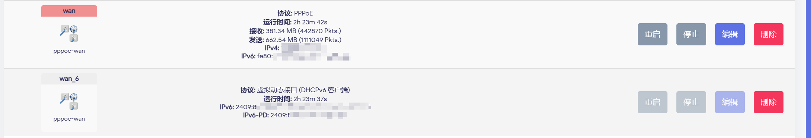

## 二、LAN 口配置

首先，我们需要在 `网络` > `接口` > `LAN` > `编辑`，打开 `LAN` 口配置。

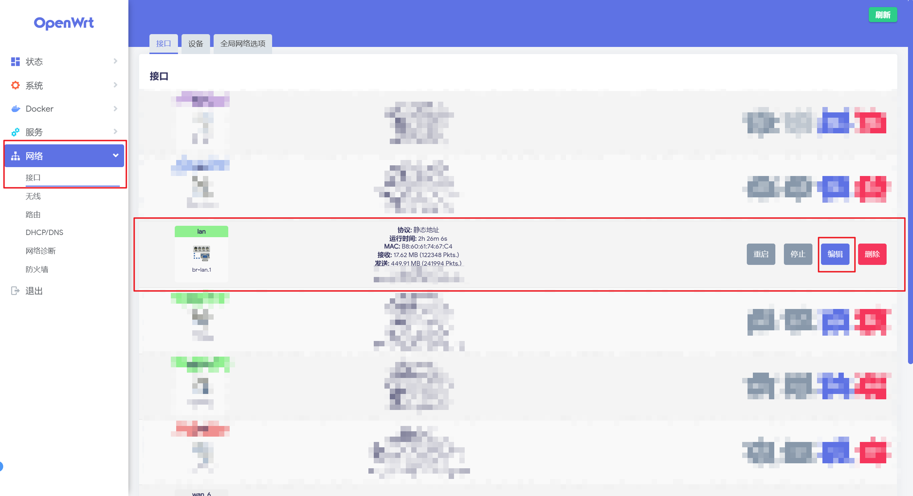

随后，点击 `高级设置`：

- 取消勾选 `委托 IPv6 前缀`
- `IPv6 分配长度` 设置为 `64`
- `IPv6 前缀过滤器` 选择与 `WAN` 口有关的 `wan_6`  
   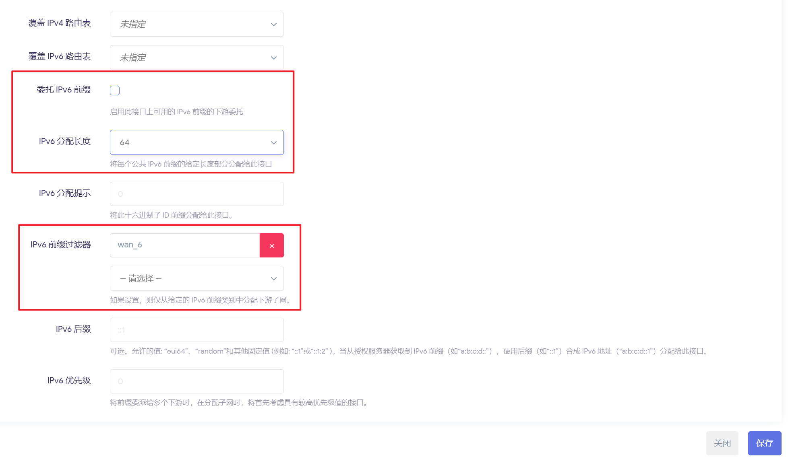

然后，切换到 `DHCP 服务器` > `IPv6 设置`：

- 将 `RA 服务` 和 `DHCPv6 服务` 设置 `服务器模式`
- `NDP 代理` 设置为已禁用
- 其它按需设置即可

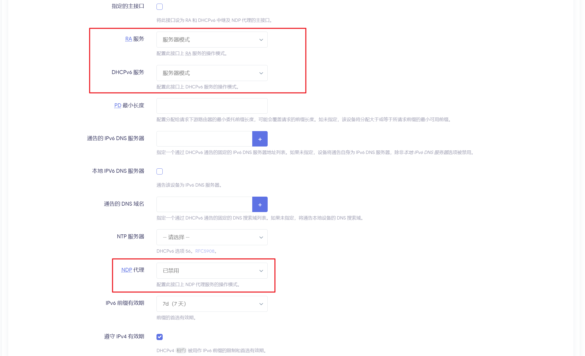

随后，切换到 `IPv6 RA设置` ：

- 将 `默认路由器` 设置为 `自动`
- 勾选 `启用SLAAC`
- `RA 标记` 勾选 `受管配置 (M)` 和 `其他配置 (O)`
- 其余按需配置

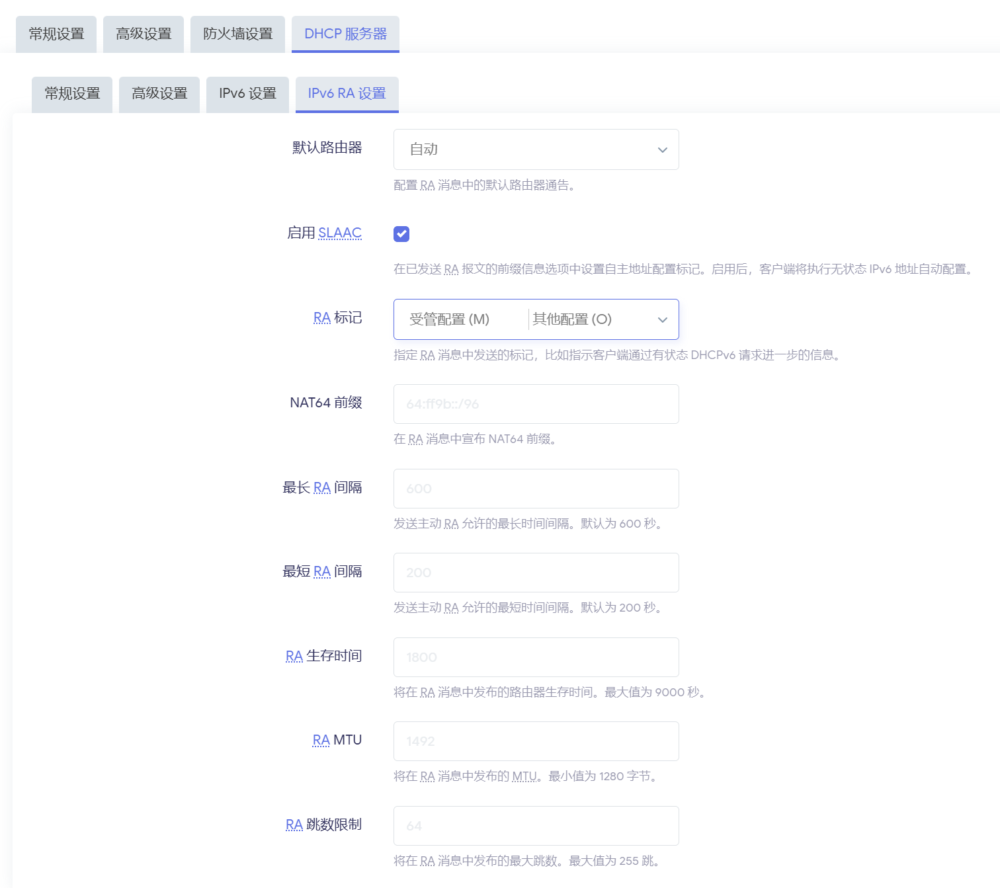

此时 LAN 口上即可获取到 公网 `IPV6` 地址。  
 

## 三、IPv6 测试

按照以上方式配置之后，连接到 `LAN` 接口的设备也可以被分配到公网IPv6

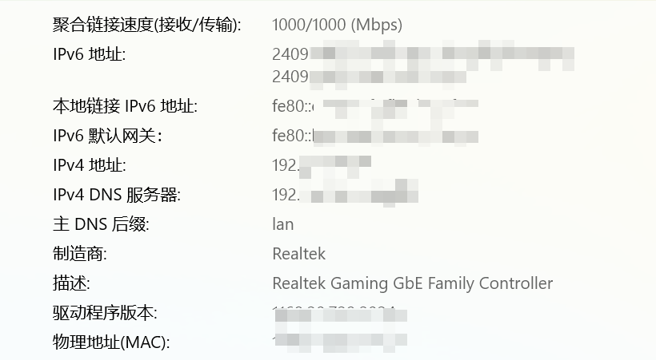  
 同时可以使用以下地址检测 `IPv6` 是否可以连通：

- <https://test-ipv6.com/index.html>
- <https://test-ipv6.csclub.uwaterloo.ca/index.html>
- <https://www.kame.net/>
- [https://test6.ustc.edu.cn](https://test6.ustc.edu.cn/)

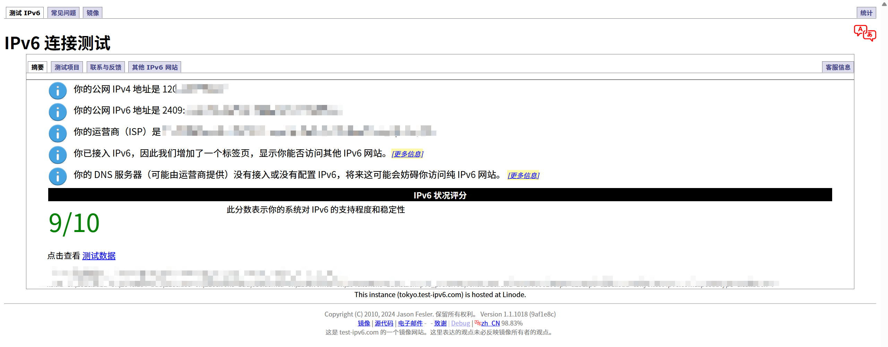
