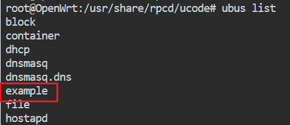
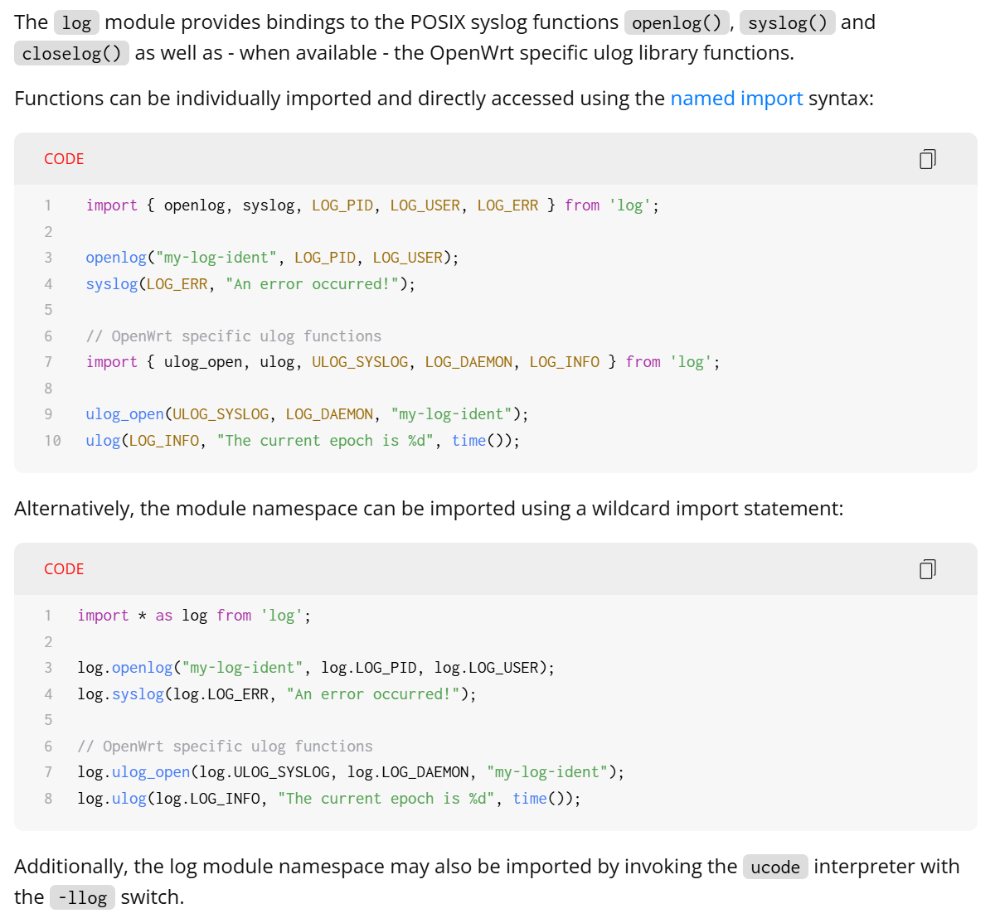
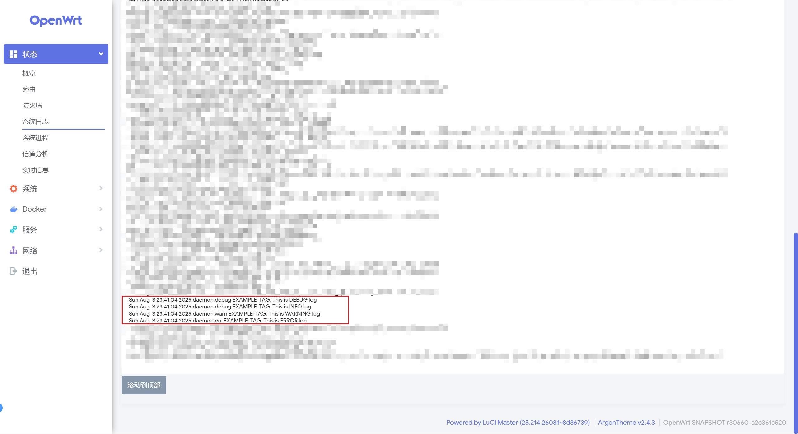

> 原文链接：https://blog.csdn.net/TeleostNaCl/article/details/149887517
> 发布时间：2025-08-03 23:44:16
> 标签：经验分享、智能路由器、网络、ucode、lua

---

#### 文章目录

- [一、问题背景](#_1)
- [二、实现方法](#_39)

## 一、问题背景

`OpenWrt` 的 `ucode` 是一种轻量级脚本语言，专为嵌入式系统和 `OpenWrt` 环境设计。它的语法类似于 `JavaScript`，并提供了丰富的内置功能，使其适用于系统配置、`Web` 开发（如 `LuCI` 界面）以及嵌入式脚本任务。

例如一段标准的 `ucode` 脚本示例如下：

```lua
'use strict';

let ubus = require('ubus').connect();

// 返回一个方法列表
return {
    // 定义一个 ubus 对象名
    example: {
        // 定义一个方法
        method: {
            call: function() {
			    return { message: "Hello World" };
		    }
        }
    }
}
```

需要将此脚本放到 `OpenWrt` 系统的 `/usr/share/rpcd/ucode` 文件夹下，随后使用以下命令重启 `rpcd` 服务

```bash
/etc/init.d/rpcd restart
```

此时所编写的 `example` 服务即被注册进了 `ubus` 中，通过命令 `ucode list` 可以看到刚刚新建的 `example`



随后使用 `ubus call example method` 调用刚刚新增的方法，即可得到 `Hello World` 的输出


那么我们在编辑相关 `ucode` 脚本时，我们希望有日志打印，知道我们程序的运行状态，方便我们的调试，因此本文将详细介绍如何在 `ucode` 脚本中添加日志打印的方法。

## 二、实现方法

参考：

- System logging functions: [https://ucode.mein.io/module-log.html](https://ucode.mein.io/module-log.htm)
- OpenWrt Ucode Example： <https://github.com/openwrt/rpcd/blob/master/examples/ucode/example-plugin>
- OpenWrt ubus：<https://openwrt.org/docs/techref/ubus>

首先，从 [System logging functions](https://ucode.mein.io/module-log.html) 中的介绍可以知道，只要导入 `log` 包，调用 `log.ulog(LOG_INFO, "Log message");` 即可打印日志，此时日志将输出到 `OpenWrt` 的日志中。  
 

同时，使用 `ulog_open(ULOG_SYSLOG, LOG_DAEMON, "LOG TAG");` 可以修改此脚本的打印的 `TAG`，方便在日志中筛选，例如有如下代码，分别打印四种级别的日志：

```lua
'use strict';

// 导入日志包
import * as log from 'log';

let ubus = require('ubus').connect();

return {
    example: {
        method: {
            call: function() {
                // 修改日志打印的TAG 为 EXAMPLE-TAG
                log.ulog_open(log.ULOG_SYSLOG, log.LOG_DAEMON, "EXAMPLE-TAG");

                // 打印 DEBUG 级别的日志
                log.ulog(log.LOG_DEBUG, "This is DEBUG log");
                // 打印 INFO 级别的日志
                log.ulog(log.LOG_INFO, "This is INFO log");
                // 打印 WARNING 级别的日志
                log.ulog(log.LOG_WARNING, "This is WARNING log");
                // 打印 ERROR 级别的日志
                log.ulog(log.LOG_ERR, "This is ERROR log");

                // 当调用了 ulog_open 需要调用 ulog_close, 还原系统日志的配置, 避免前面设置的 TAG 影响到其他日志打印
                log.ulog_close();
                
                return { message: "Hello World" };
		    }
        }
    }
}
```

此时重启 `rpcd` 服务，执行定义的 ucode 方法，在系统日志中即可以看到相关的日志打印。  
 
