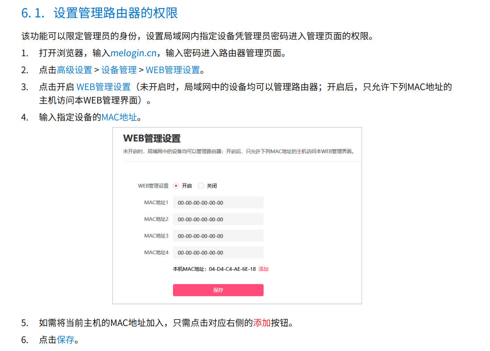
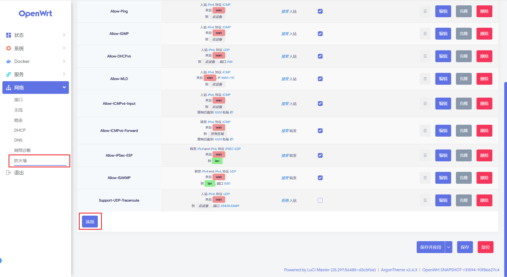
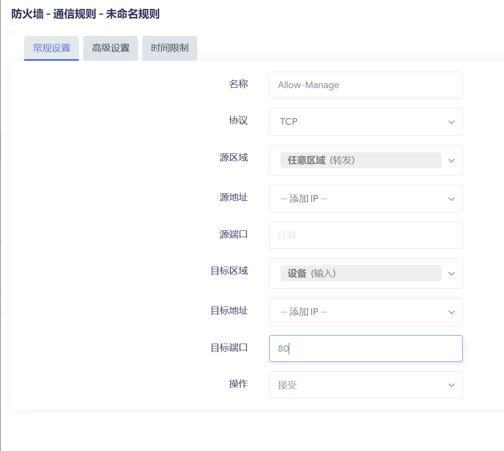
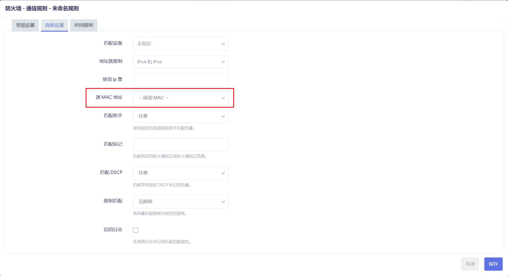
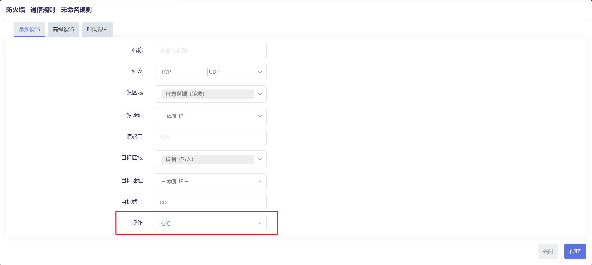

> 原文链接：https://blog.csdn.net/TeleostNaCl/article/details/153922409
> 发布时间：2025-10-26 14:55:30
> 标签：ssh、智能路由器、网络、经验分享

---

#### 文章目录

- [一、问题背景](#_1)
- [二、实现方法](#_10)
- - [（一）添加允许管理的设备规则](#_22)
  - [（二）添加禁止管理的规则](#_36)

## 一、问题背景

一般家用路由器都有一个叫 `WEB 管理设置`，可以限制管理员身份，只有指定的的设备从具有访问路由器管理地址和管理路由器的权限，这样极大提高了路由器的管理安全。

例如水星路由器有如下管理设置（参考 [水星双频千兆无线路由器详细配置指南.pdf](https://service.mercurycom.com.cn/download/202012/%E6%B0%B4%E6%98%9F%E5%8F%8C%E9%A2%91%E5%8D%83%E5%85%86%E6%97%A0%E7%BA%BF%E8%B7%AF%E7%94%B1%E5%99%A8%E8%AF%A6%E7%BB%86%E9%85%8D%E7%BD%AE%E6%8C%87%E5%8D%97%201.0.0.pdf)）：

但是，截至目前为止，`OpenWrt` 官方的 `package` 里面没有可以直接实现类型此功能的包，因此本文将介绍使用防火墙的方式，通过增加规则来实现限制只有指定设备才能访问 luci 和 使用 SSH 等方式管理设备的方法。

## 二、实现方法

对于 `luci` 来说，其实是 `OpenWrt` 提供了一个 `80` 端口的网络服务，在浏览器输入`OpenWrt` 的管理员地址的时候，即访问的是 `80` 端口的网络服务。因此，为了实现类似的效果，只要在防火墙配置成只允许指定设备的 `IP` 或者 `Mac` 地址才能访问 `80` 端口即可。

对于其它管理服务，例如 `SSH` 一般是 `80` 端口，`HTTPS` 的 `luci` 则是 `443`，也是采用相同的方法。

防火墙配置方法如下：  
 首先，点击 `luci` > `网络` > `防火墙` > `通信规则` > `添加`，新建一个防火墙规则。

> ！！！注意：先使用非 `luci` 管理的端口进行测试，例如 `SSH` 的 `22` 端口，然后测试成功之后，再添加 `luci` 管理的端口，**可避免因配置错误而无法再修改防火墙规则。**

### （一）添加允许管理的设备规则

为了保证设备进行管理，首先需要增加允许管理设备的规则，按以下方式配置：

- `协议`：根据管理方式所需要协议，勾选指定协议，一般选择 `TCP`
- `源区域`：选择 `任意区域(转发)`
- `目标端口`：根据管理方式所需要的端口进行填写，多个端口用空格隔开，例如：`80 443 22`
- `操作`：选择 `接受`

根据不同方式来设置允许管理的设备，比如使用限制 `IP` 的方式，则在常规设置的 `源地址` 里面添加指定的 `IP`。  
 而如果是使用 `mac` 地址的方式，则在 `高级设置` 中的 `源 MAC 地址` 中添加 `MAC` 地址。

### （二）添加禁止管理的规则

在上一步的 `允许管理的设备规则` 添加完成之后，则添加禁用所有设备的对指定端口的访问。

设置方式同上，这里只需要把 `操作` 修改为禁用即可，其它保持相同，同事不需要配置 `源地址` 和 `源 MAC 地址`

配置完成之后，此时会两个配置规则，一个 `接受入站`，另一个 `拒绝入站`，同时 `接受入站` 的规则要在 `拒绝入站` 前面，此时应用之后即可完成配置。

