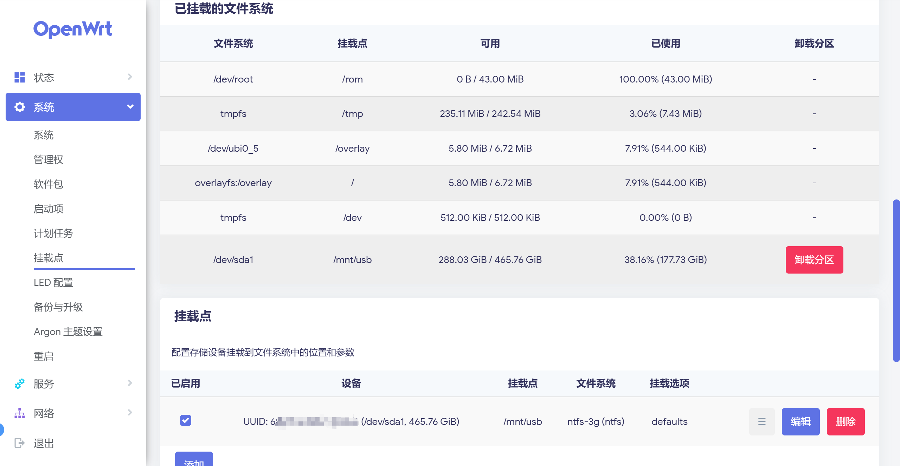
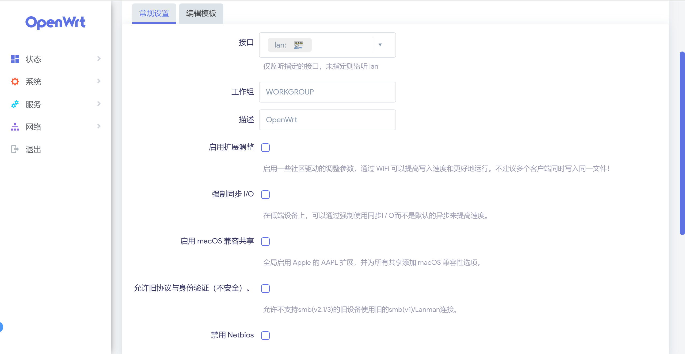
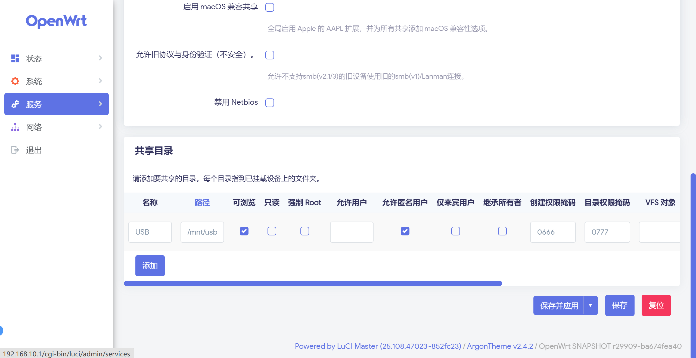
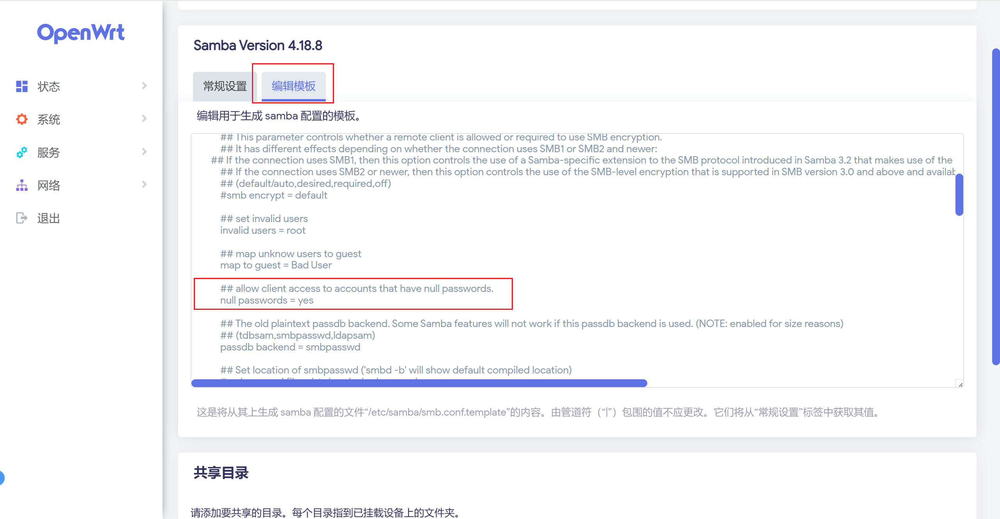
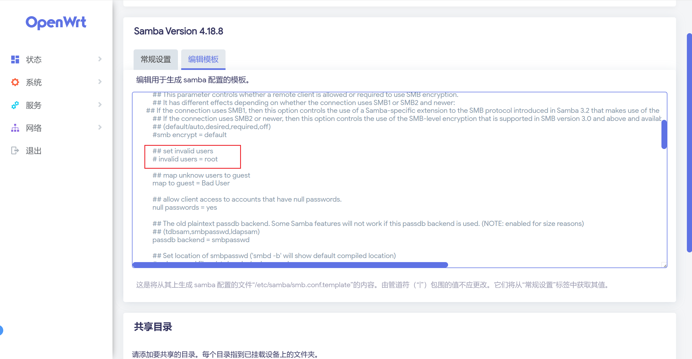
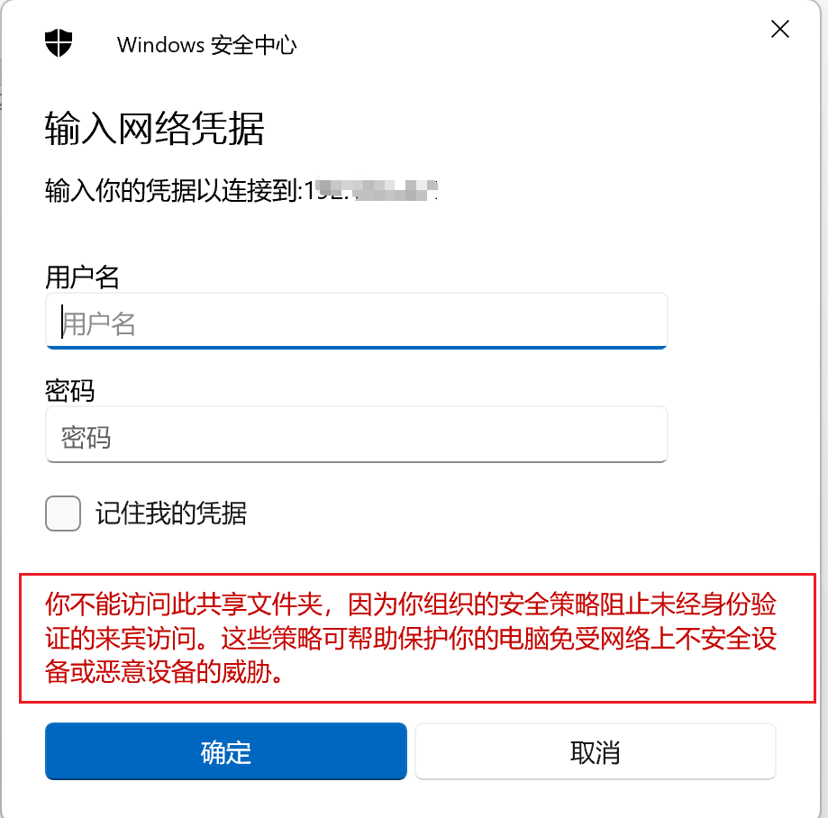
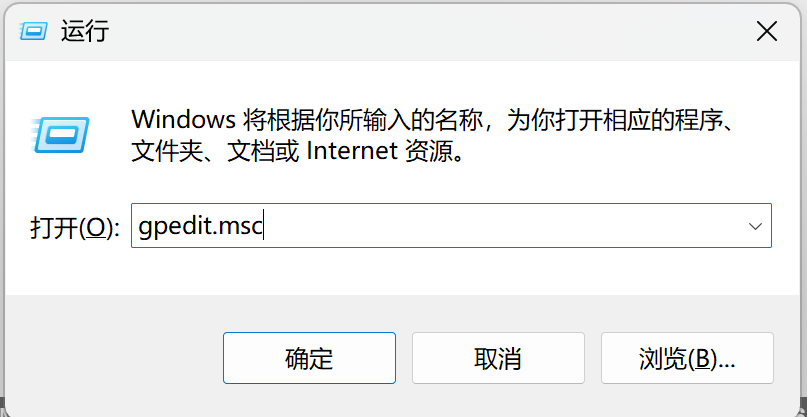
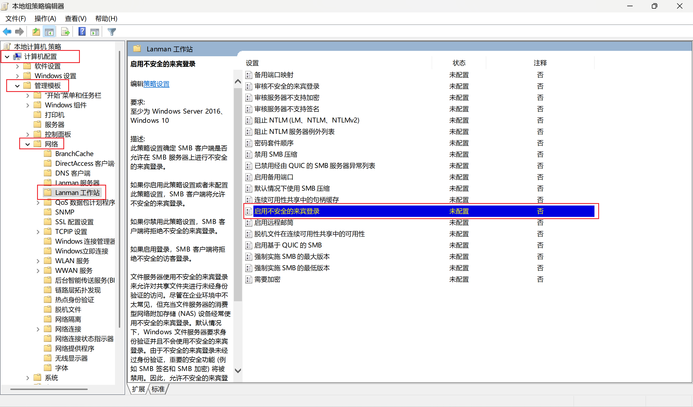

@[TOC]
## 一、安装所需要的软件
首先 `OpenWrt` 的官方文档出详细介绍了在 `OpenWrt` 搭建 `Samba` 服务器的方法：[https://openwrt.org/docs/guide-user/services/nas/cifs.server](https://openwrt.org/docs/guide-user/services/nas/cifs.server)

首先，在编译的时候，需要给 `内核` 勾选上对 `usb` 和 `文件系统`的相关的支持。

**usb 的模块有：**
```
kmod-usb3 kmod-usb-storage-uas usbutils block-mount mount-utils
```
各个模块所在的位置如下：
```
Kernel modules > USB Support > kmod-usb3
Kernel modules > USB Support > kmod-usb-storage-uas 
Utilities > usbutils
Base system > block-mount
Utilities > mount-utils
```
前两个是最基础的 `USB` 支持，后三个是用于自动挂载 `USB设备` 的工具。
>此处推荐安装 `Utilities` > `Disc` > `fdisk` 工具，可用于查看和管理 `USB设备` 的分区信息。

**文件系统的模块有：**
```
kmod-fs-ext4 kmod-fs-exfat kmod-fs-ntfs3
```
其都是在 `Kernel modules > Filesystems` 下的。其中，
`kmod-fs-ext4`：`EXT4` 文件系统支持
`kmod-fs-exfat`：`exFAT` 和 `fat32` 文件系统支持
`kmod-fs-ntfs3`：`NTFS` 文件系统支持（ `Windows` 默认的文件系统）。也可以使用 `Utilities` > `Filesystem` > `ntfs-3g`  启用 `NTFS` 文件系统支持
如果有其它文件系统格式，则勾选编译安装其他相关的驱动。

最后，勾选安装 `luci-app-samba4` 的 `Luci` 应用，运行 `samba4`。
## 二、配置自动挂载
由于在 `Linux` 中每个磁盘和分区都需要通过挂载的方式，才能正确的识别，因此我们接入一个 `u盘` 之后就需要配置一下，在系统中分配路径。
> 为了方便在 `OpenWrt` 中挂载，建议在电脑上提前对硬盘进行分区。

由于我们在前面已经安装了 `block-mount` 工具，那么其可以为我们自动识别文件系统的格式和路径，然后自动为我们把硬盘挂载到 /mnt 目录。此工具在后台管理中位置为 `系统` > `挂载点` ：

当我们将 `USB设备` 接入之后，点击 `挂载点` 页面中 `生成配置` ，在点击 `挂载已连接的设备`，此时就会自动将系统支持的文件系统挂载到了 `/mnt` 目录下了。注意：生成的配置需要点击保存之后才能永久生效

此时就可以在 `挂载点` 中看到接入的 `USB设备` 了。可点击`编辑` ，实现修改它的挂载参数。

> 如果自动挂载找不到自己的硬盘或者分区，需要检查在第一步是否在内核中安装了相关文件系统的支持。

## 三、配置 Samba 服务器
在 `Luci 管理页面` 中 打开 `服务` > `网络共享` 界面进行配置`Samba` 服务器。

对于常规设置来说，只需要按需启用即可，不会影响整体功能。

随后在 `共享目录` 添加硬盘的挂载路径，进行配置共享硬盘。

如果计划无需登录即可使用，则可以勾选 `允许匿名用户`，否则对于设备访问来说就需要输入用户名和密码。

## 四、配置 Samba 访问用户和密码（可选）
这一步是可选的，对于家庭 `Samba` 来说，如果能确保数据安全，则可以直接勾选 `允许匿名用户`，无需配置用户和密码。但是，在某些设备上，处于安全性考虑，是不允许 `匿名访问` 模式，例如Windows，默认不启用 `匿名访问`，但可在策略组修改这一行为（后文介绍）。

### 新建 Samba 专门的用户

`samba` 使用的用户名即为系统中的用户名，但为了保证系统的安全，`samba` 中使用的密码和管理员密码就不相同的，需要分别独立设置。

首先可以使用 `useradd` 命令添加一个 `samba` 的专门用户，如果没有 `useradd` 命令，则需要先安装 `shadow-useradd`应用。为了保证数据安全，此用户无目录和禁止登陆 `shell`。
```shell
# 创建用户（无家目录，禁止登录）
useradd -M -s /bin/false smbuser  
```
随后可以使用 `smbpasswd ` 命令设置Samba 密码，随后输入两次相同的密码即可
```shell
 # 设置 Samba 密码
smbpasswd -a smbuser
```
至此就完成了添加 samba 专门的账户，在客户端登录时，使用此用户名和密码即可。

### 添加无密码的 Samba 账户
`Samba` 支持无密码的用户，只需要在设置密码的时候，不输入任何字符，连续按两次回车即可。
同时，需要确保在 `samba 配置的模板` 中有 `null passwords = yes` 的配置项

### 使用root账户
处于安全考虑，`Samba` 默认不会使用 `root` 用户，如果需要启用，则需要在模板代码中，`invalid users` 配置项中不包含`root`，或直接注释掉此配置项。

## 五、解决 Windows 无法匿名访问Samba
出于安全考虑，`Windows` 默认屏蔽了 `匿名访问` 的能力，此时会提示：你不能访问此共享文件夹 因为你组织的安全策略阻正止未经身份验证的来宾访。 这些策略可帮助保护你的电脑免受网络上不安全设备或恶意设备的威胁。这里可能会出现0x80004005的错误

这里给出两个解决方案。

 ### 方案一 配置无密码的Samba账户并启用匿名访问
 为了避免 `Windows` 无法匿名访问，我们可以专门为 `Samba` 建立一个无密码的账户，在 `Windows` 登录时使用此用户名进行登录即可。同时在 `Samba` 配置时也 `启用匿名访问`，其他设备则可以直接匿名访问，而无需输入用户名和密码。
### 方案二 在本地组策略组编辑器中启用不安全来宾登录
对于 专业版 或 企业版 的 `Windows` 来说，其支持管理组策略（`Win` + `R` 中输入 `gpedit.msc` 打开 `本地组策略组编辑器`），因此可以 `启用不安全来宾登录`

其位置在 `计算机配置` > `管理模板` > `网络` > `Lanman工作站` > `启用不安全来宾登录`，将其修改为 `已启用` 即可。


但是此方法有明显的缺陷，就是对于家庭版的 `Windows` 来说不能直接修改策略组，同时如果有多台设备，就需要配置多次，因此建议使用方案一来解决 `Windows` 不能 `匿名访问` 的问题
