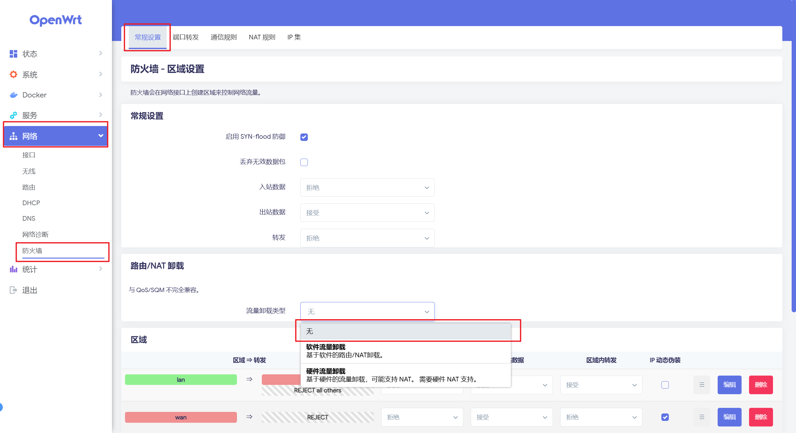

> 原文链接：https://blog.csdn.net/TeleostNaCl/article/details/154962599
> 发布时间：2025-11-18 00:03:23
> 标签：经验分享、智能路由器

---

我们可以使用 `luci-app-statistics` 详细统计路由器上的流量使用情况，具体可参考：<https://blog.csdn.net/TeleostNaCl/article/details/154961719>

但是在使用了一段时间后发现，`wifi` 到 `wan` 口的流量一直无法被统计到，包括 `ifconfig` 也无法统计。经过排查发现是因为 `网络加速` 功能导致的，例如 `路由/NAT 卸载` 或 `硬件流量卸载`。

我们知道，`ifconfig` 只能统计到软件层的流量，而当设备启用 `流量卸载` 功能之后，会由专门的硬件去处理流量路径，从而导致流量不经过软件层，无法被统计到。

因此，为了可以使用 `luci-app-statistics` 统计到 `wifi` 和 `wan` 口之间的流量，我们需要关闭 `网络加速` 和 `流量卸载` 的功能：  
 将 `luci` > `网络` > `常规设置` > `流量卸载类型` 设置为 `无` 即可。

从实测的结果来看，流量卸载类型无论是选择 `软件流量卸载` 还是 `硬件流量卸载`，都无法统计到流量，因此这里只能设置成无。

另外，我自己的设备是 `CMCC RAX3000M`，将流量卸载功能关闭之后，没有明显感觉到有性能劣化，都可以跑满 `1000M` 的宽带。

不过这里仍需要测试，看关掉此功能对设备性能的影响。
