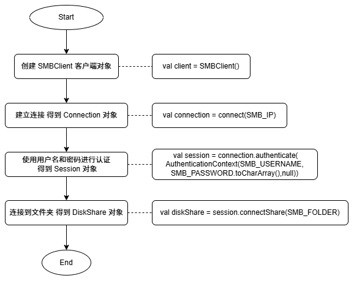
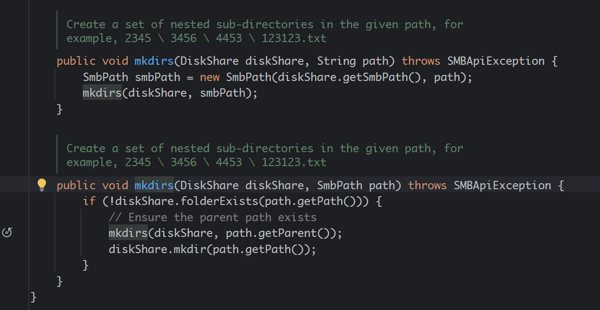
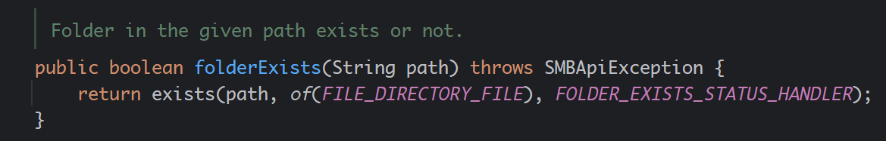
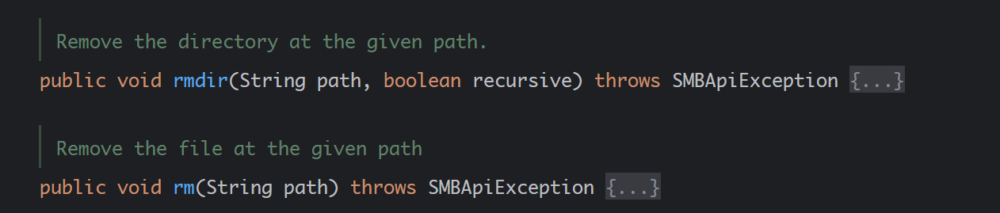
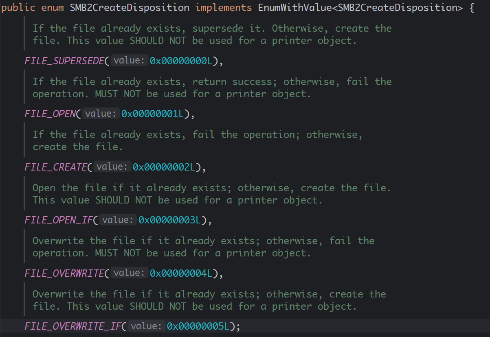
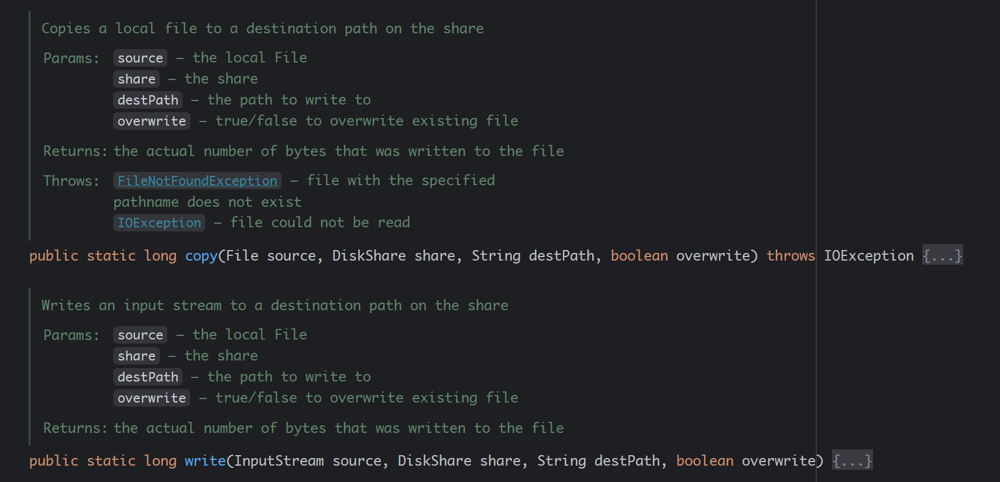

> 原文链接：https://blog.csdn.net/TeleostNaCl/article/details/151998648
> 发布时间：2025-09-23 16:04:59
> 标签：java、android、服务器、kotlin、经验分享、运维

---

#### 文章目录

- [一、问题背景](#_1)
- [二、依赖导入](#_4)
- [三、连接到 SMB](#_SMB_32)
- [四、文件夹创建](#_70)
- [五、删除文件/文件夹](#_86)
- [六、上传文件](#_102)
- [七、Proguard 混淆规则](#Proguard__153)

## 一、问题背景

当我们在 `Java` 程序 或 `Android` 程序中，需要使用 `SMB` 的客户端连接 `SMB` 服务器进行上传和下载文件的时候，我们可以使用优秀的开源库 `hierynomus/smbj`：<https://github.com/hierynomus/smbj>，其是专门为 `Java` 实现的 `SMB2/SMB3` 客户端库。其具有 `API` 简单清晰，使用方便的特点，本文将简单介绍其使用方法，实现文件/文件夹的上传、删除 等文件操作。

## 二、依赖导入

首先，我们需要在自己的项目中导入 `SMBJ` 的相关依赖

```groovy
dependencies {
    implementation 'com.hierynomus:smbj:0.14.0'
}
```

同时，在 `Android` 编译环境中，需要解决 `META-INF/versions/9/OSGI-INF/MANIFEST.MF` 文件冲突的问题，否则会报如下错误：

```shell
> A failure occurred while executing com.android.build.gradle.internal.tasks.MergeJavaResWorkAction
   > 2 files found with path 'META-INF/versions/9/OSGI-INF/MANIFEST.MF' from inputs:
      - org.bouncycastle:bcprov-jdk18on:1.79/bcprov-jdk18on-1.79.jar
      - org.jspecify:jspecify:1.0.0/jspecify-1.0.0.jar
     Adding a packaging block may help, please refer to
     https://developer.android.com/reference/tools/gradle-api/com/android/build/api/dsl/Packaging
     for more information
```

在 `app` 模块下的 `build.gradle` 文件的 `android` 包络中添加以下代码：

```groovy
android {
	packagingOptions {
        pickFirst 'META-INF/versions/9/OSGI-INF/MANIFEST.MF'
    }
}
```

## 三、连接到 SMB

`SMBJ` 对于文件的操作都是基于 `com.hierynomus.smbj.share.DiskShare`，因此我们需要先创建出 `DiskShare` 对象，

- 在创建 `DiskShare` 对象，需要 `com.hierynomus.smbj.session.Session` 对象通过 `connectShare()` 方法连接到 `SMB` 的路径，
- 而 `Session` 对象是通过 `com.hierynomus.smbj.connection.Connection` 对象通过 `authenticate` 方法进行认证得到连接，
- 最后 `Connection` 对象是通过 `com.hierynomus.smbj.SMBClient` 对象通过 `connect` 方法 连接到 `SMB` 服务器。

因此，连接的时序图如下：  
   
 核心代码如下：

```kt
// SMB 客户端对象
var client: SMBClient? 
// 文件操作对象，对应SMB的服务器的根目录
var diskShare: DiskShare?
try {
    client = SMBClient().apply {
        // 建立连接
        val connection = connect(SMB_IP)
        // 进行认证
        val session = connection.authenticate(AuthenticationContext(SMB_USERNAME,SMB_PASSWORD.toCharArray(),null))
        // 打开服务器的的根目录
        diskShare = session.connectShare(SMB_FOLDER) as? DiskShare
    }
} catch (e: Exception) {
	// 如果有异常 需要关闭 SMB 客户端对象
    client?.close()
}
```

这里有三个常量需要定义：

- `SMB_IP`：`SMB` 服务器的地址
- `SMB_USERNAME`：`SMB` 服务器登录用户名
- `SMB_PASSWORD`：`SMB` 服务器登录密码
- `SMB_FOLDER`：`SMB` 服务器的根目录

如果是通过匿名连接，则可以使用 `AuthenticationContext.anonymous()` 和 `AuthenticationContext.guest()` 进行认证。

通过以上方法可以得到 `DiskShare` 对象进行操作文件。

## 四、文件夹创建

如果我们需要在 `SMB` 服务器创建一个新文件，则可以使用 `com.hierynomus.smbj.utils.SmbFiles.mkdirs()` 方法进行创建，同时此方法会递归创建父文件夹，保证父文件夹存在，文件夹可以创建成功。同时，如果创建失败，会抛出异常，只需要捕获此异常即可知道是创建失败，因此可以使用以下方法创建文件夹

```kt
var result = false
try {
    SmbFiles().mkdirs(diskShare, path)
    result = true
} catch (e: Exception) {
    result = false
}
```

这里的 `path` 是相对于 `SMB` 服务器的根目录地址，API文档如下：  
   
 之后，我们可以使用 `DiskShare.folderExists()` 方法检查文件夹是否存在  
 

## 五、删除文件/文件夹

`SMBJ` 提供了两个方便的 `API` 进行删除文件和删除文件夹：

- `DiskShare.rm()` 删除文件
- `DiskShare.rmdir()` 删除文件夹

我们可以使用 `DiskShare.fileExists()` 和 `DiskShare.folderExists()` 来检测需要删除的是文件还是文件夹，调用不同的 `API` 进行删除：

```kt
if (diskshare.folderExists(path)) {
    diskshare.rmdir(path, true)
} else if (diskshare.fileExists(path)) {
    diskshare.rm(path)
}
```

这里的 `path` 是相对于 `SMB` 服务器的根目录地址，API文档如下：  
 

## 六、上传文件

文件上传有多种方法，但所有的方法的第一步是需要打开远端的文件，在打开文件的时候，可以传递不同的参数以实现不同的需求：

```kt
val file = diskShare.openFile(remotePath, EnumSet.of(AccessMask.GENERIC_WRITE), null,  EnumSet.of(SMB2ShareAccess.FILE_SHARE_WRITE), SMB2CreateDisposition.FILE_CREATE, null)
```

此方法的前面如下：

```java
public File openFile(String path, Set<AccessMask> accessMask, Set<FileAttributes> attributes, Set<SMB2ShareAccess> shareAccesses, SMB2CreateDisposition createDisposition, Set<SMB2CreateOptions> createOptions) {}
```

- `path` 是相对于 `SMB` 服务器的根目录地址
- `accessMask` 是用于控制文件的访问权限，默认传递 `EnumSet.of(AccessMask.GENERIC_WRITE)`
- `attributes` 是文件的属性值，可以传空
- `shareAccesses` 是操作类型，此处是写入文件，因此传递 `EnumSet.of(SMB2ShareAccess.FILE_SHARE_WRITE)`
- `createDisposition` 是文件创建的方法，其可以传递以下类型的值  
   
  - `FILE_SUPERSEDE`：如果文件存在时，则先删除旧文件，再写入新文件。如果文件不存在，则创建新文件
  - `FILE_OPEN`：如果文件存在时，则打开文件。如果文件不存在，则返回操作失败
  - `FILE_CREATE`：如果文件不存在，则创建新文件。如果文件存在，则返回操作失败
  - `FILE_OPEN_IF`：如果文件存在时，则打开文件。如果文件不存在，则创建文件
  - `FILE_OVERWRITE`：如果文件存在时，则覆写文件。如果文件不存在，则返回操作失败
  - `FILE_OVERWRITE_IF`：如果文件存在时，则覆写文件。如果文件不存在，则创建文件

随后我们需要创建本地的文件对象 `localFile`，打开本地文件的输入流。我们可以用如下方法写入文件：

```kt
// 打开本地文件的输入流
localFile.inputStream().buffered(UPLOAD_BUFFER_SIZE).use { input ->
	diskShare.openFile(remotePath, EnumSet.of(AccessMask.GENERIC_WRITE), null,  EnumSet.of(SMB2ShareAccess.FILE_SHARE_WRITE), SMB2CreateDisposition.FILE_CREATE, null).use { file ->
		// 打开远端文件的输出流
		file.outputStream.buffered(UPLOAD_BUFFER_SIZE).use { output ->
			// 将输入流写入到输出流中
			input.copyTo(output)
		}
	}
}
```

```kt
// 使用 FileByteChunkProvider 
FileByteChunkProvider(localFile).use { provider ->
	diskShare.openFile(remotePath, EnumSet.of(AccessMask.GENERIC_WRITE), null,  EnumSet.of(SMB2ShareAccess.FILE_SHARE_WRITE), SMB2CreateDisposition.FILE_CREATE, null).use { file ->
		// 将 provider 写入 file
		file.write(it)
	}
}
```

> 第二种方式在遇到大文件时会失败，建议使用第一种方法

同时，`SmbFiles` 提供了 `copy()` 和 `write()` 的方法，方便上传文件。  
 

## 七、Proguard 混淆规则

```
-keep class org.slf4j.** { *; }
-dontwarn org.slf4j.**

-dontwarn javax.el.**
-dontwarn org.ietf.jgss.**
```
