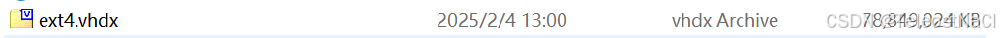
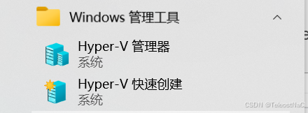
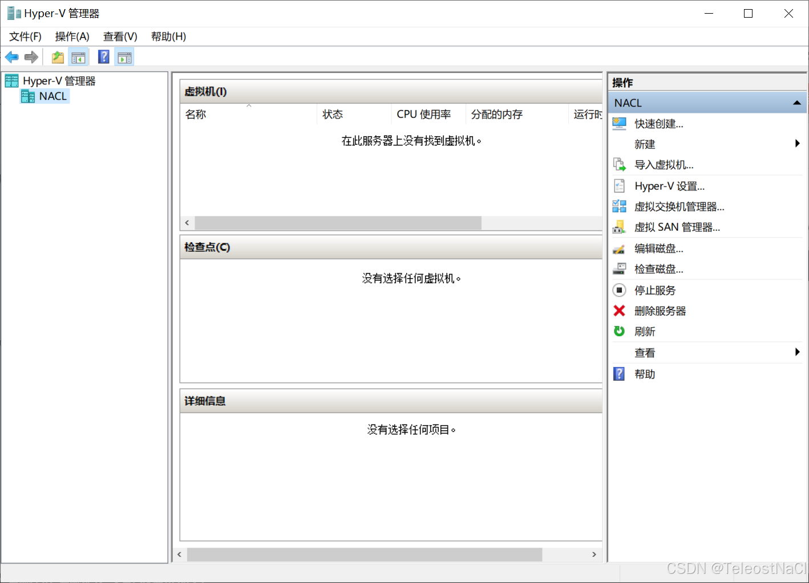
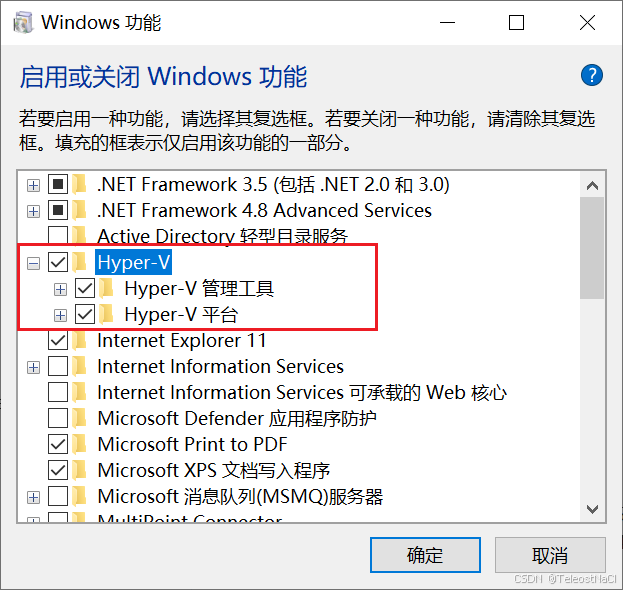
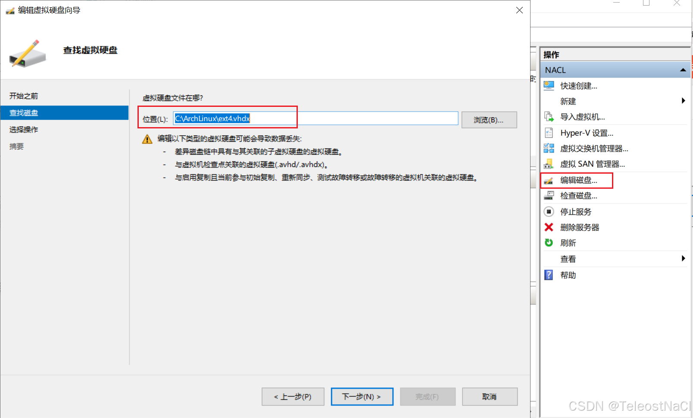
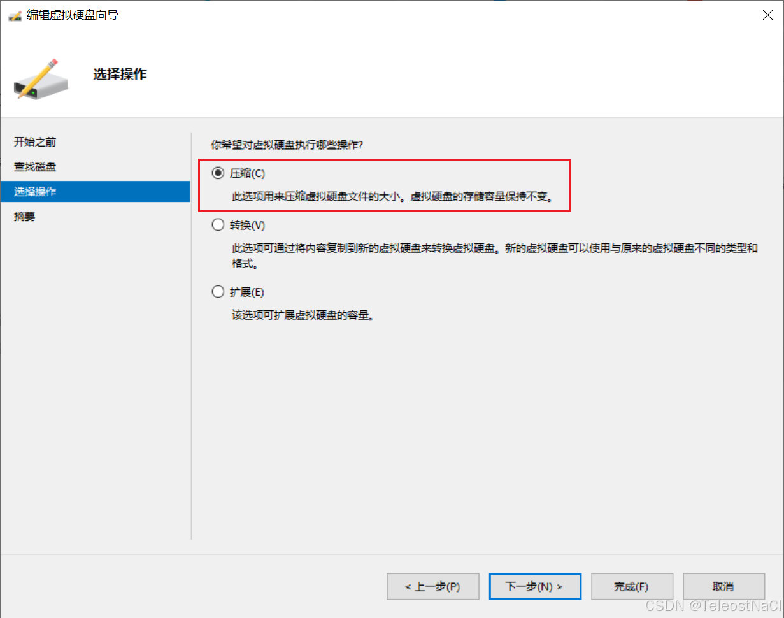

## 问题背景
随着WSL的使用时间越来越长, WSL的占用的磁盘空间越来越大, 且即使在WSL中删除了相关文件, 占用空间也得不到释放. 因为本质上, WSL是一个虚拟机系统, 在系统中会使用一个`vhdx`文件用来存储wsl的内容. 此文件会随着wsl使用的时候, 向系统申请占用之后会一直保持那么大的空间. 

为了减小WSL占用, 目标就是减小WSL的`vhdx`文件, 如下所示, 在释放WSL占用空间前, vhdx文件大概占了`70G`左右

经过释放之后, vhdx文件大概只占了`40G`


核心步骤就是先填充WSL中未使用的空间为0, 再使用 Hyper-V管理器的压缩磁盘功能以释放空间. 详细步骤如下:

## 第零步: (`重要!!!`) 在操作前请备份vhdx文件
由于此操作是直接修改了vhdx文件, 为避免发生意外, 请提前对vhdx文件进行**备份!!!**

## 第一步: 在WSL删除无用的文件
在WSL2中删除无用的文件, 保证有需要释放的空间
## 第二步: 填充WSL中未使用的空间以确保磁盘压缩有效
使用如下命令将未使用的空间填充成0, 并等待其执行完成, 确保在磁盘压缩的时候可以释放此部分未使用的空间, 
```shell
dd if=/dev/zero of=~/zero.fill bs=1M
sync
rm ~/zero.fill
```
`dd` 的作用：创建一个填充了零的文件直到磁盘空间耗尽。
`sync` 的作用：确保所有写入完成到磁盘。
`rm`删除文件：在完成后删除这个文件以释放实际空间。

## 第三步: 关闭WSL
退出所有 WSL 会话，然后在 PowerShell 中执行以下命令关闭 WSL2：
```powershell
wsl --shutdown
```

## 第四步: 打开Hyper-V管理器
打开 `开始`菜单 -> `Windows管理工具` -> `Hyper-V管理器`




如果无Hyper-V管理器, 在 `程序和功能` > `启用和关闭Windows功能`中开启`Hyper-V`



## 第五步: 压缩 VHDX 文件
在 `Hyper-V管理器` 选择 `编辑磁盘` 功能, 选择WSL使用的虚拟磁盘vhdx文件, 再选择压缩操作, 点击下一步, 等待操作完成. 


如果此时没有压缩的操作, 请确保wsl已经完全关闭了

---

此步骤也可以使用命令进行压缩
```powershell
Optimize-VHD -Path "ext4.vhdx文件的绝对路径" -Mode Full
```
