@[toc]
## 一、绪论
KDE Connect是著名的Linux桌面环境KDE下的一款适用于Linux, Windows, MacOS, Android, iOS跨平台互联开源工具，可以把手机当电脑的触控板，遥控器，互传文件，收发短信等等 。其官网地址如下：https://kdeconnect.kde.org/

关于发送文件，KDE Connect在KDE桌面环境下，可非常方便地发送文件，因为其已将发送到设备的选项添加到右键菜单中。
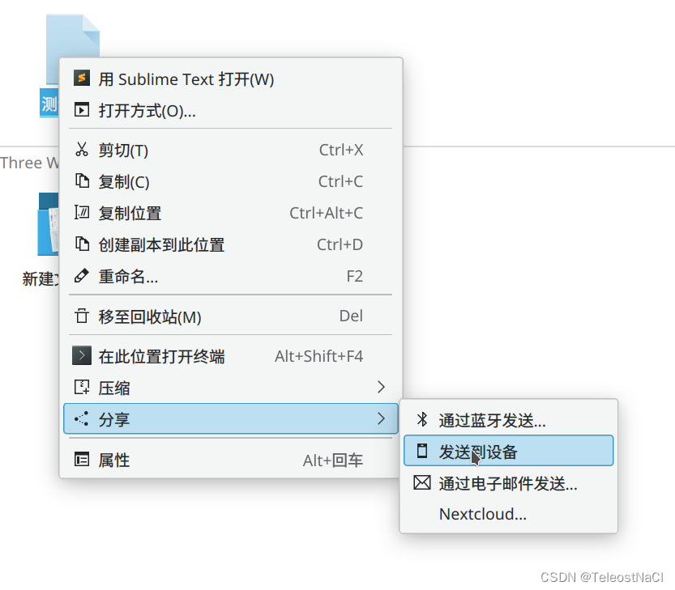

然而，在Windows下，KDE Connect在文件的右键菜单并没有注册相关服务，发送文件需要手动的点击托盘图标，选择设备，点击发送文件，再选择文件，点击发送，相对较为繁琐。
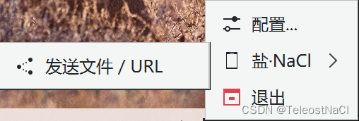
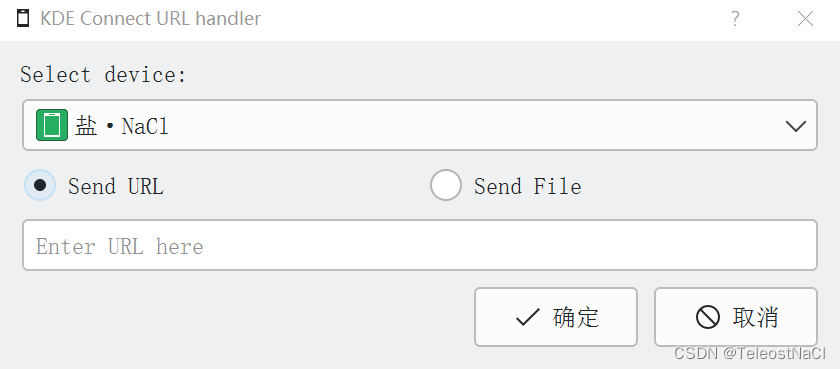

本文提出一种编写VBS脚本的方法，使用kdeconnect-cli命令，将KDE Connect设备添加到右键发送到选项菜单中，可快捷的将文件发送给指定设备。

## 二、相关基础
### 1. kdeconnect-cli命令
kdeconnect-cli是位于`/KDE Connect安装路/bin/`下的一个叫`kdeconnect-cli`的可执行文件（Windows下默认路径为：`C:\Program Files\KDE Connect\bin\kdeconnect-cli.exe`），提供KDE Connect部分功能的命令行版本，可使用该程序进行快捷的操作。详细的文档说明：https://userbase.kde.org/KDE_Connect/Tutorials/Useful_commands

打开命令行，跳转到`kdeconnect-cli`所在路径，执行kdeconnect-cli.exe --help查看帮助文档，如下图所示，可以清晰的知道kdeconnect-cli命令的用法。
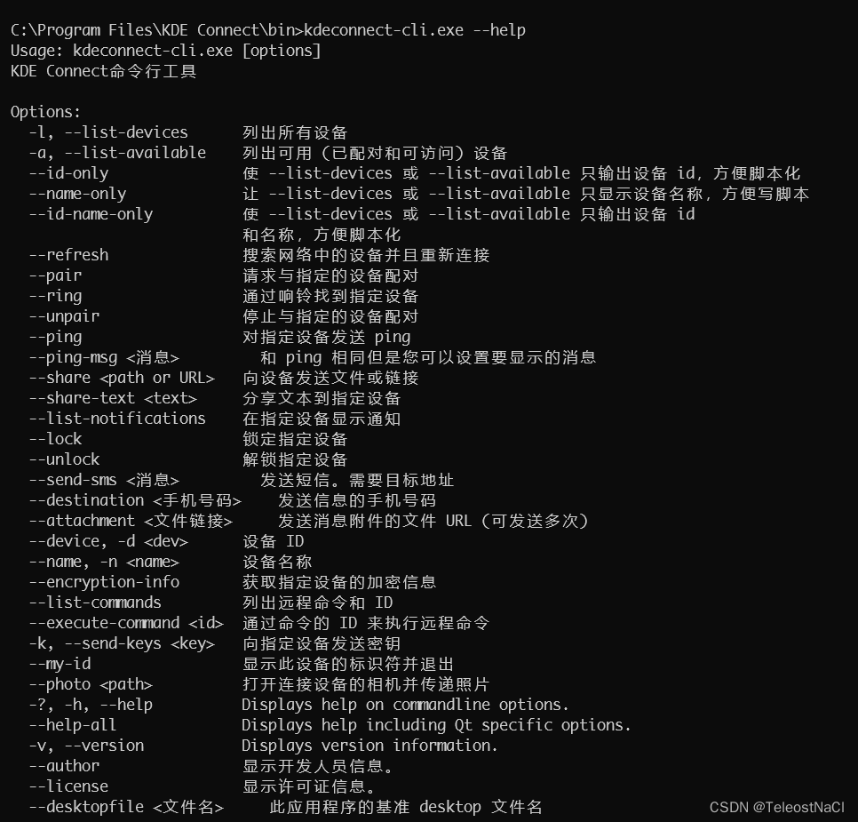

在详细的文档说明中，给出了一条发送屏幕截图的命令(Linux Shell)，如下
```shell
file=/tmp/$(hostname)_$(date "+%Y%m%d_%H%M%S").png; 
spectacle -bo "${file}" && while ! [ -f "${file}" ];
do sleep 0.5; 
done && kdeconnect-cli -d $(kdeconnect-cli -a --id-only) --share "${file}"
```
第一条命令定义了存储截屏的文件路径，`spectacle`是进行截屏的命令，下面一个while循环是为了保证屏幕截图成功，最后`kdeconnect-cli -d $(kdeconnect-cli -a --id-only) --share "${file}"`命令则是使用了kdeconnect-cli命令进行发送文件。

我们关注--share参数，查阅帮助文档可知其是向设备发送文件或链接，同时，-d命令是指定设备ID。
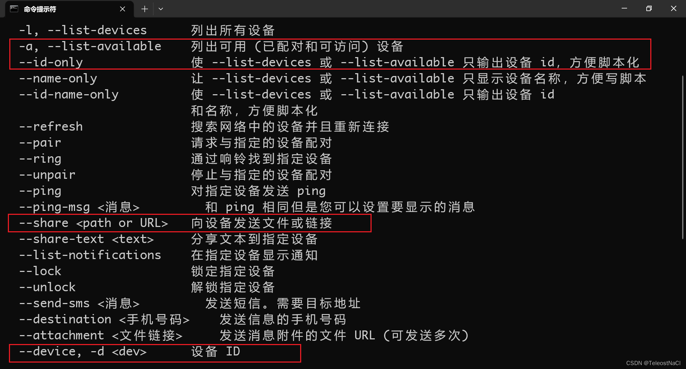

`kdeconnect-cli -a --id-only`则是获取设备id的命令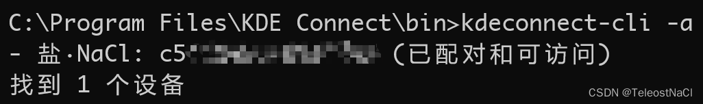

因此，为了使用kdeconnect-cli进行发送文件，首先使用`kdeconnect-cli -a`列出所有设备，获取设备的id（设备ID一般是不会改变的），然后使用`kdeconnect-cli -d $设备ID --share "$文件路径"`命令进行发送文件。

### 2. 文件右键菜单中的发送到选项
右键文件在弹出的菜单中有一个名为`发送到`的选项，在其子菜单下一般有以下默认功能。
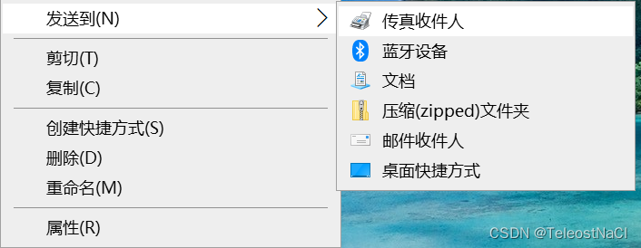
此子菜单的列表项其实是对应着一个文件夹下的文件，在`运行`中输入`shell:sendTo`可快速打开该文件夹。
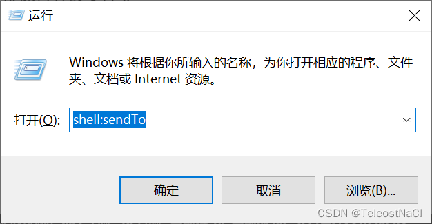
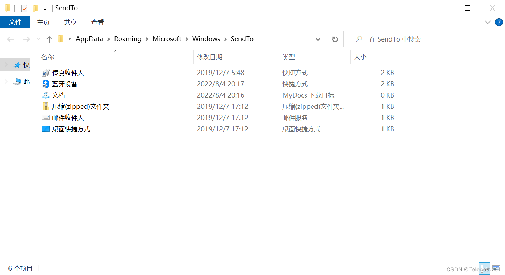
因此，只要在该文件夹下创建的文件，都将会在文件右键菜单`发送到`中展示。

当点击发送到中的子项时，会将所需发送文件的路径作为唯一的参数发给子项对应的文件，文件再对其进行处理。
在`shell:sendTo`文件夹下编写以下bat脚本进行验证（此脚本仅是打印第一个参数）
```bash
@echo off
echo %1
pause
```
点击发送到，选择刚创建的`测试参数.bat`，运行结果可以看到，其已将第一参数（即文件路径）打印出来。
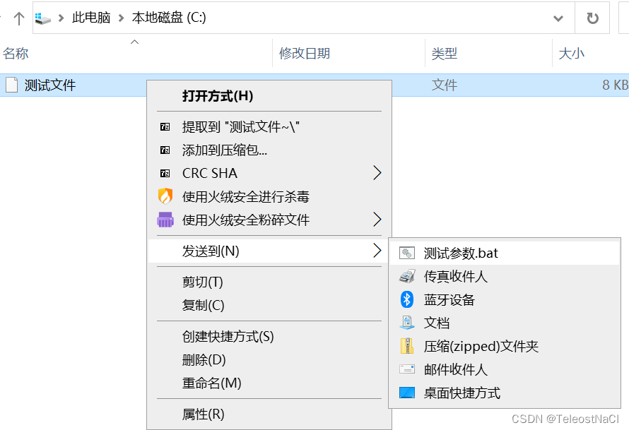
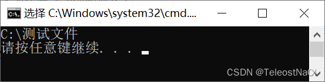
因此我们可以在`shell:sendTo`文件夹下编写脚本，使用第一个参数来获取文件路径，从而完成我们想要对文件的操作。

### 3. 使用vbs运行时隐藏命令行窗口
编写以下vbs脚本，可在运行cmd命令时，不显示命令行窗口(ws.run 为执行命令的方法，command为所需执行的命令，vbhide参数为隐藏运行窗口)
```
Set ws = CreateObject("Wscript.Shell")
ws.run command, vbhide
```
>`WScript.Arguments`可获取传递给vbs脚本的参数，`WScript.Arguments(0)`可获取第一个参数，`WScript.Arguments.Count`为参数的总数。

## 三、编写VBS脚本
综上所述，我们可以在`shell:sendTo`文件夹编写vbs脚本，并执行kdeconnect-cli命令，完成在发送到的菜单中添加KDE Connect设备，并便捷的将文件发送至设备中。脚本如下：
```vbnet
' 使用 发送到 时, 仅有一个参数
If WScript.Arguments.Count = 1 Then
	' 该参数为文件的路径, 并使用引号(需转义为chr(34))将其引起来(路径中可能含有空格)
	path = chr(34) &WScript.Arguments(0) &chr(34)
	' 该参数为kdeconnect-cli的路径, 并使用引号(需转义为chr(34))将其引起来(路径中可能含有空格)
	command_path = chr(34) & "C:\Program Files\KDE Connect\bin\kdeconnect-cli.exe" & chr(34)
	' 该参数为deviceID(自行填入)
	deviceId = ""
	' 拼接命令
	command = command_path &" -d " &deviceId &" --share " &path 
	
	' 调试时进行打印命令
	' MsgBox command
	
	' 执行命令, 并隐藏cmd窗口
	Set ws = CreateObject("Wscript.Shell")
	ws.run command, vbhide
End If
```

1. 脚本中先进行判断参数的总数，保证总数为1，
2. 随后将第一个参数使用转义后的引号将其引起来，定义为`path`变量（所需发送文件的路径），因为文件路径中可能含有非法字符（如空格），加引号可保证命令正常运行。
3. 再定义`command_path`变量，记录kdeconnect-cli命令的路径（也需使用引号）。
4. 定义`deviceId`变量，此为发送文件到指定设备的ID，可通过`kdeconnect-cli -a`命令进行获取。设备的ID一般是固定的，可在脚本中写死。如果有多个设备，可创建多条vbs，仅修改`deviceId`变量
5. 然后将命令进行拼接，形成一条完整的发送文件到指定设备的命令`kdeconnect-cli -d $设备ID --share "$文件路径"`
6. 最后使用隐藏cmd命令行窗口的方式执行命令。

## 四、隐藏格式拓展名和修改图标
若直接在`shell:sendTo`文件夹编写vbs脚本，则显示在`发送到`的选项中会显示.vbs格式拓展名。我们可以在其它路径下编写vbs脚本，最后创建一个快捷方式（同时，快捷方式可以自定义图标），并移动到`shell:sendTo`文件夹下。

最后效果如下：
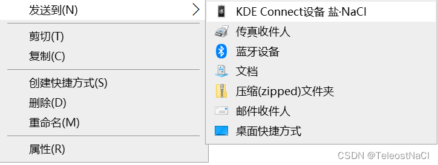
