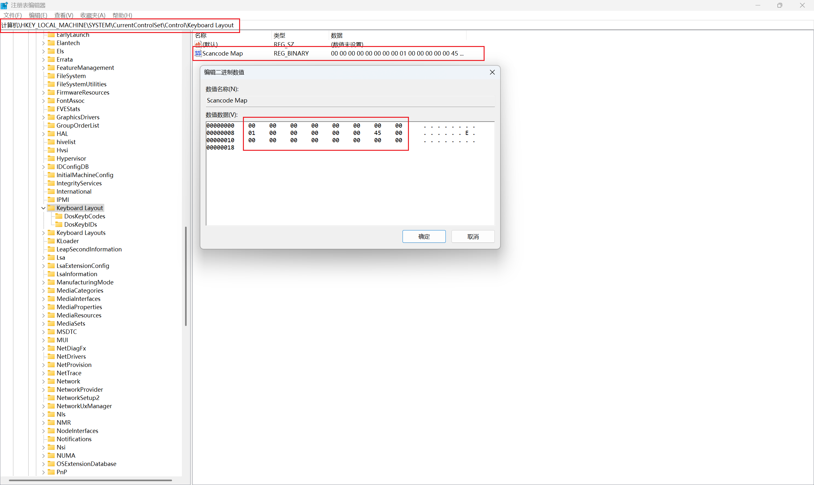
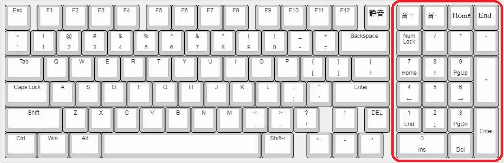
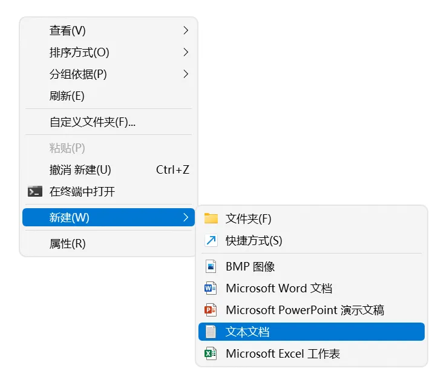
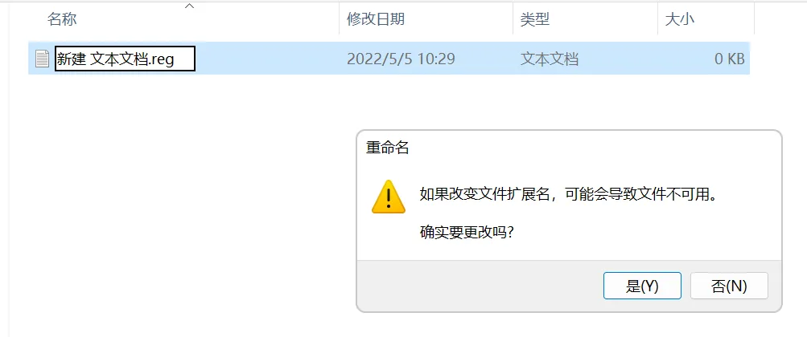
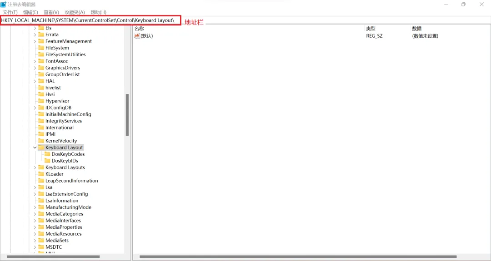
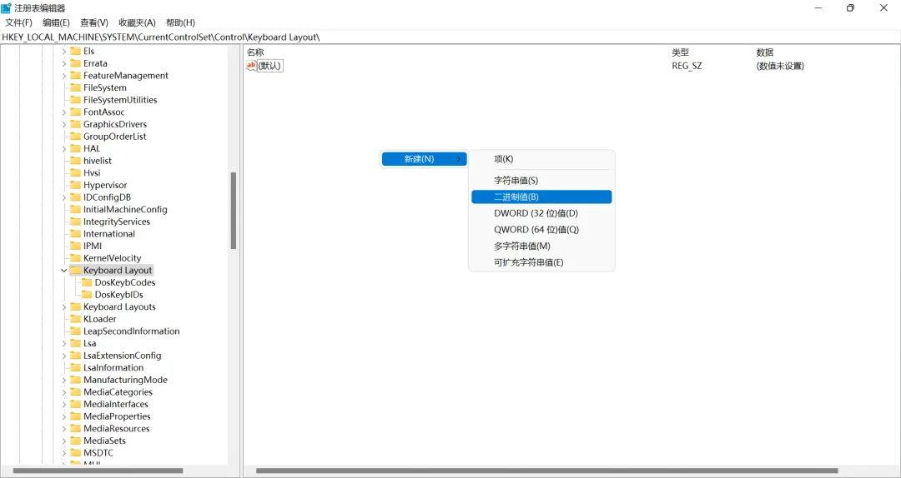
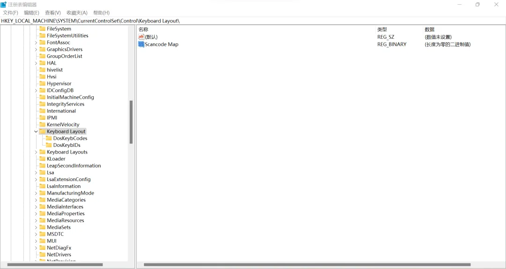
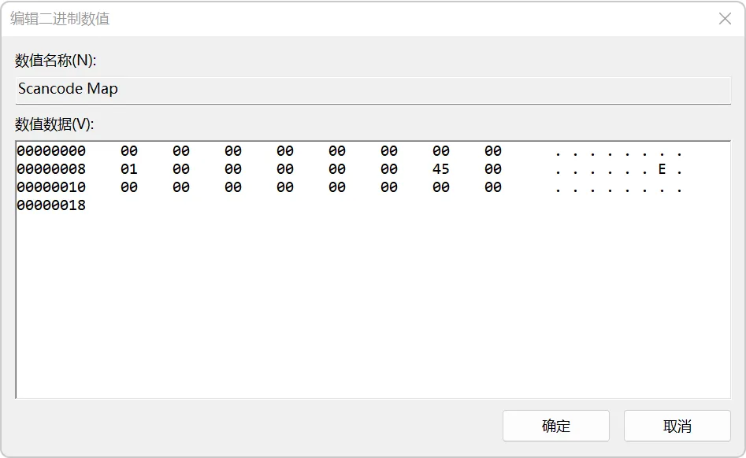
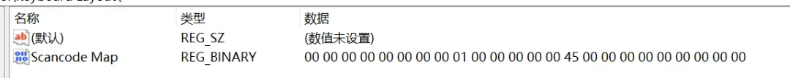

**先说需修改注册表的位置与键值**
路径：`HKEY_LOCAL_MACHINE\SYSTEM\CurrentControlSet\Control\Keyboard Layout\`
二进制键：`Scancode Map`
键值：
```
00 00 00 00 00 00 00 00 
01 00 00 00 00 00 45 00
00 00 00 00 00 00 00 00
```
如下图：

@[TOC]
# 一、问题背景
对于带有数字小键盘的键盘来说，尤其是笔记本电脑的键盘，小键盘区域的数字键一般会与功能键放在一起。当 `NumLock(小键盘锁)` 启用时，小键盘会输入数字；当 `NumLock` 关闭时，小键盘输入功能键(如 `Home` `End` `PgUp` `PgDn` `Insert` `Delete` 等可用于控制光标位置的功能键)。通过按下键盘上的 `Numlk` 键可以切换 `Numlock` 状态。

如果很少使用小键盘功能键的时候，我们会希望 `Numlock` 一直保持常开。但有些键盘尤其是笔记本键盘，`Numlk` 键与 `BackSpace` 键靠的很近，我们有时候在按下回退键或者数字键的时候，会误按到 `Numlk` 键，从而导致 `NumLock` 处于非锁定状态，当我们再使用数字键时，往往会造成不可意料的结果，尤其是又在不经意间按下了 `Insert` 键，会给我们使用带来极大的麻烦。

本文就介绍如何在使用 `Windows` 操作系统的电脑通过修改注册表永久禁用 `Numlk` 键，即使在误触 `Numlk` 键的情况下也不改变小键盘的功能，使其处于一直输入数字的状态。

# 二、(方法一) 编写并导入注册表文件
- **1. 在任意位置新建一个文本文档**

- **2. 双击打开新建的文件，粘贴内容，并保存**
```
Windows Registry Editor Version 5.00

[HKEY_LOCAL_MACHINE\SYSTEM\CurrentControlSet\Control\Keyboard Layout]
"Scancode Map"=hex:00,00,00,00,00,00,00,00,01,00,00,00,00,00,45,00,00,00,00,00,00,00,00,00
```
- **3. 使用重命名修改新建文件的拓展名为reg(前提是打开了显示文件拓展名)**

- **4. 双击修改扩展名后的文件，导入注册表图片**

- **5. 确认Numlock处于正确的状态，然后重启电脑**

# 三、(方法二) 在注册表编辑器中修改
- **1. 按下 `Win` + `R` 键，呼出 `运行`，输入 `regedit`，按确定，打开 `注册表编辑器`。**


- **2. 在打开的 `注册表编辑器` 展开路径或直接在地址栏输入**
`HKEY_LOCAL_MACHINE\SYSTEM\CurrentControlSet\Control\Keyboard Layout\`

- **3. 在右边窗口点击右键，选择新建-二进制值，并将其命名为Scancode Map**

4. **双击新建的 `Scancode Map` 的项，在打开的窗口按顺序输入二进制值，按确定保存**
```
00 00 00 00 00 00 00 00 
01 00 00 00 00 00 45 00
00 00 00 00 00 00 00 00
```


- **5. 确认Numlock处于正确的状态，然后重启电脑**
# 四、取消禁用
**(方法一) 直接在注册表编辑中删除注册表项**
```
HKEY_LOCAL_MACHINE\SYSTEM\CurrentControlSet\Control\Keyboard Layout\Scancode Map
```

**(方法二) 编写并导入以下的注册表文件内容**
```
Windows Registry Editor Version 5.00

[HKEY_LOCAL_MACHINE\SYSTEM\CurrentControlSet\Control\Keyboard Layout]
"Scancode Map"=-
```
最后，重启电脑就可以恢复 `Numlk` 键的功能了。

# 五、禁用Numlk键下，不改变Numlock状态，使用功能键
我们在禁用 `Numlk` 键之后，没有办法通过键盘去切换 `Numlock` 状态，也就不会改变小键盘的输入状态，要么一直输入数字，要么一直输入控制光标的功能键。这是本文所要实现的功能。

但如果在 `Numlock` 锁定状态下,即输入数字的状态下，有时候我们又想使用功能键怎么办呢？只要同时按下 `shift` 键，就可以实现在不改变 `Numlock` 状态下，输入控制光标的功能键。
