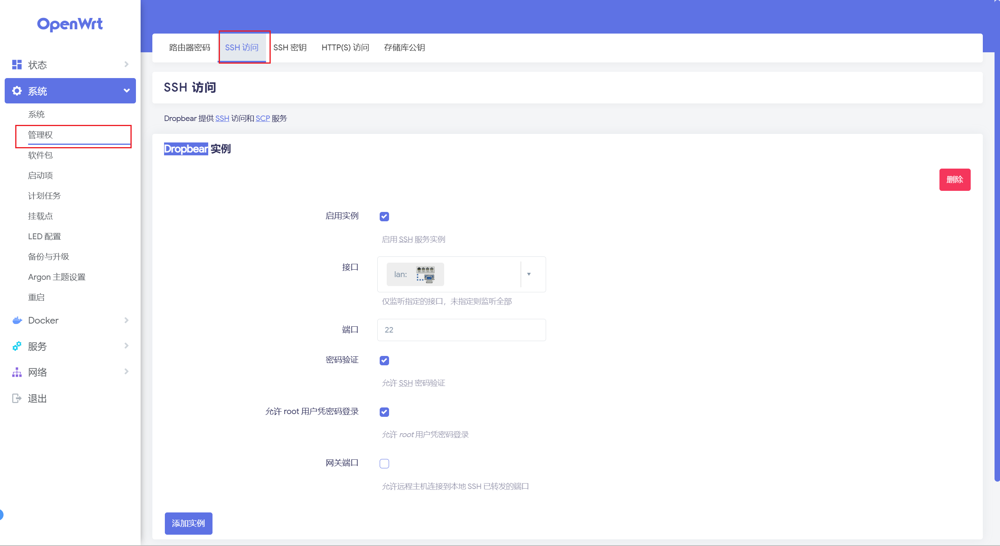
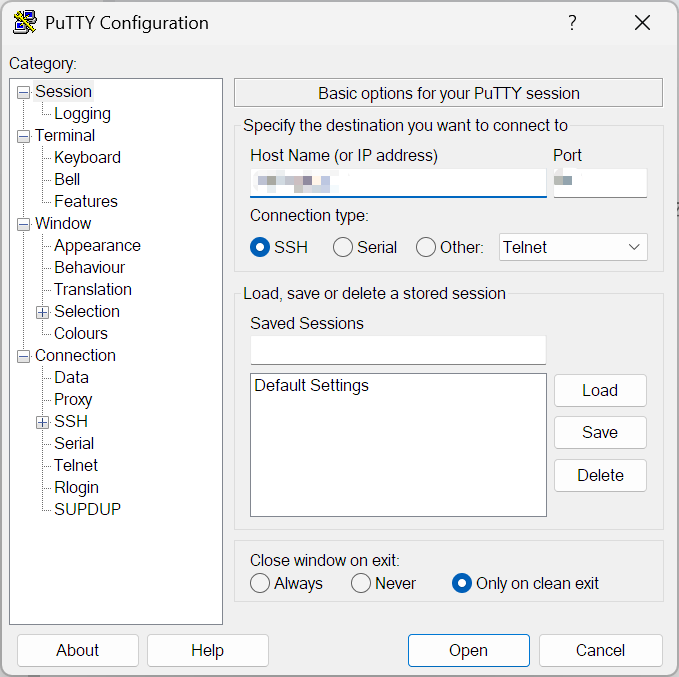
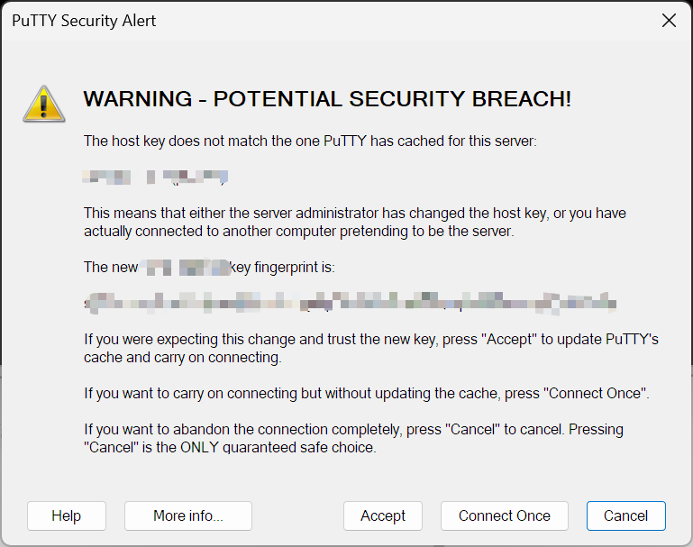
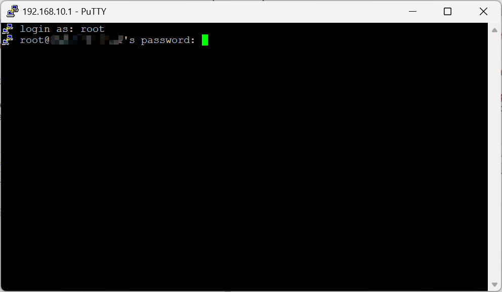
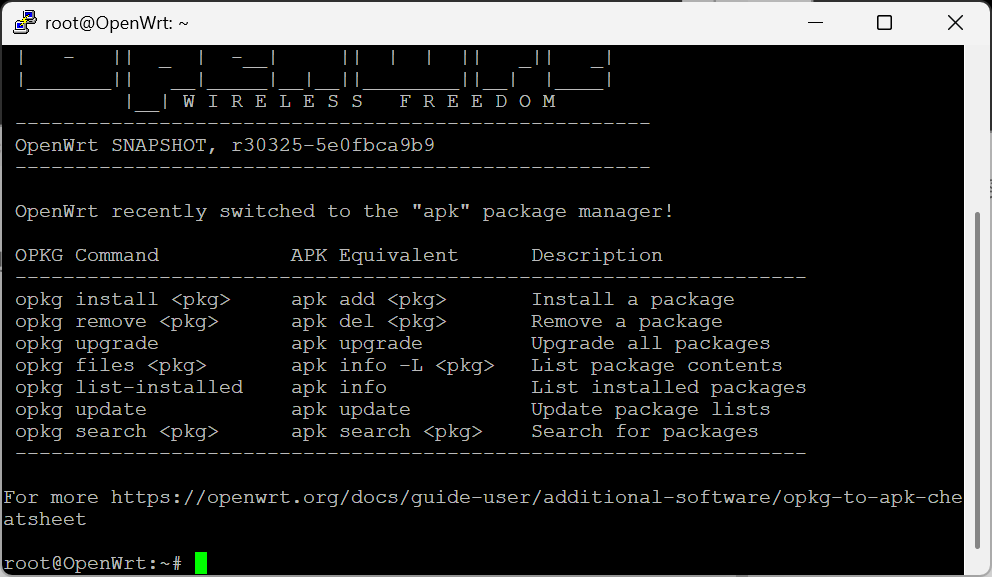
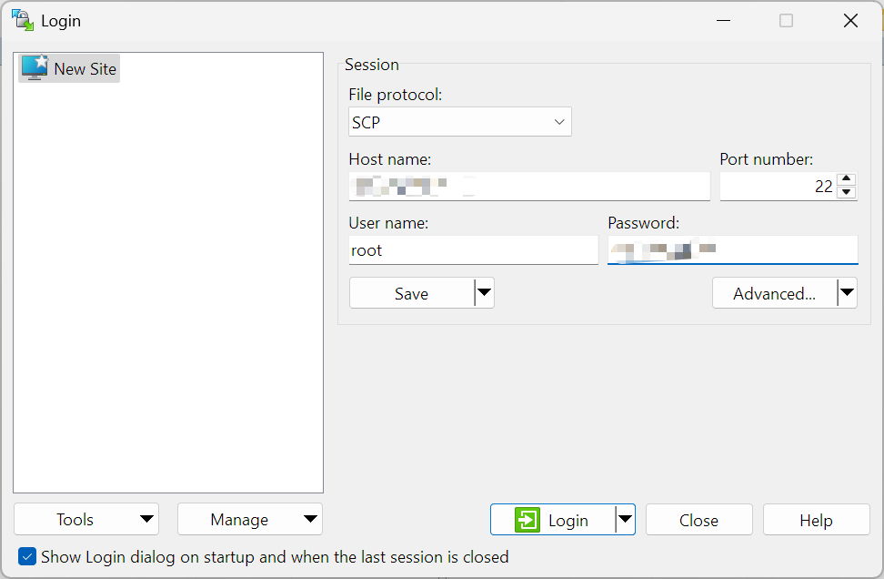
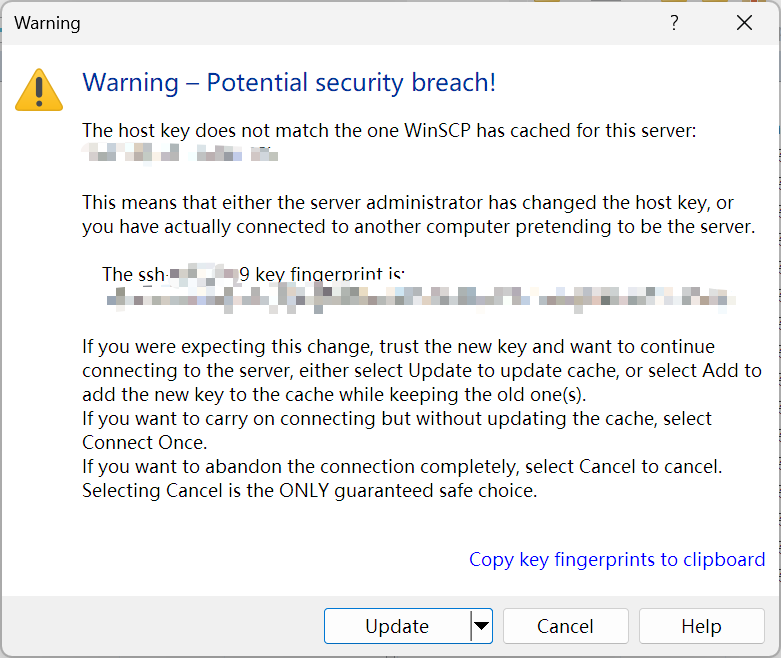
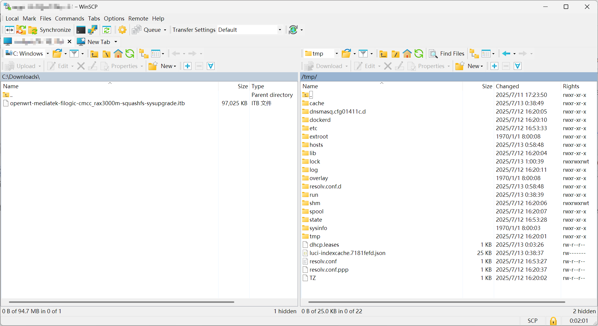
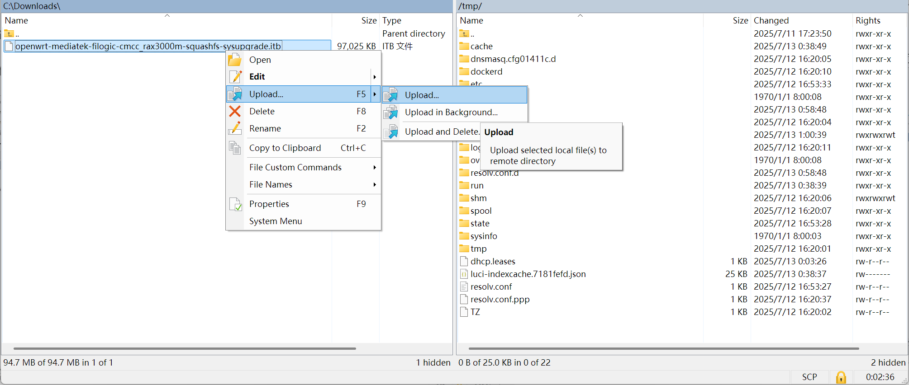

@[TOC]
# 一、背景介绍
我们平常时在玩 `OpenWrt` 系统的时候，难免会遇到因为配置出错，`OpenWrt` 的 `luci` 无法正常使用，无法登录到路由器的管理界面，从而导致路由器无法正常使用。这个时候其实路由器还没有成砖，电脑是可以正常连接到路由器，甚至可以访问到外网，只是 `luci` 模块崩溃了，因此还不需要使用 `不死uboot` 模式下去救砖。

就在某次刷机的时候，因为编译的系统中缺少了 `luci` 某个核心组件，导致无法进入 `luci` 管理界面，需要重新刷一个带完整 `luci` 的固件才能正常使用。因为想到，此系统是配置了 `Dropbear` 实例的，可以使用 `SSH` 的方式登录到路由器后台，因此想到可以通过  `SSH` 登录到后台之后，使用 `SCP` 将固件包上传到路由器临时目录，再使用 `sysupgrade` 命令刷写新系统，以恢复 `luci` 的使用，从而避免使用 `uboot` 刷机。本文将详细介绍此次因 `luci` 无法登录而通过 `SSH` 升级 `OpenWrt` 固件的经验总结。

> 如下图所示，本文操作的前提是在 `系统` > `管理权` > `SSH访问` 中配置了 `Dropbear` 实例，可以通过 `SSH` 登录到路由器后台，否则只能使用  `uboot` 进行刷机
>
> 

# 二、解决过程
## （一）使用 SSH 登录到路由器
我们先使用一个支持 `SSH` 的软件登录到路由器后台，本文使用的是 `Putty`：[https://www.putty.org/](https://www.putty.org)。其他软件基本操作相同。

在 `Host Name` 和 `Port` 输入路由器的 `IP` 地址和 `Dropbear` 实例设置的 `端口号` （默认为 `22` ），`Connection type` 需要选择 `SSH`，随后点击 `Open`。



如果此前通过 `SSH` 连接过相同的 `IP`，此时会弹一个安全警告，提示是否有更新本地的 `SSH` 可信任列表和证书，我们直接点击 `Accept` 即可。


随后会出现一个终端窗口，提示输入用户名和密码。我们在 `login as:` 之后输入 `OpenWrt` 管理员的用户名，回车之后再输入密码即可，此时输入密码时不可见，只要输入完整按回车即可。


如果 `Dropbear` 实例配置正常，此时即可登录到路由器后台


## （二）使用 SCP 上传新固件到路由器
我们使用一个支持 `SCP` 的软件将编译好的新固件到路由器上，这里我们使用 `WinSCP`：[https://winscp.net/eng/download.php](https://winscp.net/eng/download.php)

运行 `WinSCP` 之后，会自动弹出一个登录弹窗，此时 `File protocal` 选择 `SCP`，`Host name` 输入路由器的 `IP`，`Port number` 输入 `Dropbear` 实例设置的 `端口号` （默认为 `22` ），在 `User name` 和 `Password` 分别输入用户名和密码，随后点击 `Login`，即可进行登录



与 `Putty` 一样，如果之前已经连接过，则需要更新可信任列表和证书，此时点击 `Update` 即可。


此时即可连接到路由器的 `SCP` 服务。

随后，我们将右边路由器的路径定位到临时目录 `/tmp`，用于存放我们的新固件，左边定位到新固件存放的位置


随后右键新固件，点击 `Upload` 将固件上传到路由器的 `/tmp` 目录，并等待其完成。


## （三）使用 sysupgrade 命令进行升级
随后我们回到 `Putty` 软件（或其他 `SSH` 软件），使用 `sysupgrade` 命令进行升级。首先我们输入 `sysupgrade -h` 可以得到此命令的使用方法：
```shell
root@OpenWrt:~# sysupgrade -h
Usage: /sbin/sysupgrade [<upgrade-option>...] <image file or URL>
       /sbin/sysupgrade [-q] [-i] [-c] [-u] [-o] [-k] [-P] <backup-command> <fil                                                                                                                                   e>

upgrade-option:
        -f <config>  restore configuration from .tar.gz (file or url)
        -i           interactive mode
        -c           attempt to preserve all changed files in /etc/
        -o           attempt to preserve all changed files in /, except those
                     from packages but including changed confs.
        -u           skip from backup files that are equal to those in /rom
        -n           do not save configuration over reflash
        -p           do not attempt to restore the partition table after flash.
        -k           include in backup a list of current installed packages at
                     /etc/backup/installed_packages.txt
        -s           stay on current partition (for dual firmware devices)
        -P           create provisioning partition to keep sensitive data across
                     factory resets.
        -T | --test
                     Verify image and config .tar.gz but do not actually flash.
        -F | --force
                     Flash image even if image checks fail, this is dangerous!
        --ignore-minor-compat-version
                     Flash image even if the minor compat version is incompatibl                                                                                                                                   e.
        -q           less verbose
        -v           more verbose
        -h | --help  display this help

backup-command:
        -b | --create-backup <file>
                     create .tar.gz of files specified in sysupgrade.conf
                     then exit. Does not flash an image. If file is '-',
                     i.e. stdout, verbosity is set to 0 (i.e. quiet).
        -r | --restore-backup <file>
                     restore a .tar.gz created with sysupgrade -b
                     then exit. Does not flash an image. If file is '-',
                     the archive is read from stdin.
        -l | --list-backup
                     list the files that would be backed up when calling
                     sysupgrade -b. Does not create a backup file.
```

根据是否保留配置和需要去添加不同参数。对于不需要备份的刷写新固件的命令如下：
```shell
sysupgrade -n /tmp/sysupgrade.bin
```
`/tmp/sysupgrade.bin` 替换成具体的新固件文件路径即可。执行之后会校验固件包，随后会开始升级，并弹出关闭`shell` 连接，此时 `Putty` 会断开，等待路由器重启完毕即可。


# 三、后话
此次救机虽然简单，但很关键的是系统配置了 `Dropbear` 实例的，让我们可以有机会使用命令进行更新。因此，我们在玩 `OpenWrt`，尽量需要配置一个安全的 `Dropbear` 实例，以便在出问题的时候，可以方便修复问题，而不需要使用 `uboot` 刷机，这样子我们可以省去不少的麻烦事。
