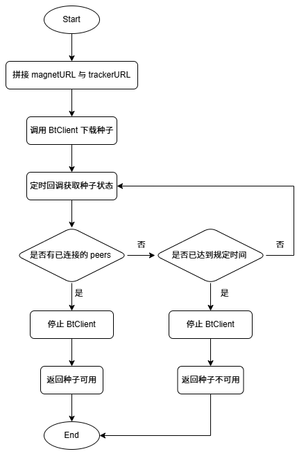
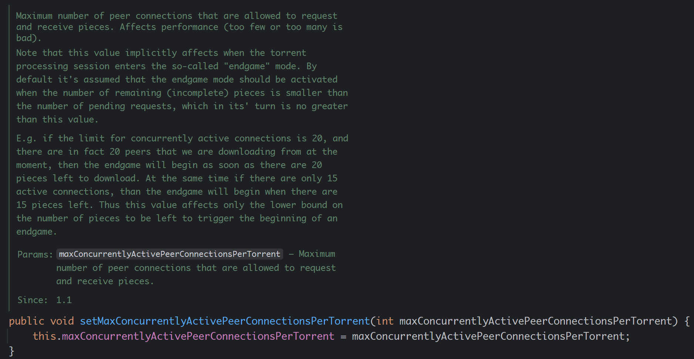

## 一、问题背景
当我们想下载种子的资源时候，我们无法快速的知道一个种子是否可用，只有当我们放到种子下载器进行尝试下载，才可以知道一个种子是否可用。当我们有多个种子的时候，如果一个一个的尝试，那就会非常耗费时间和精力。

因此我们需要一个程序，帮助我们先去对种子进行一次筛选，先去简单判断一下种子是否可用。本文将使用 `Java` / `Kotlin` 编写一种通过检查是否有可用的 `peers` 的方式去检测 `BT` 种子的磁力链接是否可用的程序。

磁力连接形如:
```
magnet:?xt=urn:btih:<info-hash>
```

## 二、概要设计
本文使用的 `Java` 库为 `atomashpolskiy/bt`：[https://github.com/atomashpolskiy/bt](https://github.com/atomashpolskiy/bt)。这是一个为 `Java` 实现的支持种子下载的所有特性的 `BitTorrent` 的库。

官方 `wiki`：[https://atomashpolskiy.github.io/bt/](https://atomashpolskiy.github.io/bt/)

本方案将利用 `atomashpolskiy/bt` 种子下载的功能，先将 种子链接和 `tracker` 进行组装，然后调用 `BtClient` 进行下载种子，并利用回调的方式知道种子下载的状态，再从状态中获取 `peers` 的信息，一旦获取到 `peers` 信息，就立刻停止下载，表示此种子可用。如果在规定时间内，未获取到 `peers` 信息，则表示种子不可用。此方案的流程图如下：


## 三、实现细节
### （一）在 gradle 中导入 atomashpolskiy/bt
首先，我们需要先导入 `atomashpolskiy/bt` 的相关依赖，主要有：
-  `com.github.atomashpolskiy:bt-core`：核心库
- `com.github.atomashpolskiy:bt-http-tracker-client`：提供 `tracker` 能力
- `com.github.atomashpolskiy:bt-dht` 提供 `DHT` 能力

当前最新的版本为 `1.10`，因此 `gradle` 中编写如下内容，即可导入 `atomashpolskiy/bt` 库。
```groovy
dependencies {
    // BT 提供的库
    def bt_version = "1.10"

    implementation "com.github.atomashpolskiy:bt-core:$bt_version"
    implementation "com.github.atomashpolskiy:bt-http-tracker-client:$bt_version"
    implementation "com.github.atomashpolskiy:bt-dht:$bt_version"
}
```

### （二）拼接 magnetURL 与 trackerURL
首先，我们需要先实现拼接 `magnetURL` 与 `trackerURL`，由于 `magnetURL` 里面只有种子的 `hash` 值，需要配置 `tracker` 的信息才能寻找到可供下载的用户，并帮助建立链接，可以参考：[https://trackerslist.com/#/zh](https://trackerslist.com/#/zh)

同时，在磁力链接里面支持直接写 Tracker，通过参数 `&tr=` 进行连接，例如：
```
magnet:?xt=urn:btih:<info-hash>&tr=tracker1&tr=tracker2&tr=tracker3
```
因此，我们在检测种子的磁力链接是否可用的时候，需要提供一个 `magnetURL` 和 `trackerURL` 的列表，利用 `StringBuilder` 拼接字符串。

```kotlin
// 将 tracker 拼接到 磁力链之后
val torrent = StringBuilder(torrentUri)
trackers?.forEach { tracker ->
    torrent.append("&tr=").append(tracker)
}
```

### （三）构建 Config
对于  `atomashpolskiy/bt` 库中下载 `BT` 的相关配置是由 `bt.runtime.Config` 类进行定义的，在本方案中，为了加快发现 `peers` 的速度，从源码中来看，`maxConcurrentlyActivePeerConnectionsPerTorrent` 的默认值为20，因此可以适当增加 `peer` 的连接数。
```koltin
val config = Config()
// 增大获取peers的线程数
config.maxConcurrentlyActivePeerConnectionsPerTorrent = 50
```

源码如下：

### （四）构建不下载的 Storage
由于在下载的时候，一定需要指定一个 `Storage`，表示下载该种子的文件时存储的目录。但是我们只是需要检测种子是否可用，不需要实际下载，因此需要自定义一个 `Storage` 类，使其不会进行下载，一种实现方法就是覆写所有方法，并且都是空实现，以便实现禁止下载。方法如下：
```kotlin
object : Storage {
    override fun getUnit(torrent: Torrent?, torrentFile: TorrentFile?): StorageUnit? {
        return object : StorageUnit {
            override fun readBlock(buffer: ByteBuffer?, offset: Long): Int = -1
            override fun writeBlock(buffer: ByteBuffer?, offset: Long): Int = -1
            override fun writeBlock(buffer: ByteBufferView?, offset: Long): Int = -1
            override fun capacity(): Long = 0
            override fun size(): Long = 0
            override fun close() {}
        }
    }

    override fun flush() {}
}
```

### （五）构建 BtClient
按照官方的文档，构建下载 `BT` 种子磁力链的 `BtClient`：
```kotlin
val client: BtClient = Bt.client()
    .config(config)
    // 不下载文件
    .storage(object : Storage {
        override fun getUnit(torrent: Torrent?, torrentFile: TorrentFile?): StorageUnit? {
            return object : StorageUnit {
                override fun readBlock(buffer: ByteBuffer?, offset: Long): Int = -1
                override fun writeBlock(buffer: ByteBuffer?, offset: Long): Int = -1
                override fun writeBlock(buffer: ByteBufferView?, offset: Long): Int = -1
                override fun capacity(): Long = 0
                override fun size(): Long = 0
                override fun close() {}
            }
        }

        override fun flush() {}
    })
    .magnet(torrent.toString())
    .autoLoadModules()
    .build()
```

### （六）定时回调获取种子状态
`BtClient` 有一个 `startAsync` 方法，其可以在独立的线程中开始下载种子，并且其可以传递一个 `Consumer<TorrentSessionState>` 的参数和时间间隔，`BtClient` 将按时间间隔定时回调 `Consumer<TorrentSessionState>` 方法，获取种子的下载状态，从中可以获取到相关的已连接的 `peers` 信息。我们可以定义一个超时时间，如果轮询时间达到了，但是仍没有获取到 `peers` 信息，则认为种子不可用，结束 `BtClient`。如果在轮询时间内，获取到了 `peers` 信息，则认为种子可用，并结束 `BtClient`。相关代码如下：
```kotlin
// 定义种子是否可用
var available = false
// 定义已轮询的次数
var count = 0

// 每隔一段时间检测一次是否有peers
val future = client.startAsync({ s: TorrentSessionState ->
	// 如果 connectedPeers 不为空 则表示有可以连接的 peers 则认为种子可用
    if (s.connectedPeers.isNotEmpty()) {
        available = true
        client.stop()
        return@startAsync
    }
	
	// 如果轮询次数已经达到了指定次数 即已经超时了 仍没有获取到 peers 则认为种子不可用
    if (++count >= checkCount) {
        client.stop()
    }
    // 定义每次轮询的时间间隔
}, CHECK_PEERS_INTERVAL)

// 等待 client 完成 stop 或 超时
future.join()

return available
```

## 四、完整实现
完整的实现如下：
```kotlin
import bt.Bt
import bt.data.Storage
import bt.data.StorageUnit
import bt.metainfo.Torrent
import bt.metainfo.TorrentFile
import bt.net.buffer.ByteBufferView
import bt.runtime.BtClient
import bt.runtime.Config
import bt.torrent.TorrentSessionState
import com.teleostnacl.bt.utils.BTUtil.CHECK_PEERS_COUNT
import java.nio.ByteBuffer

/**
 * BT 种子工具类
 */
object BTUtil {
    /**
     * 检查 Peers 的时间间隔
     */
    private const val CHECK_PEERS_INTERVAL = 1000L

    /**
     * 检查 Peers 超时的时长 单位: 分钟
     */
    const val CHECK_PEERS_TIME_MIN = 1

    /**
     * 检查 Peers 的次数
     */
    private const val CHECK_PEERS_COUNT = CHECK_PEERS_TIME_MIN * 60

    /**
     * 检查种子是否可用的方法
     *
     * @param torrentUri 种子的链接
     * @param trackers 自定义的tracker列表
     * @param checkCount 检查 Peers 的次数, 默认为 [CHECK_PEERS_COUNT]
     */
    fun isTorrentUrlAlive(
        torrentUri: String,
        trackers: List<String>? = null,
        checkCount: Int = CHECK_PEERS_COUNT
    ): Boolean {
        val startTime = System.currentTimeMillis()
        // 将 tracker 拼接到 磁力链之后
        val torrent = StringBuilder(torrentUri)
        trackers?.forEach { tracker ->
            torrent.append("&tr=").append(tracker)
        }

        val config = Config()
        // 增大获取peers的线程数
        config.maxConcurrentlyActivePeerConnectionsPerTorrent = 50

        val client: BtClient = Bt.client()
            .config(config)
            // 不下载文件
            .storage(object : Storage {
                override fun getUnit(torrent: Torrent?, torrentFile: TorrentFile?): StorageUnit? {
                    return object : StorageUnit {
                        override fun readBlock(buffer: ByteBuffer?, offset: Long): Int = -1
                        override fun writeBlock(buffer: ByteBuffer?, offset: Long): Int = -1
                        override fun writeBlock(buffer: ByteBufferView?, offset: Long): Int = -1
                        override fun capacity(): Long = 0
                        override fun size(): Long = 0
                        override fun close() {}
                    }
                }

                override fun flush() {}
            })
            .magnet(torrent.toString())
            .autoLoadModules()
            .build()

		// 定义种子是否可用
		var available = false
		// 定义已轮询的次数
		var count = 0
		
		// 每隔一段时间检测一次是否有peers
		val future = client.startAsync({ s: TorrentSessionState ->
			// 如果 connectedPeers 不为空 则表示有可以连接的 peers 则认为种子可用
		    if (s.connectedPeers.isNotEmpty()) {
		        available = true
		        client.stop()
		        return@startAsync
		    }
			
			// 如果轮询次数已经达到了指定次数 即已经超时了 仍没有获取到 peers 则认为种子不可用
		    if (++count >= checkCount) {
		        client.stop()
		    }
		    // 定义每次轮询的时间间隔
		}, CHECK_PEERS_INTERVAL)
		
		// 等待 client 完成 stop 或 超时
		future.join()

        return available
    }
}
```
