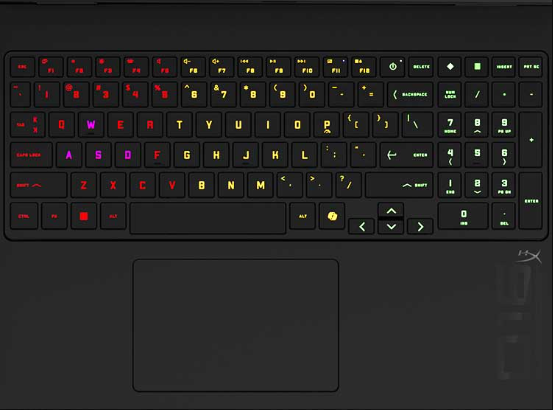
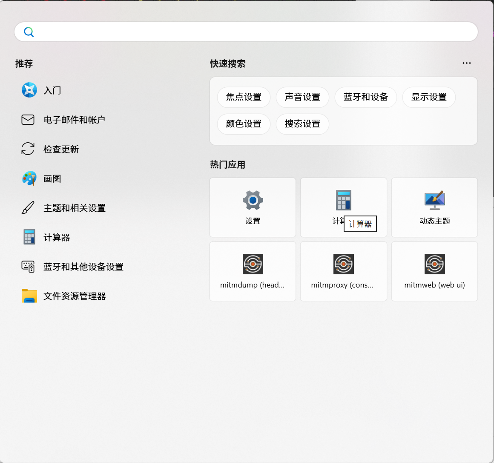
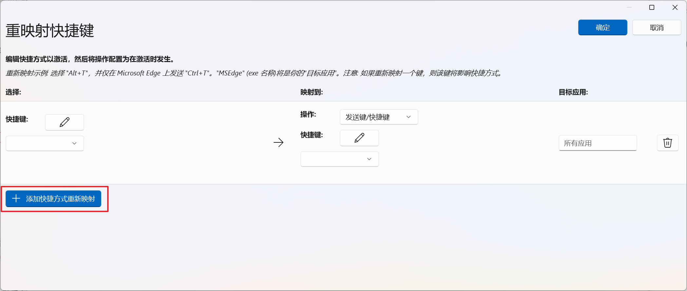
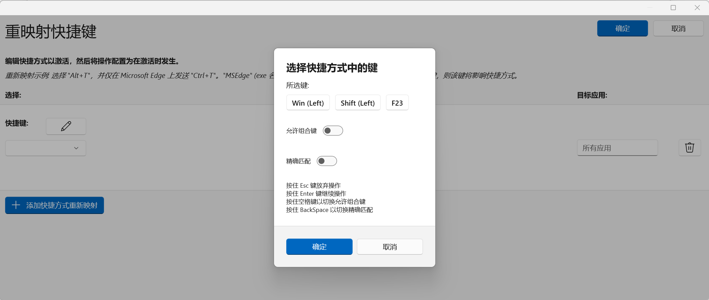
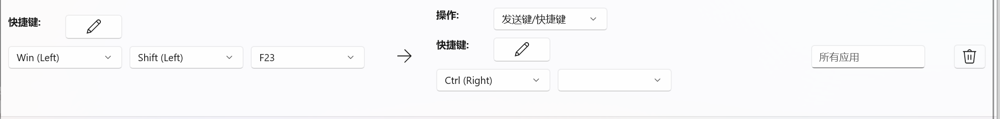
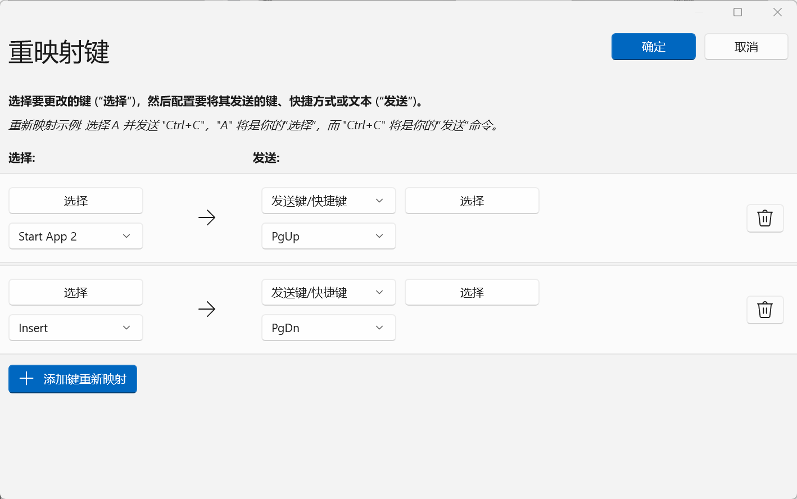

> 原文链接：https://blog.csdn.net/TeleostNaCl/article/details/153849193
> 发布时间：2025-10-24 23:05:20
> 标签：1024程序员节、经验分享、windows、计算机外设

---

#### 文章目录

- [一、问题背景](#_1)
- [二、安装 PowerToys](#_PowerToys_16)
- [三、配置快捷键](#_28)
- [四、其它键映射方案](#_48)

## 一、问题背景

最近新换了一台笔记本惠普暗影精灵 11，拿到手之后发现这台电脑没有 右 `ctrl` 键，作为经常使用 `ctrl` + `.` 组合键，在中文输入下切换中文标点和英文标点的功能的时候，在这台电脑上发现极其不舒服，如下图所示：

而在原来的 右 `ctrl` 键的位置变成了由惠普自定义的按键，点击之后会换出快速面板：

实际在使用中觉得这功能很鸡肋，浪费了一个按键，所以在思考能不能映射右 `ctrl` 键，得到一个右 `ctrl` 键，提高方公效率。

因此，本文将介绍使用 `PowerToys` 的键盘管理器工具编辑惠普暗影精灵11 的 ONEN 自定义按键的方法。

参考：<https://blog.csdn.net/TeleostNaCl/article/details/148533808>

## 二、安装 PowerToys

`PowerToys` 是由微软开发的适用于 `Windows` 平台用于自定义 `Windows` 的实用工具：<https://learn.microsoft.com/zh-cn/windows/powertoys/>。

本文将用到 `PowerToy` 中的 [键盘管理器工具](https://learn.microsoft.com/zh-cn/windows/powertoys/#keyboard-manager)。

参考官方的安装文档：<https://learn.microsoft.com/zh-cn/windows/powertoys/install>，有以下三种方式进行安装  
 

本文使用 `Microsoft Store` 进行安装，直接在 `Microsoft Store` 中搜索 `PowerToys`，在结果页面中点击安装即可。

## 三、配置快捷键

安装完成之后，在开始菜单中找到 `PowerToys`，然后双击运行。  
 

首次打开将会出现`欢迎页`，点击打开设置即可跳转到全部功能的`设置页`。

切换到 `设置页` 之后，点卡 `输入/输出` 菜单，点击 `键盘管理器`，并将 `启用键盘管理器` 的开关打开，此时将会启用键盘管理器的功能。

点击重新映射按键，随后点击 `添加快捷方式重新映射` 新增按键映射，此时会增加一条新条目：  
   
 点击快捷键的编辑，点击 OMEN 的自定义按键，此时可以看到，这个按键的键值为 `Win(Left)` + `Shitf(Left)` + `F23` 的组合键。  
   
 操作中选择 `发送键/快捷键`，同时由于没有右ctrl键，我们可以在映射的列表中手动选择 `Ctrl(Right)`，之后点确定保存即可，如下图：  
   
 此时，此功能键就已经被映射成右 `ctrl` 键了。在配合其它按键形成其它组合键功能。

## 四、其它键映射方案

在键盘的右上角有一个计算器的快捷键，这个按键也不怎么常用，同时 `INSERT` 键也不是常用的键，而对于我来说，`Pg Up` 和 `Pg Down` 翻页按钮较为常用，因此我这里映射为翻页键。（也可以根据需要映射成其它按键）

在 `重新影射键` 中重新映射了这两个键。（`Start App 2` 即使计算器的按键）  
 
