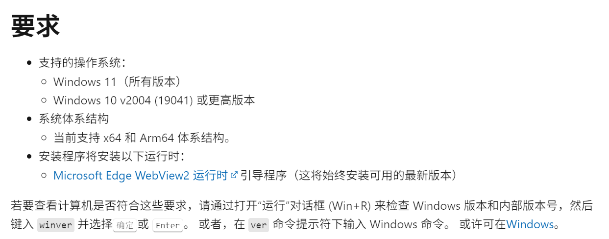

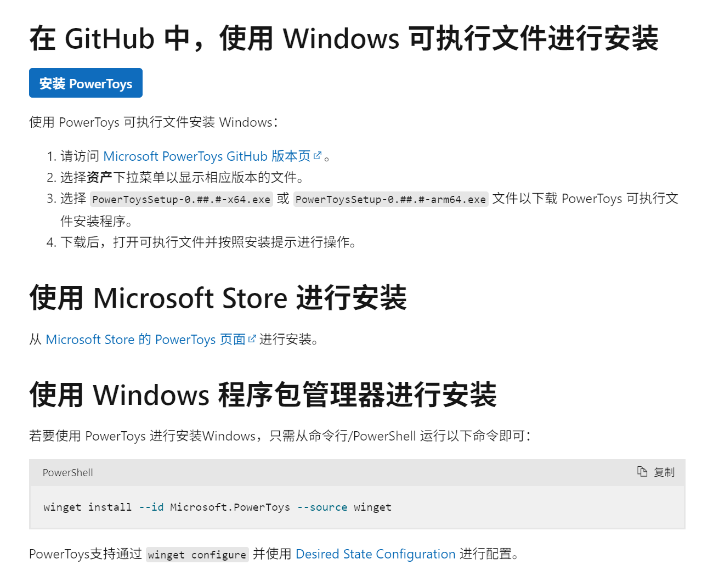
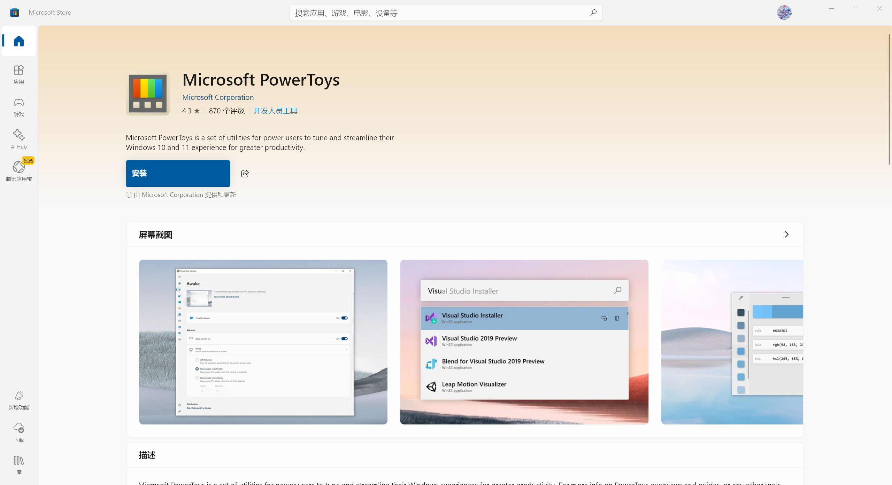
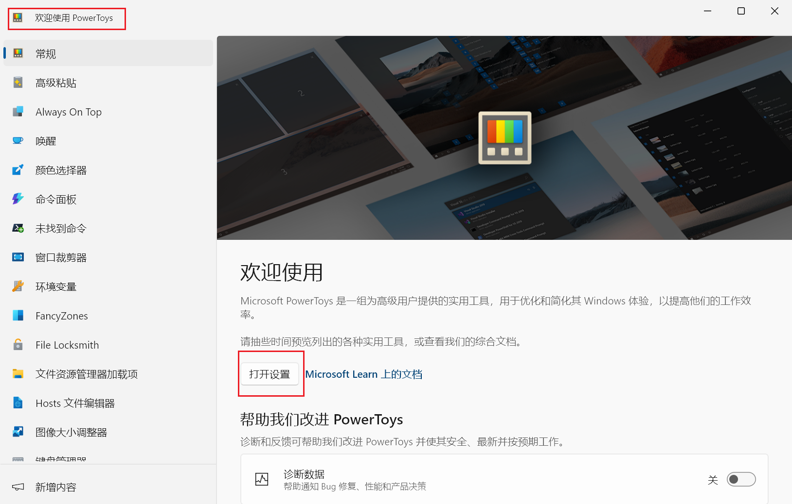
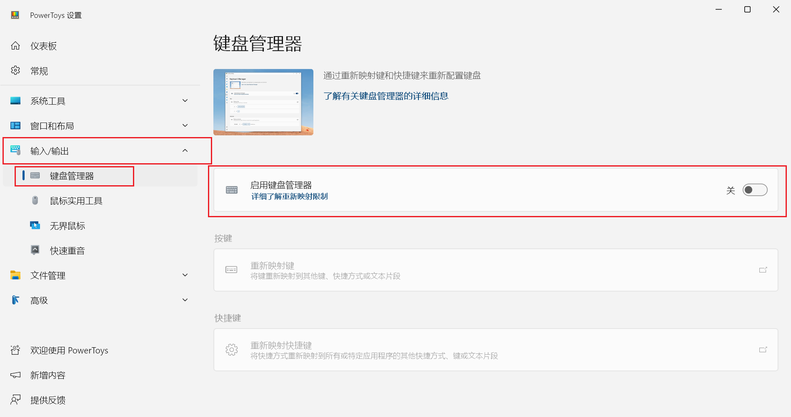
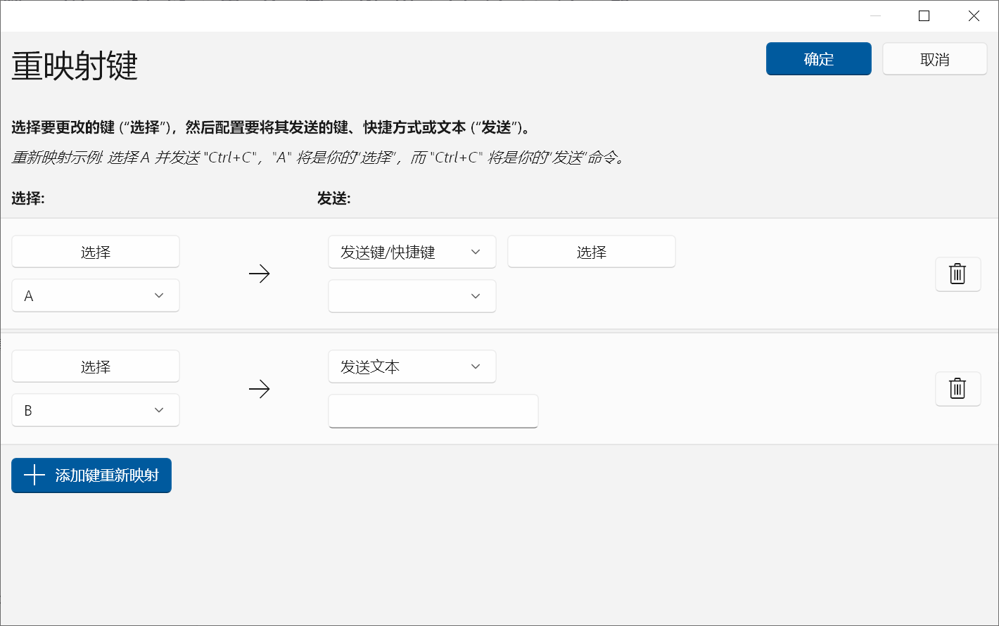
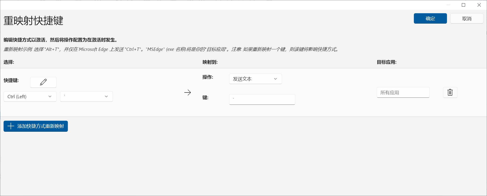
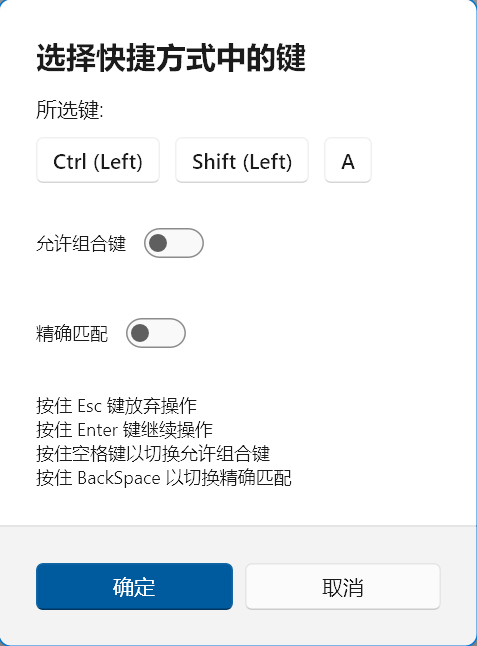
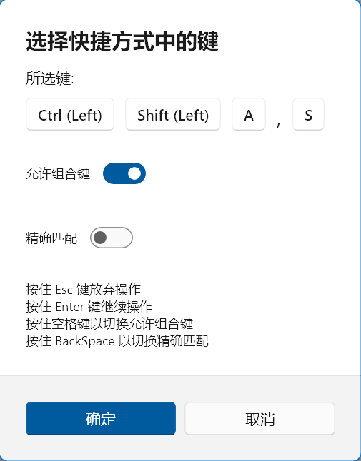

@[TOC]

# 一、问题背景

在之前的一篇文章中介绍了使用 `Java` 程序实现快捷键输入字符的方式（[https://blog.csdn.net/TeleostNaCl/article/details/148158298](https://blog.csdn.net/TeleostNaCl/article/details/148158298)），其原理是利用 后台常驻的 `Java` 应用实现监听快捷键的方式，将指定内容写入 `剪贴板` 中，再使用 `Robot` 类模拟 `ctrl` + `V` 进行粘贴，实现按下快捷键输入指定内容。但是此问题存在一定的技术门槛，且由于 `Java Api` 的限制，其对 `剪贴板` 有一定的侵入性，因此不具有广泛的适用性。

本文将介绍使用 `Windows` 官方出品的 `PowerToys` 中的键盘管理器工具重新映射按键，去实现设置指定快捷键快速输出指定内容的方式。

> 由于 `PowerToys` 需要在 Windows 10 v2004之后的 64位版本运行，因此此方法也仅适用于Windows 10 v2004之后的 64位版本
> 

# 二、安装 PowerToys

`PowerToys` 是由微软开发的适用于 `Windows` 平台用于自定义 `Windows` 的实用工具：[https://learn.microsoft.com/zh-cn/windows/powertoys/](https://learn.microsoft.com/zh-cn/windows/powertoys/)。
如官方文档描述，当前 PowerToy 可用的工具如下：

而本文将用到 `PowerToy` 中的 [键盘管理器工具](https://learn.microsoft.com/zh-cn/windows/powertoys/#keyboard-manager)。

参考官方的安装文档：[https://learn.microsoft.com/zh-cn/windows/powertoys/install](https://learn.microsoft.com/zh-cn/windows/powertoys/install)，有以下三种方式进行安装

本文使用 `Microsoft Store` 进行安装，直接在 `Microsoft Store` 中搜索 `PowerToys`，在结果页面中点击安装即可。

# 三、配置快捷键

安装完成之后，在开始菜单中找到 `PowerToys`，然后双击运行。

首次打开将会出现`欢迎页`，点击打开设置即可跳转到全部功能的`设置页`。

切换到 `设置页` 之后，点卡 `输入/输出` 菜单，点击 `键盘管理器`，并将 `启用键盘管理器` 的开关打开，此时将会启用键盘管理器的功能。

此时 `重新映射按键` 和 `重新映射快捷键` 的选项将会被启用，点击即可开始配置相关按键的组合，并输出指定的按键组合。
其中 `重新映射按键` 功能指的是单个按键的映射，其可以实现对单个按键映射成 其他按键或组合键，或发送一段文本。

`重新映射快捷键` 功能则指的是多个按键的映射，其可以实现对单个按键映射成 其他按键或组合键，或发送一段文本。

这里的 `允许组合键` 功能指的是是否可以添加多个字母的组合。如果未开启 `允许组合键`，则输入中只能包含一个字母，而当打开时，则允许组合多个字母的按键。如下图所示

