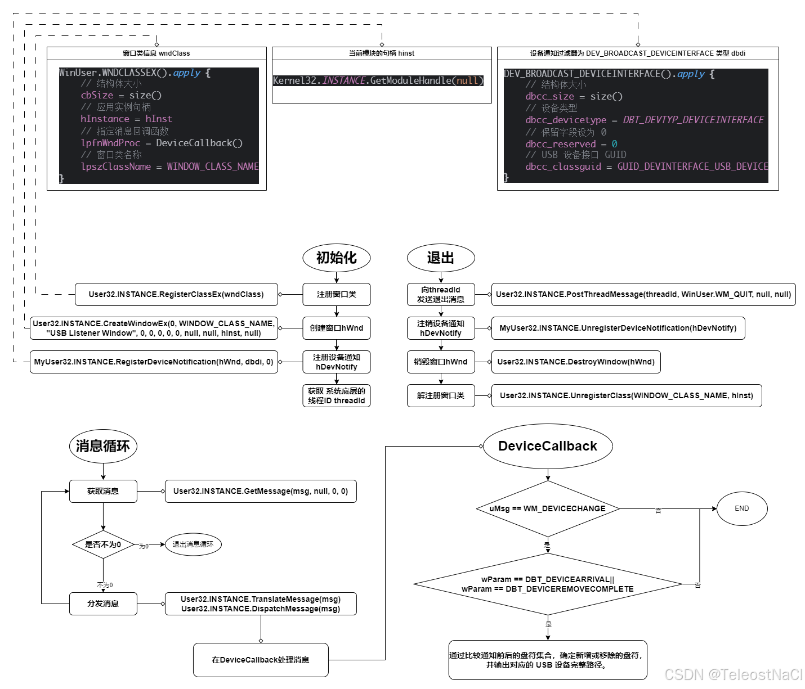

@[toc]
# 一、需求背景
在 Windows 系统上，检测 USB 设备的插入和移除可以通过 Windows API 来实现。Java 语言本身不提供直接的 API 访问这些系统功能，但可以借助 JNA (Java Native Access) 进行调用。本篇文章介绍了一种使用 JNA 监听 USB 设备插拔事件的实现方式。

# 二、核心代码
```kt
import com.sun.jna.Native
import com.sun.jna.Structure
import com.sun.jna.platform.win32.DBT.*
import com.sun.jna.platform.win32.Guid
import com.sun.jna.platform.win32.Kernel32
import com.sun.jna.platform.win32.User32
import com.sun.jna.platform.win32.WinBase.DRIVE_REMOVABLE
import com.sun.jna.platform.win32.WinDef
import com.sun.jna.platform.win32.WinDef.HWND
import com.sun.jna.platform.win32.WinNT
import com.sun.jna.platform.win32.WinUser
import com.sun.jna.platform.win32.WinUser.WM_DEVICECHANGE
import com.sun.jna.win32.StdCallLibrary
import com.sun.jna.win32.W32APIOptions

/**
 * 监听U盘 插入 移除 的线程
 *
 * 1. 注册一个窗口类并创建窗口，该窗口用于接收设备通知消息。
 * 2. 通过 RegisterDeviceNotification 注册设备通知，过滤器为 DEV_BROADCAST_DEVICEINTERFACE 类型。
 * 3. 启动消息循环处理 Windows 消息。
 */
private class ListenUSBFlashDiskStateThread : Thread() {

    companion object {
        /**
         * USB 设备接口的 GUID（标准定义）
         */
        private val GUID_DEVINTERFACE_USB_DEVICE by lazy { Guid.GUID("{A5DCBF10-6530-11D2-901F-00C04FB951ED}") }

        /**
         * 定义窗口类名称
         */
        private const val WINDOW_CLASS_NAME = "UsbListener"

        /**
         * 当前模块句柄
         */
        private val hInst by lazy { Kernel32.INSTANCE.GetModuleHandle(null) }

        /**
         * 窗口类信息
         */
        private val wndClass by lazy {
            WinUser.WNDCLASSEX().apply {
                // 结构体大小
                cbSize = size()
                // 应用实例句柄
                hInstance = hInst
                // 指定消息回调函数
                lpfnWndProc = DeviceCallback()
                // 窗口类名称
                lpszClassName = WINDOW_CLASS_NAME
            }
        }


        // 配置设备通知过滤器为 DEV_BROADCAST_DEVICEINTERFACE 类型
        private val dbdi by lazy {
            DEV_BROADCAST_DEVICEINTERFACE().apply {
                // 结构体大小
                dbcc_size = size()
                // 设备类型
                dbcc_devicetype = DBT_DEVTYP_DEVICEINTERFACE
                // 保留字段设为 0
                dbcc_reserved = 0
                // USB 设备接口 GUID
                dbcc_classguid = GUID_DEVINTERFACE_USB_DEVICE
            }
        }
    }

    /**
     * 该监听u盘插拔事件的 在系统底层的 ID
     */
    private var threadId = 0

    /**
     * 窗口的实例
     */
    private var hWnd: HWND? = null

    /**
     * 设备通知
     */
    private var hDevNotify: WinUser.HDEVNOTIFY? = null

    /**
     * 初始化窗口信息
     */
    private fun initWindow() {
        // 注册窗口类
        if (User32.INSTANCE.RegisterClassEx(wndClass).toLong() == 0L) {
            throw RuntimeException("RegisterClassEx Failed!")
        }

        // 创建窗口（窗口不需要显示，因此使用 0 作为样式和尺寸参数）
        hWnd = User32.INSTANCE.CreateWindowEx(0, WINDOW_CLASS_NAME, "USB Listener Window", 0, 0, 0, 0, 0, null, null, hInst, null)
        if (hWnd == null) {
            throw RuntimeException("CreateWindowEx Failed!")
        }

        // 注册设备通知，注意：窗口句柄下只能使用 DEV_BROADCAST_DEVICEINTERFACE
        hDevNotify = MyUser32.INSTANCE.RegisterDeviceNotification(hWnd, dbdi, 0)
        if (hDevNotify == null) {
            val err = Kernel32.INSTANCE.GetLastError()
            throw RuntimeException("RegisterDeviceNotification Failed! $err")
        }

        // 获取 该监听u盘插拔事件的 在系统底层的 ID
        threadId = Kernel32.INSTANCE.GetCurrentThreadId()
    }

    private fun destroyWindow() {
        // 程序退出前注销设备通知
        if (!MyUser32.INSTANCE.UnregisterDeviceNotification(hDevNotify)) {
            throw RuntimeException("UnregisterDeviceNotification Failed!")
        }

        // 销毁窗口
        if (!User32.INSTANCE.DestroyWindow(hWnd)) {
            throw RuntimeException("DestroyWindow Failed!")
        }

        // 解注册窗口类
        if (!User32.INSTANCE.UnregisterClass(WINDOW_CLASS_NAME, hInst)) {
            throw RuntimeException("UnregisterClass Failed!")
        }
    }

    override fun run() {
        // 初始化 和 结束 要在同一线程中 才能获取到消息
        initWindow()

        // 消息循环，等待并分发 Windows 消息
        val msg = WinUser.MSG()
        while (User32.INSTANCE.GetMessage(msg, null, 0, 0) != 0) {
            User32.INSTANCE.TranslateMessage(msg)
            User32.INSTANCE.DispatchMessage(msg)
        }

        // 销毁Window
        destroyWindow()
    }

    override fun interrupt() {
        super.interrupt()

        // 发送退出的消息 结束此线程
        User32.INSTANCE.PostThreadMessage(threadId, WinUser.WM_QUIT, null, null)
    }
}

/**
 * DEV_BROADCAST_DEVICEINTERFACE 结构体定义
 *
 * 此结构体用于注册设备接口通知，
 * 当设备发生插拔时，系统会发送包含此结构体的消息。
 */
@Structure.FieldOrder("dbcc_size", "dbcc_devicetype", "dbcc_reserved", "dbcc_classguid", "dbcc_name")
internal class DEV_BROADCAST_DEVICEINTERFACE : Structure() {
    @JvmField
    var dbcc_size: Int = 0

    @JvmField
    var dbcc_devicetype: Int = 0

    @JvmField
    var dbcc_reserved: Int = 0

    @JvmField
    var dbcc_classguid: Guid.GUID = Guid.GUID()

    // 固定大小缓冲区，通常足以存放设备接口路径（虽然这里不直接使用）
    @JvmField
    var dbcc_name: ByteArray = ByteArray(260)
}

/**
 * 自定义 User32 接口，包含设备通知相关 API
 *
 * RegisterDeviceNotification 和 UnregisterDeviceNotification 均存在于 Windows 的 User32 库中，
 * 通过 JNA 调用相应函数实现设备通知注册与注销。
 */
private interface MyUser32 : StdCallLibrary {

    companion object {
        val INSTANCE: MyUser32 = Native.load("user32", MyUser32::class.java, W32APIOptions.DEFAULT_OPTIONS)
    }

    fun RegisterDeviceNotification(hRecipient: WinNT.HANDLE?, notificationFilter: Structure?, flags: Int): WinUser.HDEVNOTIFY?

    fun UnregisterDeviceNotification(handle: WinUser.HDEVNOTIFY?): Boolean
}

/**
 * 设备消息处理回调函数
 *
 * 说明：
 * 1. 由于窗口句柄下只能注册 DEV_BROADCAST_DEVICEINTERFACE，
 *    收到的通知中无法直接获得盘符信息，所以采用枚举逻辑驱动器的方法。
 * 2. 当收到设备插入（DBT_DEVICEARRIVAL）或拔出（DBT_DEVICEREMOVECOMPLETE）消息时，
 *    程序延时一段时间等待系统完成挂载或卸载，然后重新枚举可移动盘符。
 * 3. 通过比较通知前后的盘符集合，确定新增或移除的盘符，并输出对应的 USB 设备完整路径。
 */
private class DeviceCallback : WinUser.WindowProc {
    override fun callback(
        hwnd: WinDef.HWND?, uMsg: Int,
        wParam: WinDef.WPARAM?, lParam: WinDef.LPARAM?,
    ): WinDef.LRESULT {
        if (uMsg == WM_DEVICECHANGE) {
            when (wParam?.toInt()) {
                DBT_DEVICEARRIVAL, DBT_DEVICEREMOVECOMPLETE -> {
                    // 调用回调 计算 接入 或 移除的u盘
                    // TODO 这里调用 getRemovableDrives 获取当前接入的设备, 然后比价原来的列表, 计算出新接入或拔出的U盘
                }
            }
        }

        // 调用缺省的窗口消息处理
        return User32.INSTANCE.DefWindowProc(hwnd, uMsg, wParam, lParam)
    }
}

    /**
     * 枚举当前系统中所有可移动盘符。
     * 通过 Java 标准库 File.listRoots() 获取所有盘符，
     * 然后调用 Kernel32.INSTANCE.GetDriveType() 过滤出 DRIVE_REMOVABLE 类型的盘符。
     *
     * @return 包含所有可移动盘符的集合
     */
    fun getRemovableDrives(): Set<String> {
        val drives = mutableSetOf<String>()
        File.listRoots().forEach { root ->
            // 使用绝对路径（例如 "F:\"）调用 GetDriveType 获取驱动器类型
            val driveType = Kernel32.INSTANCE.GetDriveType(root.absolutePath)
            if (driveType == DRIVE_REMOVABLE) {
                drives.add(root.absolutePath)
            }
        }
        return drives
    }
```

# 三、流程图


# 四、代码解析
## 1. 实现思路
1. 注册一个隐藏窗口 作为消息接收器。
2. 使用 RegisterDeviceNotification 注册设备通知，监听`DEV_BROADCAST_DEVICEINTERFACE` 事件。
3. 启动 Windows 消息循环 以等待 USB 设备的插入或移除通知。
4. 使用回调函数处理 `WM_DEVICECHANGE` 事件 并获取可移动存储设备的盘符
5. 比较设备变更前后的可移动盘符集合，得出新增或移除的设备。

## 2. 定义JNA接口代码
Windows 定义的 USB 设备接口 GUID `{A5DCBF10-6530-11D2-901F-00C04FB951ED}`，代表所有 USB 设备。
```kt
private val GUID_DEVINTERFACE_USB_DEVICE by lazy { Guid.GUID("{A5DCBF10-6530-11D2-901F-00C04FB951ED}") }
```


`DEV_BROADCAST_DEVICEINTERFACE` 结构体定义
此结构体用于注册设备接口通知， 当设备发生插拔时，系统会发送包含此结构体的消息。
```kt
@Structure.FieldOrder("dbcc_size", "dbcc_devicetype", "dbcc_reserved", "dbcc_classguid", "dbcc_name")
internal class DEV_BROADCAST_DEVICEINTERFACE : Structure() {
    @JvmField
    var dbcc_size: Int = 0

    @JvmField
    var dbcc_devicetype: Int = 0

    @JvmField
    var dbcc_reserved: Int = 0

    @JvmField
    var dbcc_classguid: Guid.GUID = Guid.GUID()

    // 固定大小缓冲区，通常足以存放设备接口路径（虽然这里不直接使用）
    @JvmField
    var dbcc_name: ByteArray = ByteArray(260)
}
```

`MyUser32` 接口定义了 `Windows User32.dll` 中的设备通知 API，允许我们注册和注销设备通知。
MyUser32 继承自 StdCallLibrary，用于封装 Windows User32.dll 提供的 设备通知 API。`RegisterDeviceNotification` 和 `UnregisterDeviceNotification` 均存在于 Windows 的 User32 库中。
在 Java/Kotlin + JNA 代码中，`StdCallLibrary` 主要用于调用 Windows API（遵循 stdcall 调用约定）。
```kt
private interface MyUser32 : StdCallLibrary {
    companion object {
        val INSTANCE: MyUser32 = Native.load("user32", MyUser32::class.java, W32APIOptions.DEFAULT_OPTIONS)
    }

    fun RegisterDeviceNotification(hRecipient: WinNT.HANDLE?, notificationFilter: Structure?, flags: Int): WinUser.HDEVNOTIFY?

    fun UnregisterDeviceNotification(handle: WinUser.HDEVNOTIFY?): Boolean
}
```

当前模块（即应用程序）的 实例句柄（HINSTANCE）。
在 Windows API 中，`HINSTANCE` 代表当前可执行程序（或 DLL）的内存地址空间。在 Java 使用 JNA 访问 Windows API 时，需要传递这个句柄给某些函数（如 `RegisterClassEx`），以便正确注册窗口。
```kt
private val hInst by lazy { Kernel32.INSTANCE.GetModuleHandle(null) }
```

窗口类信息 用于注册一个 窗口类（Window Class），从而可以创建窗口并接收 Windows 消息。
```kt
private val wndClass by lazy {
    WinUser.WNDCLASSEX().apply {
        // 结构体大小
        cbSize = size()
        // 应用实例句柄
        hInstance = hInst
        // 指定消息回调函数
        lpfnWndProc = DeviceCallback()
        // 窗口类名称
        lpszClassName = WINDOW_CLASS_NAME
    }
}
```

配置设备通知过滤器为 `DEV_BROADCAST_DEVICEINTERFACE` 类型
注册设备通知（RegisterDeviceNotification） 才能监听 USB 设备事件。
这个 dbdi 结构体定义了监听规则，告诉 Windows 只关注 USB 设备的插拔事件，而不是监听所有设备变化。
```kt
private val dbdi by lazy {
    DEV_BROADCAST_DEVICEINTERFACE().apply {
        // 结构体大小
        dbcc_size = size()
        // 设备类型
        dbcc_devicetype = DBT_DEVTYP_DEVICEINTERFACE
        // 保留字段设为 0
        dbcc_reserved = 0
        // USB 设备接口 GUID
        dbcc_classguid = GUID_DEVINTERFACE_USB_DEVICE
    }
}
```
## 2. 初始化代码
首先注册窗口`User32.INSTANCE.RegisterClassEx`
然后再创建窗口`User32.INSTANCE.CreateWindowEx`，并记录创建出来的`HWND`类
再注册设备通知`MyUser32.INSTANCE.RegisterDeviceNotification`，并记录`WinUser.HDEVNOTIFY`类
最后调用`Kernel32.INSTANCE.GetCurrentThreadId()`获取当前线程在底层的线程

```kt
// 注册窗口类
if (User32.INSTANCE.RegisterClassEx(wndClass).toLong() == 0L) {
    throw RuntimeException("RegisterClassEx Failed!")
}

// 创建窗口（窗口不需要显示，因此使用 0 作为样式和尺寸参数）
hWnd = User32.INSTANCE.CreateWindowEx(0, WINDOW_CLASS_NAME, "USB Listener Window", 0, 0, 0, 0, 0, null, null, hInst, null)
if (hWnd == null) {
    throw RuntimeException("CreateWindowEx Failed!")
}

// 注册设备通知，注意：窗口句柄下只能使用 DEV_BROADCAST_DEVICEINTERFACE
hDevNotify = MyUser32.INSTANCE.RegisterDeviceNotification(hWnd, dbdi, 0)
if (hDevNotify == null) {
    val err = Kernel32.INSTANCE.GetLastError()
    throw RuntimeException("RegisterDeviceNotification Failed! $err")
}

// 获取 该监听u盘插拔事件的 在系统底层的 ID
threadId = Kernel32.INSTANCE.GetCurrentThreadId()
```
## 3. 核心代码
该方法的实现核心: 注册USB 设备接口的 GUID `{A5DCBF10-6530-11D2-901F-00C04FB951ED}` 的设备通知，然后再轮询并分发Windows的消息，在 `WinUser.WindowProc` 过滤 `WM_DEVICECHANGE` 的消息，再判断参数 `wParam` 是`DBT_DEVICEARRIVAL` 和 `DBT_DEVICEREMOVECOMPLETE` 的事件，此时回调获取当前已连接的设备，然后再与之前的设备列表进行比较，得到的差异即是此前接收到事件所接入或拔出的u盘。

消息循环，等待并分发 Windows 消息
```kt
val msg = WinUser.MSG()
while (User32.INSTANCE.GetMessage(msg, null, 0, 0) != 0) {
    User32.INSTANCE.TranslateMessage(msg)
    User32.INSTANCE.DispatchMessage(msg)
}
```

设备消息处理回调函数
说明：由于窗口句柄下只能注册 `DEV_BROADCAST_DEVICEINTERFACE`，收到的通知中无法直接获得盘符信息，所以采用枚举逻辑驱动器的方法。
当收到设备插入（`DBT_DEVICEARRIVAL`）或拔出（`DBT_DEVICEREMOVECOMPLETE`）消息时，程序延时一段时间等待系统完成挂载或卸载，然后重新枚举可移动盘符。通过比较通知前后的盘符集合，确定新增或移除的盘符，并输出对应的 USB 设备完整路径。
```kt
private class DeviceCallback : WinUser.WindowProc {
    override fun callback(
        hwnd: WinDef.HWND?, uMsg: Int,
        wParam: WinDef.WPARAM?, lParam: WinDef.LPARAM?,
    ): WinDef.LRESULT {
        if (uMsg == WM_DEVICECHANGE) {
            when (wParam?.toInt()) {
                DBT_DEVICEARRIVAL, DBT_DEVICEREMOVECOMPLETE -> {
                	// 调用回调 计算 接入 或 移除的u盘
                    // TODO 这里调用 getRemovableDrives 获取当前接入的设备, 然后比价原来的列表, 计算出新接入或拔出的U盘
                }
            }
        }

        // 调用缺省的窗口消息处理
        return User32.INSTANCE.DefWindowProc(hwnd, uMsg, wParam, lParam)
    }
}
```


枚举当前系统中所有可移动盘符。通过 Java 标准库 `File.listRoots()` 获取所有盘符， 然后调用 `Kernel32.INSTANCE.GetDriveType()` 过滤出 `DRIVE_REMOVABLE` 类型的盘符，即是当前连接的U盘
```kt
fun getRemovableDrives(): Set<String> {
    val drives = mutableSetOf<String>()
    File.listRoots().forEach { root ->
        // 使用绝对路径（例如 "F:\"）调用 GetDriveType 获取驱动器类型
        val driveType = Kernel32.INSTANCE.GetDriveType(root.absolutePath)
        if (driveType == DRIVE_REMOVABLE) {
            drives.add(root.absolutePath)
        }
    }
    return drives
}
```
## 4.  结束代码
当需要结束掉监听时，需要先向线程发送结束的消息，使用 `User32.INSTANCE.PostThreadMessage` 发送消息，传递 `WinUser.WM_QUIT` 参数，此时 `User32.INSTANCE.GetMessage` 会返回0，上面核心代码中的消息循环代码将退出，不再监听Windows的消息。
```kt
User32.INSTANCE.PostThreadMessage(threadId, WinUser.WM_QUIT, null, null)
```

随后注销设备通知 `MyUser32.INSTANCE.UnregisterDeviceNotification`
再销毁窗口 `User32.INSTANCE.DestroyWindow(hWnd)`
最后解注册窗口 `User32.INSTANCE.UnregisterClass`

# 五、其它说明
以上调用JNA的代码需要在同一个线程执行，不可以跨线程访问。

## [JNA](https://github.com/java-native-access/jna)
源码路径: `https://github.com/java-native-access/jna`

`Java Native Access (JNA)` 是一个Java库，它允许Java程序直接调用本机共享库（Shared Libraries），而无需编写任何`JNI（Java Native Interface`）或本机代码。
## JNA依赖导入
```groovy
def jna_version = '5.16.0'

implementation "net.java.dev.jna:jna:$jna_version"
implementation "net.java.dev.jna:jna-platform:$jna_version"
```

## JNA混淆规则
```pro
# 保留 jna 的核心类和接口
-keep class com.sun.jna.** { *; }
```
