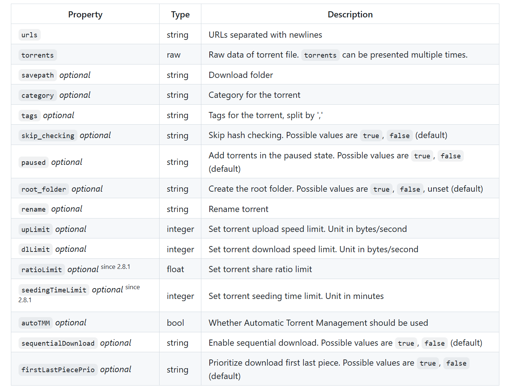
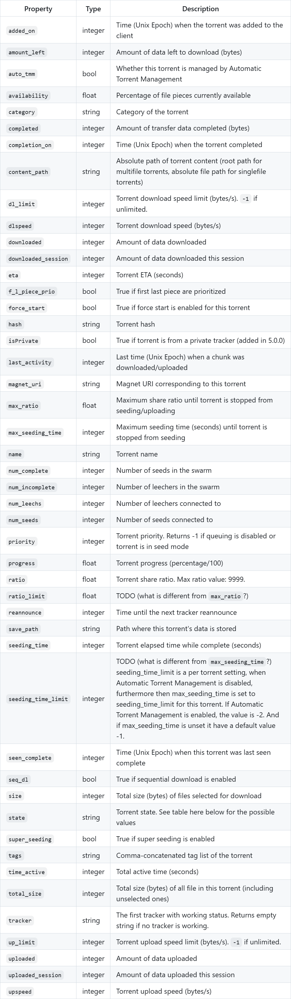
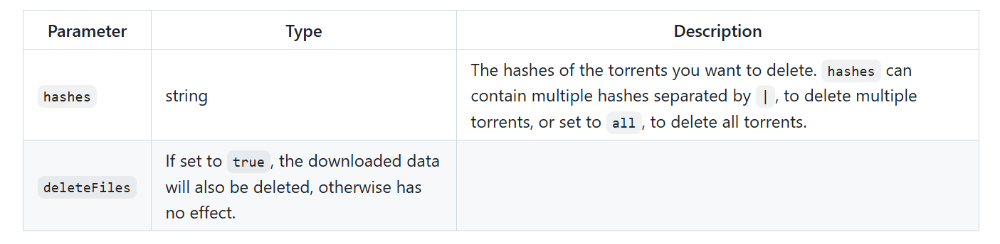
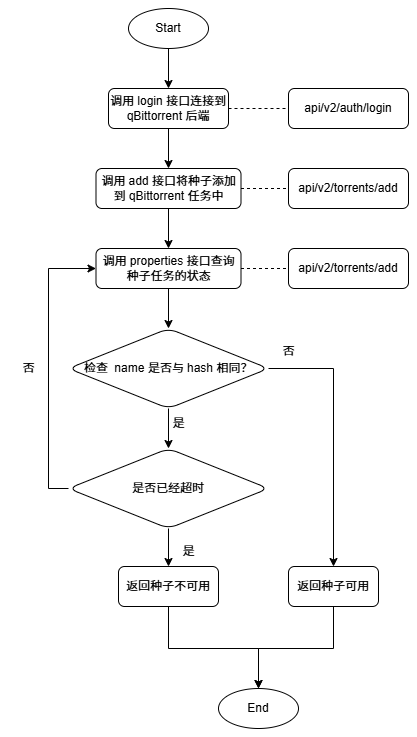

> 原文链接：https://blog.csdn.net/TeleostNaCl/article/details/152415545
> 发布时间：2025-10-02 19:54:57
> 标签：经验分享、电脑、windows、java、kotlin

---

#### 文章目录

- [一、问题背景](#_1)
- [二、WebUI API 介绍](#WebUI_API__4)
- - [1. login 接口：api/v2/auth/login](#1_login_apiv2authlogin_8)
  - [2. add 接口：api/v2/torrents/add](#2_add_apiv2torrentsadd_23)
  - [3. properties 接口：api/v2/torrents/properties](#3_properties_apiv2torrentsproperties_33)
  - [4. delete 接口：api/v2/torrents/delete](#4_delete_apiv2torrentsdelete_39)
- [三、流程图](#_44)
- [四、代码实现](#_47)
- - [1. Retrofit 接口定义](#1_Retrofit__48)
  - [2. Repo类](#2_Repo_104)

## 一、问题背景

之前有利用 `atomashpolskiy/bt`：<https://github.com/atomashpolskiy/bt> 的 `Java` 库实现了用 `Java / Kotlin` 编写检测BT种子的磁力链接是否有可用 `peers` 的程序: <https://blog.csdn.net/TeleostNaCl/article/details/151051936>。由于使用的开源库，功能没有 `qBittorrent` 的那么丰富，导致有些种子在 `qBittorrent` 中可以使用的，但是在检测程序中报告无法下载，从而造成误判断。而 `qBittorrent` 提供了丰富的 `WebUI` 的 `API`，是我们可以通过直接调用相关 `API` 而使用 `qBittorrent` 的功能。因此，本文将详细介绍使用 `Kotlin` 代码，使用 `Retrofit` 的响应式风格调用 `qBittorrent` 的 `API` 去检查BT种子的磁力链接是否可用的程序。

## 二、WebUI API 介绍

详细的官方介绍文档如下：[https://github.com/qbittorrent/qBittorrent/wiki/WebUI-API-(qBittorrent-5.0)](https://github.com/qbittorrent/qBittorrent/wiki/WebUI-API-%28qBittorrent-5.0%29)

我们在此功能中只会用到四个接口（`login` 接口，`add` 接口，`properties`接口，`delete` 接口），本文将详细介绍他们的用法，其它接口可以参阅详细的官方介绍文档。

### 1. login 接口：api/v2/auth/login

[https://github.com/qbittorrent/qBittorrent/wiki/WebUI-API-(qBittorrent-5.0)#login](https://github.com/qbittorrent/qBittorrent/wiki/WebUI-API-%28qBittorrent-5.0%29#login)  
 首先，我们需要调用 `login` 接口（`api/v2/auth/login`），使用 `POST` 方法传递用户名和账户，此时将尝试登录，如果登录成功，则会得到 `Cookies` 信息，此 `Cookies` 信息将会在后面调用其它接口的时候被传递作为身份凭证。

例如，官方示例如下：

```shell
curl -i --header 'Referer: http://localhost:8080' --data 'username=admin&password=adminadmin' http://localhost:8080/api/v2/auth/login

HTTP/1.1 200 OK
Content-Encoding:
Content-Length: 3
Content-Type: text/plain; charset=UTF-8
Set-Cookie: SID=hBc7TxF76ERhvIw0jQQ4LZ7Z1jQUV0tQ; path=/
```

### 2. add 接口：api/v2/torrents/add

[https://github.com/qbittorrent/qBittorrent/wiki/WebUI-API-(qBittorrent-5.0)#add-new-torrent](https://github.com/qbittorrent/qBittorrent/wiki/WebUI-API-%28qBittorrent-5.0%29#add-new-torrent)  
 此接口是向 `qBittorrent` 中添加一个种子以便下载的核心接口，其使用 `POST` 方法可以传递多个参数，以适应不同的需求，详细的介绍如下：  
   
 我们这里需要用到四个参数：  
 `urls`：磁力链链接。为了便于程序的编写，我们只检测磁力连接形如 `magnet:?xt=urn:btih:<info-hash>` 的种子，因此我们使用 `urls` 参数。  
 `paused`：传递 `true`，使种子处于暂停状态。由于我们只需要检查其可用性，所以需要使其处于暂停状态。  
 `skip_checking`：传递 `true`，我们不需要下载文件，所以不需要 `hash` 校验。  
 `tags`：此参数可选。其可以给种子下载任务添加一个标签，将检测种子可用的任务与其它任务进行区分。使用 `,` 可以分割多个标签。

### 3. properties 接口：api/v2/torrents/properties

[https://github.com/qbittorrent/qBittorrent/wiki/WebUI-API-(qBittorrent-5.0)#get-torrent-generic-properties](https://github.com/qbittorrent/qBittorrent/wiki/WebUI-API-%28qBittorrent-5.0%29#get-torrent-generic-properties)  
 此接口是查询种子状态的核心方法，使用 `GET` 方法传递种子的 `Hash` 值，其可以获取种子的大部分信息，参数如下：  
   
 我们检验种子有效性的时候，可以使用是否可以获取到种子元信息作为依据，而对于大部分种子来说，当未获取到元信息的时候，`name` 参数为种子的 `hash` 值，当获取到元信息之后，`name` 参数会将会使用种子名。因此，为了程序的简易性，我们将使用此作为种子是否可用的依据，基本可以涵盖大部分场景。在使用中，我们将定时轮询此接口，获取种子信息，一旦种子获取到元信息，我们即可返回种子可用。否则等超时之后（即在指定时间内都无法获取到元信息），则认为种子不可用。

### 4. delete 接口：api/v2/torrents/delete

[https://github.com/qbittorrent/qBittorrent/wiki/WebUI-API-(qBittorrent-5.0)#delete-torrents](https://github.com/qbittorrent/qBittorrent/wiki/WebUI-API-%28qBittorrent-5.0%29#delete-torrents)  
 此接口用于将种子移除，使用 `POST` 方法，可以传递两个参数，删除指定 `hash` 值的种子任务吗，并指定是否需要移除文件。  
 

## 三、流程图



## 四、代码实现

### 1. Retrofit 接口定义

```kt
class QBRetrofit {
    val retrofit: Retrofit = Retrofit.Builder()
        .baseUrl("WebUI地址")
        .client(OkHttpClient.Builder()
                // 自定义 cookies管理
                .cookieJar(cookieJar)
                .build())
          // Gson 转换器
        .addConverterFactory(GsonConverterFactory.create()).build();
    
    fun qbApi(): QBApi = retrofit.create(QBApi::class.java)
}

interface QBApi {
    /**
     * 登录到 qBittorrent
     */
    @FormUrlEncoded
    @POST("api/v2/auth/login")
    suspend fun login(
        @Field("username") username: String,
        @Field("password") password: String
    ): ResponseBody

    /**
     * 添加磁力链接种子
     */
    @FormUrlEncoded
    @POST("api/v2/torrents/add")
    suspend fun addTorrent(
        @Field("urls") magnetLink: String,
        @Field("paused") paused: String = "true",
        @Field("skip_checking") skipChecking: String = "true",
        @Field("tags") tags: String? = null
    ): ResponseBody

    /**
     * 获取种子详细信息
     */
    @GET("api/v2/torrents/properties")
    suspend fun getTorrentProperties(@Query("hash") hash: String): Response<TorrentProperties>

    /**
     * 删除种子
     */
    @POST("api/v2/torrents/delete")
    @FormUrlEncoded
    fun deleteTorrents(
        @Field("hashes") hashes: String,
        @Field("deleteFiles") deleteFiles: Boolean = true
    ): Call<ResponseBody>
}
```

### 2. Repo类

```kt
/**
 * qBittorrent 的 Repo 类
 */
class QBRepo {

    companion object {
        /**
         * 登录到 qBittorrent 的账户和密码
         */
        private const val USERNAME = "admin"
        private const val PASSWORD = "adminadmin"

        /**
         * 登录成功的信息
         */
        private const val LOGIN_SUCCESS = "Ok."

        /**
         * 测试种子的标签
         */
        private const val TEST_TORRENT_TAG = "Test"

        /**
         * 检查 种子可用性的 默认次数
         */
        private const val CHECK_AVAILABLE_COUNT = 60

        /**
         * 轮询检查种子可用性的 默认时长
         */
        private const val CHECK_AVAILABLE_INTERVAL = 1000L
    }

    private val api by lazy { QBRetrofit().qbApi() }

    /**
     * 检查种子是否可用
     * 
     * @param magnetLink 种子的磁力链
     * @param trackers 额外的tracker
     * @param checkCount 轮询检查种子是否可用的次数
     * @param checkInterval 轮询检查种子是否可用的时间间隔
     */
    suspend fun isTorrentUrlAlive(
        magnetLink: String, trackers: List<String>,
        checkCount: Int = CHECK_AVAILABLE_COUNT,
        checkInterval: Long = CHECK_AVAILABLE_INTERVAL
    ): Boolean = withContext(Dispatchers.IO) {
        var result = false

        // 获取hash值
        val hash = extractHashFromMagnet(magnetLink) ?: return@withContext false

        try {
            // 先尝试登录
            if (!login()) {
                return@withContext false
            }
            
            // 将 tracker 拼接到 磁力链之后
            val torrent = StringBuilder(magnetLink)
            trackers.forEach { tracker ->
                torrent.append("&tr=").append(tracker)
            }

            // 先将种子 以暂停方式 添加到 qBittorrent 中
            api.addTorrent(torrent.toString(), tags = TEST_TORRENT_TAG)

            // 添加进去之后 每秒循环检查种子是否可用
            var i = 0
            while (isActive && i++ < checkCount) {
                // 延迟
                delay(checkInterval)

                // 获取种子的信息
                val properties = api.getTorrentProperties(hash).body()
                val name = properties?.name?.lowercase()
                // 如果名字为空 则继续检查
                if (name.isNullOrBlank()) {
                    continue
                }

                // 如果 种子的名字不是 hash 值 则表示 种子可用 返回true
                if (name != hash) {
                    result = true
                    break
                }
            }
        } catch (e: Exception) {
        } finally {
            try {
                // 检测完成之后 要删除种子
                api.deleteTorrents(hash).execute()
            } catch (_: Exception) {
            }
        }
        
        return@withContext result
    }

    /**
     * 登录到 qBittorrent
     */
    suspend fun login(): Boolean = withContext(Dispatchers.IO) {
        try {
            val response = api.login(USERNAME, PASSWORD)
            val body = response.string()
            body == LOGIN_SUCCESS
        } catch (e: Exception) {
            false
        }
    }

    /**
     * 从磁力链接中提取哈希值
     */
    private fun extractHashFromMagnet(magnetLink: String): String? {
        return magnetLink.split("urn:btih:").getOrNull(1)
            ?.split("&")
            ?.first()?.lowercase()
    }
}
```
