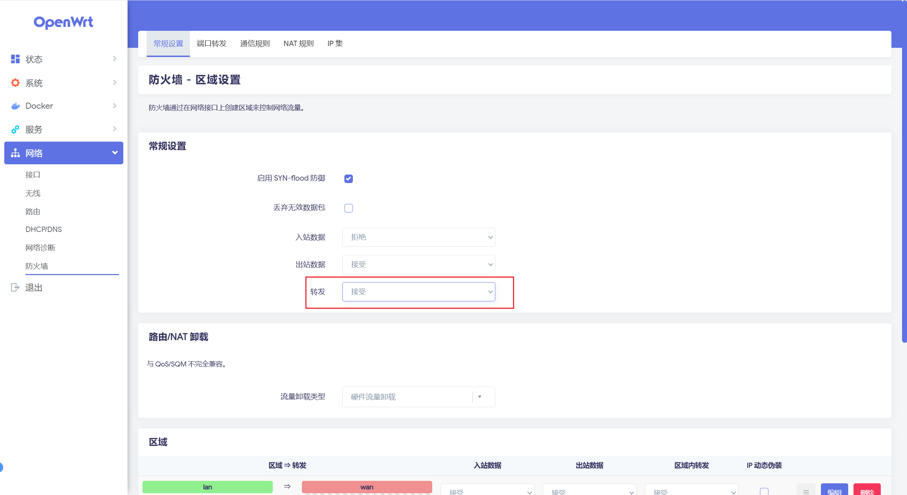
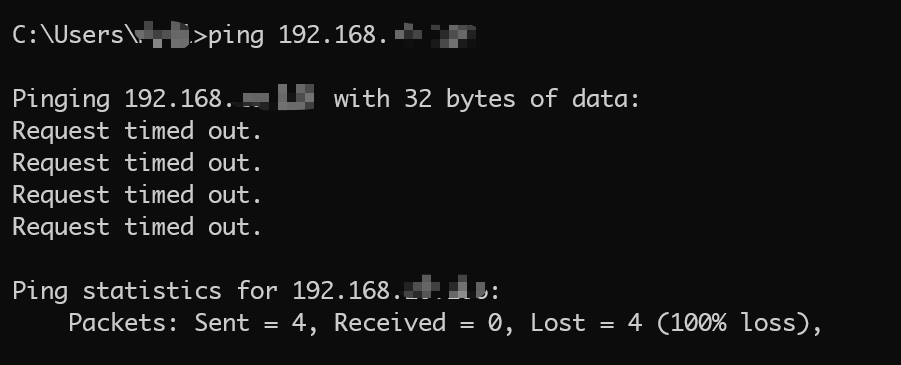
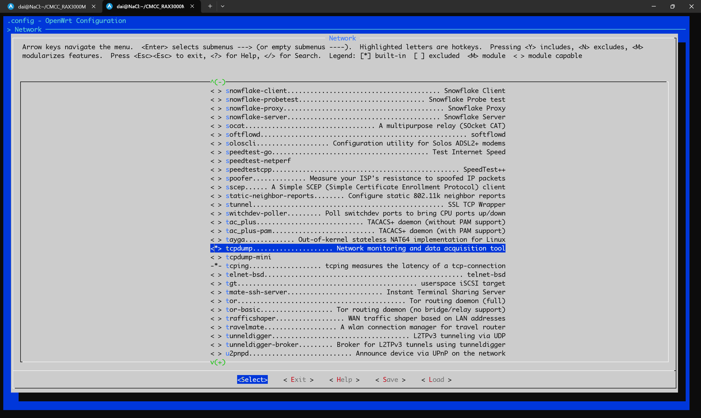

@[TOC]
## 一、问题背景
参考 [OpenWrt as Docker container host](https://openwrt.org/docs/guide-user/virtualization/docker_host) 官方的教程，可以知道只要安装了 `luci-app-dockerman` luci包，即可在 `OpenWrt` 上运行 `docker`，随后就可以安装各类镜像，并部署运行各类容器。


`luci-app-dockerman` 包的位置位于：`LuCI` > `3. Applications`  > `luci-app-dockerman`，勾选编译即可。


但是，安装新镜像之后发现，局域网下的设备之间不能互相访问通信了，而取消勾选`luci-app-dockerman` 包之后重新编译安装，即可互相访问。因此可以推测，这个问题是因为安装 `docker` 之后引起的问题。

本文将详细探寻 OpenWrt 安装 docker 之后局域网的设备之间无法互相访问通信 的原因，并提出一种简单的解决方案。

## 二、解决方案
> 限于笔者目前对 `OpenWrt` 了解还不够深入，暂且用这些方式进行解决。

先直接说解决方案：
### （方法一）修改全局设置的 转发（ forward） 为 接受（ACCEPT）
在 `luci` 管理界面，`网络` > `防火墙` > `防火墙 - 区域设置` > `常规设置` 中，将 `转发` 设置为 `接受` 即可，配置如下：



也可以直接修改配置文件，在 `/etc/config/firewall` 文件中，在 `defaults` 的配置中修改 `forward` 属性为 `ACCEPT`，相关代码如下：
```
config defaults
        option input 'REJECT'
        option output 'ACCEPT'
        option forward 'ACCEPT'
```
### （方法二）设置 net.bridge.bridge-nf-call-iptables=0 并将 docker 的容器网络设置为host
由后文介绍可以知道，发生此问题是由于 `docker` 配置了 `net.bridge.bridge-nf-call-iptables=1`，导致原本隐式允许的 LAN 通信被显示拒绝。因此我们可以修改 `docker` 创建出来的配置文件 `/etc/sysctl.d/12-br-netfilter-ip.conf`，将`net.bridge.bridge-nf-call-ip6tables=1` 和 `net.bridge.bridge-nf-call-iptables=1` 注释掉即可，代码如下：
```
# Do not edit, changes to this file will be lost on upgrades
# /etc/sysctl.conf can be used to customize sysctl settings

# enable bridge firewalling for docker
# net.bridge.bridge-nf-call-ip6tables=1
# net.bridge.bridge-nf-call-iptables=1
```
但此方法会导致 `docker` 中的 `容器` 不能使用 `bridge` 的网络模式，因此需要将 `docker` 中的 `容器`  的网路模式都修改为 `host`。

## 三、原因探析
### （一）确认无法访问
首先我们需要先找到一个合适的方法确认是否无法互相访问，并确定出特征流量，方便通过流量去追踪，因此我们选用 `ping` 命令，去 `ping` 另一个设备的 `IP`，检查是否可以连通。可确定其是 `ICMP` 流量。

通过 `ping DeviceIP` 可以确定这两个设备无法 `ping` 通，也即无法互相访问



### （二）使用 tcpdump 检查流量
`tcpdump` 是一个强大的命令行网络抓包工具，可以获取 `OpenWrt` 的指定接口的 流量。可以安装 `tcpdump` 包，去获取流量并进行分析。也可以在编译的时候勾选  `tcpdump` 包，其路径为 `Network` >  `tcpdump`，如下：



当安装完 `tcpdump` 包之后，即可使用 `tcpdump` 命令进行抓包分析。

首先需要确认局域网的接口名，其需要在 `tcpdump` 被指定，用于抓取指定接口的网络流量，例如 `br.lan`。随后在命令之后再带上 `icmp` 可以过滤 `icmp` 流量，进行分析。命令格式如下：
```shell
tcpdump -i br-lan icmp
```

通过此命令，可以看到有如下的打印：
```
21:04:30.316761 IP Device1.lan > OpenWrt.lan: ICMP echo request, id 21972, seq 227, length 11
21:04:30.316887 IP OpenWrt.lan > Device1.lan: ICMP echo reply, id 21972, seq 227, length 11

21:04:30.738076 IP Device2.lan > OpenWrt.lan: ICMP echo request, id 4441, seq 308, length 11
21:04:30.738136 IP OpenWrt.lan > Device2.lan: ICMP echo reply, id 4441, seq 308, length 11

21:04:35.799464 IP Device1.lan > Device2.lan: ICMP echo request, id 1, seq 93, length 40
21:04:35.803724 IP OpenWrt.lan > Device2.lan: ICMP Device1.lan protocol 1 port 21758 unreachable, length 68
21:04:35.803613 IP Device2.lan > Device1.lan: ICMP echo reply, id 1, seq 93, length 40
```
这段日志来可以被分成三部分：

第一部分是 `Device1` 与 `OpenWrt` 的 `ICMP` 的流量，从 `Device1.lan > OpenWrt.lan: ICMP echo request` 和 `OpenWrt.lan > Device1.lan: ICMP echo reply` 可以看出 `Device1` 与 `OpenWrt` 是可以正常访问， `ICMP` 的流量可以正常通行。

第二部分是 `Device2` 与 `OpenWrt` 的 `ICMP` 的流量，从 `Device2.lan > OpenWrt.lan: ICMP echo request` 和 `OpenWrt.lan > Device2.lan: ICMP echo reply` 可以看出 `Device2` 与 `OpenWrt` 是可以正常访问， `ICMP` 的流量可以正常通行。

而第三部分是 `Device1.lan` 到 `Device2.lan` 的 `ICMP` 的流量，可以看到  `Device1.lan protocol 1 port 21758 unreachable`，此时流量无法到达 `Device2.lan`，而是直接被路由器拦截了直接通信并返回了 `unreachable` 消息。

因此，这表明 `OpenWrt` 正在阻止 `LAN` 设备间的直接通信，而这点极有可能是因为 `LAN` 区域的转发( `Forward` )策略可能被设置为拒绝( `REJECT/DROP` )

###  （三）检查防火墙配置
通过命令 `cat /etc/config/firewall ` 输出防火墙的相关配置，可以得到如下结果：
```
config defaults
        option input 'REJECT'
        option output 'ACCEPT'
        option forward 'REJECT'

config zone
        option name 'lan'
        option input 'ACCEPT'
        option output 'ACCEPT'
        option forward 'ACCEPT'
        list network 'lan'
```
可以看到，`lan` 的 `zone`的 `forward` 已经被设置为 `ACCEPT` （即 `option forward 'ACCEPT'`），但是全局配置中的 `forward` 被设置为了 `REJECT`（即 `option forward 'REJECT'`），因此可以推测出这里是无法相互访问的原因。

## 四、为什么安装 docker 之后才会出现这样的问题呢
1. **`Docker` 自动创建的防火墙规则**
`Docker` 默认会修改 `iptables` 规则，在 `/etc/firewall.user` 或自定义链中插入规则，可能导致了覆盖原有的 `LAN` 转发规则 或者 创建新的 `DOCKER-USER` 链并设置默认策略为 `DROP`

2. **`Docker` 网络接口的隔离特性**
`Docker` 创建的 `docker0` 网桥默认会：启用 `net.bridge.bridge-nf-call-iptables=1`（让桥接流量经过 `iptables`），此时触发 `OpenWrt` 的默认 `REJECT` 策略，导致原本隐式允许的 LAN 通信被显示拒绝。（参考：[https://github.com/openwrt/packages/blob/master/utils/dockerd/files/etc/sysctl.d/sysctl-br-netfilter-ip.conf](https://github.com/openwrt/packages/blob/master/utils/dockerd/files/etc/sysctl.d/sysctl-br-netfilter-ip.conf)）
而原始配置中，因 `net.bridge.bridge-nf-call-iptables=0`，虽然全局默认是 `REJECT`，但 `br-lan` 桥接流量绕过了 `iptables`
