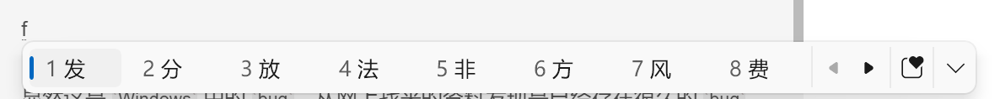
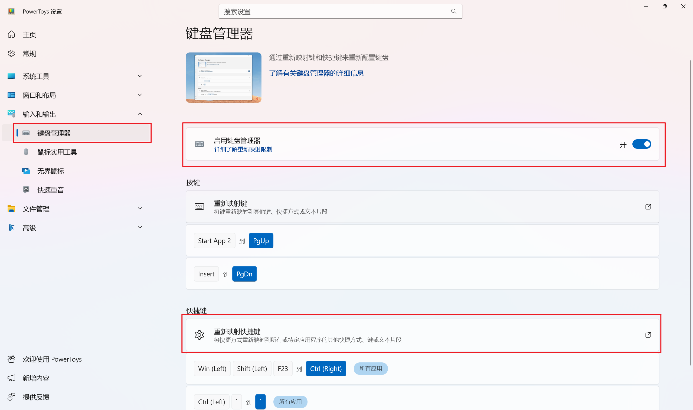
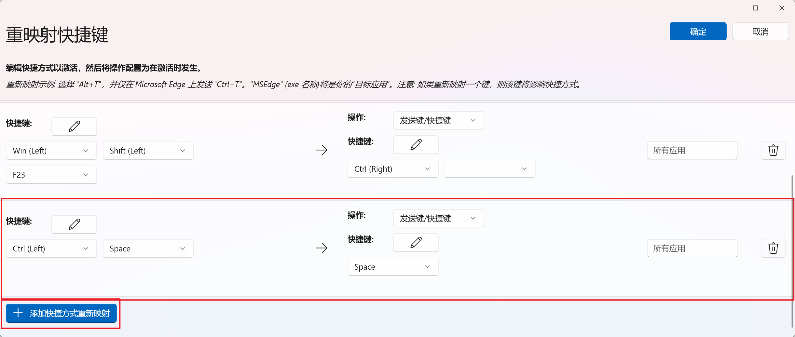

> 原文链接：https://blog.csdn.net/TeleostNaCl/article/details/156108283
> 发布时间：2025-12-20 11:51:30
> 标签：bug、微软、经验分享

---

#### 文章目录

- [一、问题背景](#_1)
- [二、禁用方法](#_19)

## 一、问题背景

在 `Win10` 上，微软输入法可以使用 `shift` + `空格` 进行切换 半角/全角 的输入，同时微软输入法提供了禁用此切换的功能，在 `微软拼音输入法设置` > `按键` > `全/半角切换`，将其设置成 `无` 即可。

但是，实际上在 `Win10` 上，如果在拼音输入情况下，按下一个字符展开弹出候选词的时候，这个时候再按下 `shift` + `空格` 就会触发切换 全角/半角 的输入。  
   
 另外，如果按下 `shift` + `任意键` + `空格` 也会触发切换 全角/半角 的输入。

显然这是 `Windows` 中的 `bug`，从网上找来的资料发现是已经存在很久的 `bug` 了。测试发现，在 `Windows 11` 中已经不存在这个 `bug` 了。

解决这个问题的一种方法就是，占用 `shift` + `空格` 的快捷键，阻止 微软输入法响应。本文将介绍使用 PowerToys 禁用 `shift` + `空格` 的快捷键切换 全角/半角 的输入的方法。

参考文档：

- <https://www.bilibili.com/opus/915242781889265664>
- <https://v2ex.com/t/1028800>
- <https://www.zhihu.com/question/47107132>

## 二、禁用方法

PowerToys 的安装使用可以参考: <https://blog.csdn.net/TeleostNaCl/article/details/148533808>

在 `PowerToys` > `输入和输出` > `键盘管理器` 页面中，首先 `启用键盘管理器`，然后再 `重新映射快捷键`：  
 

再点击 `添加快捷方式重新映射`，然后快捷键设置为 `shift` + `Space`，然后映射为 `Space` 即可

