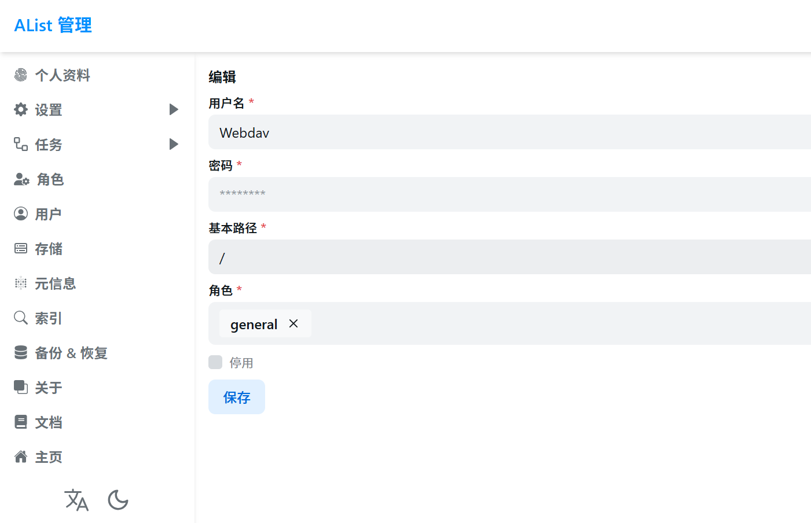
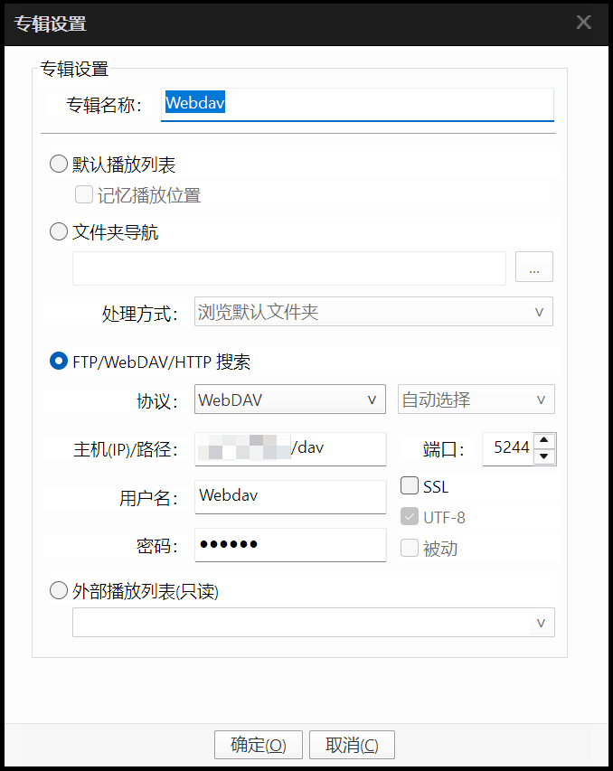

> 原文链接：https://blog.csdn.net/TeleostNaCl/article/details/150655316
> 发布时间：2025-08-23 22:26:17
> 标签：经验分享

---

按照 `详细介绍将 AList 搭建 WebDav 添加到 PotPlayer 专辑 的方法`: <https://blog.csdn.net/TeleostNaCl/article/details/150653718>，使用 `PotPlayer` 播放 `Alist` 的 `Webdav` 音视频，有时候会提示 `无法在 FTP/WebDAV/HTTP 上修改该文件夹` 的错误，导致无法播放。

这个问题是因为 `Potplayer` 播放 `Webdav` 的时候，不允许匿名访问，因此需要在 `Alist` 的 `Webdav` 的配置的户时，需要配置密码，不允许使用 `无需密码访问`，同时需要对角色授予 `Wedav 读取`，并保证在 `PotPlayer` 配置时，保证用户名和密码正确。

