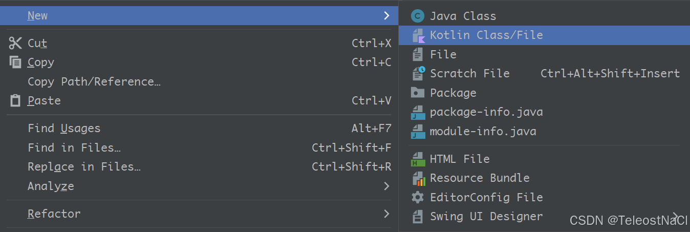
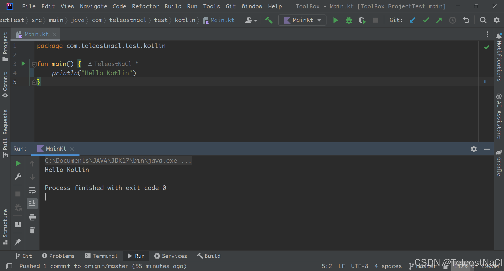

# 第一步: 在最顶层gradle文件(settings.gradle)中添加Kotlin支持
```groovy
buildscript {
    repositories {
        mavenCentral()
        ...
    }
    dependencies {
    	...
        classpath "org.jetbrains.kotlin:kotlin-gradle-plugin:$kotlin_version"
    }
}
```
核心代码是 `classpath "org.jetbrains.kotlin:kotlin-gradle-plugin:$kotlin_version"`, 其中`$kotlin_version`需要根据项目的gradle版本和jdk版本, 选择合适的版本, 可以参考: 
`https://kotlinlang.org/docs/releases.html#release-details`

# 第二步: 在模块的gradle文件(build.gradle)中启用Kotlin支持
```groovy
plugins {
    id 'java'
    id 'application'
    id 'org.jetbrains.kotlin.jvm'
    ...
}
```
核心代码为: `id 'org.jetbrains.kotlin.jvm'`, 此处根据不同gradle版本, 有多种写法. 比如
`apply plugin: "org.jetbrains.kotlin"`

由于我们已经在settings.gradle指定了kotlin版本 这里可以不使用. 暂且列举在这里
```groovy
plugins {
    id 'org.jetbrains.kotlin' version "$kotlin_version"
}
```

# 测试
完成以上两步之后, 即启用了Kotlin支持, 即可编写Kotlin代码进行测试


