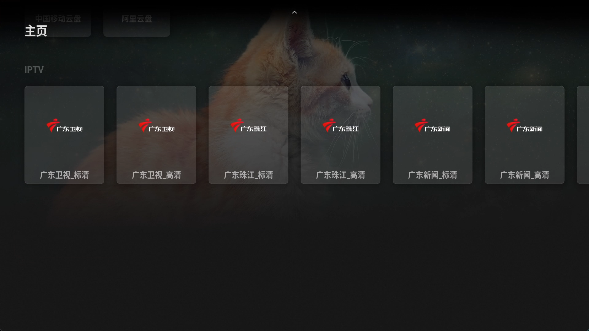

参考：

- [https://www.right.com.cn/forum/thread-8419765-1-1.html](https://www.right.com.cn/forum/thread-8419765-1-1.html)
- [在 OpenWrt 实现单线复用 使用单 wan 口上同时 提供访问 Internet 和接入 IPTV 的能力](https://blog.csdn.net/TeleostNaCl/article/details/156111855)
- [在OpenWrt上使用udpxy同时实现在机顶盒和Potplayer等直播流软件观看IPTV直播的方法](https://blog.csdn.net/TeleostNaCl/article/details/147023332)


从以上参考网址我们可以知道，广东移动的节目单可以直接用 [http://183.235.16.92:8082/epg/api/custom/getAllChannel2.json](http://183.235.16.92:8082/epg/api/custom/getAllChannel2.json) 链接直接下载。


而我们需要按照 [https://blog.csdn.net/TeleostNaCl/article/details/156365244](https://blog.csdn.net/TeleostNaCl/article/details/156365244) 先设置好分流，将目标地址 `183.235.16.92` 的流量发往 `iptv` 的接口，从而可以正常获取节目单的原始文件（以下是部分的信息）：


```json
{
    "status": "200",
    "channels": [
    {
        "code": "02000000000000050000000000000055",
        "title": "CCTV-1综合",
        "subTitle": "CCTV-1综合",
        "channelnum": "100",
        "virtualChannelnum": "",
        "icon": "http://183.235.16.92:8081/pics/micro-picture/channelNew/02000000000000050000000000000055.png",
        "icon2": "",
        "showFlag": "ChannelMark_4",
        "timeshiftAvailable": "true",
        "lookbackAvailable": "true",
        "isCharge": "0",
        "params":
        {
            "ztecode": "ch000000000000104",
            "hwurl": "rtp://239.10.0.202:1025",
            "zteurl": "rtp://239.20.0.192:2182",
            "playBackRecommendPos": "BizPosition_69716",
            "hwmediaid": "10000100000000060000000000128463",
            "recommendPos": "BizPosition_16227",
            "hwcode": "10000100000000050000000000088734"
        },
        "phychannels": [
        {
            "code": "PhysicalChannel_889",
            "channelCode": "02000000000000050000000000000055",
            "bitrateType": "4",
            "bitrateTypeName": "高清",
            "channelnum": "",
            "virtualChannelnum": "",
            "params":
            {
                "ztecode": "ch000000000000104",
                "hwurl": "rtp://239.10.0.114:1025",
                "zteurl": "rtp://239.20.0.104:2006",
                "hwmediaid": "10000100000000060000000000128463",
                "hwcode": "10000100000000050000000000088734"
            }
        },
        {
            "code": "02000000000000060000000000000033",
            "channelCode": "02000000000000050000000000000055",
            "bitrateType": "2",
            "bitrateTypeName": "标清",
            "channelnum": "",
            "virtualChannelnum": "",
            "params":
            {
                "ztecode": "ch000000000000104",
                "hwurl": "rtp://239.10.0.202:1025",
                "zteurl": "rtp://239.20.0.192:2182",
                "hwmediaid": "10000100000000060000000000128463",
                "hwcode": "10000100000000050000000000088734"
            }
        }]
    },
    {
        "code": "02000000000000050000000000000152",
        "title": "CCTV-1高清",
        "subTitle": "CCTV-1高清",
        "channelnum": "373",
        "virtualChannelnum": "",
        "icon": "http://183.235.16.92:8081/pics/micro-picture/channel/2023-08-31/a3f781bc-7405-441b-a9a1-5cef3f0d3acd.png",
        "icon2": "",
        "showFlag": "ChannelMark_4",
        "timeshiftAvailable": "true",
        "lookbackAvailable": "true",
        "isCharge": "0",
        "params":
        {
            "ztecode": "ch000000000000104",
            "hwurl": "rtp://239.10.0.114:1025",
            "zteurl": "rtp://239.20.0.104:2006",
            "playBackRecommendPos": "BizPosition_69716",
            "hwmediaid": "10000100000000060000000000128463",
            "recommendPos": "BizPosition_16227",
            "hwcode": "10000100000000050000000000088734"
        },
        "phychannels": [
        {
            "code": "02000000000000060000000000000131",
            "channelCode": "02000000000000050000000000000152",
            "bitrateType": "4",
            "bitrateTypeName": "高清",
            "channelnum": "",
            "virtualChannelnum": "",
            "params":
            {
                "ztecode": "ch000000000000104",
                "hwurl": "rtp://239.10.0.114:1025",
                "zteurl": "rtp://239.20.0.104:2006",
                "hwmediaid": "10000100000000060000000000128463",
                "hwcode": "10000100000000050000000000088734"
            }
        },
        {
            "code": "PhysicalChannel_1105",
            "channelCode": "02000000000000050000000000000152",
            "bitrateType": "2",
            "bitrateTypeName": "标清",
            "channelnum": "",
            "virtualChannelnum": "",
            "params":
            {
                "ztecode": "ch000000000000192",
                "hwurl": "rtp://239.10.0.202:1025",
                "zteurl": "rtp://239.20.0.192:2182",
                "hwmediaid": "10000100000000060000000000315396",
                "hwcode": "10000100000000050000000000122823"
            }
        }]
    },]
}
```


很显然，这份 `json` 文件中完整的包含了我们所需要的信息，

- `title` 代表着电视节目的台名
- `icon` 代表着电视节目的台标
- `zteurl` 则是组播地址 (需要将 `rtp://` 去掉，并配上 udpyx 的地址)


只要使用以上的信息，就可以编辑为一个 .m3u 文件，格式如下：


```m3u
#EXTM3U

#EXTINF:-1 tvg-logo="$icon",$title
$udpxy/$zteurl
```


而一段类似的文件如下：

```
#EXTM3U

#EXTINF:-1 tvg-logo="http://183.235.16.92:8081/pics/micro-picture/channelNew/02000001000000050000000000000001.png",广东卫视_标清
http://openwrt.lan:4022/udp/239.20.0.131:2060

#EXTINF:-1 tvg-logo="http://183.235.16.92:8081/pics/micro-picture/channelNew/02000001000000050000000000000001.png",广东卫视_高清
http://openwrt.lan:4022/udp/239.20.0.101:2000

#EXTINF:-1 tvg-logo="http://183.235.16.92:8081/pics/micro-picture/channelNew/02000006000000052015070399000004.png",广东珠江_标清
http://openwrt.lan:4022/udp/239.20.0.111:2020

#EXTINF:-1 tvg-logo="http://183.235.16.92:8081/pics/micro-picture/channelNew/02000006000000052015070399000004.png",广东珠江_高清
http://openwrt.lan:4022/udp/239.20.0.64:3144

#EXTINF:-1 tvg-logo="http://183.235.16.92:8081/pics/micro-picture/channel/2023-09-06/59c6544c-4b7f-4104-a439-a748dbd0cbd4.png",广东新闻_标清
http://openwrt.lan:4022/udp/239.20.0.112:2022

#EXTINF:-1 tvg-logo="http://183.235.16.92:8081/pics/micro-picture/channel/2023-09-06/59c6544c-4b7f-4104-a439-a748dbd0cbd4.png",广东新闻_高清
http://openwrt.lan:4022/udp/239.21.0.93:3712

#EXTINF:-1 tvg-logo="http://183.235.16.92:8081/pics/micro-picture/channel/2023-09-06/0a5d0541-6e5d-4101-83a1-49517c096c44.png",广东民生_标清
http://openwrt.lan:4022/udp/239.20.0.113:2024

#EXTINF:-1 tvg-logo="http://183.235.16.92:8081/pics/micro-picture/channel/2023-09-06/0a5d0541-6e5d-4101-83a1-49517c096c44.png",广东民生_高清
http://openwrt.lan:4022/udp/239.21.0.86:3684

#EXTINF:-1 tvg-logo="http://183.235.16.92:8081/pics/micro-picture/channelNew/02000006000000052015070399000001.png",广东体育_标清
http://openwrt.lan:4022/udp/239.20.0.114:2026

#EXTINF:-1 tvg-logo="http://183.235.16.92:8081/pics/micro-picture/channelNew/02000006000000052015070399000001.png",广东体育_高清
http://openwrt.lan:4022/udp/239.20.0.103:2004

#EXTINF:-1 tvg-logo="http://183.235.16.92:8081/pics/micro-picture/channel/2023-09-05/196642b5-31d4-427e-85c8-0315747c05a9.png",经济科教_标清
http://openwrt.lan:4022/udp/239.20.0.191:2180

#EXTINF:-1 tvg-logo="http://183.235.16.92:8081/pics/micro-picture/channel/2023-09-05/196642b5-31d4-427e-85c8-0315747c05a9.png",经济科教_高清
http://openwrt.lan:4022/udp/239.20.0.102:2002

#EXTINF:-1 tvg-logo="http://183.235.16.92:8081/pics/micro-picture/channel/2023-08-31/e1a72ecf-416f-42ed-bf6c-7e1e4905281d.png",大湾区卫视_标清
http://openwrt.lan:4022/udp/239.20.0.125:2048

#EXTINF:-1 tvg-logo="http://183.235.16.92:8081/pics/micro-picture/channel/2023-08-31/e1a72ecf-416f-42ed-bf6c-7e1e4905281d.png",大湾区卫视_高清
http://openwrt.lan:4022/udp/239.21.0.84:3676

#EXTINF:-1 tvg-logo="http://183.235.16.92:8081/pics/micro-picture/channelNew/02000001000000050000000000000011.png",广东影视_标清
http://openwrt.lan:4022/udp/239.20.0.117:2032

#EXTINF:-1 tvg-logo="http://183.235.16.92:8081/pics/micro-picture/channelNew/02000001000000050000000000000011.png",广东影视_高清
http://openwrt.lan:4022/udp/239.21.0.85:3680

#EXTINF:-1 tvg-logo="http://183.235.16.92:8081/pics/micro-picture/channel/2023-09-06/97dfe8dd-a9d7-47a4-8f9a-3112c13b0d9a.png",广东少儿_标清
http://openwrt.lan:4022/udp/239.20.0.118:2034

#EXTINF:-1 tvg-logo="http://183.235.16.92:8081/pics/micro-picture/channel/2023-09-06/97dfe8dd-a9d7-47a4-8f9a-3112c13b0d9a.png",广东少儿_高清
http://openwrt.lan:4022/udp/239.21.0.87:3688

#EXTINF:-1 tvg-logo="http://183.235.16.92:8081/pics/micro-picture/channel/2023-09-06/70f10dac-2507-40db-8f90-2e2de344db49.png",嘉佳卡通_标清
http://openwrt.lan:4022/udp/239.20.0.119:2036

#EXTINF:-1 tvg-logo="http://183.235.16.92:8081/pics/micro-picture/channel/2023-09-06/70f10dac-2507-40db-8f90-2e2de344db49.png",嘉佳卡通_高清
http://openwrt.lan:4022/udp/239.21.0.94:3716

#EXTINF:-1 tvg-logo="http://183.235.16.92:8081/pics/micro-picture/channelNew/02000001000000050000000000000389.png",南方购物-精选_标清
http://openwrt.lan:4022/udp/239.21.0.105:3760

#EXTINF:-1 tvg-logo="http://183.235.16.92:8081/pics/category/201912/13/2019121315594287846170.png",移动频道_标清
http://openwrt.lan:4022/udp/239.20.0.133:2064

#EXTINF:-1 tvg-logo="http://183.235.16.92:8081/pics/micro-picture/channelNew/02000001000000050000000000000389.png",南方购物_标清
http://openwrt.lan:4022/udp/239.20.0.116:2030

#EXTINF:-1 tvg-logo="http://183.235.16.92:8081/pics/micro-picture/channelNew/02000001000000050000000000000385.png",岭南戏曲_标清
http://openwrt.lan:4022/udp/239.20.0.115:2028

#EXTINF:-1 tvg-logo="http://183.235.16.92:8081/pics/micro-picture/channelNew/02000001000000050000000000000385.png",岭南戏曲_高清
http://openwrt.lan:4022/udp/239.21.0.147:3932

#EXTINF:-1 tvg-logo="http://183.235.16.92:8081/pics/micro-picture/channelNew/02000001000000050000000000000381.png",现代教育_标清
http://openwrt.lan:4022/udp/239.20.0.128:2054

#EXTINF:-1 tvg-logo="http://183.235.16.92:8081/pics/micro-picture/channelNew/02000001000000050000000000000381.png",现代教育_高清
http://openwrt.lan:4022/udp/239.21.0.148:3936

#EXTINF:-1 tvg-logo="http://183.235.16.92:8081/pics/micro-picture/channelNew/02000000000000050000000000000055.png",CCTV-1综合_标清
http://openwrt.lan:4022/udp/239.20.0.192:2182

#EXTINF:-1 tvg-logo="http://183.235.16.92:8081/pics/micro-picture/channelNew/02000000000000050000000000000055.png",CCTV-1综合_高清
http://openwrt.lan:4022/udp/239.20.0.104:2006

#EXTINF:-1 tvg-logo="http://183.235.16.92:8081/pics/micro-picture/channelNew/02000000000000050000000000000058.png",CCTV-2财经_标清
http://openwrt.lan:4022/udp/239.20.0.176:2150

#EXTINF:-1 tvg-logo="http://183.235.16.92:8081/pics/micro-picture/channelNew/02000000000000050000000000000058.png",CCTV-2财经_高清
http://openwrt.lan:4022/udp/239.20.0.197:2192

#EXTINF:-1 tvg-logo="http://183.235.16.92:8081/pics/micro-picture/channelNew/02000001000000050000000000000214.png",CCTV-3综艺_标清
http://openwrt.lan:4022/udp/239.20.0.27:3296

#EXTINF:-1 tvg-logo="http://183.235.16.92:8081/pics/micro-picture/channelNew/02000001000000050000000000000214.png",CCTV-3综艺_高清
http://openwrt.lan:4022/udp/239.20.0.28:3292

#EXTINF:-1 tvg-logo="http://183.235.16.92:8081/pics/micro-picture/channelNew/02000000000000050000000000000053.png",CCTV-4中文国际_标清
http://openwrt.lan:4022/udp/239.20.0.177:2152

#EXTINF:-1 tvg-logo="http://183.235.16.92:8081/pics/micro-picture/channelNew/02000000000000050000000000000053.png",CCTV-4中文国际_高清
http://openwrt.lan:4022/udp/239.20.0.16:3340

#EXTINF:-1 tvg-logo="http://183.235.16.92:8081/pics/micro-picture/channelNew/02000001000000050000000000000216.png",CCTV-5体育_标清
http://openwrt.lan:4022/udp/239.20.0.26:3300

#EXTINF:-1 tvg-logo="http://183.235.16.92:8081/pics/micro-picture/channelNew/02000001000000050000000000000216.png",CCTV-5体育_高清
http://openwrt.lan:4022/udp/239.20.0.30:3284

#EXTINF:-1 tvg-logo="http://183.235.16.92:8081/pics/micro-picture/channelNew/02000001000000050000000000000217.png",CCTV-6电影_标清
http://openwrt.lan:4022/udp/239.20.0.25:3304

#EXTINF:-1 tvg-logo="http://183.235.16.92:8081/pics/micro-picture/channelNew/02000001000000050000000000000217.png",CCTV-6电影_高清
http://openwrt.lan:4022/udp/239.20.0.29:3288

#EXTINF:-1 tvg-logo="http://183.235.16.92:8081/pics/micro-picture/channelNew/02000000000000050000000000000102.png",CCTV-7国防军事_标清
http://openwrt.lan:4022/udp/239.20.0.178:2154

#EXTINF:-1 tvg-logo="http://183.235.16.92:8081/pics/micro-picture/channelNew/02000000000000050000000000000102.png",CCTV-7国防军事_高清
http://openwrt.lan:4022/udp/239.20.0.198:2194

#EXTINF:-1 tvg-logo="http://183.235.16.92:8081/pics/micro-picture/channelNew/02000001000000050000000000000218.png",CCTV-8电视剧_标清
http://openwrt.lan:4022/udp/239.20.0.24:3308

#EXTINF:-1 tvg-logo="http://183.235.16.92:8081/pics/micro-picture/channelNew/02000001000000050000000000000218.png",CCTV-8电视剧_高清
http://openwrt.lan:4022/udp/239.20.0.31:3280

#EXTINF:-1 tvg-logo="http://183.235.16.92:8081/pics/micro-picture/channel/2023-08-31/c1276329-0224-4234-9365-fb9537ac26ab.png",CCTV-9纪录_标清
http://openwrt.lan:4022/udp/239.20.0.179:2156

#EXTINF:-1 tvg-logo="http://183.235.16.92:8081/pics/micro-picture/channel/2023-08-31/c1276329-0224-4234-9365-fb9537ac26ab.png",CCTV-9纪录_高清
http://openwrt.lan:4022/udp/239.20.0.199:2196

#EXTINF:-1 tvg-logo="http://183.235.16.92:8081/pics/micro-picture/channelNew/02000000000000050000000000000087.png",CCTV-10科教_标清
http://openwrt.lan:4022/udp/239.20.0.180:2158

#EXTINF:-1 tvg-logo="http://183.235.16.92:8081/pics/micro-picture/channelNew/02000000000000050000000000000087.png",CCTV-10科教_高清
http://openwrt.lan:4022/udp/239.20.0.200:2198

#EXTINF:-1 tvg-logo="http://183.235.16.92:8081/pics/micro-picture/channelNew/02000000000000050000000000000056.png",CCTV-11戏曲_标清
http://openwrt.lan:4022/udp/239.20.0.181:2160

#EXTINF:-1 tvg-logo="http://183.235.16.92:8081/pics/micro-picture/channelNew/02000000000000050000000000000056.png",CCTV-11戏曲_高清
http://openwrt.lan:4022/udp/239.21.0.35:3480

#EXTINF:-1 tvg-logo="http://183.235.16.92:8081/pics/micro-picture/channelNew/02000000000000050000000000000059.png",CCTV-12社会与法_标清
http://openwrt.lan:4022/udp/239.20.0.182:2162

#EXTINF:-1 tvg-logo="http://183.235.16.92:8081/pics/micro-picture/channelNew/02000000000000050000000000000059.png",CCTV-12社会与法_高清
http://openwrt.lan:4022/udp/239.20.0.201:2200

#EXTINF:-1 tvg-logo="http://183.235.16.92:8081/pics/micro-picture/channelNew/02000000000000050000000000000063.png",CCTV-13新闻_标清
http://openwrt.lan:4022/udp/239.20.0.183:2164

#EXTINF:-1 tvg-logo="http://183.235.16.92:8081/pics/micro-picture/channelNew/02000000000000050000000000000063.png",CCTV-13新闻_高清
http://openwrt.lan:4022/udp/239.21.0.88:3692

#EXTINF:-1 tvg-logo="http://183.235.16.92:8081/pics/micro-picture/channelNew/02000000000000050000000000000066.png",CCTV-14少儿_标清
http://openwrt.lan:4022/udp/239.20.0.184:2166

#EXTINF:-1 tvg-logo="http://183.235.16.92:8081/pics/micro-picture/channelNew/02000000000000050000000000000066.png",CCTV-14少儿_高清
http://openwrt.lan:4022/udp/239.20.0.202:2202

#EXTINF:-1 tvg-logo="http://183.235.16.92:8081/pics/micro-picture/channelNew/02000000000000050000000000000064.png",CCTV-15音乐_标清
http://openwrt.lan:4022/udp/239.20.0.185:2168

#EXTINF:-1 tvg-logo="http://183.235.16.92:8081/pics/micro-picture/channelNew/02000000000000050000000000000064.png",CCTV-15音乐_高清
http://openwrt.lan:4022/udp/239.21.0.36:3484

#EXTINF:-1 tvg-logo="http://183.235.16.92:8081/pics/micro-picture/channelNew/02000000000000050000000000000148.png",CGTN_标清
http://openwrt.lan:4022/udp/239.20.0.186:2170

#EXTINF:-1 tvg-logo="http://183.235.16.92:8081/pics/category/201908/01/2019080112590554935014.png",CCTV-17_标清
http://openwrt.lan:4022/udp/239.20.0.8:3372

#EXTINF:-1 tvg-logo="http://183.235.16.92:8081/pics/category/201908/01/2019080112590554935014.png",CCTV-17_高清
http://openwrt.lan:4022/udp/239.20.0.7:3376

#EXTINF:-1 tvg-logo="http://183.235.16.92:8081/pics/micro-picture/channelNew/02000006000000052015071499000016.png",湖南卫视_4K超高清
http://openwrt.lan:4022/udp/239.21.0.166:4012

#EXTINF:-1 tvg-logo="http://183.235.16.92:8081/pics/micro-picture/channelNew/02000006000000052015071499000016.png",湖南卫视_标清
http://openwrt.lan:4022/udp/239.20.0.135:2068

#EXTINF:-1 tvg-logo="http://183.235.16.92:8081/pics/micro-picture/channelNew/02000006000000052015071499000016.png",湖南卫视_高清
http://openwrt.lan:4022/udp/239.20.0.105:2008

#EXTINF:-1 tvg-logo="http://183.235.16.92:8081/pics/micro-picture/channelNew/02000000000000050000000000000070.png",浙江卫视_4K超高清
http://openwrt.lan:4022/udp/239.21.0.168:4020

#EXTINF:-1 tvg-logo="http://183.235.16.92:8081/pics/micro-picture/channelNew/02000000000000050000000000000070.png",浙江卫视_标清
http://openwrt.lan:4022/udp/239.20.0.106:2010

#EXTINF:-1 tvg-logo="http://183.235.16.92:8081/pics/micro-picture/channelNew/02000000000000050000000000000070.png",浙江卫视_高清
http://openwrt.lan:4022/udp/239.20.0.169:2136

#EXTINF:-1 tvg-logo="http://183.235.16.92:8081/pics/micro-picture/channelNew/02000000000000050000000000000072.png",江苏卫视_4K超高清
http://openwrt.lan:4022/udp/239.21.0.167:4016

#EXTINF:-1 tvg-logo="http://183.235.16.92:8081/pics/micro-picture/channelNew/02000000000000050000000000000072.png",江苏卫视_标清
http://openwrt.lan:4022/udp/239.20.0.107:2012

#EXTINF:-1 tvg-logo="http://183.235.16.92:8081/pics/micro-picture/channelNew/02000000000000050000000000000072.png",江苏卫视_高清
http://openwrt.lan:4022/udp/239.20.0.170:2138

#EXTINF:-1 tvg-logo="http://183.235.16.92:8081/pics/micro-picture/channelNew/02000000000000050000000000000076.png",东方卫视_4K超高清
http://openwrt.lan:4022/udp/239.21.0.169:4024

#EXTINF:-1 tvg-logo="http://183.235.16.92:8081/pics/micro-picture/channelNew/02000000000000050000000000000076.png",东方卫视_标清
http://openwrt.lan:4022/udp/239.20.0.108:2014

#EXTINF:-1 tvg-logo="http://183.235.16.92:8081/pics/micro-picture/channelNew/02000000000000050000000000000076.png",东方卫视_高清
http://openwrt.lan:4022/udp/239.20.0.173:2144

#EXTINF:-1 tvg-logo="http://183.235.16.92:8081/pics/micro-picture/channelNew/02000000000000050000000000000057.png",安徽卫视_标清
http://openwrt.lan:4022/udp/239.20.0.136:2070

#EXTINF:-1 tvg-logo="http://183.235.16.92:8081/pics/micro-picture/channelNew/02000000000000050000000000000057.png",安徽卫视_高清
http://openwrt.lan:4022/udp/239.20.0.193:2184

#EXTINF:-1 tvg-logo="http://183.235.16.92:8081/pics/micro-picture/2025/0401/12_8783cea6-2037-44ec-826d-df7e281f6b21.png",北京卫视_标清
http://openwrt.lan:4022/udp/239.20.0.137:2072

#EXTINF:-1 tvg-logo="http://183.235.16.92:8081/pics/micro-picture/2025/0401/12_8783cea6-2037-44ec-826d-df7e281f6b21.png",北京卫视_高清
http://openwrt.lan:4022/udp/239.20.0.121:2040

#EXTINF:-1 tvg-logo="http://183.235.16.92:8081/pics/micro-picture/channelNew/02000000000000050000000000000065.png",江西卫视_标清
http://openwrt.lan:4022/udp/239.20.0.138:2074

#EXTINF:-1 tvg-logo="http://183.235.16.92:8081/pics/micro-picture/channelNew/02000000000000050000000000000065.png",江西卫视_高清
http://openwrt.lan:4022/udp/239.20.0.55:3180

#EXTINF:-1 tvg-logo="http://183.235.16.92:8081/pics/micro-picture/channelNew/02000000000000050000000000000149.png",深圳卫视_4K超高清
http://openwrt.lan:4022/udp/239.21.0.161:3992

#EXTINF:-1 tvg-logo="http://183.235.16.92:8081/pics/micro-picture/channelNew/02000000000000050000000000000149.png",深圳卫视_标清
http://openwrt.lan:4022/udp/239.20.0.134:2066

#EXTINF:-1 tvg-logo="http://183.235.16.92:8081/pics/micro-picture/channelNew/02000000000000050000000000000149.png",深圳卫视_高清
http://openwrt.lan:4022/udp/239.20.0.122:2042

#EXTINF:-1 tvg-logo="http://183.235.16.92:8081/pics/micro-picture/channelNew/02000000000000050000000000000085.png",河南卫视_标清
http://openwrt.lan:4022/udp/239.20.0.144:2086

#EXTINF:-1 tvg-logo="http://183.235.16.92:8081/pics/micro-picture/channelNew/02000000000000050000000000000085.png",河南卫视_高清
http://openwrt.lan:4022/udp/239.21.0.104:3756

#EXTINF:-1 tvg-logo="http://183.235.16.92:8081/pics/micro-picture/channelNew/02000000000000050000000000000060.png",云南卫视_标清
http://openwrt.lan:4022/udp/239.20.0.145:2088

#EXTINF:-1 tvg-logo="http://183.235.16.92:8081/pics/micro-picture/channelNew/02000000000000050000000000000060.png",云南卫视_高清
http://openwrt.lan:4022/udp/239.21.0.133:3876

#EXTINF:-1 tvg-logo="http://183.235.16.92:8081/pics/micro-picture/channelNew/02000000000000050000000000000090.png",陕西卫视_标清
http://openwrt.lan:4022/udp/239.20.0.151:2100

#EXTINF:-1 tvg-logo="http://183.235.16.92:8081/pics/micro-picture/channelNew/02000000000000050000000000000099.png",山西卫视_标清
http://openwrt.lan:4022/udp/239.20.0.152:2102

#EXTINF:-1 tvg-logo="http://183.235.16.92:8081/pics/micro-picture/channel/2023-09-06/a4e8a21b-abde-402f-9bd6-f8d461c25256.png",内蒙古卫视_标清
http://openwrt.lan:4022/udp/239.20.0.153:2104

#EXTINF:-1 tvg-logo="http://183.235.16.92:8081/pics/micro-picture/channel/2023-09-07/60104d96-548c-44ca-804d-e2603efce55c.png",青海卫视_标清
http://openwrt.lan:4022/udp/239.20.0.154:2106

#EXTINF:-1 tvg-logo="http://183.235.16.92:8081/pics/micro-picture/channel/2023-09-07/60104d96-548c-44ca-804d-e2603efce55c.png",青海卫视_高清
http://openwrt.lan:4022/udp/239.21.0.144:3920

#EXTINF:-1 tvg-logo="http://183.235.16.92:8081/pics/micro-picture/channel/2023-09-07/bd71b8a0-6392-405c-a75d-6effa9cb1041.png",海南卫视_标清
http://openwrt.lan:4022/udp/239.20.0.155:2108

#EXTINF:-1 tvg-logo="http://183.235.16.92:8081/pics/micro-picture/channel/2023-09-07/bd71b8a0-6392-405c-a75d-6effa9cb1041.png",海南卫视_高清
http://openwrt.lan:4022/udp/239.21.0.134:3880

#EXTINF:-1 tvg-logo="http://183.235.16.92:8081/pics/micro-picture/channel/2023-09-07/166ccbaa-0ac6-4bef-b702-2bbc0f6d5c56.png",宁夏卫视_标清
http://openwrt.lan:4022/udp/239.20.0.156:2110

#EXTINF:-1 tvg-logo="http://183.235.16.92:8081/pics/micro-picture/channel/2023-09-07/166ccbaa-0ac6-4bef-b702-2bbc0f6d5c56.png",宁夏卫视_高清
http://openwrt.lan:4022/udp/239.21.0.165:4008

#EXTINF:-1 tvg-logo="http://183.235.16.92:8081/pics/micro-picture/channelNew/02000000000000050000000000000100.png",西藏卫视_标清
http://openwrt.lan:4022/udp/239.20.0.157:2112

#EXTINF:-1 tvg-logo="http://183.235.16.92:8081/pics/micro-picture/channelNew/02000000000000050000000000000100.png",西藏卫视_高清
http://openwrt.lan:4022/udp/239.21.0.162:3996

#EXTINF:-1 tvg-logo="http://183.235.16.92:8081/pics/micro-picture/channelNew/02000000000000050000000000000097.png",新疆卫视_标清
http://openwrt.lan:4022/udp/239.20.0.158:2114

#EXTINF:-1 tvg-logo="http://183.235.16.92:8081/pics/micro-picture/channelNew/02000000000000050000000000000097.png",新疆卫视_高清
http://openwrt.lan:4022/udp/239.21.0.163:4000

#EXTINF:-1 tvg-logo="http://183.235.16.92:8081/pics/micro-picture/channelNew/02000000000000050000000000000094.png",甘肃卫视_标清
http://openwrt.lan:4022/udp/239.20.0.159:2116

#EXTINF:-1 tvg-logo="http://183.235.16.92:8081/pics/micro-picture/channelNew/02000000000000050000000000000094.png",甘肃卫视_高清
http://openwrt.lan:4022/udp/239.21.0.141:3908

#EXTINF:-1 tvg-logo="http://183.235.16.92:8081/pics/micro-picture/channelNew/02000001000000050000000000000377.png",兵团卫视_标清
http://openwrt.lan:4022/udp/239.20.0.160:2118

#EXTINF:-1 tvg-logo="http://183.235.16.92:8081/pics/micro-picture/channelNew/02000001000000050000000000000377.png",兵团卫视_高清
http://openwrt.lan:4022/udp/239.21.0.164:4004

#EXTINF:-1 tvg-logo="http://183.235.16.92:8081/pics/micro-picture/channelNew/02000000000000050000000000000150.png",卡酷动画_标清
http://openwrt.lan:4022/udp/239.20.0.162:2122

#EXTINF:-1 tvg-logo="http://183.235.16.92:8081/pics/micro-picture/channelNew/02000000000000050000000000000151.png",金鹰卡通_标清
http://openwrt.lan:4022/udp/239.20.0.163:2124

#EXTINF:-1 tvg-logo="http://183.235.16.92:8081/pics/micro-picture/channelNew/02000000000000050000000000000151.png",金鹰卡通_高清
http://openwrt.lan:4022/udp/239.21.0.115:3804

#EXTINF:-1 tvg-logo="http://183.235.16.92:8081/pics/micro-picture/channelNew/02000001000000050000000000000378.png",山东教育_标清
http://openwrt.lan:4022/udp/239.20.0.166:2130

#EXTINF:-1 tvg-logo="http://183.235.16.92:8081/pics/micro-picture/channelNew/02000001000000052013120900000002.png",厦门卫视_标清
http://openwrt.lan:4022/udp/239.20.0.168:2134

#EXTINF:-1 tvg-logo="http://183.235.16.92:8081/pics/micro-picture/channelNew/02000006000000052018110799000001.png",三沙卫视_标清
http://openwrt.lan:4022/udp/239.20.0.52:3192

#EXTINF:-1 tvg-logo="http://183.235.16.92:8081/pics/micro-picture/channelNew/02000006000000052018110799000001.png",三沙卫视_高清
http://openwrt.lan:4022/udp/239.21.0.143:3916

#EXTINF:-1 tvg-logo="http://183.235.16.92:8081/pics/micro-picture/channelNew/02000001000000050000000000000010.png",吉林延边卫视_标清
http://openwrt.lan:4022/udp/239.20.0.51:3216

#EXTINF:-1 tvg-logo="http://183.235.16.92:8081/pics/micro-picture/channelNew/02000006000000052020021899000001.png",CETV-2_标清
http://openwrt.lan:4022/udp/239.21.0.46:3524

#EXTINF:-1 tvg-logo="http://183.235.16.92:8081/pics/micro-picture/channelNew/02000006000000052020021899000002.png",CETV-4_标清
http://openwrt.lan:4022/udp/239.21.0.47:3528

#EXTINF:-1 tvg-logo="http://183.235.16.92:8081/pics/micro-picture/channelNew/02000006000000052020021899000002.png",CETV-4_高清
http://openwrt.lan:4022/udp/239.21.0.142:3912

#EXTINF:-1 tvg-logo="http://183.235.16.92:8081/pics/micro-picture/channel/2023-09-07/0b4cdab5-535a-49cb-97d6-52b3e3e8470e.png",广东少儿高清_高清
http://openwrt.lan:4022/udp/239.21.0.87:3688

#EXTINF:-1 tvg-logo="http://183.235.16.92:8081/pics/micro-picture/channelNew/02000000000000050000000000000153.png",CCTV5+体育高清_高清
http://openwrt.lan:4022/udp/239.20.0.203:2204

#EXTINF:-1 tvg-logo="http://183.235.16.92:8081/pics/category/201612/14/2016121417525063051976.png",爱体育高清_高清
http://openwrt.lan:4022/udp/239.20.0.208:2214

#EXTINF:-1 tvg-logo="http://183.235.16.92:8081/pics/micro-picture/channelNew/02000006000000052021102999000001.png",CCTV-16高清_高清
http://openwrt.lan:4022/udp/239.21.0.116:3808

#EXTINF:-1 tvg-logo="http://183.235.16.92:8081/pics/micro-picture/channelNew/02000006000000052021062299000001.png",CCTV4中文国际欧洲高清_高清
http://openwrt.lan:4022/udp/239.21.0.107:3768

#EXTINF:-1 tvg-logo="http://183.235.16.92:8081/pics/micro-picture/channelNew/02000006000000052021062299000020.png",CCTV4中文国际美洲高清_高清
http://openwrt.lan:4022/udp/239.21.0.108:3772

#EXTINF:-1 tvg-logo="http://183.235.16.92:8081/pics/micro-picture/channelNew/02000000000000050000000000000148.png",CGTN 英语_高清
http://openwrt.lan:4022/udp/239.21.0.109:3776

#EXTINF:-1 tvg-logo="http://183.235.16.92:8081/pics/micro-picture/channel/2023-09-05/14f03814-61b3-45bf-8130-a4a9ebd4acf5.png",CGTN 英文记录_高清
http://openwrt.lan:4022/udp/239.21.0.110:3780

#EXTINF:-1 tvg-logo="http://183.235.16.92:8081/pics/micro-picture/channel/2023-09-01/8696ed3e-d886-4b99-87b4-eba712c045dc.png",CGTN 西班牙语_高清
http://openwrt.lan:4022/udp/239.21.0.111:3800

#EXTINF:-1 tvg-logo="http://183.235.16.92:8081/pics/micro-picture/channel/2023-09-01/de945057-1986-449f-b9e4-094905c376b3.png",CGTN 法语_高清
http://openwrt.lan:4022/udp/239.21.0.112:3788

#EXTINF:-1 tvg-logo="http://183.235.16.92:8081/pics/micro-picture/channel/2023-09-01/c0a96dad-20d0-4c5e-a8e4-8fdde62633f6.png",CGTN 阿拉伯语_高清
http://openwrt.lan:4022/udp/239.21.0.113:3792

#EXTINF:-1 tvg-logo="http://183.235.16.92:8081/pics/micro-picture/channel/2023-09-01/e2de4a0e-f0b8-4730-9f8f-3b57ea543535.png",CGTN 俄语_高清
http://openwrt.lan:4022/udp/239.21.0.114:3796

#EXTINF:-1 tvg-logo="http://183.235.16.92:8081/pics/micro-picture/channelNew/02000000000000050000000000000196.png",黑龙江卫视高清_高清
http://openwrt.lan:4022/udp/239.20.0.123:2044

#EXTINF:-1 tvg-logo="http://183.235.16.92:8081/pics/micro-picture/channelNew/02000006000000052016042599000001.png",湖北卫视高清_高清
http://openwrt.lan:4022/udp/239.20.0.124:2046

#EXTINF:-1 tvg-logo="http://183.235.16.92:8081/pics/micro-picture/channelNew/02000001000000052013120900000001.png",天津卫视高清_高清
http://openwrt.lan:4022/udp/239.20.0.171:2140

#EXTINF:-1 tvg-logo="http://183.235.16.92:8081/pics/micro-picture/channelNew/02000001000000050000000000000395.png",山东卫视高清_4K超高清
http://openwrt.lan:4022/udp/239.21.0.171:4032

#EXTINF:-1 tvg-logo="http://183.235.16.92:8081/pics/micro-picture/channelNew/02000001000000050000000000000395.png",山东卫视高清_高清
http://openwrt.lan:4022/udp/239.20.0.172:2142

#EXTINF:-1 tvg-logo="http://183.235.16.92:8081/pics/micro-picture/channelNew/02000006000000052015071499000044.png",辽宁卫视高清_高清
http://openwrt.lan:4022/udp/239.20.0.175:2148

#EXTINF:-1 tvg-logo="http://183.235.16.92:8081/pics/micro-picture/channelNew/02000004000000052016021800000003.png",四川卫视高清_4K超高清
http://openwrt.lan:4022/udp/239.21.0.170:4028

#EXTINF:-1 tvg-logo="http://183.235.16.92:8081/pics/micro-picture/channelNew/02000004000000052016021800000003.png",四川卫视高清_高清
http://openwrt.lan:4022/udp/239.20.0.194:2186

#EXTINF:-1 tvg-logo="http://183.235.16.92:8081/pics/micro-picture/channelNew/02000004000000052016021800000002.png",金鹰纪实高清_高清
http://openwrt.lan:4022/udp/239.20.0.196:2190

#EXTINF:-1 tvg-logo="http://183.235.16.92:8081/pics/micro-picture/channelNew/02000004000000052016032800000002.png",重庆卫视高清_高清
http://openwrt.lan:4022/udp/239.20.0.195:2188

#EXTINF:-1 tvg-logo="http://183.235.16.92:8081/pics/micro-picture/channelNew/02000006000000052017022799000002.png",贵州卫视高清_高清
http://openwrt.lan:4022/udp/239.20.0.212:2222

#EXTINF:-1 tvg-logo="http://183.235.16.92:8081/pics/category/201706/22/2017062218064859858234.png",中国教育-1高清_高清
http://openwrt.lan:4022/udp/239.20.0.213:2224

#EXTINF:-1 tvg-logo="http://183.235.16.92:8081/pics/micro-picture/channelNew/02000006000000052018110799000002.png",福建东南卫视高清_高清
http://openwrt.lan:4022/udp/239.20.0.58:3168

#EXTINF:-1 tvg-logo="http://183.235.16.92:8081/pics/micro-picture/channelNew/02000000000000052018103099000001.png",河北卫视高清_高清
http://openwrt.lan:4022/udp/239.20.0.56:3176

#EXTINF:-1 tvg-logo="http://183.235.16.92:8081/pics/micro-picture/channelNew/02000006000000052018110799000005.png",吉林卫视高清_高清
http://openwrt.lan:4022/udp/239.20.0.54:3184

#EXTINF:-1 tvg-logo="http://183.235.16.92:8081/pics/micro-picture/channelNew/02000006000000052019050799000002.png",广西卫视高清_高清
http://openwrt.lan:4022/udp/239.20.0.15:3344

#EXTINF:-1 tvg-logo="http://183.235.16.92:8081/pics/micro-picture/channelNew/02000001000000050000000000000001.png",广东卫视超清_超清
http://openwrt.lan:4022/udp/239.20.0.99:3004

#EXTINF:-1 tvg-logo="http://183.235.16.92:8081/pics/category/201912/13/2019121315555447942886.png",经济科教超清_超清
http://openwrt.lan:4022/udp/239.20.0.98:3008

#EXTINF:-1 tvg-logo="http://183.235.16.92:8081/pics/micro-picture/channelNew/02000006000000052015070399000001.png",广东体育超清_超清
http://openwrt.lan:4022/udp/239.20.0.97:3012

#EXTINF:-1 tvg-logo="http://183.235.16.92:8081/pics/micro-picture/channelNew/02000006000000052015070399000004.png",广东珠江超清_超清
http://openwrt.lan:4022/udp/239.20.0.63:3148

#EXTINF:-1 tvg-logo="http://183.235.16.92:8081/pics/micro-picture/channel/2023-09-01/6a8aa8d9-03d0-4019-aed8-4bfde24a19c4.png",山东卫视超清_超清
http://openwrt.lan:4022/udp/239.20.0.88:3048

#EXTINF:-1 tvg-logo="http://183.235.16.92:8081/pics/category/201711/08/2017110815324737448958.png",IPTV谍战剧场_标清
http://openwrt.lan:4022/udp/239.20.0.228:2254

#EXTINF:-1 tvg-logo="http://183.235.16.92:8081/pics/category/201711/08/2017110815304569835027.png",IPTV相声小品_标清
http://openwrt.lan:4022/udp/239.20.0.229:2256

#EXTINF:-1 tvg-logo="http://183.235.16.92:8081/pics/category/201711/08/2017110815310013729062.png",IPTV野外_标清
http://openwrt.lan:4022/udp/239.20.0.230:2258

#EXTINF:-1 tvg-logo="http://183.235.16.92:8081/pics/category/201711/08/2017110815311052567688.png",IPTV法治_标清
http://openwrt.lan:4022/udp/239.20.0.231:2260

#EXTINF:-1 tvg-logo="http://183.235.16.92:8081/pics/category/201711/08/2017110815311950731104.png",爱电影_标清
http://openwrt.lan:4022/udp/239.20.0.232:2262

#EXTINF:-1 tvg-logo="http://183.235.16.92:8081/pics/category/201711/08/2017110815312970903087.png",经典电影_标清
http://openwrt.lan:4022/udp/239.20.0.233:2264

#EXTINF:-1 tvg-logo="http://183.235.16.92:8081/pics/category/201711/08/2017110815313775513345.png",爱大剧_标清
http://openwrt.lan:4022/udp/239.20.0.234:2266

#EXTINF:-1 tvg-logo="http://183.235.16.92:8081/pics/category/201711/08/2017110815315002454266.png",热播剧场_标清
http://openwrt.lan:4022/udp/239.20.0.235:2268

#EXTINF:-1 tvg-logo="http://183.235.16.92:8081/pics/category/201711/08/2017110815315705725657.png",爱综艺_标清
http://openwrt.lan:4022/udp/239.20.0.236:2270

#EXTINF:-1 tvg-logo="http://183.235.16.92:8081/pics/category/201711/08/2017110815355544648228.png",爱体育_标清
http://openwrt.lan:4022/udp/239.20.0.237:2272

#EXTINF:-1 tvg-logo="http://183.235.16.92:8081/pics/category/201711/08/2017110815321620754390.png",少儿动画_标清
http://openwrt.lan:4022/udp/239.20.0.238:2274

#EXTINF:-1 tvg-logo="http://183.235.16.92:8081/pics/category/201711/08/2017110815322782009249.png",魅力时尚_标清
http://openwrt.lan:4022/udp/239.20.0.239:2276

#EXTINF:-1 tvg-logo="http://183.235.16.92:8081/pics/category/201711/08/2017110815323827810747.png",收视指南_标清
http://openwrt.lan:4022/udp/239.20.0.240:2278

#EXTINF:-1 tvg-logo="http://183.235.16.92:8081/pics/micro-picture/channelNew/02000006000000052017041099000001.png",汽摩_标清
http://openwrt.lan:4022/udp/239.20.0.222:2242

#EXTINF:-1 tvg-logo="http://183.235.16.92:8081/pics/micro-picture/channelNew/02000006000000052022090199000001.png",书画_标清
http://openwrt.lan:4022/udp/239.21.0.140:3904

#EXTINF:-1 tvg-logo="http://183.235.16.92:8081/pics/micro-picture/channelNew/02000006000000052017041099000012.png",老故事_标清
http://openwrt.lan:4022/udp/239.20.0.227:2252

#EXTINF:-1 tvg-logo="http://183.235.16.92:8081/pics/micro-picture/channelNew/02000006000000052017041099000015.png",中学生_标清
http://openwrt.lan:4022/udp/239.21.0.139:3900

#EXTINF:-1 tvg-logo="http://183.235.16.92:8081/pics/category/201801/22/2018012209314388114760.png",环球奇观_标清
http://openwrt.lan:4022/udp/239.20.0.245:2288

#EXTINF:-1 tvg-logo="http://183.235.16.92:8081/pics/micro-picture/channelNew/02000006000000052017041099000018.png",国学频道_标清
http://openwrt.lan:4022/udp/239.20.0.247:2292

#EXTINF:-1 tvg-logo="http://183.235.16.92:8081/pics/micro-picture/channel/2023-10-27/5929d32f-9d10-4b90-b678-fe4dbb0f6431.png",发现之旅_标清
http://openwrt.lan:4022/udp/239.21.0.151:3948

#EXTINF:-1 tvg-logo="http://183.235.16.92:8081/pics/micro-picture/channel/2024-08-20/aab0491c-508c-48ac-98f8-38d7fce6e704.png",卫生健康高清_高清
http://openwrt.lan:4022/udp/239.21.0.154:3960

#EXTINF:-1 tvg-logo="http://183.235.16.92:8081/pics/micro-picture/channelNew/02000006000000052020061799000001.png",兵器科技高清_高清
http://openwrt.lan:4022/udp/239.21.0.80:3660

#EXTINF:-1 tvg-logo="http://183.235.16.92:8081/pics/micro-picture/channelNew/02000006000000052020061799000002.png",电视指南高清_高清
http://openwrt.lan:4022/udp/239.21.0.81:3664

#EXTINF:-1 tvg-logo="http://183.235.16.92:8081/pics/micro-picture/channelNew/02000006000000052020061799000003.png",风云足球高清_高清
http://openwrt.lan:4022/udp/239.21.0.70:3620

#EXTINF:-1 tvg-logo="http://183.235.16.92:8081/pics/micro-picture/channelNew/02000006000000052020061799000004.png",央视台球高清_高清
http://openwrt.lan:4022/udp/239.21.0.71:3624

#EXTINF:-1 tvg-logo="http://183.235.16.92:8081/pics/micro-picture/channelNew/02000006000000052020061799000005.png",高尔夫网球高清_高清
http://openwrt.lan:4022/udp/239.21.0.72:3628

#EXTINF:-1 tvg-logo="http://183.235.16.92:8081/pics/micro-picture/channelNew/02000006000000052020061799000006.png",女性时尚高清_高清
http://openwrt.lan:4022/udp/239.21.0.73:3632

#EXTINF:-1 tvg-logo="http://183.235.16.92:8081/pics/micro-picture/channelNew/02000006000000052020061799000007.png",世界地理高清_高清
http://openwrt.lan:4022/udp/239.21.0.74:3636

#EXTINF:-1 tvg-logo="http://183.235.16.92:8081/pics/micro-picture/channelNew/02000006000000052020061799000008.png",怀旧剧场高清_高清
http://openwrt.lan:4022/udp/239.21.0.75:3640

#EXTINF:-1 tvg-logo="http://183.235.16.92:8081/pics/micro-picture/channelNew/02000006000000052020061799000009.png",风云剧场高清_高清
http://openwrt.lan:4022/udp/239.21.0.76:3644

#EXTINF:-1 tvg-logo="http://183.235.16.92:8081/pics/micro-picture/channelNew/02000006000000052020061799000010.png",央视精品高清_高清
http://openwrt.lan:4022/udp/239.21.0.77:3648

#EXTINF:-1 tvg-logo="http://183.235.16.92:8081/pics/micro-picture/channelNew/02000006000000052020061799000011.png",第一剧场高清_高清
http://openwrt.lan:4022/udp/239.21.0.78:3652

#EXTINF:-1 tvg-logo="http://183.235.16.92:8081/pics/micro-picture/channelNew/02000006000000052020061799000012.png",风云音乐高清_高清
http://openwrt.lan:4022/udp/239.21.0.79:3656

#EXTINF:-1 tvg-logo="http://183.235.16.92:8081/pics/micro-picture/channelNew/02000006000000052021062199000001.png",早期教育高清_高清
http://openwrt.lan:4022/udp/239.21.0.106:3764

#EXTINF:-1 tvg-logo="",精选频道3_未知
http://openwrt.lan:4022/udp/239.20.0.20:3324

#EXTINF:-1 tvg-logo="",精选频道4_未知
http://openwrt.lan:4022/udp/239.20.0.19:3328

#EXTINF:-1 tvg-logo="",精选频道5_未知
http://openwrt.lan:4022/udp/239.20.0.18:3332

#EXTINF:-1 tvg-logo="http://183.235.16.92:8081/pics/micro-picture/channel/2024-06-14/5ffaa2e2-ba66-4470-be81-c01ca4543dd5.png",睛彩广场舞_高清
http://openwrt.lan:4022/udp/239.21.0.153:3956

#EXTINF:-1 tvg-logo="http://183.235.16.92:8081/pics/micro-picture/channel/2024-06-14/e7a5d778-62fd-49fa-9846-32624e834cda.png",睛彩竞技_高清
http://openwrt.lan:4022/udp/239.21.0.152:3952

#EXTINF:-1 tvg-logo="http://183.235.16.92:8081/pics/micro-picture/channel/2023-05-05/b2a8229e-fe95-44ee-abe3-765c936e93ec.png",移动咪咕五大联赛4K-2_4K
http://openwrt.lan:4022/udp/239.20.0.65:3140

#EXTINF:-1 tvg-logo="http://183.235.16.92:8081/pics/micro-picture/channel/2023-05-05/5e6b93a6-372d-4dc0-978c-baf8b58114b0.png",咪咕-高清赛事000_高清
http://openwrt.lan:4022/udp/239.21.0.23:3432

#EXTINF:-1 tvg-logo="http://183.235.16.92:8081/pics/micro-picture/channel/2023-05-05/737725d3-9fb5-4b99-a480-e2a781fffd4f.png",咪咕-高清赛事1_高清
http://openwrt.lan:4022/udp/239.20.0.45:3224

#EXTINF:-1 tvg-logo="http://183.235.16.92:8081/pics/micro-picture/channel/2023-05-05/153c59b5-e211-4cb7-858c-10f4ed00f4e2.png",咪咕-高清赛事10_高清
http://openwrt.lan:4022/udp/239.21.0.10:3380

#EXTINF:-1 tvg-logo="http://183.235.16.92:8081/pics/micro-picture/channel/2023-05-05/ec25efa5-a5e5-4cf2-b69d-842fe55dd3f7.png",咪咕-高清赛事11_高清
http://openwrt.lan:4022/udp/239.21.0.11:3384

#EXTINF:-1 tvg-logo="http://183.235.16.92:8081/pics/micro-picture/channel/2023-05-05/d37eaa80-7434-4298-998a-0dce2801ca5c.png",咪咕-高清赛事12_高清
http://openwrt.lan:4022/udp/239.21.0.12:3388

#EXTINF:-1 tvg-logo="http://183.235.16.92:8081/pics/micro-picture/channel/2023-05-05/d821ee0a-6525-47cc-8926-87768b39ff17.png",咪咕-高清赛事13_高清
http://openwrt.lan:4022/udp/239.21.0.13:3392

#EXTINF:-1 tvg-logo="http://183.235.16.92:8081/pics/micro-picture/channel/2023-05-05/98003d5b-15df-462e-813b-bdd1c02adab3.png",咪咕-高清赛事14_高清
http://openwrt.lan:4022/udp/239.21.0.14:3396

#EXTINF:-1 tvg-logo="http://183.235.16.92:8081/pics/micro-picture/channel/2023-05-05/8c90db17-8b5d-49d2-8ac8-70b7b17f8f6e.png",咪咕-高清赛事15_高清
http://openwrt.lan:4022/udp/239.21.0.15:3400

#EXTINF:-1 tvg-logo="http://183.235.16.92:8081/pics/micro-picture/channel/2023-05-05/304c9f3a-5e06-4460-8ef0-c3a9a446c8d3.png",咪咕-高清赛事16_高清
http://openwrt.lan:4022/udp/239.21.0.16:3404

#EXTINF:-1 tvg-logo="http://183.235.16.92:8081/pics/micro-picture/channel/2023-05-05/d622d3c7-0a26-4ae9-a3e3-49269885338e.png",咪咕-高清赛事17_高清
http://openwrt.lan:4022/udp/239.21.0.17:3408

#EXTINF:-1 tvg-logo="http://183.235.16.92:8081/pics/micro-picture/channel/2023-05-05/c6a32a6f-223f-4626-8d5f-89b5093c55b4.png",咪咕-高清赛事18_高清
http://openwrt.lan:4022/udp/239.21.0.18:3412

#EXTINF:-1 tvg-logo="http://183.235.16.92:8081/pics/micro-picture/channel/2023-05-05/90141c62-94a8-486a-9dc9-54541db69b29.png",咪咕-高清赛事19_高清
http://openwrt.lan:4022/udp/239.21.0.19:3416

#EXTINF:-1 tvg-logo="http://183.235.16.92:8081/pics/micro-picture/channel/2023-05-05/e13c1fbd-cd8e-4199-a8fb-ec7653ec067d.png",咪咕-高清赛事2_高清
http://openwrt.lan:4022/udp/239.20.0.44:3228

#EXTINF:-1 tvg-logo="http://183.235.16.92:8081/pics/micro-picture/channel/2023-05-05/7493658f-e6fa-47a3-b017-fd08f21ae5dc.png",咪咕-高清赛事20_高清
http://openwrt.lan:4022/udp/239.21.0.20:3420

#EXTINF:-1 tvg-logo="http://183.235.16.92:8081/pics/micro-picture/channel/2023-05-05/7fdddc17-af2b-4d85-8288-65178f9cdc9d.png",咪咕-高清赛事21_高清
http://openwrt.lan:4022/udp/239.21.0.21:3424

#EXTINF:-1 tvg-logo="http://183.235.16.92:8081/pics/micro-picture/channel/2023-05-05/47105094-399a-47d4-8374-36d80055ed30.png",咪咕-高清赛事22_高清
http://openwrt.lan:4022/udp/239.21.0.22:3428

#EXTINF:-1 tvg-logo="http://183.235.16.92:8081/pics/micro-picture/channel/2023-05-05/f04bd492-2ee0-4aeb-8973-9985c1b33f44.png",咪咕-高清赛事23_高清
http://openwrt.lan:4022/udp/239.21.0.29:3456

#EXTINF:-1 tvg-logo="http://183.235.16.92:8081/pics/micro-picture/channel/2023-05-05/e329d6fd-9a5f-4a52-a5ae-46e4be448138.png",咪咕-高清赛事24_高清
http://openwrt.lan:4022/udp/239.21.0.30:3460

#EXTINF:-1 tvg-logo="http://183.235.16.92:8081/pics/micro-picture/channel/2023-05-05/11cbd2ec-ab0e-4459-955b-a0b7b2a793fe.png",咪咕-高清赛事25_高清
http://openwrt.lan:4022/udp/239.21.0.31:3464

#EXTINF:-1 tvg-logo="http://183.235.16.92:8081/pics/micro-picture/channel/2023-05-05/1efbdb73-9bd0-4fa0-8e15-37b7131b9aaf.png",咪咕-高清赛事26_高清
http://openwrt.lan:4022/udp/239.21.0.32:3468

#EXTINF:-1 tvg-logo="http://183.235.16.92:8081/pics/micro-picture/channel/2023-05-05/8267d80d-712f-40bb-86f3-db4b7f6e78f2.png",咪咕-高清赛事27_高清
http://openwrt.lan:4022/udp/239.21.0.33:3472

#EXTINF:-1 tvg-logo="http://183.235.16.92:8081/pics/micro-picture/channel/2023-05-05/7cbaa23f-4c4c-4969-8b8f-5a031816e4cd.png",咪咕-高清赛事3_高清
http://openwrt.lan:4022/udp/239.20.0.43:3232

#EXTINF:-1 tvg-logo="http://183.235.16.92:8081/pics/micro-picture/channel/2023-05-05/6148f633-fe92-4c7d-a48c-652ac64b19ef.png",咪咕-高清赛事4_高清
http://openwrt.lan:4022/udp/239.20.0.14:3348

#EXTINF:-1 tvg-logo="http://183.235.16.92:8081/pics/micro-picture/channel/2023-05-05/0aea979f-fbf6-4585-8963-93bb521c9520.png",咪咕-高清赛事5_高清
http://openwrt.lan:4022/udp/239.20.0.13:3352

#EXTINF:-1 tvg-logo="http://183.235.16.92:8081/pics/micro-picture/channel/2023-05-05/c8571e8e-eecd-4c3e-a46a-651a68190d72.png",咪咕-高清赛事6_高清
http://openwrt.lan:4022/udp/239.20.0.12:3356

#EXTINF:-1 tvg-logo="http://183.235.16.92:8081/pics/micro-picture/channel/2023-05-05/8be1b856-a715-4068-bf22-f764aa0e0ae2.png",咪咕-高清赛事7_高清
http://openwrt.lan:4022/udp/239.20.0.11:3360

#EXTINF:-1 tvg-logo="http://183.235.16.92:8081/pics/micro-picture/channel/2023-05-05/96c2bb11-dc25-4064-8991-7e80f9cd0752.png",咪咕-高清赛事8_高清
http://openwrt.lan:4022/udp/239.20.0.10:3364

#EXTINF:-1 tvg-logo="http://183.235.16.92:8081/pics/micro-picture/channel/2023-05-05/1e1be142-a93d-40dc-ad9b-e13a76f403d0.png",咪咕-高清赛事9_高清
http://openwrt.lan:4022/udp/239.20.0.09:3368

#EXTINF:-1 tvg-logo="http://183.235.16.92:8081/pics/micro-picture/channel/2023-05-05/16589d72-76ef-42ed-a96e-c6abaea6f911.png",咪咕五大联赛4K-1_4K
http://openwrt.lan:4022/udp/239.20.0.66:3136

#EXTINF:-1 tvg-logo="",百视通高清直播室101_未知
http://openwrt.lan:4022/udp/239.20.0.42:3236

#EXTINF:-1 tvg-logo="",百视通高清直播室102_高清
http://openwrt.lan:4022/udp/239.20.0.41:3240

#EXTINF:-1 tvg-logo="",百视通高清直播室103_高清
http://openwrt.lan:4022/udp/239.20.0.40:3244

#EXTINF:-1 tvg-logo="",百视通高清直播室104_高清
http://openwrt.lan:4022/udp/239.20.0.39:3248

#EXTINF:-1 tvg-logo="",百视通高清直播室105_高清
http://openwrt.lan:4022/udp/239.20.0.38:3252

#EXTINF:-1 tvg-logo="",百视通高清直播室106_高清
http://openwrt.lan:4022/udp/239.20.0.37:3256

#EXTINF:-1 tvg-logo="",百视通高清直播室107_高清
http://openwrt.lan:4022/udp/239.20.0.36:3260
```


放到 `Kodi` 上，即可以展示带台标的节目单



