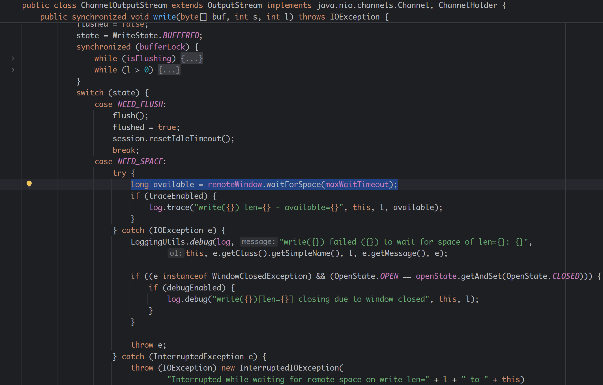

> 原文链接：https://blog.csdn.net/TeleostNaCl/article/details/153705007
> 发布时间：2025-10-21 23:34:01
> 标签：经验分享、windows、linux、ssh、Java、kotlin、智能路由器

---

#### 文章目录

- [mina-sshd 介绍](#minasshd__1)
- [使用mina-sshd 库通过 SCP 上传文件](#minasshd__SCP__10)
- [解决无法上传大文件的问题](#_34)

## mina-sshd 介绍

`mina-sshd` 库是由 `Apache` 发布的纯 `Java` 编写的 `SSH` 的开源库，其完整支持 `SSH V2`，`SCP` 和 `SFTP` 协议，方便在 `Java` 程序中搭建 `SSH` 服务端和客户端。

源码地址：<https://github.com/apache/mina-sshd>  
 项目主页：<https://mina.apache.org/sshd-project/>

本文将使用 `mina-sshd` 库作为搭建 `SSH` 客户端，通过 `SCP` 上传文件到 `OpenWrt` 系统上的方式，并解决遇到无法上传大文件的问题。

---

## 使用mina-sshd 库通过 SCP 上传文件

一段标准的代码如下：

```kt
// 创建 SSH 的客户端
val client: SshClient = SshClient.setUpDefaultClient()
client.start()

// 创建 session 并进行认证 传递用户名, SSH服务器地址, SSH服务器端口
val session = client.connect(username, host, port).verify(TIMEOUT).session
// 设置 认证密码
session.addPasswordIdentity(password)
session.auth().verify(TIMEOUT)

// 创建 ScpClient
val scpClient = ScpClientCreator.instance().createScpClient(session)
// 上传文件
scpClient.upload(Path.of(localFilePath), targetFilePath)
// 上传文件夹
scpClient.upload(Path.of(localFolderPath), targetFolderPath, 
    ScpClient.Option.TargetIsDirectory, ScpClient.Option.Recursive)
```

---

## 解决无法上传大文件的问题

在使用 `mina-sshd` 库时遇到无法通过 `SCP` 上传大文件时，问题现象时会卡住，并且无流量波动，可以上传大概几百K的数据，一段时间后会报以下错误：

```text
waitForCondition(RemoteWindow[client](ChannelExec[id=1, recipient=1]-ClientSessionImpl[root@/192.*****.1:22])) timeout exceeded: PT30S
```

经过调查，是因为我使用了以下代码，打开了 `ChannelShell`，影响了 `SCP` 的 `ACK` 数据的接受，导致在 `SCP` 传输数据的时候，卡在了 `org.apache.sshd.common.channel.ChannelOutputStream` 的 `write()` 方法中调用的 `long available = remoteWindow.waitForSpace(maxWaitTimeout);` 的语句，一直等待服务端回应传输窗口有可用空间，直到等待超时失败。

```kt
// 打开 shell
val channelShell = session.createShellChannel()

// 接受终端输出的输入流
val readerPipedOutputStream = PipedOutputStream()
val readerPipedInputStream = PipedInputStream(readerPipedOutputStream)
val reader = BufferedReader(InputStreamReader(readerPipedInputStream))
channelShell.setOut(readerPipedOutputStream)
channelShell.setErr(readerPipedOutputStream)

// 向终端输入的输出流
val writerPipedInputStream = PipedInputStream()
val writerPipedOutputStream = PipedOutputStream(writerPipedInputStream)
val writer = BufferedWriter(OutputStreamWriter(writerPipedOutputStream))
channelShell.setIn(writerPipedInputStream)

channelShell.open().await(TIMEOUT)
```



---

这里仅记录遇到的此问题，暂未深入研究为什么以上代码会对 `SCP` 的影响，并在这里附上测试中的日志和 `Wireshark` 的抓包信息：

SSHD 的日志：

```text
2025-10-20 23:18:39.743 org.apache.sshd.scp.common.ScpHelper sendStream(ScpHelper[ClientSessionImpl[root@/192.***.1:22]])[openwrt-mediatek-filogic-cmcc_rax3000m-squashfs-sysupgrade.itb] send 'C' command: C0644 91751203 openwrt-mediatek-filogic-cmcc_rax3000m-squashfs-sysupgrade.itb
2025-10-20 23:18:39.744 org.apache.sshd.common.channel.RemoteWindow waitForSpace(RemoteWindow[client](ChannelExec[id=1, recipient=1]-ClientSessionImpl[root@/192.***.1:22])) available: 1048575
2025-10-20 23:18:39.744 org.apache.sshd.client.channel.ChannelExec flush(ChannelOutputStream[ChannelExec[id=1, recipient=1]-ClientSessionImpl[root@/192.***.1:22]] SSH_MSG_CHANNEL_DATA) len=78, available=1048575
2025-10-20 23:18:39.744 org.apache.sshd.common.channel.RemoteWindow waitAndConsume(RemoteWindow[client](ChannelExec[id=1, recipient=1]-ClientSessionImpl[root@/192.***.1:22])) - requested=78, available=1048575
2025-10-20 23:18:39.745 org.apache.sshd.common.channel.RemoteWindow Consume RemoteWindow[client](ChannelExec[id=1, recipient=1]-ClientSessionImpl[root@/192.***.1:22]) by 78 down to 1048497
2025-10-20 23:18:39.745 org.apache.sshd.client.channel.ChannelExec flush(ChannelExec[id=1, recipient=1]-ClientSessionImpl[root@/192.***.1:22]) send SSH_MSG_CHANNEL_DATA len=78
2025-10-20 23:18:39.745 org.apache.sshd.client.session.ClientSessionImpl encode(ClientSessionImpl[root@/192.***.1:22]) packet #8 sending command=94[SSH_MSG_CHANNEL_DATA] len=87
2025-10-20 23:18:39.745 org.apache.sshd.client.session.ClientSessionImpl encode(ClientSessionImpl[root@/192.***.1:22]) packet #8 [chunk #1](64/87) 5e 00 00 00 01 00 00 00 4e 43 30 36 34 34 20 39 31 37 35 31 32 30 33 20 6f 70 65 6e 77 72 74 2d 6d 65 64 69 61 74 65 6b 2d 66 69 6c 6f 67 69 63 2d 63 6d 63 63 5f 72 61 78 33 30 30 30 6d 2d 73    ^.......NC0644.91751203.openwrt-mediatek-filogic-cmcc_rax3000m-s
2025-10-20 23:18:39.745 org.apache.sshd.client.session.ClientSessionImpl encode(ClientSessionImpl[root@/192.***.1:22]) packet #8 [chunk #2](87/87) 71 75 61 73 68 66 73 2d 73 79 73 75 70 67 72 61 64 65 2e 69 74 62 0a                                                                                                                               quashfs-sysupgrade.itb.
2025-10-20 23:18:39.746 org.apache.sshd.client.session.ClientSessionImpl encode(ClientSessionImpl[root@/192.***.1:22]) packet #8 command=94[SSH_MSG_CHANNEL_DATA] len=96, pad=8, mac=null
2025-10-20 23:18:39.747 org.apache.sshd.common.io.nio2.Nio2Session writeBuffer(Nio2Session[local=/[0:0:0:0:0:0:0:0]:12720, remote=/192.***.1:22]) writing 116 bytes
2025-10-20 23:18:39.748 org.apache.sshd.common.util.threads.SshdThreadFactory newThread(java.lang.ThreadGroup[name=main,maxpri=10])[sshd-SshClient[442675e1]-nio2-thread-23] runnable=java.util.concurrent.ThreadPoolExecutor$Worker@61c3d239[State = -1, empty queue]
2025-10-20 23:18:39.748 org.apache.sshd.common.io.nio2.Nio2Session handleCompletedWriteCycle(Nio2Session[local=/[0:0:0:0:0:0:0:0]:12720, remote=/192.***.1:22]) finished writing len=116 at cycle=13 after 581700 nanos
```

`Wireshark` 的包信息：

```text
75  5.696737    192.***.108  192.***.1    SSHv2   70  Client: New Keys
76  5.699465    192.***.1    192.***.108  TCP 60  22 → 12178 [ACK] Seq=1183 Ack=1381 Win=62976 Len=0
77  5.700210    192.***.108  192.***.1    SSHv2   106 Client: Encrypted packet (len=52)
79  5.702910    192.***.1    192.***.108  TCP 60  22 → 12178 [ACK] Seq=1183 Ack=1433 Win=62976 Len=0
80  5.702910    192.***.1    192.***.108  TCP 98  22 → 12178 [PSH, ACK] Seq=1183 Ack=1433 Win=62976 Len=44
81  5.702979    192.***.108  192.***.1    SSHv2   122 Client: Encrypted packet (len=68)
86  5.705468    192.***.1    192.***.108  TCP 106 22 → 12178 [PSH, ACK] Seq=1227 Ack=1501 Win=62912 Len=52
89  5.717004    192.***.108  192.***.1    SSHv2   138 Client: Encrypted packet (len=84)
90  5.740107    192.***.1    192.***.108  TCP 90  22 → 12178 [PSH, ACK] Seq=1279 Ack=1585 Win=62848 Len=36
91  5.763416    192.***.108  192.***.1    SSHv2   114 Client: Encrypted packet (len=60)
92  5.765944    192.***.1    192.***.108  TCP 98  22 → 12178 [PSH, ACK] Seq=1315 Ack=1645 Win=62848 Len=44
93  5.770990    192.***.108  192.***.1    SSHv2   170 Client: Encrypted packet (len=116)
94  5.814180    192.***.1    192.***.108  TCP 60  22 → 12178 [ACK] Seq=1359 Ack=1761 Win=62784 Len=0
95  5.814247    192.***.108  192.***.1    SSHv2   158 Client: Encrypted packet (len=104)
96  5.816358    192.***.1    192.***.108  TCP 60  22 → 12178 [ACK] Seq=1359 Ack=1865 Win=62720 Len=0
97  5.816358    192.***.1    192.***.108  TCP 98  22 → 12178 [PSH, ACK] Seq=1359 Ack=1865 Win=62720 Len=44
98  5.821108    192.***.1    192.***.108  TCP 162 22 → 12178 [PSH, ACK] Seq=1403 Ack=1865 Win=62720 Len=108
99  5.821160    192.***.108  192.***.1    SSHv2   130 Client: Encrypted packet (len=76)
100 5.821198    192.***.108  192.***.1    TCP 54  12178 → 22 [ACK] Seq=1941 Ack=1511 Win=65280 Len=0
101 5.822451    192.***.1    192.***.108  TCP 498 22 → 12178 [PSH, ACK] Seq=1511 Ack=1865 Win=62720 Len=444
102 5.830328    192.***.1    192.***.108  TCP 90  22 → 12178 [PSH, ACK] Seq=1955 Ack=1941 Win=62656 Len=36
103 5.838413    192.***.1    192.***.108  TCP 898 22 → 12178 [PSH, ACK] Seq=1991 Ack=1941 Win=62656 Len=844
104 5.838413    192.***.1    192.***.108  TCP 106 22 → 12178 [PSH, ACK] Seq=2835 Ack=1941 Win=62656 Len=52
105 5.838499    192.***.108  192.***.1    TCP 54  12178 → 22 [ACK] Seq=1941 Ack=2887 Win=64000 Len=0
106 5.859330    192.***.108  192.***.1    SSHv2   170 Client: Encrypted packet (len=116)
107 5.862414    192.***.1    192.***.108  TCP 90  22 → 12178 [PSH, ACK] Seq=2887 Ack=2057 Win=62592 Len=36
108 5.905640    192.***.108  192.***.1    TCP 54  12178 → 22 [ACK] Seq=2057 Ack=2923 Win=64000 Len=0
```
