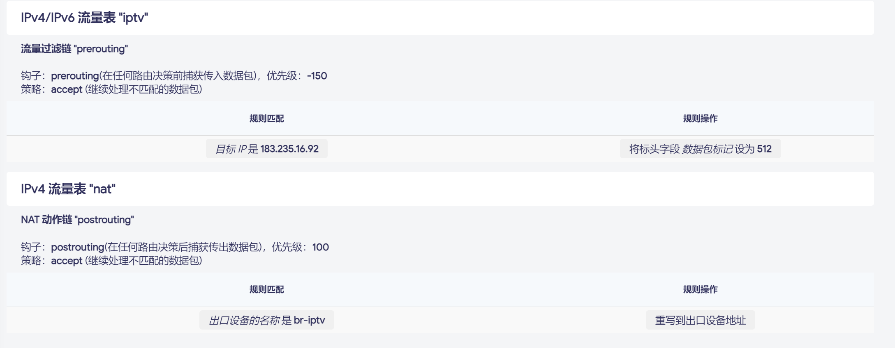

如果我们在 `OpenWrt` 上有多 `wan` 口的需求，那么我们就需要编写一套合适的分流规则，将指定流量发往不同的 `wan` 口，实现分流。在 `OpenWrt` 上我么可以使用 `mwan3` 和 `luci-app-mwan3` 实现一系列复杂的分流。


但是，如果我们只需要为几条简单的流量进行分流的适合，使用 `mwan3` 来说可能对资源消耗太重了，因此本文将介绍如何使用 `nft` 防火墙规则和路由规则进行简单分流。


本文的例子是基于之前实现 `OpenWrt` 接入了 `IPTV` 的能力，需要基于 `IPTV` 的地址去访问指定的地址：`http://183.235.16.92:8082/epg/api/custom/getAllChannel2.json`，以便实现获取节目单和节目台标。

- [在 OpenWrt 实现单线复用 使用单 wan 口上同时 提供访问 Internet 和接入 IPTV 的能力](https://blog.csdn.net/TeleostNaCl/article/details/156111855)
- [在OpenWrt上使用udpxy同时实现在机顶盒和Potplayer等直播流软件观看IPTV直播的方法](https://blog.csdn.net/TeleostNaCl/article/details/147023332)


首先，我们要先保证 `lan` 区域和 `iptv` 区域的流量互通，因此需要对 `lan` 区域设置 允许转发到目标区域中勾选 `iptv` 区域，并允许来自 `iptv` 源区域的转发。


随后，我们需要确定 `iptv` 的网关，以便可以设置路由规则。我们使用命令 `ip route show dev br-iptv` 可以知道 `iptv` 接口的网关信息（`br-iptv` 换成相应的接口），例如如下我们可以知道网关为：`10.233.128.1`

```shell
root@OpenWrt:~# ip route show dev br-iptv
default via 10.233.128.1 proto static src 10.233.128.*** metric 10 
10.233.128.0/22 proto static scope link metric 10 
```


那么我们可以用如下的命令创建相关的防火墙规则和路由规则：

```shell
# 创建对 iptv 的流量打标记: 0x200
nft add table inet iptv
nft add chain inet iptv prerouting { type filter hook prerouting priority mangle\; }
nft add rule inet iptv prerouting ip daddr 183.235.16.92 meta mark set 0x200

# 创建 br-iptv 的流量 nat 规则
nft add table ip nat
nft add chain ip nat postrouting { type nat hook postrouting priority srcnat\; }
nft add rule ip nat postrouting oifname "br-iptv" masquerade

# 对 0x200 标记 分配到 table 200
ip rule add fwmark 0x200 table 200
# 将 table 200 的流量经 br-iptv 发出
ip route add default via 10.233.128.1 dev br-iptv table 200
```


在 `luci` > `状态` > `防火墙` 中就可以看到下面的防火墙的流量表，可以看到有一个打标记的流量规则和一条 `NAT` 规则。



