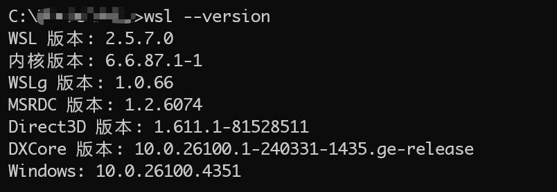

@[TOC]
# 一、问题背景
当在 `Windows` 上运行了代理软件之后，其会在本地开启相关的代理端口，所有流量都会经过此端口转发，从而实现网络代理。而在 `WSL2` 中则可以手动设置代理地址和端口，从而实现 `WSL2` 使用 `Windows` 的代理。
```shell
export http_proxy="http://<Windows_IP>:<代理端口>"
export https_proxy="http://<Windows_IP>:<代理端口>"
```

但是，随着 `WSL2` 的更新，推出了Mirrored 网络模式，它提供了更好的网络兼容性和更简单的网络配置体验。此时如果本机运行着代理，那么此时启动 `WSL2` 会提示
```
wsl: 检测到 localhost 代理配置，但未镜像到 WSL。NAT 模式下的 WSL 不支持 localhost 代理。
```

本文将 `WSL2` 的网络模式修改为 `Mirrored`（镜像模式）实现在 `WSL2` 中使用 `Windows` 代理。

而 `Mirrored` 模式的会有以下优势：
- **IP 地址共享**：WSL2 实例与 Windows 主机共享相同的 IP 地址
- **简化网络配置**：不再需要处理独立的虚拟网络接口
- **更好的兼容性**：解决了企业网络、VPN 和防火墙的许多连接问题
- **端口无缝访问**：本地端口自动映射，无需额外配置

# 二、解决方案
## （一）确认 WSL2 版本
由于这是一个 `WSL2` 的新特性，因此需要系统和 `WSL2` 同时支持，因此要求 
- `Windows 11 22H2` 或更高版本 
- `WSL2` 版本 `1.2.0` 或更高版本

在命令行提示符中输入 `wsl --version` 可以检查 `WSL2` 的版本：
```bash
wsl --version
```
会得到如下的结果

同时需要确保是使用的是 `WSL2`：输入命令：`wsl --set-default-version 2`，然后重启 `WSL2` 即可
## （二）修改配置文件设置全局网络模式为 Mirrored
在 `C:\Users\<你的用户名>\.wslconfig` 中添加或修改以下内容（如果没有此文件，创建即可）：
```
[wsl2]
networkingMode=mirrored		# 镜像模式（推荐）
dnsTunneling=true         	# DNS隧道（解决某些网络问题）
firewall=true            	# 启用防火墙集成
autoProxy=true          	# 自动同步Windows代理设置
```

> 如果修改为 `mirrored` 模式之后，此时 `localhostForwarding` 将无效，应删去此配置，否则在启动时候会报如下警告：
> **wsl: 使用镜像网络模式时，wsl2.localhostForwarding 设置无效**

此时编辑完成保存即可，输入命令 `wsl --shutdown` 即可关闭 `WSL2`，此时再重启之后就会使用镜像模式，此时可以直接使用系统代理，无需额外的配置。
