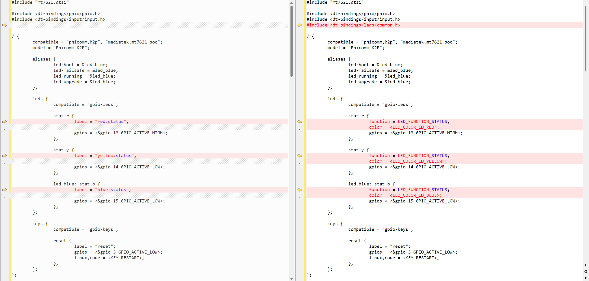
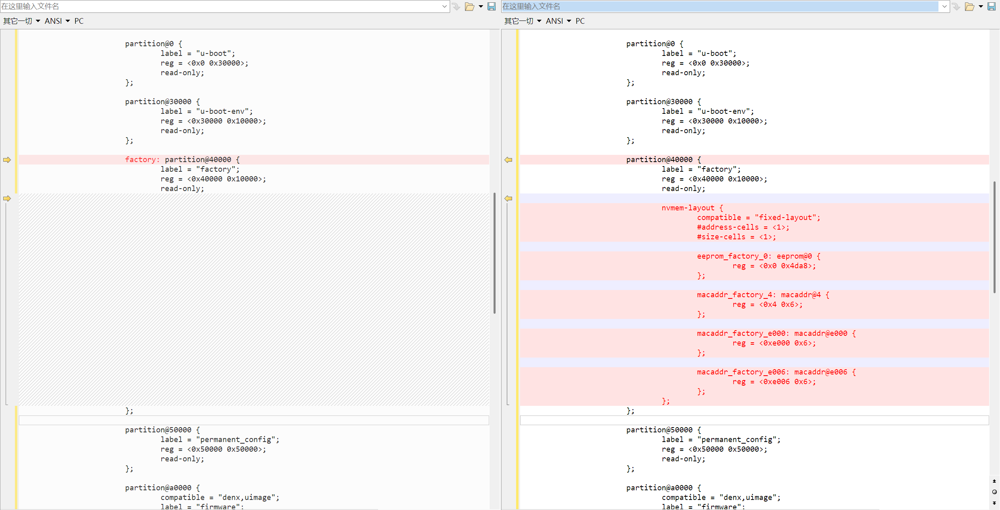
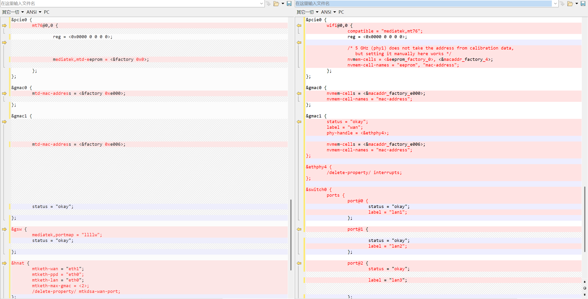

@[TOC]
# 一、问题背景
在 `lede` 源码 [https://github.com/coolsnowwolf/lede](https://github.com/coolsnowwolf/lede) 中，其已经支持了 `ZTE E8820S` 设备编译，而在  `OpenWrt` 源码 [https://github.com/openwrt/openwrt](https://github.com/openwrt/openwrt) 中是不支持 `ZTE E8820S` 设备的编译，因此在  `ZTE E8820S` 无法直接使用原版的 `OpenWrt`。其实 `lede` 架构和 `OpenWrt` 架构都是一样的，只要参考 `lede` 源码编写适合 `OpenWrt` 的 `dts` 文件即可实现编译适合于 `ZTE E8820S` 的 `OpenWrt` 系统。

本文将详细介绍如何参考 lede 源码编写 dts 文件使其适合于编译 `ZTE E8820S` 的 `OpenWrt` 系统。

# 二、代码实现
首先，先直接给出源码：
## 1. 增加 target/linux/ramips/dts/mt7621_zte_e8820s.dts 文件
进入到 `OpenWrt` 源码根目录，再进入到 `target/linux/ramips/dts` 目录，创建 `mt7621_zte_e8820s.dts` 文件，文件内容如下
```dts
// SPDX-License-Identifier: GPL-2.0-or-later OR MIT

#include "mt7621.dtsi"

#include <dt-bindings/gpio/gpio.h>
#include <dt-bindings/input/input.h>

/ {
        compatible = "zte,e8820s", "mediatek,mt7621-soc";
        model = "ZTE E8820S";

        aliases {
                led-boot = &led_power;
                led-failsafe = &led_power;
                led-running = &led_power;
                led-upgrade = &led_power;
                label-mac-device = &gmac0;
        };

        chosen {
                bootargs = "console=ttyS0,115200";
        };

        leds {
                compatible = "gpio-leds";

                led_power: power {
                        label = "white:power";
                        gpios = <&gpio 16 GPIO_ACTIVE_LOW>;
                };

                led_sys: sys {
                        label = "white:sys";
                        gpios = <&gpio 3 GPIO_ACTIVE_LOW>;
                };
        };

        keys {
                compatible = "gpio-keys";

                reset {
                        label = "reset";
                        gpios = <&gpio 18 GPIO_ACTIVE_HIGH>;
                        linux,code = <KEY_RESTART>;
                };

                wps {
                        label = "wps";
                        gpios = <&gpio 8 GPIO_ACTIVE_LOW>;
                        linux,code = <KEY_WPS_BUTTON>;
                };

                wifi {
                        label = "wifi";
                        gpios = <&gpio 10 GPIO_ACTIVE_LOW>;
                        linux,code = <KEY_RFKILL>;
                };
        };
};

&nand {
        status = "okay";

        partitions {
                compatible = "fixed-partitions";
                #address-cells = <1>;
                #size-cells = <1>;

                partition@0 {
                        label = "u-boot";
                        reg = <0x0 0x80000>;
                        read-only;
                };

                partition@80000 {
                        label = "u-boot-env";
                        reg = <0x80000 0x80000>;
                        read-only;
                };

                factory: partition@100000 {
                        label = "factory";
                        reg = <0x100000 0x40000>;
                        read-only;
                };

                partition@140000 {
                        label = "kernel";
                        reg = <0x140000 0x400000>;
                };

                partition@540000 {
                        label = "ubi";
                        reg = <0x540000 0x7a40000>;
                };
        };
};

&pcie {
        status = "okay";
};

&pcie0 {
        wifi@0,0 {
                compatible = "pci14c3,7603";
                reg = <0x0000 0 0 0 0>;
                mediatek,mtd-eeprom = <&factory 0x0000>;
                ieee80211-freq-limit = <2400000 2500000>;

                led {
                        led-active-low;
                };
        };
};

&pcie1 {
        wifi@0,0 {
                compatible = "pci14c3,7662";
                reg = <0x0000 0 0 0 0>;
                mediatek,mtd-eeprom = <&factory 0x8000>;
                ieee80211-freq-limit = <5000000 6000000>;

                led {
                        led-sources = <2>;
                        led-active-low;
                };
        };
};

&gmac0 {
        mtd-mac-address = <&factory 0xe000>;
};

&gmac1 {
        mtd-mac-address = <&factory 0xe006>;
        status = "okay";
};

&switch0 {
        ports {
                port@0 {
                        status = "okay";
                        label = "lan1";
                };

                port@1 {
                        status = "okay";
                        label = "lan2";
                };

                port@2 {
                        status = "okay";
                        label = "lan3";
                };

                port@3 {
                        status = "okay";
                        label = "lan4";
                };

                port@4 {
                        status = "okay";
                        label = "wan";
                        mtd-mac-address = <&factory 0xe000>;
                };
        };
};

&state_default {
        gpio {
                groups = "i2c", "jtag", "uart2", "uart3", "wdt";
                function = "gpio";
        };
};
```

## 2. 修改 target/linux/ramips/image/mt7621.mk 添加 ZTE E8820S 设备支持
进入到 `OpenWrt` 源码根目录，再进入到 `target/linux/ramips/image` 目录，修改 `mt7621.mk` 文件，在文件末尾添加以下内容：
```mk
define Device/zte_e8820s
  $(Device/dsa-migration)
  $(Device/uimage-lzma-loader)
  BLOCKSIZE := 128k
  PAGESIZE := 2048
  KERNEL_SIZE := 4096k
  UBINIZE_OPTS := -E 5
  IMAGE_SIZE := 129280k
  IMAGES += factory.bin
  IMAGE/sysupgrade.bin := sysupgrade-tar | append-metadata
  IMAGE/factory.bin := append-kernel | pad-to $$(KERNEL_SIZE) | append-ubi | check-size
  DEVICE_VENDOR := ZTE
  DEVICE_MODEL := E8820S
  DEVICE_PACKAGES := kmod-mt7603 kmod-mt76x2 kmod-usb3 kmod-usb-ledtrig-usbport
endef
TARGET_DEVICES += zte_e8820s
```

# 三、移植过程
参考官方添加新设备的教程 [https://openwrt.org/docs/guide-developer/adding_new_device](https://openwrt.org/docs/guide-developer/adding_new_device) ，我们可以知道新增加一个设备需要编写一个 `dts` 文件和编辑相关平台的 `mk` 文件。同时我们可以在 `lede` 源码仓库中搜索 `ZTE E8820S` 相关的修改，可以得到如下三条修改：
1. [coolsnowwolf/lede@a3c941d](https://github.com/coolsnowwolf/lede/commit/a3c941d1267229a71da2a5cde5055698eadc0fd0)
2. [coolsnowwolf/lede@f465968](https://github.com/coolsnowwolf/lede/commit/f4659685c5f606e0e7ce43596745bb873ed1cc3c)
3. [coolsnowwolf/lede@6ad67fd](https://github.com/coolsnowwolf/lede/commit/6ad67fdf1294e27dde5520b27f085968aa2b3ca3)

涉及到的文件总结起来就是新增了 `target/linux/ramips/dts/mt7621_zte_e8820s.dts` 文件 和 修改了 `target/linux/ramips/image/mt7621.mk` 文件。
在过程中，有对 `target/linux/ramips/mt7621/base-files/etc/board.d/01_leds` 文件新增了 `E8820S` 的 `LED` 的支持，但在最后一笔提交 [coolsnowwolf/lede@6ad67fd](https://github.com/coolsnowwolf/lede/commit/6ad67fdf1294e27dde5520b27f085968aa2b3ca3) 中把它给去除了，因此不涉及此文件的修改。

同时，由于 `lede` 仓库和 `OpenWrt` 仓库有一定的差异，我们迁移的时候需要排除掉这部分的差异，才能使 `OpenWrt` 顺利编译通过，因此，我们选择两个仓库都支持的同平台的 `Phicomm K2P` 作为对比进行迁移。

## （一）分析 Phicomm K2P dts的差异

我们先来看 `dts` 文件，比对两个仓库的 `Phicomm K2P` 的 `dts` 文件：`target/linux/ramips/dts/mt7621_phicomm_k2p.dts`
- `lede` ：[https://github.com/coolsnowwolf/lede/blob/master/target/linux/ramips/dts/mt7621_phicomm_k2p.dts](https://github.com/coolsnowwolf/lede/blob/master/target/linux/ramips/dts/mt7621_phicomm_k2p.dts)
- `OpenWrt` ：[https://github.com/openwrt/openwrt/blob/main/target/linux/ramips/dts/mt7621_phicomm_k2p.dts](https://github.com/openwrt/openwrt/blob/main/target/linux/ramips/dts/mt7621_phicomm_k2p.dts)

可以看到，这里由四部分的不同之处：
### 第一处 LED 的差异


### 第二处 分区布局的差异

### 第三处 端口定义方式的不同

### 第四处 OpenWrt 无 hnat
`lede` 对 `mtk` 平台加入了闭源驱动，支持 `mtk` 的 `hnat` 硬件分流，可以提高 `wifi` 性能和路由能力。但是在 `OpenWrt` 仓库中，无此能力，因此需要去掉与 `hnat` 有关的源码。

## （二）分析 Phicomm K2P mk的差异
我们先来看 `mk` 文件，比对两个仓库的 `Phicomm K2P` 的 `mk` 文件：`target/linux/ramips/image/mt7621.mk`
- `lede` ：[https://github.com/coolsnowwolf/lede/blob/master/target/linux/ramips/image/mt7621.mk](https://github.com/coolsnowwolf/lede/blob/master/target/linux/ramips/image/mt7621.mk)
```
define Device/phicomm_k2p
  IMAGE_SIZE := 15744k
  DEVICE_VENDOR := Phicomm
  DEVICE_MODEL := K2P
  SUPPORTED_DEVICES += k2p
  DEVICE_COMPAT_VERSION := 1.1
  DEVICE_PACKAGES := kmod-mt7615-firmware -uboot-envtools
endef
TARGET_DEVICES += phicomm_k2p
```

- `OpenWrt` ：[https://github.com/openwrt/openwrt/blob/main/target/linux/ramips/image/mt7621.mk](https://github.com/openwrt/openwrt/blob/main/target/linux/ramips/image/mt7621.mk)
```
define Device/phicomm_k2p
  $(Device/dsa-migration)
  IMAGE_SIZE := 15744k
  DEVICE_VENDOR := Phicomm
  DEVICE_MODEL := K2P
  DEVICE_ALT0_VENDOR := Phicomm
  DEVICE_ALT0_MODEL := KE 2P
  SUPPORTED_DEVICES += k2p
  DEVICE_PACKAGES := kmod-mt7615-firmware -uboot-envtools
endef
TARGET_DEVICES += phicomm_k2p
```

可以看到，除了定义方式不一样外，其余内容使完全相同的。

## （三）编写  ZTE E8820S  的编译文件
### 第一步 编写 mk 文件
我们先来说简单的，参考 `lede` 的 `mk` 文件[https://github.com/coolsnowwolf/lede/blob/master/target/linux/ramips/image/mt7621.mk](https://github.com/coolsnowwolf/lede/blob/master/target/linux/ramips/image/mt7621.mk)
```
define Device/zte_e8820s
  $(Device/dsa-migration)
  $(Device/uimage-lzma-loader)
  BLOCKSIZE := 128k
  PAGESIZE := 2048
  KERNEL_SIZE := 4096k
  UBINIZE_OPTS := -E 5
  IMAGE_SIZE := 129280k
  IMAGES += factory.bin
  IMAGE/sysupgrade.bin := sysupgrade-tar | append-metadata
  IMAGE/factory.bin := append-kernel | pad-to $$(KERNEL_SIZE) | append-ubi | \
	check-size
  DEVICE_VENDOR := ZTE
  DEVICE_MODEL := E8820S
  DEVICE_PACKAGES := kmod-mt7603 kmod-mt76x2 kmod-usb3 kmod-usb-ledtrig-usbport
endef
TARGET_DEVICES += zte_e8820s
```
可以直接编写 OpenWrt 的 `target/linux/ramips/image/mt7621.mk` 文件，在文件末尾增加 `zte_e8820s` 的支持

### 第二步 迁移 dts 文件
`lede` 中 ` ZTE E8820S ` 的 `dts` 文件如下：
`target/linux/ramips/dts/mt7621_zte_e8820s.dts` ：[https://github.com/coolsnowwolf/lede/blob/master/target/linux/ramips/dts/mt7621_zte_e8820s.dts](https://github.com/coolsnowwolf/lede/blob/master/target/linux/ramips/dts/mt7621_zte_e8820s.dts)

#### 1. 删去 hnat 相关
我们有前面的分析可以知道，`OpenWrt` 是不支持 `hnat` 的，对比 `Phicomm K2P` 我们需要移除以下代码
```
&gsw {
	mediatek,mdio = <&mdio>;
	mediatek,portmap = "llllw";
	status = "okay";
};

&hnat {
	mtketh-wan = "eth1";
	mtketh-ppd = "eth0";
	mtketh-lan = "eth0";
	mtketh-max-gmac = <2>;
	/delete-property/ mtkdsa-wan-port;
};
```

#### 2. 重新定义端口
在上面我们移除了 `hnat`，则需要在 dts 文件中声明各个 `wan` 口 和 `lan` 口位置和顺序关系，以及交换机信息，由于布局与 `Phicomm K2P` 是相同的，我们直接沿用，修改 `switch0` 的信息如下：
```
&switch0 {
        ports {
                port@0 {
                        status = "okay";
                        label = "lan1";
                };

                port@1 {
                        status = "okay";
                        label = "lan2";
                };

                port@2 {
                        status = "okay";
                        label = "lan3";
                };

                port@3 {
                        status = "okay";
                        label = "lan4";
                };

                port@4 {
                        status = "okay";
                        label = "wan";
                        mtd-mac-address = <&factory 0xe000>;
                };
        };
};
```

经过以上步骤，即可新增成功，此时在编译中将增加  `ZTE E8820S` 设备。

# 四、后话
由于笔者对 `OpenWrt` 还不够深入了解，这样处理仍然是存在一定的问题，
首先，这里忽略了迁移 `LED` 相关代码，可能指示灯是无法正常工作的。
其次，在笔者的路由器上，无法通过 `luci` 页面进行更新，一定要进入 `mboot` 刷 `factory` 系统才可以正常刷机。
然后，在笔者的路由器上，有时候会出现 `wifi` 崩溃的情况，此时必须重启路由器才能恢复。

虽然仍存在以上问题，但是经过这样迁移编译之后，是可以正常开机并运行 `OpenWrt`，功能使用上都是正常的，因此迁移还是可以起作用的。

欢迎指出文章中的错误，并讨论修复相关问题~~
