@[TOC]
# 一、问题背景
`AList` 是一种使用 `Gin` 和 `Solidjs` 编写的可以挂载多个网盘的文件列表的开源程序，官方地址为：[https://alistgo.com/zh/](https://alistgo.com/zh/)

官方介绍如下：
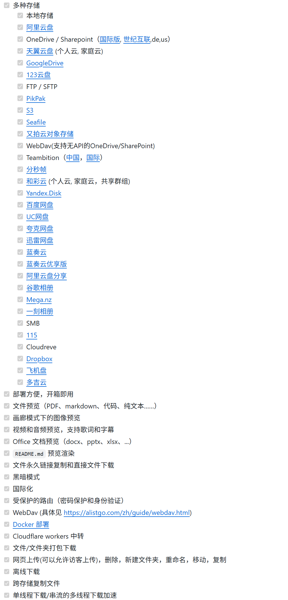
`AList` 支持在本地搭建 `WebDav` 服务，可以使局域网内的其他设备访问 `AList` 的文件列表，并播放和使用其中的内容。而 `WebDAV (Web-based Distributed Authoring and Versioning)` 是一种基于 `HTTP` 协议的扩展，它允许用户在网络上协同编辑和管理文件，就像在本地硬盘上操作一样。

而 `Kodi` 是一个开源的媒体播放器软件，广泛的支持各类音视频图片等媒体资源的解码和播放，并可支持多个平台，因此，在智能电视流行的当下，在电视上安装 `Kodi` 提高了电视机的可玩性，可使电视播放更广泛的媒体文件。开源地址：[https://github.com/xbmc/xbmc](https://github.com/xbmc/xbmc)

本文将介绍如何开启 `AList` 的 `WebDav`，并在 `Kodi` 上添加 `AList` 搭建 WebDav 的方法。

# 二、使用方法
## （一）开启 AList 的 WebDav
首先，`AList` 的 `WebDav` 功能默认是关闭的，我们需要先手动的将它打开。

我们进入 `AList` 的 `Web` 端（即 `AListIP:端口`，端口默认为 `5244`），点击页面底下的 `管理` ，进入到 `AList` 的管理页面。
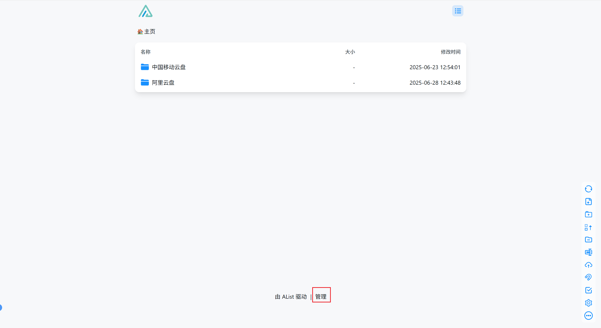
随后在管理界面中，点击用户，进入到用户管理界面。此时可以在原来的用户上去编辑相应的权限，或者新增一个用户专门用于 `WebDav`，提高用户的安全性。
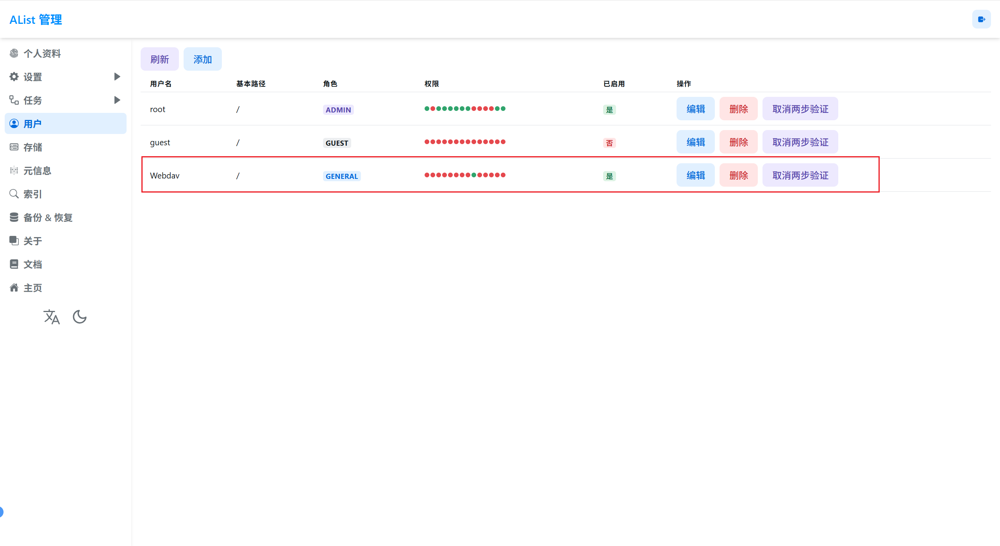

在权限编辑中，需要勾选上 `Webdav 读取` 权限，授予指定用户 `Webdav` 权限，此时即可登录到 `WebDav`
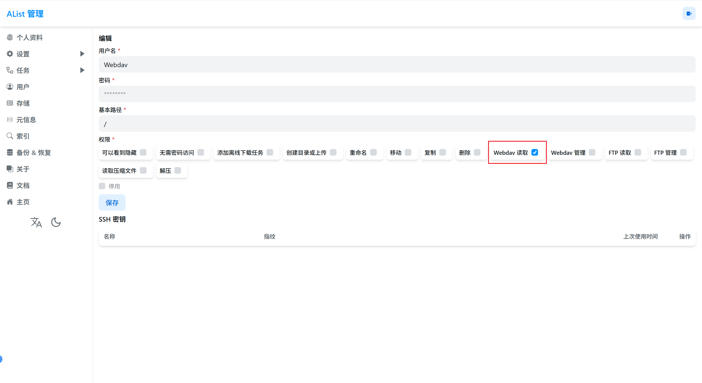
> 对于其它权限则只需要按需分配即可。另外，有些设备和软件是不支持无密码访问的，例如 PotPlayer，因此建议对用户设置一个密码。

此时，在浏览器中输入 `http://AListIP:端口/dav`，即 AList 默认使用 `dav` 作为 `Webdav` 的地址，会弹出登录界面
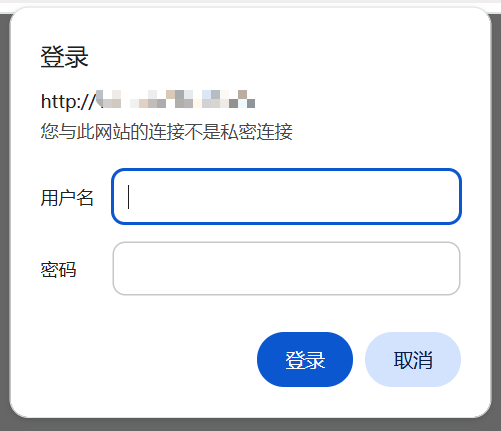
输入刚刚建立或授予权限的用户名和密码，如果可以正常登陆进去，那么会显示为
```
Method Not Allowed
```
此时 `Webdav` 搭建成功。其余情况则需要检查用户名和权限的问题。

> 提示此原因是因为 Webdav 没有支持浏览器访问，需要用专门的软件进行登录使用。

## （二）在 Kodi 添加 WebDav
当前面 `Webdav` 搭建成功之后，则只需要在  `Kodi` 中添加 `WebDav` 即可使用。

### 1. 打开设置跳转到媒体设置添加指定类型的媒体库
我们打开 `Kodi` 的 `设置` 之后，选择 `资料库` ，在 `管理源` 中任意选择一个视频类型，
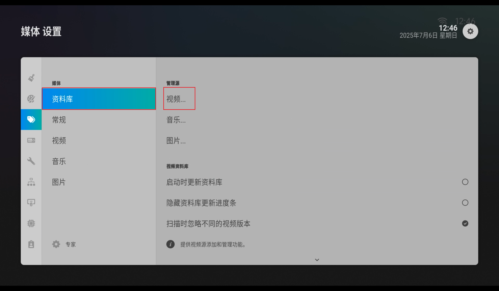
### 2. 选择添加媒体库
此时根据上一步选择的媒体类型，会进入 `视频/音乐/图片插件`，都是选择 `添加视频/音乐/图片`。

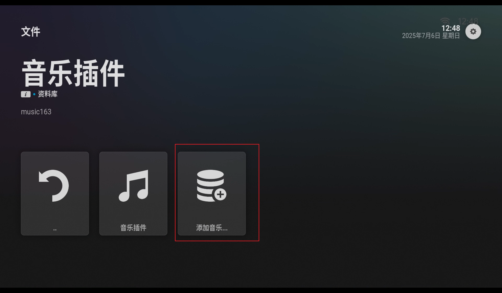
此时会弹出一个 `添加源` 的界面，点击 `文件预览` 按钮，此时会弹出浏览新共享的界面。
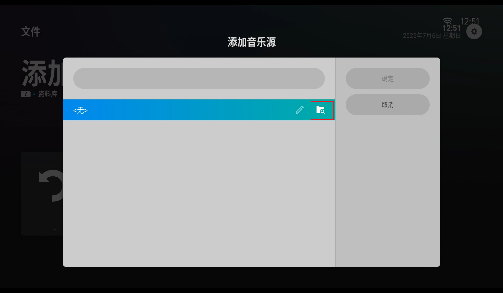
### 3. 添加新的网络位置
在浏览新共享的界面中，选择 `添加网络位置`。
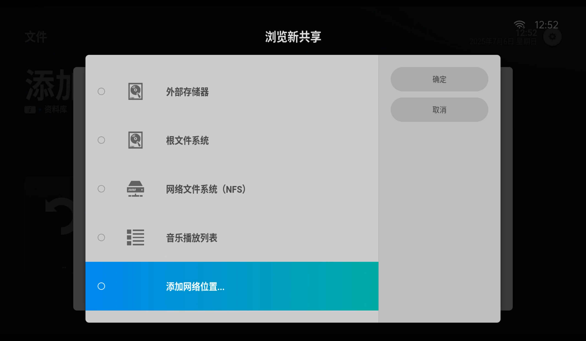

在  `添加网络位置` 中，
- `协议` 选择 `WebDAV服务器 (HTTP)`，
- `服务器地址` 填写 `AListIP`，原创路径需要填写为 `dav` (即前文所说的 `AList` 的 `Webdav` 路径为 `dav` )，
- 端口填写 `AList` 的端口，默认为 `5244` 
- `用户名` 和 `密码` 则填写刚刚增加会授予权限的用户名和密码

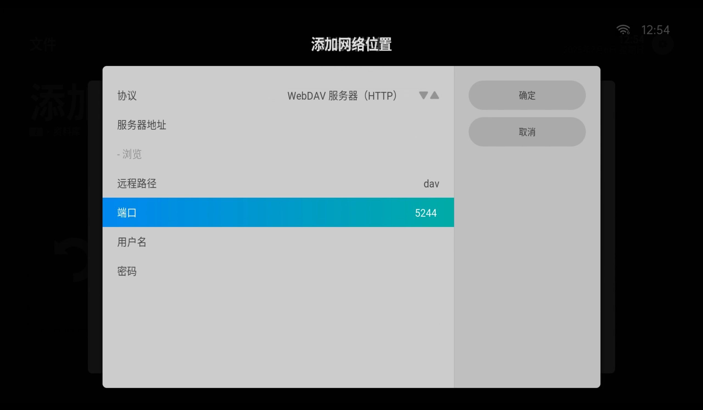

当编辑完成之后，点击确定，此时列表中会出现一个 `dav://AListIP:端口/dav` 的网络位置，此网络位置随后可以在新建其他资料库直接使用。

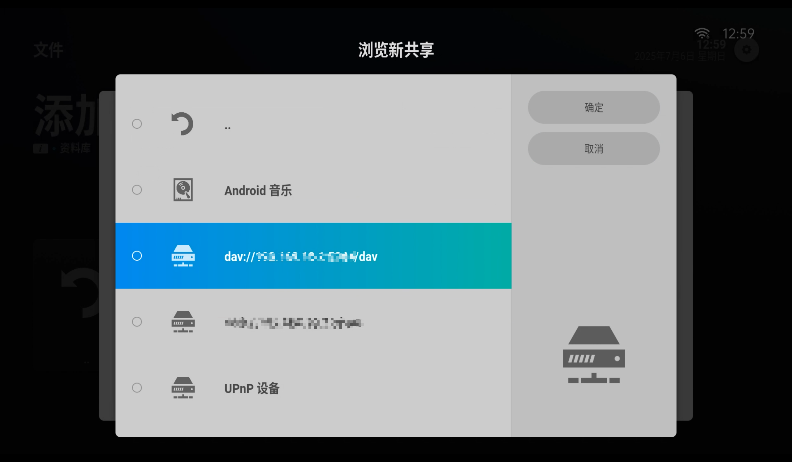

此时回到首页的资料库中，点击刚刚新建的资料库，则可以看到 `AList` 的文件了

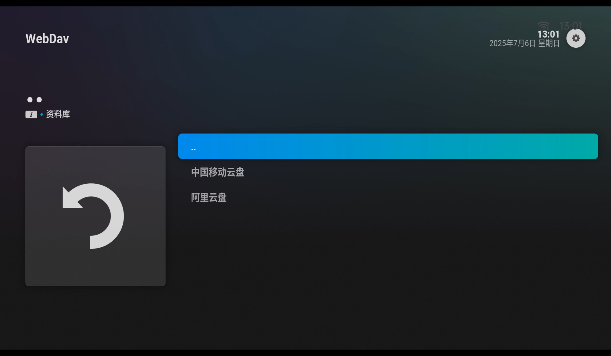
