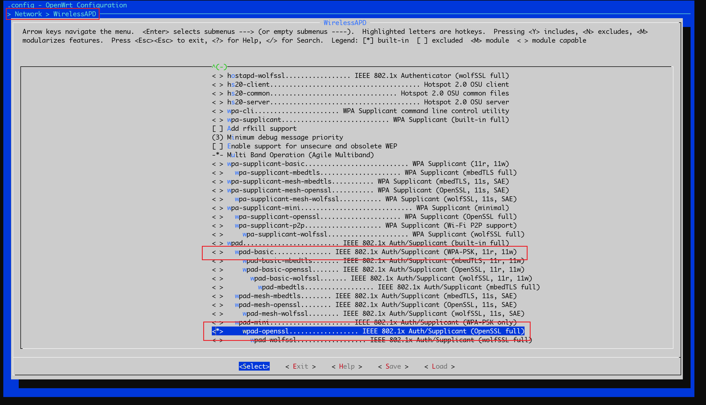
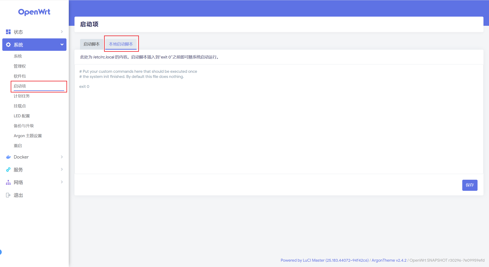

@[TOC]
# 一、背景介绍
`802.1X` 认证是用于对接入局域网内的设备进行认证的一种方式，在早期的局域网中，只要设备接入了局域网内，即可使用局域网内的所有资源，这会带来很大的安全隐患。因此 `802.1X` 认证很好的解决了这一问题，对所有的接入设备进行身份验证，通常需要有一台 `RADIUS` 服务器进行身份验证。这一项技术被广泛用于企业网络中。

但是在 `OpenWrt` 提供的原版固件中，并没有直接支持 `8021.X` 认证，需要用户自行手动配置。本文将详细介绍如何在 `OpenWrt` 上实现 `8021.X` 认证。

> 802.1X 相关知识可参考
> [https://support.huawei.com/enterprise/zh/doc/EDOC1100086515](https://support.huawei.com/enterprise/zh/doc/EDOC1100086515)
> [https://zhuanlan.zhihu.com/p/480133122](https://zhuanlan.zhihu.com/p/480133122)

# 二、解决方法
## （一）安装完整 wpad 包
现在 `OpenWrt` 官方版本默认集成的是 `wpad-basic`，其提供最基本的 `IEEE 802.1x/WPA` 的授权和认证。官方介绍如下：
>  [https://openwrt.org/packages/pkgdata/wpad-basic](https://openwrt.org/packages/pkgdata/wpad-basic)
>  This package contains a basic IEEE 802.1x/WPA Authenticator and Supplicant with WPA-PSK, 802.11r and 802.11w support.

而 对于 `802.1X ` 认证是需要 `EAP` 的支持，因此从介绍中  `WPA-PSK, 802.11r and 802.11w support` 中没有对 `EAP`，因此不支持 `802.1X ` 认证。我们需要将其更新到完整版本的 `wpad`。官方提供了以下三个完整的 `wpad` 包
- `wpad`：[https://openwrt.org/packages/pkgdata/wpad](https://openwrt.org/packages/pkgdata/wpad)
- `wpad-openssl`：[https://openwrt.org/packages/pkgdata/wpad-openssl](https://openwrt.org/packages/pkgdata/wpad-openssl)
- `wpad-wolfssl`：[https://openwrt.org/packages/pkgdata/wpad-wolfssl](https://openwrt.org/packages/pkgdata/wpad-wolfssl)

其介绍大致如下：
> This package contains a full featured IEEE 802.1x/WPA/EAP/RADIUS Authenticator and Supplicant

这三个包提供类似的功能，具体使用依赖于网络环境和 `ssl` 的选择。比如有些网络环境的认证是一定需要 `openssl` 的，所以必须选择 `wpad-openssl`。

本文选择 `wpad-openssl` 为例：
### 1. 在 OpenWrt 终端更换完整 wpad 包
如果是在已经运行的 OpenWrt 系统上，需要使用终端使用 `opkg` 或者 `apk` 包管理工具进行更新安装。 `opkg` 命令如下：
```shell
# 更新软件目录
opkg update
# 先下载 wpad (防止卸载 wpad-basic 后断网)
opkg download wpad-openssl
# 卸载 wpad-basic
opkg remove wpad-basic
# 安装 wpad-openssl
opkg install wpad-openssl_<version>_<arch>.ipk
```

`apk` 命令如下：
```shell
# 更新软件目录
apk update

# 先卸载 wpad-basic 再安装 wpad-openssl
apk del wpad-basic && apk add wpad-openssl
```

### 2. 在编译时选择完整 wpad 包
如果是自己编译的 `OpenWrt`，那么可以在编译阶段就直接将 `wpad-basic` 更换成 `wpad-openssl`。路径为 `Network` > `WirelessAPD`，取消勾选 `wpad-basic`，并勾选 `wpad-openssl`。



## （二）编写8021x.cnf配置文件
选择一个 `OpenWrt` 的永久目录（断电不消失），编写一个适用于 `802.1x` 认证的配置文件。配置文件需要根据网络环境进行修改，一种标准配置文件 `8021x.cnf` 的格式如下：
```
ctrl_interface=/var/run/wpa_supplicant
ctrl_interface_group=root
ap_scan=0
network={
  key_mgmt=IEEE8021X
  eap=PEAP
  phase2="auth=MSCHAPV2"
  priority=2
  identity="账户名"
  password="密码"
}
```

随后，使用以下命令（ `wan` 需要替换成需 `802.1x` 认证的接口）进行登录认证。
```shell
wpa_supplicant -D wired -i wan -c 8021x.cnf -B -s
```
- `-D wired`：指定驱动程序类型（driver backend），`wired` 表示使用有线网络（`Ethernet`）的驱动，适用于 `802.1X` 认证的有线网络。
- `-i wan`：指定网络接口名称。
- `-B`：让 `wpa_supplicant` 以守护进程（后台）模式运行。
- `-s`：将日志输出到系统日志中。

此时查看日志，过滤 `wpa_supplicant`，此时会发现有如下打印，如果出现 `Authentication succeeded` 字样，则表示认证成功。同时这些日志也可以帮助检查是什么阶段认证不成功，修正相关的错误。
```
Thu Jul 10 12:40:05 2025 daemon.notice wpa_supplicant[3971]: Successfully initialized wpa_supplicant
Thu Jul 10 12:40:05 2025 daemon.notice wpa_supplicant[4006]: no PHY for ifname wan
Thu Jul 10 12:40:05 2025 daemon.notice wpa_supplicant[4006]: wan: Associated with ********
Thu Jul 10 12:40:05 2025 daemon.notice wpa_supplicant[4006]: wan: CTRL-EVENT-SUBNET-STATUS-UPDATE status=0
Thu Jul 10 12:40:07 2025 daemon.notice wpa_supplicant[4006]: wan: CTRL-EVENT-EAP-STARTED EAP authentication started
Thu Jul 10 12:40:07 2025 daemon.notice wpa_supplicant[4006]: wan: CTRL-EVENT-EAP-PROPOSED-METHOD vendor=0 method=25
Thu Jul 10 12:40:07 2025 daemon.notice wpa_supplicant[4006]: wan: CTRL-EVENT-EAP-METHOD EAP vendor 0 method 25 (PEAP) selected
Thu Jul 10 12:40:07 2025 daemon.notice wpa_supplicant[4006]: wan: CTRL-EVENT-EAP-PEER-CERT depth=0 subject='********' hash=********
Thu Jul 10 12:40:07 2025 daemon.notice wpa_supplicant[4006]: wan: CTRL-EVENT-EAP-PEER-CERT depth=0 subject='********' hash=********
Thu Jul 10 12:40:07 2025 daemon.notice wpa_supplicant[4006]: wan: CTRL-EVENT-EAP-PEER-CERT depth=0 subject='********' hash=********
Thu Jul 10 12:40:07 2025 daemon.notice wpa_supplicant[4006]: EAP-MSCHAPV2: Authentication succeeded
Thu Jul 10 12:40:07 2025 daemon.notice wpa_supplicant[4006]: EAP-TLV: TLV Result - Success - EAP-TLV/Phase2 Completed
Thu Jul 10 12:40:08 2025 daemon.notice wpa_supplicant[4006]: wan: CTRL-EVENT-EAP-SUCCESS EAP authentication completed successfully
Thu Jul 10 12:40:08 2025 daemon.notice wpa_supplicant[4006]: wan: CTRL-EVENT-CONNECTED - Connection to ******** completed [id=0 id_str=]
```

部分网络中，认证成功之后需要重新获取 `IP` 地址，因此需要重启相关接口，可用以下的命令：
```shell
ifdown wan && ifup wan
```

此时，即可完成认证，可正常访问网络。

## （三）添加开机自启的脚本
在 `luci` 管理界面，`系统` > `启动项` > `本地启动脚本` 中编辑


在 `exit 0` 之前添加认证命令
```shell
# Put your custom commands here that should be executed once
# the system init finished. By default this file does nothing.

wpa_supplicant -D wired -i wan -c 8021x.cnf文件 -B -s

# 等待授权成功在重启wan接口获取新的IP地址
sleep 10

ifdown wan && ifup wan

exit 0
```
